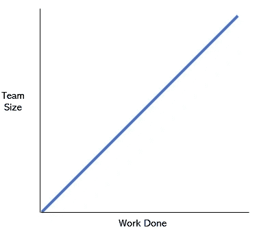
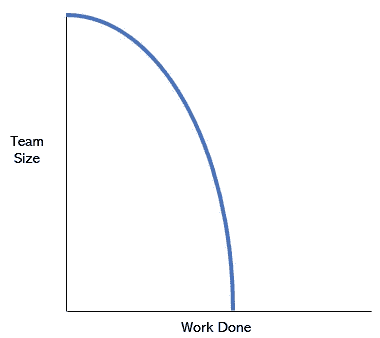

# 为什么无服务器对产品经理来说是革命性的。

> 原文：<https://itnext.io/why-serverless-is-revolutionary-for-product-managers-c545e598b476?source=collection_archive---------0----------------------->

无服务器设计从根本上改变了制约产品开发的限制因素。

插图鸣谢:董艳芳(【https://www.anitatung.com】)

产品经理在组织中有多种伪装——有时被称为*客户之声*，或*组织猫牧人*——他们是一群脸皮厚的人，承受所有的政治和借口来交付产品。对任何人来说，好的产品经理很少是英雄，他们是你所喜欢的大多数技术解决方案的幕后推手。

项目经理总是在寻找更好的工具来完成工作。我们知道竞争在紧追不舍，我们的客户厌倦了等待，我们不断需要更快、更聪明、更高效。当无服务器出现时，它如何适合玩具的产品管理目录并不明显，但在使用了一年多后，我可以看到它解决了一些一直伴随我们的软件问题。

## 团队规模和完成的工作的矛盾

产品管理的第一条规则是，需要完成的工作量总是在增长——你的产品积压总是在增加，只有当你的产品报废时，它才会变为零。挑战在于如何将待办事项中最重要的部分转化为可交付的产品。在所有条件相同的情况下，我们希望这是真的:

如果一个人一天能铲 1 吨土，那么 10 个人就能铲 10 吨。许多公司的资源管理都是基于这一点——如果你需要更多的销售，雇佣更多的销售人员。在软件领域，随着我们积压的工作越来越多，扩大团队的诱惑越来越大，但是在复杂的产品和服务中，随着时间的推移，你会看到更多这样的情况:

很少看到大型团队取得快速进展，但更常见的是看到较小的团队在持续的基础上取得惊人的进步。

在初创公司中，我们经常犯这样的错误:随着产品变得成功，我们增加了更多的开发人员、经理和项目经理，却意外地发现我们的速度在倒退。为什么？是早期开发者的高明，还是公司的官僚，还是架构的远见？

我认为这些是潜在问题的症状而不是原因，这些问题归结为三个关键因素的相互作用，其中只有两个是你可以直接控制的:

*   **脆弱**——新变化的冲击。如果一个新特性只影响机器的一部分，那么测试和实现就很容易；如果它影响到机器的所有部分，测试就变得更加关键和困难，并且实现需要更长的时间。
*   **工作规模** —一个团队可以完成的最小工作单元，被认为是一个生产性特征。比如“用 Alexa 支付”，而不是“开会讨论什么时候实现用 Alexa 支付”。
*   **复杂性** —实现一个特性需要多少知识。一个知道如何独立编写特性的开发人员能在组织中做同样的事情吗？需要采取哪些额外的步骤来无声地减缓进度，而不会给产出增加任何客户价值？

令我着迷的是，初创公司从这三个因素的最佳权重开始——没有什么是脆弱的，工作规模往往很小，客户可以理解，复杂性是不存在的。例如，如果团队需要制作一个符合 GDPR 标准的网站，他们可以研究问题并快速实施解决方案，并且非常有信心它会像预期的那样工作。

对于较大的公司，这些因素结合起来增加团队规模，最小化工作规模，并减少所做的工作。对于 GDPR，您需要法律签署、营销批准、C 级意识、对最小中断实施的 A/B 测试、运营调度窗口、在网站上查看任何其他团队部署，等等。由于环境中未知因素的脆弱性，即使有大量的控制和流程，团队对影响的信心也要少得多。

当您将这个例子扩展到一个可能包含几十个特性和几百个变更的真实项目时，就不难看出这些因素的相互作用是如何将团队规模/工作完成动态从第一个图转变到第二个图的。随着团队规模的增长，你永远注定要完成更少的工作，不管你如何哄组织机器。或者看起来是这样——但是你能做什么呢？

## 黑客三要素

这个问题困扰了我很多年，它让我调查了很多可能的原因。快速进步只有在创业公司才有可能吗？当我经历了通过更大的组织管理产品的困难时，有一段时间我是这样认为的。但后来我更仔细地研究了这三个因素。

脆弱性是*总是*对你不利——它是各种规模的每个项目中不断增长的技术债务。就像一个相反的半衰期，每一个软件都随着时间和开发变得越来越脆弱，每增加一行代码都会变得更糟。

工作规模与实际产品功能无关(“用 Alexa 付费”)，而是与基础设施的*形状的差异，当您比较“之前”和“之后”状态时。随着“后”状态变得越来越复杂，工作规模会缩小。这就是为什么在如此多的公司中，工作规模从以客户为中心(“用 Alexa 支付”)演变为组织性的(“开会讨论谁应该参与用 Alexa 支付”)。*

复杂性是社会、组织和技术因素的组合，它直接影响开发人员的入职时间、将开发人员视为可以执行任何工作的可替代资产的能力，并且是最不可能变得可见、记录或被很好理解的部分。开发人员可以在家里编写并发布一个 React 应用程序，但是在任何组织中都会有许多额外的步骤，这些步骤会在没有明显改变客户特性的情况下降低她的速度。这些步骤最终会占用她一天的大部分工作时间。

这三者在一个恶性循环中一起发挥作用，因此工作规模随着脆弱性的增长而缩小，这对于特性输出的贡献越来越小，复杂性成为产品周围无形的污泥。因此，增加更多的人没有帮助，你只能通过欺骗你如何给工作元素打分来提高速度(一个典型的信号:会议开始出现在 sprint 故事中)。

我在试图打破这种循环的大公司中见过一些有缺陷的方法。第一个是 Scaled Agile，它让所有受提议功能影响的人开大型会议，并试图通过理解复杂性来协调工作。这对提供真正史诗般午餐的餐饮公司来说是一个福音，但往往会失败，因为随着规模扩大，头条项目变得越来越小，越来越多，而且它没有从根本上解决脆弱性和复杂性问题。随着时间的推移，scaled agile 交付的是任务的战术购物清单，而不是跨越有意义特性的整体旅程。

第二，内部“创新小组”通常是一种刺激外围变革的尝试，希望脆弱的机器能够吸收工作，从而实现变革。这个善意的想法有一个奇怪的副作用，即巩固了只有创新团队才能改变任何事情的观念，而这种方法未能解决组织复杂性的问题。

在经历了这么多年的失败后，我相信你必须破解这三个因素来克服它们对工作和惰性的综合影响:

*   脆性必须*而不是*随着后续版本或老化而增加。
*   工作规模必须*而不是*小于有意义的客户特征。
*   复杂性不能*影响单个开发人员的工作。*

如果你能拥抱这些想法，你就能逃脱人类历史上每一个软件产品的命运。这听起来很棒，但是怎么可能呢？

## 无服务器打破了限制

云技术的出现是实现新的“黑客”状态的重要途径。总的来说，软件交付生命周期随着云而崩溃，因为太多平凡的事情已经为你做了。在云计算出现之前，要交付新的客户功能，您必须订购服务器、安装机架和堆叠硬件、在数据中心安排网络，然后随着时间的推移维护老化的设备。有了云，你可以租用所有这些东西，省去几十个组织步骤和几个月的时间。

此外，通过消除就地升级的需要并允许按需访问硬件，脆弱性和复杂性得以降低。与旧世界相比，启动软件变得容易了。然而，随着时间的推移，管理更多虚拟基础架构的管理负担越来越重，许多旧的交付实践仍保持不变。在采用云之后，你可以在工作变慢之前达到一个更大的团队规模，但是它仍然变慢了。

无服务器深刻地改变了这种动态。无服务器应用是由您的团队编写的小段代码(粘合剂)和由云提供商管理的功能黑盒的组合，这些黑盒只接受配置和对事件做出反应。在一个架构良好的应用程序中，通用黑盒是构成应用程序工作的操作负担的重要部分。应用程序本身不再是一个单一的功能，而是功能和盒子的联合。

实际上，这对我上面提到的三个因素有着巨大的影响:

*   零基础设施管理和松散耦合降低了脆弱性。在我们的项目中，我们已经看到我们的代码库缩小了，在某些情况下,*缩小了 10 倍。*
*   工作规模往往在功能规模附近徘徊，因为创建以前不需要的新功能版本或全新功能是微不足道的。
*   复杂性不会影响开发人员——如果她能编写一个处理信用卡支付的函数，它将是一个无服务器应用程序中几乎相同的代码，没有组织包装器和减缓工作的环境因素。

即使在非常大的无服务器应用程序中，对于产品经理来说，放大功能并查看更改时受影响的几个部分也很简单。用特性标志同时运行两个版本也很容易，而且通常没有必要淘汰旧版本的代码。

使用无服务器，我们总是在基础设施的外围进行构建，编写尽可能少的代码，连接完全托管的服务，我们从来不需要从运营角度考虑这些服务。我们并不试图管理一个庞然大物，整理旧代码或获得整个系统的世界观。

## 为什么这非常重要

随着变化率的增加，预测软件的未来状态或客户的未来需求变得更加困难。这意味着构建对未来状态始终有效的基础代码通常是徒劳的。我们已经看到在大多数公司中代码重用是多么少，以及对老化平台的承诺是如何阻碍进步的。

传统的模式是尽可能地维护和开发旧系统，直到维护消耗了几乎所有的开发工作，公司最终用新系统重新开始，预示着不会重复旧系统的失败。当新系统最终被这三个因素扼杀时，技术森林大火就来了，我们重新开始。

我们对系统复杂性症状的痴迷解释了为什么如此多的范例来来去去，却没有对产品管理产生任何重大影响。无服务器允许产品团队最小化增加的复杂性，并继续以相当稳定的速度交付价值，而不会陷入困扰软件几十年的经典陷阱。

这是无服务器的早期阶段，但最初的迹象非常有希望。在客户对功能需求空前高涨的时候，产品经理可能最终会有一个开发平台，允许一种功能驱动的心态，不会随着组织的复杂性而变慢，也不会因为脆弱性而瘫痪。