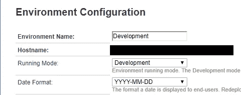

# 为什么不应该在生产中使用“调试模式”？

> 原文：<https://itnext.io/why-should-you-not-use-debug-mode-in-production-4cef40e29fd7?source=collection_archive---------2----------------------->

如果您查看服务中心的管理选项卡，您会看到“运行模式”的设置。在个人环境中，这是只读的。[记录了生产和开发模式的基本机制](https://success.outsystems.com/Support/Enterprise_Customers/Maintenance_and_Operations/OutSystems_running_modes%3A_Development_vs_Production_mode)。

“运行模式”设置

然而，*没有记录的是*“为什么我不能为我的生产环境打开‘开发模式’？”毕竟，这听起来很有用，对吗？

答案是“性能”。使用开发模式或在生产环境中启用调试，会将调试符号添加到编译后的代码中。这极大地增加了它的大小(因此使用了多少 RAM ),也大大降低了它的执行速度。您不会注意到开发或 QA 环境中的差异，但是加载成百上千的用户，肯定会有差异。

所以…虽然在生产环境中有时间和地点可以打开调试，或者打开整个生产环境的开发模式，但是请记住要关闭它，除非在极少数情况下，您必须调试一个真实的生产环境。

J.是