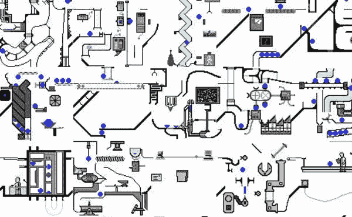
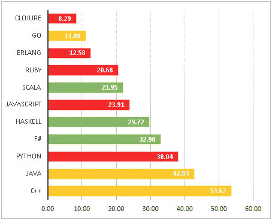

# 为什么简单如此复杂

> 原文：<https://itnext.io/why-simple-is-so-complex-362bc835b763?source=collection_archive---------2----------------------->

## 软件工程中简单的复杂性

> 我的结论是，有两种方法来构建一个软件设计:一种方法是让它简单到没有明显的缺陷，另一种方法是让它复杂到没有明显的缺陷。—东尼·霍尔

简单。软件工程师的圣杯。那些身居高位的人一再敦促我们去寻找它:

*   (软件设计是)一门手艺…它与重视简单胜过复杂有很大关系——芭芭拉·利斯科夫
*   如果我们想建立好的系统，我们需要建立简单的系统
*   编写复杂软件而不会失败的唯一方法是降低它的全局复杂性，用简单的部分来构建它——埃里克·s·雷蒙德
*   简单可能比复杂更难:你必须努力让你的思维变得清晰，让它变得简单。但最终还是值得的，因为一旦你到了那里，你就可以移山倒海了。—史蒂夫·乔布斯
*   简单是可靠的先决条件。—埃德格·迪克斯特拉
*   可靠性的代价是追求最大的简单性——东尼·霍尔

然而，就像圣杯一样，简单证明是难以捉摸的。这有许多原因:

*   软件本质上是复杂的。软件的元素以一种非线性的方式相互作用。整体的复杂度比线性增加*更多*。
*   您并不总是能够控制您必须使用的软件(例如，第三方库、贵公司其他部门的库、传统库等)
*   变革的压力一直存在。
*   相互竞争的需求和利益经常发生冲突。(1)

> 整体的复杂性比线性增长要多得多。

## 非技术因素

> [一个程序员]必须掌握的大部分复杂性是任意的复杂性，是由他的界面必须符合的许多人类机构和系统莫名其妙地强加的。—弗雷德·布鲁克斯

每当我们想到一个软件时，我们必须超越技术层面去思考。它的存在是有原因的，与代码无关。

其中包括:

*   用户
*   企业和利益相关者
*   工程师、设计师、产品所有者的需求/兴趣
*   财政限制

在许多情况下，这些复杂情况背后的驱动因素将来自个人利益或政治。虽然我们可能不喜欢这样，但这些是影响软件开发的真实因素。我们忽视了它们的影响和复杂性，后果自负。

## 复杂性是不可避免的

> 从长远来看，每一个节目都变成了洛可可——然后是碎石——艾伦·珀利斯

在任何有意义的软件程序中，复杂性都是不可避免的。软件系统必须发展，否则就会过时。随着它们的发展，它们不可避免地以新的或变化的特性的形式增加了复杂性。因此，事实证明，在我们的软件中引入复杂性符合我们的利益！

# 简单不能来自简单的思考

在一个充满复杂性的行业中，如果有一种方法可以保证好的软件，那将是非常令人欣慰的。事实上，许多人会声称存在一种神奇的技术或方法。让我们来看看其中的一些:

*   静态类型
*   结构

## 静态类型将解决所有问题！

近来，静态类型作为软件质量的救星，受到了大量的宣传和努力。例如，引用 Elm 网站:

> 与手写的 JavaScript 不同，Elm 代码实际上不会产生运行时异常。相反，Elm 使用类型推断来检测编译过程中的问题，并给出友好的提示。这样，问题永远不会出现在你的用户面前。

这是一个可爱的情绪。但愿这是真的。如果静态类型的正确使用可以解决我们所有的问题，那就太神奇了。当然，如果这是真的，那么使用 Elm 这样的语言将是每个软件开发人员的道德义务。这种影响是如此的重大，如此的至关重要，这是毋庸置疑的。不幸的是，事实并非如此。

> 静态打字狂热者试图让我们相信“好的打字程序不会出错”。虽然这听起来令人印象深刻，但这是一个相当空洞的说法。静态类型检查是对程序运行时行为的编译时抽象，因此它必然只是部分可靠和不完整的。这意味着程序仍然可能出错，因为属性没有被类型检查器跟踪，而且有些程序虽然不会出错，但也不能进行类型检查。—埃里克·梅耶尔和彼得·德雷顿，来自*编程语言之间冷战的结束*

事实上，正如 Meijer 和 Drayton 指出的，过分强调静态类型会导致问题，因为它们引入了*增加的复杂性*:

> 使静态类型化更少部分和更完整的冲动导致类型系统变得过于复杂和奇特，如“幻影类型”和“摇摆类型”等概念所见证的。这就像试图在腿上绑着球和链子跑马拉松，并得意洋洋地喊着你几乎成功了，尽管你在第一英里后跳伞了。

关于 bug 密度的数据表明他们的结论是准确的。与静态类型相比，语言和较低错误密度之间的相关性更符合简单性:

正如上面引用的研究的作者 Dan Lebrero 指出的那样:“[数据]没有显示静态/动态类型有什么不同，但它们确实显示了……注重简单性的语言与不注重简单性的语言之间的差距。”

## 你只需要使用正确的框架

> 当程序需要关注无关的东西时，编程语言就是低级的。—艾伦·珀利斯

软件业一直致力于提供抽象层，使编码更容易、更可靠。我们不再用机器语言编码的事实本身就证明了这一努力的成功。虽然我们去除了很多偶然的复杂性，但是系统固有的核心复杂性仍然存在。我们建立的抽象概念会引发更多的问题。

正如乔尔·斯波尔斯基(Joel Spolsky)的名言:“所有非平凡的抽象在某种程度上都是有漏洞的。”通过“泄漏”，他的意思是抽象在某种程度上未能管理它被设计来简化的复杂性。复杂性仍然从抽象的裂缝中“漏”出来。

我们可以看到 React JS 的一个现代例子。React 的主要意图之一是抽象出 DOM。然而，React 为那些可能需要与 DOM 进行[交互的情况提供了`refs`。当然，要做到这一点，你必须理解*如何与 DOM 交互。这意味着抽象失败了。事实上，它引入了额外的复杂性，必须理解如何“逃避”与 DOM 的交互。*](https://reactjs.org/docs/refs-and-the-dom.html)

此外，这种抽象也带来了复杂性。必要性的抽象隐藏了实现的细节，因此限制了可以完成的事情。这就是 React 有`refs`的原因。有些事情它就是做不到。抽象本身可能有内在的复杂性。

# 没有灵丹妙药

虽然上面的评论可能会引起宗教争吵，但它们并不是有意的。相反，其目的是指出:

> 无论是在技术上还是在管理技术上，都没有一个单独的发展本身能够保证在[软件]生产率、可靠性和简单性上有一个数量级的提高。—弗雷德·布鲁克斯

然而，与进入但丁的地狱不同，你不需要放弃所有的希望。认识到没有构建完美软件的神奇方法可以让你走出神奇思维的领域。只有当你从这种幻想中走出来，你才能应对软件的现实。一旦你到了那里，你会发现这不是软件的问题。

它更大:它是个人的，人际的。这是程序性的。它是环境和情境的。它是时间的和历史的。这是多代人和直接的。换句话说，这是关于系统的。

如果没有银弹，我们能做什么？我们可以接受:

*   总会有复杂的事情需要我们去处理。
*   我们不会写出完美的软件——并且对此没有意见。
*   总会有妥协和不完美。
*   好的工作需要时间。
*   我们必须处理人为因素(偏好、政治、不同的思维方式。&c)。

> …设计是最好慢慢地、小心地完成的事情——艾伦·凯

# 是什么让它变得简单？

> [软件简单性]需要与发现复杂自然现象背后的简单物理规律一样的技能、投入、洞察力，甚至灵感。它还要求愿意接受受物理、逻辑和技术限制的目标，并在冲突目标无法实现时接受妥协。— *东尼·霍尔*

很难确定是什么让事情变得简单。部分原因是因为简单有些主观。这部分是因为对简单性的解释依赖于经验。对受过训练的数学家来说简单而明显的事情对生物学家来说可能不那么简单——反之亦然。这最多给我们留下了对简单的模糊理解，这让人想起了大法官波特对色情的著名定义:“当我看到它时，我就知道它。”

也就是说，下面是一个简单程序的一些方面:

*   一旦系统的基本原理被很好地理解，理解和解决问题就变得容易了。
*   该系统利用众所周知的文化标记来简化理解。
*   它保持了设计的一致性。
*   它很好地利用了语义。
*   它平衡了系统的边界和领域对灵活性的需求。
*   复杂性被尽可能地限制。
*   识别并去除不必要的复杂性。

# 防止不必要的复杂性

虽然单个开发人员可以做一些事情来防止复杂性，但是组织层面的努力才是最有影响力的。以下是组织可以做的一些事情:

## 欲速则不达

> 当任何一个项目接近完成时，总会有一股添加新功能的狂热……这种狂热的确是疯狂的，因为它会导致一个陷阱…——东尼·霍尔

努力让销售、业务和产品相信软件开发——好的软件开发——需要时间。

*   给设计留出时间。
*   为良好的编码实践留出时间。
*   给重构留出时间。

每一次牺牲都有代价。随着时间的推移，这些成本会不断增加。

## 避免最新的技术陷阱

软件开发是一个时尚行业。当程序员努力学习最终允许他们以“正确”的方式做事的方法、语言或框架时，追逐最新和最棒的会带来混乱。深思熟虑，以及不仅仅因为流行就随大流的意愿，对保护代码的健全性大有帮助。

证明比酷好多了。

## 遵循标准程序

> 衡量程序员的标准不是他们的独创性和逻辑性，而是他们案例分析的完整性。—艾伦·珀利斯

有一些标准的、众所周知的、久经考验的实践有助于软件质量和简单性:

*   代码审查——也许是软件团队工具箱中最强大的工具之一。确保你的代码审查是经过深思熟虑的，并且执行良好。
*   设计评审——不要仅仅评审代码，还要评审设计。
*   充分的前期设计——不要只是坐下来编码。看看你的系统是怎么设计的。遵循这些设计模式，确保您的[设计随着时间的推移保持一致](https://medium.com/@joseph.crick/maintaining-design-integrity-over-time-d9255b957d90)。
*   对你的系统如何运作有一个宏伟的计划。在高层次上定义方面，例如:你将如何处理应用程序中的异步性？你将如何管理容错？您将如何管理数据一致性？&c。
*   确保你的要求是好的——不管你是如何得到的。

# 摘要

简单远非简单。同样重要的是要记住，它是达到目的的手段，而不是目的本身。最终得到易于使用和操作的高质量软件。

迄今为止，保持系统简单是人类管理软件工作最有效的方式之一。简单既是一个过程和实践，也是一套原则、指导方针或哲学。这是应该由整个组织来支持和管理的事情。

— — — — —

*延伸阅读:*

1.  [http://www . cs . nott . AC . uk/~ PSZ CAH/g51 ISS/Documents/nosilverbullet . html](http://www.cs.nott.ac.uk/~pszcah/G51ISS/Documents/NoSilverBullet.html)
2.  [http://zoo . cs . Yale . edu/classes/cs 422/2011/bib/hoar 81 emperor . pdf](http://zoo.cs.yale.edu/classes/cs422/2011/bib/hoare81emperor.pdf)
3.  [https://www . joelonsoftware . com/2002/11/11/the-law-of-leaky-abstracts/](https://www.joelonsoftware.com/2002/11/11/the-law-of-leaky-abstractions/)
4.  [https://www . ics . UCI . edu/~ Lopes/teaching/INF 212 w 12/readings/rdl 04 meijer . pdf](https://www.ics.uci.edu/~lopes/teaching/inf212W12/readings/rdl04meijer.pdf)