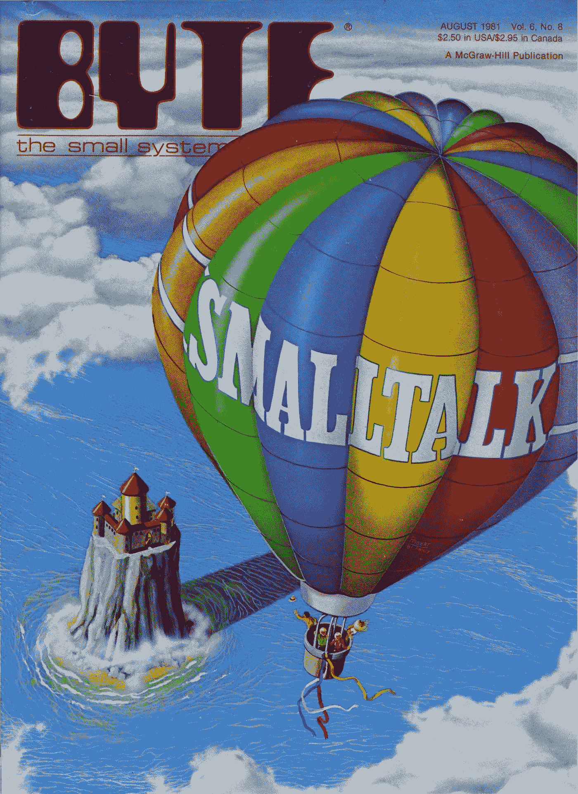
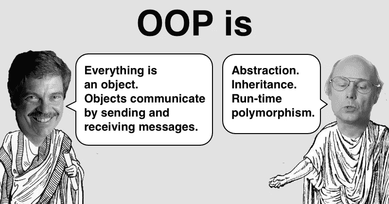
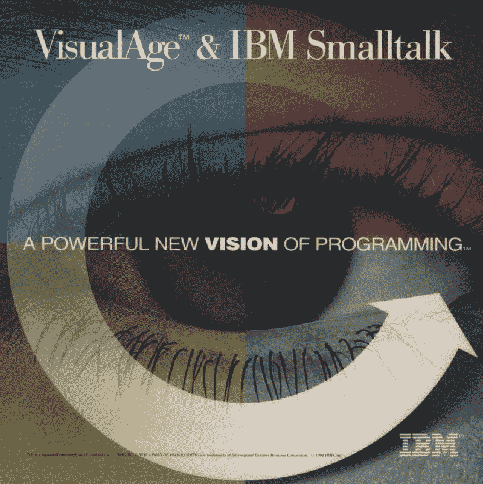
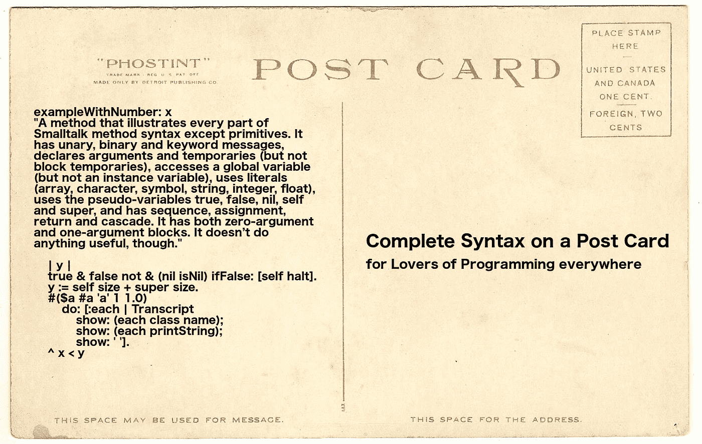

# 为什么 Smalltalk 如此容易传播

> 原文：<https://itnext.io/why-smalltalk-is-so-easy-to-evangelize-2b88b4d4605c?source=collection_archive---------3----------------------->

俄罗斯“布拉蒂诺”温压火箭发射器

在世界上所有的编程语言中，Smalltalk 是迄今为止最容易传播的一种。这是为什么呢？

首先，Smalltalk 有着美好的历史遗产。它对软件行业、计算机科学和编程语言设计做出了巨大的贡献。它开创了语言虚拟机和 JIT 编译。它创造了世界上第一个现代 IDE。它使得*现场编码*变得容易访问。它介绍了 MVC 架构模式。它主要负责 TDD(测试驱动开发)。它开创了对象数据库的发展。它给了我们第一个重构浏览器。它有助于开发 GUI 和所见即所得。

它影响了 Objective-C、Ruby、PHP、Perl、Python、Groovy、Scala、Dart 和其他语言的设计。

它普及了面向对象编程(而 Simula 67 从学术上引入了类和对象的概念)。还记得著名的《字节》杂志 1981 年 8 月封面吗？

其次，艾伦·凯和他在 PARC 施乐公司的团队是传奇。艾伦·凯的眼光非同寻常。他的面向对象哲学非常出色。它远胜于比雅尼·斯特劳斯特鲁普等人信奉的哲学。

艾伦·凯谈 Smalltalk 的早期(跳到 2:17)

第三，Smalltalk 有着出色的业绩记录。[实际上，它在 20 世纪 80 年代和 90 年代非常受欢迎。](http://jeffsutherland.org/news0196.html)它被 IBM 用于他们的 VisualAge 企业计划。它被许多著名的客户使用，包括美国联合军队、JP 摩根、东方海外集装箱运输公司、Desjardins、瑞士联合银行、德州仪器、阿根廷电信、宝马和西门子公司。

它有一个非常重要的商业供应商的存在，企业公司赞赏。看看 Cincom (VisualWorks)、实例化(VA Smalltalk)和 GemTalk 系统(GemStone/S)。它得到了 Pharo 财团的大力赞助。

第四，Smalltalk 有统计证据(在 T4 的 Capers Jones 的 Namcook Analytics 研究中)支持巨大的程序员生产力。这与同一主张的许多轶事证据相一致。

第五，Smalltalk 拥有丰富的语言家族，如 Pharo、Squeak、Cuis Smalltalk、Dolphin Smalltalk(针对 Windows 优化)、GNU Smalltalk(针对命令行爱好者)、Amber (transpiles to JS)、Hoot Smalltalk (JVM 支持)、VisualWorks、VA Smalltalk 和 GemStone/S(高性能对象数据库)，可以满足无数的需求。

而且，Pharo 是历史上发展和创新最快的 Smalltalk！它在不到十年的时间里重塑了自己。

第六，Smalltalk 让面向对象编程变得非常容易，比在 C++、Java、C#等中容易得多。Smalltalk 极其简单易学。它的完整语法适合一张明信片。你可以在 15 分钟内学会 Smalltalk 的所有语法！

第七，Smalltalk 非常通用。你可以用 Seaside 和茶壶框架做后端 web。你可以用 Amber 和 PharoJS transpiled 语言做前端 web。你可以用 Cordova/PhoneGap 做手机。您可以使用 PolyMath 库、Roassal 数据可视化和 Moose 数据分析平台进行数据科学研究。可以用 TensorFlow 和 Keras 做机器学习。你可以做很多事。你可以用 PhaROS 做机器人。你可以做虚拟现实。你甚至可以编写虚幻游戏引擎的脚本！

漫游演示

虚拟现实演示

虚幻游戏引擎演示

换句话说，Smalltalk 提供了大量的弹药储备。你可以一次又一次地齐射。

还有什么语言能如此容易地被传播？Clojure？水晶？飞镖？仙丹？Golang？哈斯克尔。朱莉娅。科特林？尼姆？球拍？生锈？打字稿？没有。差远了。