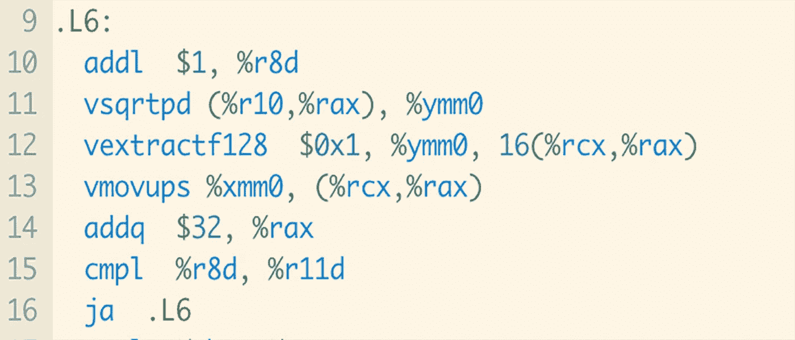

# 为什么标准 C++数学函数很慢

> 原文：<https://itnext.io/why-standard-c-math-functions-are-slow-d10d02554e33?source=collection_archive---------0----------------------->



计算平方根的 C++函数的汇编

性能一直是 C++的重中之重，然而在语言和标准库中都有许多例子，编译器生成的代码比机器能够生成的代码要慢得多。在这篇博文中，我将从标准数学库中探究一个这样的例子。

假设我们的任务是计算浮点数数组的平方根。我们可以编写一个这样的函数来执行操作:

如果我们使用 gcc，我们可以用

```
g++ -c -O3 -march=native sqrt1.cpp
```

有了`-O3`，gcc 将极大地优化代码，但仍然会产生符合标准的代码。`-march=native`选项告诉 gcc 生成针对本地架构指令集的代码。即使在不同的 x86-64 CPU 之间，生成的二进制文件也可能不可移植。

现在，让我们对该函数进行基准测试。我们将使用[谷歌基准](https://github.com/google/benchmark)来测量计算`1,000,000`数字的平方根需要多长时间:

编译我们的基准并运行我们得到

```
g++ -O3 -march=native -o benchmark benchmark.cpp sqrt1.o
./benchmark
Running ./benchmark
Run on (6 X 2600 MHz CPU s)
CPU Caches:
 L1 Data 32 KiB (x6)
 L1 Instruction 32 KiB (x6)
 L2 Unified 256 KiB (x6)
 L3 Unified 9216 KiB (x6)
Load Average: 0.17, 0.07, 0.05
 — — — — — — — — — — — — — — — — — — — — — — — — — — — — — -
Benchmark Time CPU Iterations
 — — — — — — — — — — — — — — — — — — — — — — — — — — — — — -
BM_Sqrt1/1000000 4984457 ns 4946631 ns 115
```

我们能做得更好吗？让我们试试这个版本:

并使用编译

```
g++ -c -O3 -march=native -fno-math-errno sqrt2.cpp
```

`compute_sqrt1`和`compute_sqrt2`唯一的区别是我们在编译时增加了额外的选项`-fno-math-errno`。稍后我会解释`-fno-math-errno`是做什么的；但是现在，我只会指出产生的代码不再符合标准。

我们来对标一下`compute_sqrt2`。

运转

```
g++ -O3 -march=native -o benchmark benchmark.cpp sqrt2.o
./benchmark
```

我们得到了

```
Running ./benchmark
Run on (6 X 2600 MHz CPU s)
CPU Caches:
 L1 Data 32 KiB (x6)
 L1 Instruction 32 KiB (x6)
 L2 Unified 256 KiB (x6)
 L3 Unified 9216 KiB (x6)
Load Average: 0.17, 0.07, 0.05
 — — — — — — — — — — — — — — — — — — — — — — — — — — — — — -
Benchmark Time CPU Iterations
 — — — — — — — — — — — — — — — — — — — — — — — — — — — — — -
BM_Sqrt2/1000000 1195070 ns 1192078 ns 553
```

呀！`compute_sqrt2`是*比`compute_sqrt1`快 4 倍多*。

有什么不同？让我们深入到组件中找出答案。我们可以通过运行以下命令来生成代码的程序集

```
g++ -S -c -O3 -march=native sqrt1.cpp
g++ -S -c -O3 -march=native -fno-math-errno sqrt2.cpp
```

结果将取决于您使用的架构，但是在我的架构上查看 [sqrt1.s](https://github.com/rnburn/cmath-benchmark/blob/main/asm/sqrt1.s) ，我们看到了这一部分

```
.L3:
 vmovsd (%rdi), %xmm0
 vucomisd %xmm0, %xmm2
 vsqrtsd %xmm0, %xmm1, %xmm1
 ja .L12
 addq $8, %rdi
 vmovsd %xmm1, (%rdx)
 addq $8, %rdx
 cmpq %r12, %rdi
 jne .L3
```

让我们分解前几条指令:

```
1: vmovsd (%rdi), %xmm0 
 # Load a value from memory into the register %xmm0
2: vucomisd %xmm0, %xmm2
 # Compare the value of %xmm0 with %xmm2 and set the register
 # EFLAGS with the result
3: vsqrtsd %xmm0, %xmm1, %xmm1 
 # Compute the square root of %xmm0 and store in %xmm1
4: ja .L12 
 # Inspects EFLAGS and jumps if %xmm2 is above %xmm0
```

指令 3 和 4 是干什么用的？回想一下，对于实数，sqrt 没有定义负值。当传递给`std::sqrt`一个负数时，C++标准要求它返回特殊的浮点值`NaN`，并将全局变量`errno`设置为`EDOM`。但是错误处理最终会非常昂贵。

如果我们看一下 [sqrt2.s](https://github.com/rnburn/cmath-benchmark/blob/main/asm/sqrt2.s) ，我们会看到主循环的这些指令:

```
.L6:
 addl $1, %r8d
 vsqrtpd (%r10,%rax), %ymm0
 vextractf128 $0x1, %ymm0, 16(%rcx,%rax)
 vmovups %xmm0, (%rcx,%rax)
 addq $32, %rax
 cmpl %r8d, %r11d
 ja .L6
```

没有错误处理的负担，gcc 可以产生更快的代码。`vsqrtpd`是所谓的单指令多数据(SIMD)指令。它一次计算四个双精度浮点数的平方根。对于像 sqrt 这样计算量很大的函数，矢量化非常有用。

不幸的是，标准要求这样的错误处理。进行错误检查要慢得多，以至于许多编译器，如英特尔的 icc 和苹果默认的基于 clang 的编译器，默认情况下都选择不进行错误处理。即使我们想让`std::sqrt`做错误处理，我们也不能依赖主流编译器来做。

*完整的基准可以在*[*rn burn/cmath-bech mark*](https://github.com/rnburn/cmath-benchmark)*找到。这个故事最初发表于*[https://ryanburn . com/2020/12/26/why-c-standard-math-functions-are-slow/](https://ryanburn.com/2020/12/26/why-c-standard-math-functions-are-slow/)