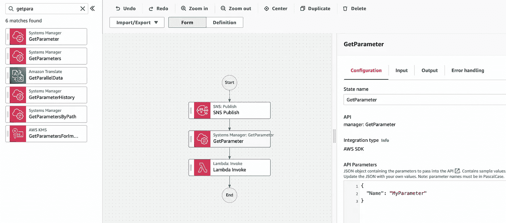
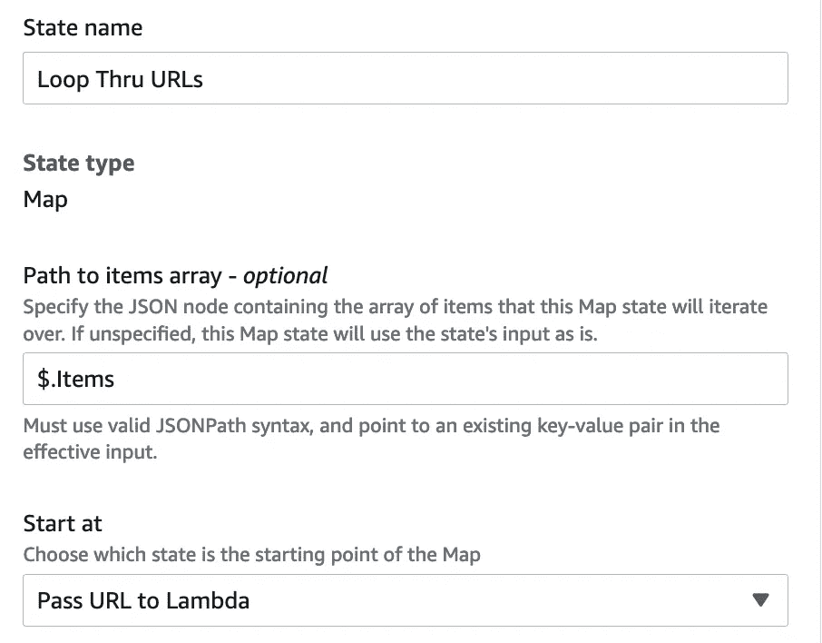
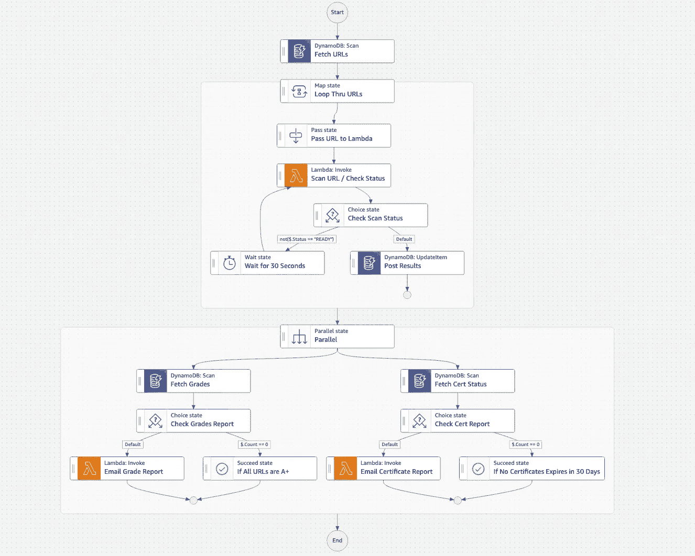

# 为什么 Step Functions 是您没有使用的最佳 AWS 服务

> 原文：<https://itnext.io/why-step-functions-is-the-best-aws-service-you-are-not-using-4f3c133d7d0d?source=collection_archive---------0----------------------->

## 我们如何使用它来满足 FedRAMP 中度合规性要求

我有件事要坦白:我爱 AWS 的 STEP 函数！它们可能是 AWS 提供的最强大的服务。但并不总是这样。当我第一次学习阶跃函数时，我被吓到了。

“什么是状态机？”

“你会如何使用它？”。

后来…

"为什么有这么多 Lambda 函数？"

它们对我来说太复杂了，难以理解。然后我开始想:如何将两个 Lambda 函数缝合在一起，其中一个得到另一个的结果？然后一切都开始有意义了！让我们来回顾一下。

# 什么是状态机？

状态机只是动作的逻辑流程。这与运行 bash 或 Powershell 脚本没有太大区别。例如:一个每天运行的脚本，它查询 Active Directory 中 90 天未登录的用户，禁用任何符合该标准的用户，并发送所有新禁用用户的电子邮件报告。这是一个非常简单的状态机。

# 为什么我不能这样做，而忘记阶跃函数呢？

作为 cron 选项卡在服务器上运行脚本需要计算资源和操作系统。这并非没有管理开销，尤其是当脚本是资源密集型的和/或对业务运营至关重要时。Step Functions 允许您抽象出管理层，同时仍然能够运行长时间的复杂流程/脚本。此外，Step Functions 与 EventBridge 等其他 AWS 服务相集成，因此您可以根据不同的事件模式触发您的状态机，甚至可以在 web 应用程序中将它用作 API Gateway 的逻辑层。

当我第一次开始使用阶跃函数时，它很棒，但是有点乏味。我必须为每个动作编写一个 Lambda 函数——这也意味着为每个 Lambda 函数设计一个具有最少特权的 IAM 角色，并对 Lambda 应用一个资源策略，通过只允许我的状态机调用 Lambda 来防止特权升级。因为我无论如何都要写代码，所以我没有发现很多 Step 函数的内部函数非常有用——对于长时间的异步流程，我只使用了 Choice 和 Wait 以及 CheckStatus Lambda。

# 直接 API 集成和 Workflow Studio 来拯救您

去年，AWS 宣布了 2 个而不是 1 个 Step 函数的游戏规则改变者:

1.  直接 API 集成——您现在可以直接在您的状态机中定义 AWS API 调用——不再需要为每个动作缝合简单的 Lambdas。每个 API 动作！这真正释放了内部函数的力量，因为我现在可以将该逻辑卸载到阶跃函数。如果你使用自定义库或者需要做一些复杂的数据转换，你只需要写一个 Lambda。
2.  workflow Studio——一个超级灵活的基于浏览器的向导，您可以通过拖放来定义您的流程。这真的提醒了我(以积极的方式！)在我之前的工作中构建 SharePoint 工作流。



Step 函数的新 Workflow Studio 的润色和手感真的是一流的！

# 构建 SSL 配置状态跟踪器

我们的一个 FedRAMP 客户目前正在与他们的授权机构进行卡托流程(连续 ATO 您每年进行 1/3 的审计，而不是每 3 年进行一次全面审计)。对于那些不熟悉 FedRAMP 流程的人来说，每个云服务提供商都必须满足基于 NIST 800–53 的数百种不同的控制，尽管 FedRAMP 控制有硬性要求，而不是许多“由组织定义”的标准。CISA 具有约束力的操作指令(BOD)18–01、 [*增强电子邮件和网络安全*](https://www.cisa.gov/binding-operational-directive-18-01) 中概述了联邦政府使用的所有公共终端的一些要求。这需要 DMARC、DKIM 和 SPF 用于所有电子邮件应用程序，以及在您的网络流量的 TLS 配置中使用强密码和 HSTS。仅仅使用 FIPS 140–2 验证的加密技术是不够的(尽管这并不排除它)，您的应用程序必须符合以下要求:

1.  3DES 按照 NIST[CAVP](https://www.cisa.gov/binding-operational-directive-18-01)的说法还是可以接受的；BOD 18–01 禁止在 TLS 中使用 3DES。RC4 也被 BOD 18–01 禁止，但是 IETF 在 2015 年通过 RFC 7465 宣布 RC4 不再被允许用于 TLS，因此这些天在野外非常罕见。
2.  必须执行 HSTS(更多关于这是下文)。

进入 ssllabs.com(由 Qualys 提供)。SSL Labs 是 FedRAMP 授权的服务，用于评估您的 web 应用程序的 SSL/TLS 状态。由于我们有 30-40 个端点要评估，这不是我们想要手动完成的事情！幸运的是，[ssllabs.com 有一个公共 API](https://www.ssllabs.com/projects/ssllabs-apis/index.html) 。这似乎是使用阶跃函数的最佳时机！

我创建了一个 DynamoDB 表，其中存储了我们必须跟踪的所有 URL。

然后，我像这样定义我的阶跃函数:

1.  通过 EventBridge 每周调用一次
2.  在 DynamoDB 中查询我需要扫描的所有 URL。
3.  我使用 Map State 内在函数告诉 Step 函数遍历列表，并对列表中的每一项执行一组操作。因为 DynamoDB 查询将列表嵌入到了 JSON 字典中，所以我只需指定在字典中的什么位置找到要迭代的列表。



4.将 URL 传递给 Lambda——在将它传递给 Lambda 之前，我使用这一步对上一步中的 JSON 进行了一些预解析。

5.使用 Lambda 调用 SSLLabs API。这是异步的，所以我没有花钱让 Lambda 一直运行到任务完成，而是让 Step 函数检查状态并等待它就绪。我的 Lambda 函数从结果中解析出几个属性。我稍后将介绍这些内容。* *旁注:我为此使用了请求库。由于这是一个基本的 Python 库，我希望 AWS 将它作为托管层之一。我理解不要把它放入运行时，但是如果能够作为一个层导入而不需要手动上传库就好了。

6.准备好之后，我会将结果上传到 dynamo db——URL 就是分区键。因为我使用了直接的 API 集成来调用 dynamo db:put item——我只是这样定义了动作。

```
{
 “TableName”: “ssllab”,
 “Key”: {
 “endpoint”: {
 “S.$”: “$.url”
 }
 },
 “AttributeUpdates”: {
 “Grade”: {
 “Action”: “PUT”,
 “Value”: {
 “S.$”: “$.grade”
 }
 },
.............
.............additional attributes
 },
 “supportHSTS”: {
 “Action”: “PUT”,
 “Value”: {
 “S.$”: “$.HSTS”
 }
 },
 “PFSCiphers”: {
 “Action”: “PUT”,
 “Value”: {
 “S.$”: “$.PFS”
 }
 }
 }
}
```

7.因为我想生成两个不同的报告，所以我运行了两个不同的分支:

1.  等级状态报告，
2.  关于证书过期状态的报告(我们没有使用 ACM，因为我们必须使用政府的 CA)

8.查询 DDB 中成绩不是 A+的所有终端以及证书将在 30 天内过期的所有终端。

```
{
 “TableName”: “ssllab”,
 “FilterExpression”: “Grade <> :val”,
 “ExpressionAttributeValues”: {
 “:val”: {
 “S”: “A+”
 }
 },
 “ProjectionExpression”: “endpoint, Grade”
}
```

旁注:看一下<>符号，这是 DynamoDB 滤波器表达式中不等于的表达式。我在 AWS 文档中没有看到这个，但是在 StackOverflow 中找到了！

```
{
 “TableName”: “ssllab”,
 “FilterExpression”: “Expiresin30Days = :val”,
 “ExpressionAttributeValues”: {
 “:val”: {
 “S”: “True”
 }
 },
 “ProjectionExpression”: “endpoint, CertIssuer, ExpirationDate”
}
```

9.如果有任何结果(Count 不等于 0)，它会将 json 结果发送给一个 Lambda 函数，该函数使用 *json2html* 库将 JSON 列表转换成 html 表。然后，我将这个 html 传递给 sesv2:SendEmail 操作来发送每周报告。

下面是最后一个流程:



阶跃函数自动生成清晰的文档流程图。

这样，我就有了一个自动化的、无服务器的 SSL/TLS 配置状态跟踪器。如果我有时间，我会在 CDK 把它打包，然后发到 GitHub 上。

**关于 SSL 实验室的一些评论**

SSL Labs 生成了一些关于您的 SSL/TLS 配置的非常有趣的数据——这些数据本身可能是一篇又长又复杂的博客。我们报告的一些属性是:

1.  分数——分数是基于很多因素的，其中一些我会在下面介绍。
2.  证书到期日期—这是 UNIX 时间，所以我必须使用 datetime 库进行转换。
3.  证书颁发者—显示简化续订过程的证书颁发机构
4.  证书主体—我还没有在 DDB 查询中建立这种逻辑，但是由于我们使用多 SAN 证书，一些 URL 将具有相同的证书，并将导致过期列表中的冗余条目。在将来的某个时候，我将在查询中添加逻辑，以便只输出具有唯一证书主体的条目。
5.  它是否容易受到几个众所周知的攻击，如野兽或心脏出血。
6.  是支持 3DES 还是 RC4。RC4 在结果中被明确地叫了出来。为了确定 3DES 是否受支持，我必须解析所有受支持的密码套件，幸运的是这并不太难。
7.  PFS——完美的前向保密——是一个概念，它意味着所有会话对所有加密都使用唯一的会话密钥。这确保了如果会话密钥泄露或被盗，并且有人记录了加密的对话，他们将只能解密单个会话。解决方案是使用短暂的密钥交换。如果您在密码套件中看到 DHE，您正在使用 PFS。这包括比圆形曲线更有效的椭圆曲线——ECDHE。
8.  HSTS(HTTP 严格传输安全)是由您的 web 服务器传递的一个报头，它告诉浏览器使用 HTTPS 向前移动该域，即使您输入 HTTP。由于没有更好的术语，可以把它看作客户端重定向。传统上，您会在 web 服务器或负载平衡器上使用 HTTP 到 HTTPS 重定向。然而，从理论上讲，如果原始请求是未加密的，并且其中包含敏感数据，那么这将会对其进行保护。最佳实践是将*最大年龄*设置为至少 1 年，并且*包括子域名*——这样所有子域名在第一次被浏览时都会执行 HTTPS。此外，你可以在标题中包含*预载*，它告诉像谷歌和 Mozilla 这样的浏览器公司，在他们的浏览器中预载这个域名——确保它不会通过 HTTP。否则，您的浏览器必须先获得您正在浏览的域名的 HSTS 响应头，然后才能知道实施 HTTPS。虽然不能保证浏览器会预加载你的域名，但是值得一试。根据 BOD 18-01，联邦政府要求所有公共联邦终端强制执行 HSTS，以满足 FISMA、CMMC 或 FedRAMP 合规性要求。
9.  安全的重新谈判——这只是因为它有点令人恼火才被包括在内。我们的一个终点不支持这一点，因此被评为 A-。当客户端或服务器想要在会话过程中切换加密密钥时，通常在客户端验证之后，使用安全重新协商。奇怪的是，这是 A+评级所要求的。重新协商会使您的网站暴露于多种攻击(DoS 和 MitM)——这就是为什么安全重新协商被发明来帮助减轻这些攻击的原因。此外，如果你使用短暂的 Diffie-Hellman，你必须问为什么你需要重新协商？这些密钥是短暂的，并且是在会话启动时计算的，在获得唯一且安全的会话密钥后，您是否需要立即转身重新协商？这可能是 TLS 1.3 中没有包括安全重新协商的原因，在 TLS 1.3 中，PFS 被明确强制执行。

Matthew 是领先的 AWS 网络安全合作伙伴 stackArmor 的高级解决方案总监，该公司为希望满足合规框架安全要求的客户设计定制解决方案:FedRAMP、NIST 800 系列、PCI-DSS、国防部 SRG、CMMC、HIPAA、FISMA、FIPS 140–2(和 3)等。StackArmor 提供了一个经过 AWS 审核的解决方案，可以加速 FedRAMP ATO 的运行并降低 40%以上的成本。