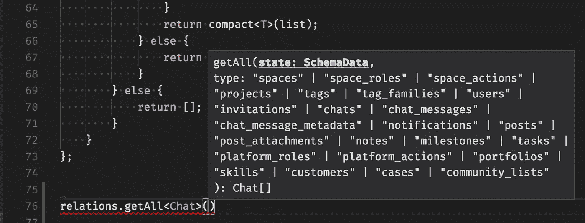

# 为什么使用 TypeScript，好的和不好的理由

> 原文：<https://itnext.io/why-use-typescript-good-and-bad-reasons-ccd807b292fb?source=collection_archive---------0----------------------->

选择。

*本文是《* [*打字要领*](https://medium.com/@wittydeveloper/typescript-essentials-b7ae85b0f561) *》，
这是第一章。*

如果你问自己:

> 我应该使用 TypeScript 吗？我需要它吗？

那么，这篇文章就送给你了。

⚠️ *这篇文章仅仅反映了我的观点、我学到的经验和引用了其他开发者的观点。*

# 不好的原因

## 使用 TypeScript，不需要编写测试

正如 [Eric Elliot](https://medium.com/@_ericelliott) 在下面这篇伟大的文章
中所解释的，“静态类型不会降低整体的 bug 密度”。类型是由开发人员编写的，在运行时不会被检查，所以你的程序的“强度”取决于你对 TypeScript 的使用。
如果你正在寻找 TypeScript 来减少你的 bug，[请看看 TDD](https://fr.wikipedia.org/wiki/Test_driven_development) 。

 [## 静态类型令人震惊的秘密

### 最近 TypeScript 的人气真的爆发了。我喜欢 TypeScript，我喜欢静态类型。我不使用…

medium.com](https://medium.com/javascript-scene/the-shocking-secret-about-static-types-514d39bf30a3) 

然而[最近的一项研究](https://blog.acolyer.org/2017/09/19/to-type-or-not-to-type-quantifying-detectable-bugs-in-javascript/)显示，使用字体可以减少 15%的错误。
引用阿德里安·科尔耶的话:

> 在开发过程中减少 15%的错误对你来说值得吗？

如果你喜欢数据，并且愿意了解关于“15%”的更多细节，我强烈建议你阅读全文:

 [## 打字还是不打字:量化 JavaScript 中可检测的错误

### 打字还是不打字:量化 JavaScript 中的可检测错误高等，2017 这是一个了不起的…

blog.acolyer.org](https://blog.acolyer.org/2017/09/19/to-type-or-not-to-type-quantifying-detectable-bugs-in-javascript/) 

使用类型用 JavaScript 开发不会使程序不容易出错。
还在疑惑“*为什么？”，*这就把我们带到了下一节👇。

## 有了 TypeScript，我可以在运行时信任我的代码

TypeScript 是一个静态类型检查工具，它不能保证您的代码在运行时按预期运行。
以下代码片段示例:

即使函数声明是类型化的，也不能保证运行时⚠️的输入类型是什么

尽管您的函数是“类型化的”，但是如果开发人员选择将参数类型强制转换为`any`，TypeScript 会忽略类型验证。关于类型转换的更多信息，请跟我学第二章。

> 请记住，TypeScript 不会在运行时进行类型断言

## TypeScript 看起来更像 C#，我不需要理解 JavaScript

作为一个长期的 JavaScript 爱好者，与面向对象的方法相比，我总是偏爱函数式方法。

我认为 TypeScript 应该在这里促进团队合作，提高速度，并改善项目的可维护性。

TypeScript 不应该用来(在我看来)尽可能快地把一些非 JavaScript 开发人员放到前端。

TypeScript 还是 JavaScript，所以[理解 JavaScript 很重要](https://medium.com/javascript-scene/the-two-pillars-of-javascript-ee6f3281e7f3)。

# 好的理由

## TypeScript 将帮助您的开发人员在不断增长的代码库上一起工作

> TypeScript 允许开发人员专注于公开的 API，而不必记住所有代码。

我相信 TypeScript 最好的一点是鼓励开发者开发公开接口(像*契约*)。

如果您在遵循 [SRP](https://en.wikipedia.org/wiki/Single_responsibility_principle) 的架构中使用隔离的组件/服务，那么 TypeScript 允许您使用类型化接口来公开您的 API，让其他开发人员“保持在循环中”。

这个导出的函数公开了一个清晰的签名，如果我修改了它，如果任何使用它的代码被破坏了，我会立即得到通知

我要补充的是，这种“面向接口的开发”使得与大型团队合作变得更加容易，尤其是如果那些团队是由不同级别(初级、高级)的开发人员组成的话。
**我坚持认为对 JavaScript 的良好理解是至关重要的**，但是 TypeScript 使得大型项目中的入门**更加容易，并且允许开发人员专注于公开的 API，而不必记住所有的代码。**

更重要的是，TypeScript 将避免疏忽错误，如“错别字”。

## TypeScript 工具将节省开发人员的时间

> 老实说，我总是回避每一个工具和 IDE，认为它会让我变得愚蠢和懒惰。

但是对于 TypeScript(以及其他语言)，核心团队为工具做了一个令人敬畏的架构工作。

这些分为许多部分:

*   `[**tsserver**](https://github.com/Microsoft/TypeScript/wiki/Standalone-Server-%28tsserver%29)`
    TypeScript 核心团队非常关心开发人员的体验，这就是为什么他们开发了一个可用的工具(作为流程服务)
    这个工具然后被所有 IDE 使用，为所有 IDE 的所有开发人员带来相同的 UX。
*   [**语言服务器协议项目**](https://microsoft.github.io/language-server-protocol/)微软并没有在打字稿层面停止这一举措。
    语言服务器是一个为所有语言开发类似“tsserver”服务(又名语言服务器)的协议。

> *语言服务器协议(LSP)* 背后的想法是标准化工具和服务器如何通信的协议，因此单个*语言服务器*可以在多个开发工具中重用，并且工具可以以最小的努力支持语言。

*   **其他工具和倡议** 通过查看 [TypeScript 架构](https://github.com/Microsoft/TypeScript/wiki/Architectural-Overview)，你会看到编译器和 utils 都是“开放”的。这使得社区可以开发出许多令人敬畏的工具，比如 TSLint。

例如，VSCode 使用 TypeScript 语言和工具的所有可用功能来帮助开发人员轻松地重构和编写代码。
这让我可以专注于真正的问题，让 TypeScript 覆盖我已经知道但有时会忘记的东西(错别字、标准 API 等)
这包括所有重构预防措施，我完全有能力采取这些措施，但往往懒得采取！⤵️

Visual Studio 代码中出色的重构功能示例

我将在第 2 章详细介绍 VSCode 的一些特性。

## 微软社区努力的成功故事

从历史上看，像许多前端开发人员一样，我并不热衷于微软。但是，老实说，微软近年来为网络做了一项了不起的工作。

以我的经验来看，第一个将打字引入 JavaScript 的“社区”是拥有 Dart 和 AngularDart 的 Google。
后来，Angular 团队开始了一个名为 AtScript(带类型和运行时类型检查的 JavaScript 超集)的框架。
最后，谷歌的 Angular 团队选择使用 TypeScript，以及微软公开发布的新 JavaScript 超集语言。
与此同时，脸书放出了信息流(主要针对 React)。

Angular 2 集成 3 年后，随着 VSCode 的开发和全面的 React 集成，TypeScript 有了一个巨大的活跃社区，许多公司在生产中使用它。

以下是最伟大的社区成就的(非常)候选名单:

*   **React“集成”propsTypes**
    “本机”TypeScript 类型和 React PropTypes 之间的映射。

*   **definitely typed*@ types*** *几乎所有的热门包都有自己的 TypeScript typing**比* [*4200+ npm 包*](https://www.npmjs.com/~types)*【typed】更受社区欢迎！*
*   **ApolloData GraphQL 类型生成** 如果你正在使用 GraphQL API，这确实是一个*杀手锏！
    Apollo 团队开发的一套工具将为你的前端应用生成所有的 TS 类型，这使得“类型真实”。
    更多详情:* [阿波罗-codegen](https://github.com/apollographql/apollo-codegen)

## TypeScript 让您体验未来的 JavaScript，并带有类型。

即使“TypeScript”包含“type”，该语言也不会强制用户使用类型。
即使我鼓励你使用类型的所有功能(在第 2 章)，TypeScript 在 ES-next 特性集传输方面做得相当好。
然而，**它并不等同于巴别塔**允许使用真正早期 [TC39 阶段](https://tc39.github.io/process-document/)的特性。

# 摘要

**不良**

*   测试替换， **TypeScript 不是测试框架**
*   运行时安全， **TypeScript 不是运行时类型检查器**
*   我可以写面向对象的 C#类代码，
    **TypeScript 就是 typed JavaScript**

**好的**

*   团队和代码可伸缩性与“面向接口的开发”
    **TypeScript 将帮助您处理成长中的团队和大型代码库**
*   工具和社区
    **微软做了一个了不起的社区工作。**
*   ES-next compliance
    **TypeScript 带你领略一下未来的 JavaScript，带打字。**

我希望这一章能帮助你很好地理解什么是 TypeScript，并确定它是否是一种你可能受益的技术。👌

## 请随意关注我的第二章:

[**《诚实的预告片:利弊》**](https://medium.com/p/typescript-the-honest-trailer-ae19e7bc0f7e)