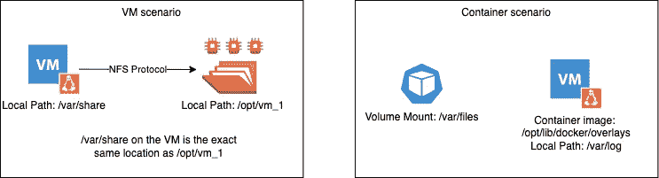
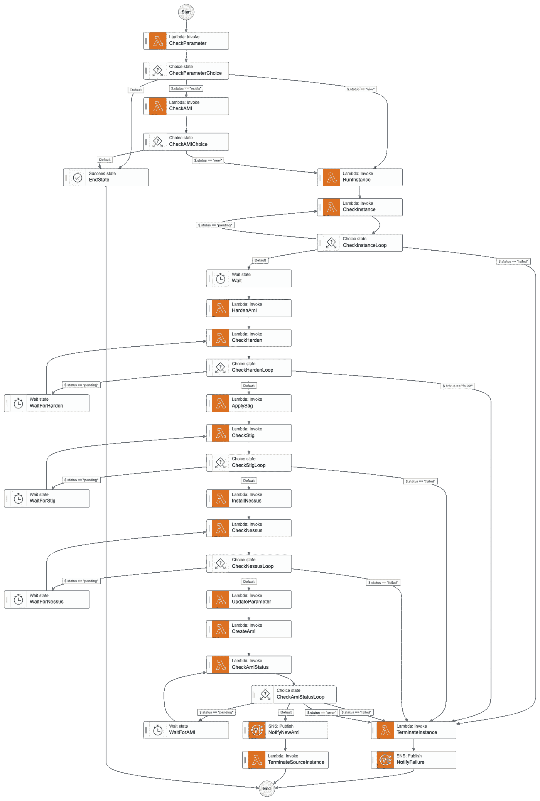

# 为什么我们需要基于主机的容器化保护

> 原文：<https://itnext.io/why-we-need-containerized-host-based-protection-758ed209da56?source=collection_archive---------4----------------------->

容器化的工作负载早已成为企业应用程序事实上的标准部署模型。然而，在如何正确保护工作节点以满足 CMMC 和 FedRAMP 等监管市场的合规性需求方面，仍然存在一些普遍的困惑。查看我之前的博客，了解如何满足联邦工作负载的集装箱扫描要求。

今天，我们将探讨基于主机的工作节点保护，即防病毒、文件完整性监控、应用程序允许列表(也称为基于主机的安全套件或 HBSS)。

对于这些要求，FedRAMP SI-3 明确规定:

> 本组织:
> 
> a.在信息系统入口和出口点采用恶意代码保护机制来检测和消除恶意代码；
> 
> b.根据组织配置管理政策和程序，在有新版本时更新恶意代码保护机制；
> 
> c.将恶意代码保护机制配置为:
> 
> 对信息系统进行定期扫描**【分配:组织定义的频率】**并对来自外部来源的文件进行实时扫描【选择(一个或多个)】；端点；网络入口/出口点]根据组织安全政策下载、打开或执行文件；以及**【选择(一个或多个):拦截恶意代码；隔离恶意代码；向管理员发送警报；【分配:组织定义的动作】]** 响应恶意代码检测；和
> 
> d.解决恶意代码检测和清除期间的误报接收以及由此对信息系统可用性造成的潜在影响。

## 补充指南:

> 例如，信息系统入口和出口点包括防火墙、电子邮件服务器、web 服务器、代理服务器、远程访问服务器、工作站、笔记本电脑和移动设备。例如，恶意代码包括病毒、蠕虫、特洛伊木马和间谍软件。恶意代码还可以以各种格式编码(例如 UUENCODE、Unicode)，包含在压缩或隐藏文件中，或者使用隐写术隐藏在文件中。恶意代码可以通过不同的方式传输，包括例如网络访问、电子邮件、电子邮件附件和便携式存储设备。恶意代码插入是通过利用信息系统漏洞来实现的。例如，恶意代码保护机制包括反病毒签名定义和基于信誉的技术。存在各种技术和方法来限制或消除恶意代码的影响。普遍的配置管理和全面的软件完整性控制可以有效地防止未授权代码的执行。除了商业现成软件，定制软件中也可能存在恶意代码。例如，这可能包括逻辑炸弹、后门和其他类型的网络攻击，这些攻击可能会影响组织使命/业务职能。传统的恶意代码保护机制并不总能检测到此类代码。在这些情况下，组织依赖于其他安全措施，包括例如安全编码实践、配置管理和控制、可信采购过程和监控实践，以帮助确保软件不执行除预期功能之外的功能。组织可以确定在检测到恶意代码时，可能需要采取不同的措施。例如，组织可以定义响应定期扫描期间的恶意代码检测的动作、响应恶意下载的检测的动作、和/或响应试图打开或执行文件时的恶意检测的动作。

在解决这些需求时，我经常听到的最大误解之一是，当人们问他们是否应该在容器中部署 AV/FIM/AppControl 解决方案时，答案是响亮的“不”!为了解释，让我们来看看容器和它们的宿主是如何交互的。

容器使用所谓的联合文件系统——非常类似于使用 NFS 之类的协议装载远程共享。在左侧的场景中，一个虚拟机在/var/share 处装载了一个 NFS 共享。如果您通过 SSH 连接到 NFS 服务器，那么虚拟机存储在/var/share 的文件实际上存在于/opt/vm_1 上。

容器以非常相似的方式运行。当容器映像下载到主机上时—映像的内容存储在主机上，通常在目录:/opt/lib/docker 中。这就是为什么如果您运行主机的漏洞扫描，如果容器有漏洞，它会显示在主机的漏洞扫描中，漏洞只会出现在下载容器映像的目录中。旁白:我不会依赖主机漏洞扫描来检测容器映像中的漏洞——很难追踪漏洞属于哪个映像版本。坚持使用容器图像扫描解决方案，但是很高兴知道基于主机的解决方案仍然可以发现已部署容器的漏洞。

在容器中装载卷时，卷在装载路径下对容器可见，即作为容器运行的应用程序将引用此路径(例如/var/files)。但是，如果您 SSH 到运行容器的主机，您将在/var/log 中看到容器使用的文件。

长话短说，在工作节点上安装 HBSS 本身不仅足够了，而且是唯一的前进道路。但是，这又增加了一层复杂性，需要将 HBSS 堆栈放入工作节点映像中。大多数组织依赖于不可变的工作节点，并希望实现一个映像管道来强化和安装他们的工作节点上的安全堆栈。AWS 提供了一个专为这些场景设计的 EC2 映像构建器。在撰写本文时，EC2 Image Builder 还没有通过美国国防部 SRG 工作负载的 IL-4/5/6 认证。在这种情况下，您可以利用阶跃函数来编排图像管道。

正如您所看到的，这可能非常复杂，并且如果您正在利用多云，您可能必须维护多个工作节点映像和管道，这确实会限制您。

我希望看到的是，拥有基于主机的安全解决方案的公司，如 BlackBerry/Cylance、Trend Micro、Tenable(用于扫描代理)等，提供代理的容器化版本。这样，它就可以作为具有足够文件系统权限的 DaemonSet 运行(这可能意味着作为 root 运行),并允许您将 HBSS 部署抽象为 Kubernetes 本机结构。这与其他安全解决方案一致，如 Splunk Connect，它利用 FluentBit 的 DaemonSet 将容器日志发送到 Splunk 实例，还有 Falco。目前，有一个社区拥有的项目将 CrowdStrike Falcon 传感器部署为 DaemonSet。我希望看到它获得 CrowdStrike 的官方支持。但这绝对是朝着正确的方向发展！

 [## GitHub - CrowdStrike/falcon-helm:使用 Kubernetes 运行 CrowdStrike Falcon 的舵图

### Falcon 是 CrowdStrike 平台，旨在通过一套统一的云交付技术来阻止违规行为…

github.com](https://github.com/CrowdStrike/falcon-helm)