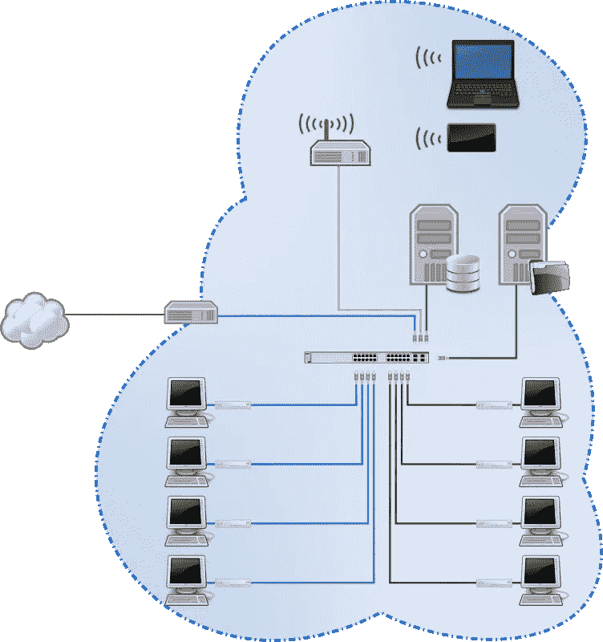
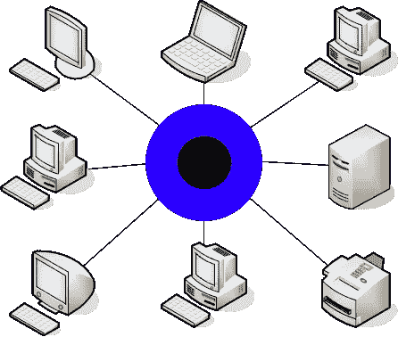
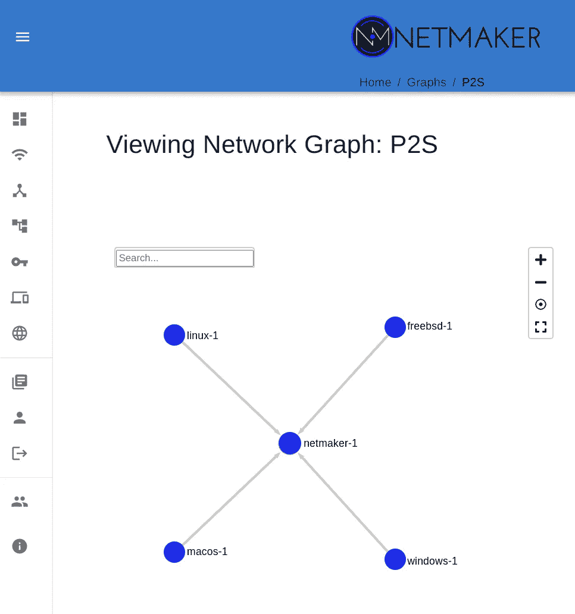
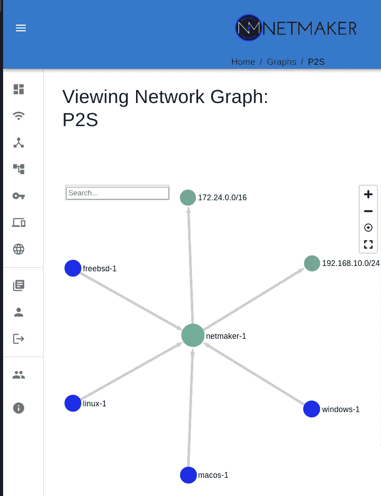

# 为什么您可能不想要网状 VPN

> 原文：<https://itnext.io/why-you-might-not-want-a-mesh-vpn-21ac040c767b?source=collection_archive---------4----------------------->

*声明:我是* [*Netmaker*](https://github.com/gravitl/netmaker) *的创造者，一个网状 VPN 平台。*

网状虚拟专用网真的很酷。想象一下亚马逊的 VPC、数据中心的子网或您的本地局域网。这些是多组位于同一地点的设备，它们可以直接安全地相互通信。

网状虚拟专用网很像局域网或 VPC，但设备可以生活在任何地方。想象一下，创建一个由分散在全球各地的计算机、服务器、电话和物联网设备组成的专用网络。

这就是为什么许多人选择 [Netmaker](https://netmaker.org/) 作为他们的虚拟网络平台:它使用 WireGuard 创建网状虚拟网络，与 OpenVPN 或 ZeroTier 等旧设备相比，它的速度非常快。

我们已经在 Netmaker 上工作了大约一年，最近几个月，我们收到了一些用户的询问，他们想要更少的连接。

这些用户正在设置诸如互联网网关或远程访问服务器之类的东西。在这种情况下，他们有一堆设备需要访问一个端点，但不希望所有设备相互访问。

*嗯嗯*，我们认为……*是的，这可能有道理……他们不希望在访问远程服务器时，有上百台其他设备知道如何访问他们的笔记本电脑。*那*做*有道理。

幸运的是，WireGuard 非常灵活，我们能够相对容易地添加一个名为“点到点”网络的新功能。那么有什么区别呢？想象一个没有中继的星型拓扑:

网络中的每个节点都有一个对等点，即“集线器”在星型拓扑中，该集线器通常充当中继，在网络中转发流量。我们在 Netmaker 中已经有了一个功能(它被称为… [中继](https://docs.netmaker.org/relay-server.html))。

相反，在点对点网络中，就是这样。这对于您需要提供对…的安全访问的场景来说非常理想

*   一堆机器中的一台。
*   远离一堆其他机器的远程位置的子网。
*   一台“堡垒”机器上的一堆设备
*   来自一堆设备的互联网

所有这些都可以通过网状网络实现，我们已经实施这些模式有一段时间了。不同的是，在点对点网络中，你不会在这个过程中得到所有那些额外的、不必要的连接。

这也可以与一个 [**出口网关**](https://docs.netmaker.org/egress-gateway.html) (另一个 Netmaker 原创)结合，以提供对整个远程网络的访问。因此，如果你在 AWS 中有一个服务器，它可以作为一组远程机器进入 VPC 的网关。

因此，简而言之，网状网络很酷，非常灵活，能给你所需要的访问。*然而*，你可能会得到比你所需要的更多的访问权限。在这种情况下，你可能会想要一些更…有限的东西。