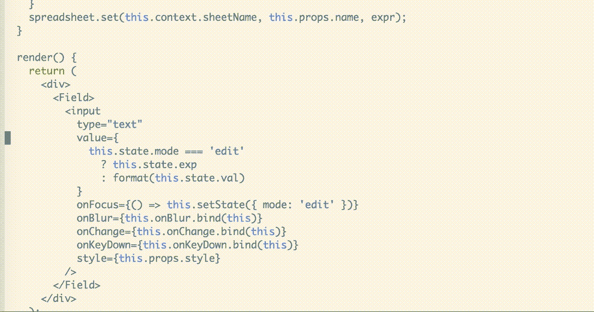

# 如果你在团队中工作，为什么你需要更漂亮的生活

> 原文：<https://itnext.io/why-you-need-prettier-in-your-life-if-you-work-in-a-team-8b0658dc1d89?source=collection_archive---------2----------------------->

我先问一个问题，下面哪一行代码的格式是正确的？

```
a) if ( this ) { foo('bar'); }
   const options = { width, height, title } = this.props;b) if(this){
     foo("bar");
   } const options = { 
       width, 
       height, 
       title, 
   } = this.props;
```

嗯，答案应该是“没关系”。上述代码中的任何变化都不会对最终结果产生任何影响，关心它看起来像什么只会减慢我们的速度，并在不值得担心的问题上耗尽认知负荷。

下面这段代码怎么样？

```
if(this){
     foo("bar");
   }const options = { width,height, title, description,date,author,image,imageLarge}
   } = this.props;
```

明明是乱七八糟！跳转不一致，我们有一些很长的线长度。

我们可以解决这个问题的一个方法是使用 ESLint 和一套严格的规则。但是你曾经不得不处理一个过分热心的 ESLint 配置吗？我最近有，它是令人厌烦的。我会创建一个组件，然后花 10-15 分钟浏览它，在正确的地方添加空格，直到它最终接受我的工作。与此同时，我已经忘记了我最初想做什么。完全是浪费时间。

漂亮女孩来救我们了！用它自己的话说，“漂亮是一个固执己见的代码格式化程序。它通过解析您的代码，并按照自己的规则重新打印代码，来实现一致的风格。”

让我们一次用一行关键词。

# 固执己见的

这意味着你不能选择。不再有关于我们将如何格式化代码的团队会议，喊得最响的人也不会得到他们的方式的实现，所以这更公平。这个应该有换行吗？括号内的空格？谁在乎呢——我们正在按漂亮女孩想要的方式做！

# 一致的

当多个开发人员在同一个项目上工作时，一致性是必须的。不管是谁创建的，代码看起来都是您期望的样子。你不能抱怨有人在应该有四个空格的时候使用了一个制表符，或者他们在不应该有空格的地方留了空格——每次都是一样的，这不是谁的错——漂亮地做到了！

# 重印

这东西是自动的。你不需要告诉它运行，你不需要通过它返回，直到它高兴。它“只是工作”,并且每次都以同样的方式工作。


# 用 ESLint 更漂亮

我们已经有了 [eslint](https://www.npmjs.com/package/eslint) ，为什么还需要更漂亮的？用漂亮来格式化，用林挺来表达它的本意——功能性。使用 [eslint](https://www.npmjs.com/package/eslint) 来确保你没有留下没有被使用的变量，并且你没有在你的生产代码中留下控制台日志。

即使使用 ESLint，我也会选择使用一组推荐值。同样，如果你配置，你的观点。如果你认为，你必须证明，这导致讨论，会议，认知能力从编码输出中被拿走，浪费在多余的东西上。

下面是我在 React 项目中使用最新的 JavaScript (transpiled with Babel)设置 ESLint 的一个例子。

# 在代码编辑器中使用

几乎每个代码编辑器都支持更漂亮的。您可以让它在保存时运行。看起来是这样的:



从[https://jlongster.com/prettier-1.0](https://jlongster.com/prettier-1.0)

这很方便，但是会有点烦人和分散注意力。我倾向于让我写的代码不管我写了什么，让漂亮的人以后为我担心。我仍然写单引号，在我想要的地方加空格，并且有很长的行。当我提交我的工作时，它已经被处理好了，没有人会看到我的格式错误的代码。

# 作为提交前挂钩运行

那么，当我们提交时，如何让它运行呢？用一个饭桶挂钩。你可以自己管理和编写这些或者使用一个包，比如[哈士奇](https://www.npmjs.com/package/husky)和另一个叫做 [lint-staged](https://www.npmjs.com/package/lint-staged) 的包。总的来说，这让我可以在提交之前，把我上次提交后编辑过的所有文件都整理出来，在 Prettier 和 ESLint 中浏览一遍。

# 配置

你*可以*配置的更漂亮，但是按理说你不应该。其实刚出来的时候，你根本配置不了。这是固执己见，这才是重点。我告诉你一个秘密，这并不是说它会以让每个人都开心的方式格式化代码，事实上，它可能会以让每个人都同样不开心的方式格式化代码。这算是一种胜利。您可以告诉它偏向单引号(它的目标是使用尽可能少的转义的引号方法，默认为双引号)，您可以更改它的行长度、括号间距等等。但我真的建议你不要。一旦开始配置，那就是你的看法，而不是更漂亮的，你得自圆其说。如果只是“它有多漂亮”，你可以卸下责任，停止讨论，继续你的一天。

# 结论

这篇文章的标题是为什么你在一个团队中需要它。它在团队中如此有用的原因是一致性和不需要意见。如果 Prettier 告诉你它是怎样的，团队中就没有人发号施令，也不需要围绕代码格式召开不必要的会议。如果你还没有尝试过，那就试试吧——你将永远不会回头！

这篇文章是我不久前在 [BristolJS](https://www.meetup.com/BristolJS/) 做的演讲的一部分，并且[的幻灯片可以在网上获得](http://slides.com/paulthomas-1/what-is-prettier-why-you-need-it#/)。