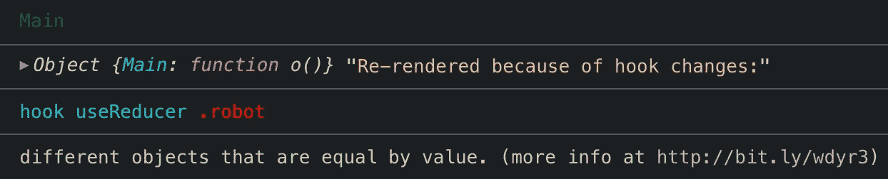
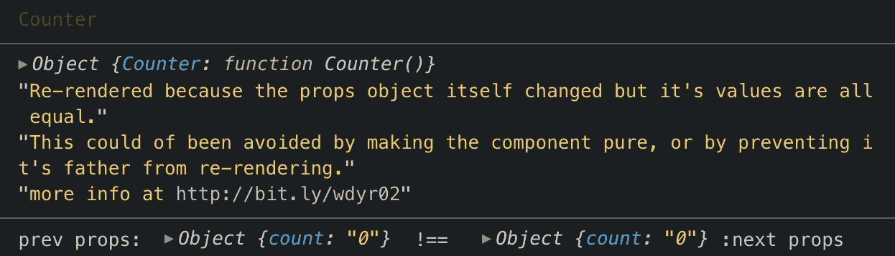

# 你为什么渲染，有什么反应？

> 原文：<https://itnext.io/why-you-rendering-react-a6332b3ced24?source=collection_archive---------4----------------------->

React 让开发人员可以自由地以他们认为合适的方式设计他们的应用程序。你使用类组件，高阶组件，渲染道具组件，钩子，还是这些模式的混合？然后是国家管理决策。你的应用程序的组件+状态架构很快就会变得非常笨拙。

无论你如何组装你的应用程序，确保你的组件和状态的改变能够像预期的那样触发重新渲染总是一个好主意。如果要重新渲染昂贵的组件，这一点尤为重要。

为了确保这不会发生，一个全面的方法是使用一个方便的开发包，[Why-do-You-Render](https://www.npmjs.com/package/@welldone-software/why-did-you-render)。要设置它，只需在安装包后将此代码片段添加到您的应用程序代码库中:

```
if (process.env.NODE_ENV === 'development') {const whyDidYouRender = require('@welldone-software/why-did-you-render');whyDidYouRender(React, {
    include: [/** REGEX here to include **/]
  });
}
```

添加环境变量 conditional，以便仅在开发模式下执行此操作。

至少，您只需要`include`选项。它接受一个与组件 displayName 匹配的正则表达式数组。我会选择包含最昂贵的组件。但是，如果你想测试你的整个应用程序，只需要做`[/A-za-z/]`。

一旦就位，任何可避免的重新渲染都会被记录到你的控制台上。**那么哪些是可以避免的重渲染呢？为了回答这个问题，让我们来看看 Why-do-You-Render 的一些日志。**

打开下面的代码沙盒示例，点击*“坏集计数”*按钮。哇，这么多日志，我们甚至还没有输入一个新的值！

从最初的[为什么渲染](https://medium.com/welldone-software/track-redundant-re-renders-that-caused-by-hooks-with-why-did-you-render-version-3-504468deb653)示例扩展而来。显示嵌套对象并使用 Immer。

看一下日志——

**“因挂钩变化而重新渲染:值相等的不同对象”**



因为 React 钩子通过比较引用而不是值来呈现。所以它会重新渲染，除非通过`[object.is](https://developer.mozilla.org/en-US/docs/Web/JavaScript/Reference/Global_Objects/Object/is)`比较两个值相等。

由“坏集计数”调用的 reducer case 发生变异并创建一个新对象:

```
case "broken-set-count":return {
    robot: { count: action.payload.count } // mutated no!
  };
```

`set-count`方法确实更好。它比较变异前的值。

```
case "set-count":if (action.payload.count === state.robot.count) {
    return state; // return previous state
  }return {
    robot: { count: action.payload.count } // new object
  };
```

但是实际上，使用像 [ImmerJS](https://github.com/immerjs/immer) 这样的实用程序库来处理不变性要好得多:

```
case "set-immer-count":const newState = produce(state, 
   draftState => { draftState.robot.count = action.payload.count });return newState; // all good!
```

**“重新渲染，因为道具对象本身发生了变化，但其值都是相等的。”**



这是因为当父组件重新渲染时，子组件也会重新创建为新元素。(此处阅读更多[深度解释](https://medium.com/welldone-software/why-did-you-render-mr-big-pure-react-component-part-2-common-fixing-scenarios-667bfdec2e0f))。

在演示中，问题的关键是变异的对象。因此，有了两个更好的减速器方法，这个*似乎*被固定。

但也不尽然。

当父组件合法地重新呈现时，并不是所有的子组件都需要更新。例如，当我们点击*“切换机器人颜色”*按钮更新`props.monochrome`时，我们不希望`Counter`重新渲染。它应该只与`props.count`有关。然而，我们从日志中看到它确实如此。

解决办法就是用`React.memo`。(如果使用一个类组件，等效的解决方案是扩展为一个`Pure.component`。)当`props.monochrome`改变时，封装在记忆化函数中的`CounterMemo`组件不会触发任何不必要的重新渲染。

```
const CounterMemo = React.memo(({ count }) => {
  return <p>how many robots (memo)?: {count}</p>;
});
```

不变性和记忆性都是当今常见的最佳实践。使用 Why-do-You-Render 是检查任何遗漏或意外的好方法。我发现现在新的 React Dev 工具[移除了高亮更新](https://github.com/facebook/react/issues/16437)特性，这更加有用了。:(