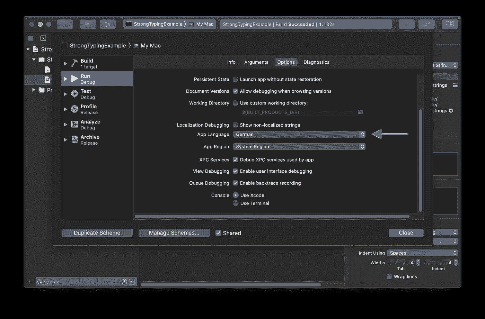
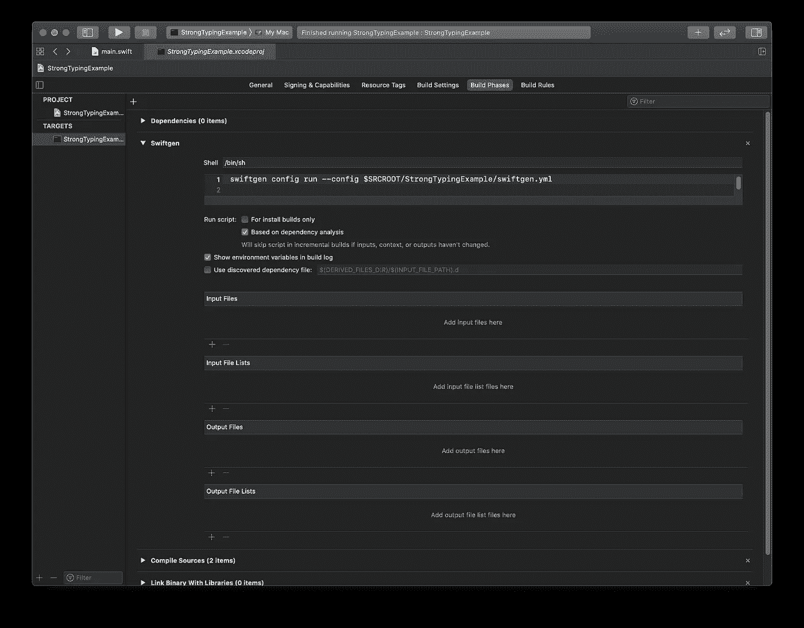
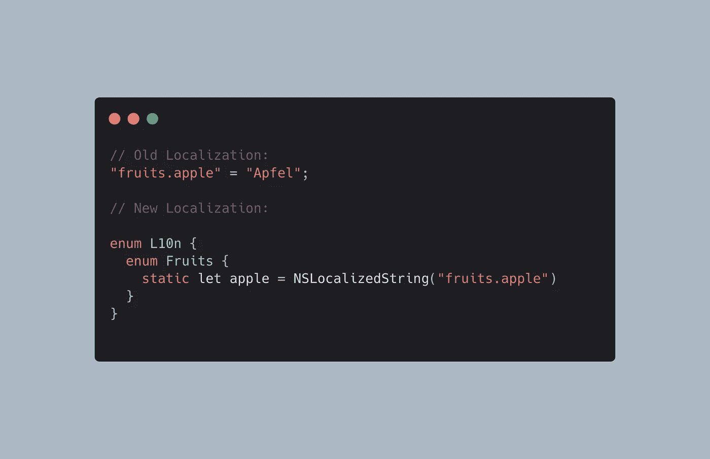

# 为什么您应该使用 Swiftgen 强类型化您的本地化

> 原文：<https://itnext.io/why-you-should-strongly-type-your-localizations-with-swiftgen-340e35e7b6a3?source=collection_archive---------0----------------------->

为了开始这个故事，您将看到一个非常基本的代码示例，其中包括一些问题。我们将一起改进代码片段，并最终创建一个复杂的解决方案。

> 即使在这个故事中使用 SwiftUI，它也不是主要作用域，只用于更简单的代码片段。这些概念适用于任何可用的 Swift 项目，包括 UIKit/AppKit 接口，甚至命令行工具。

# 隐藏在明处的问题。

请看下面的视图示例，其中显示了行动号召消息和行动按钮:

如果您在 SwiftUI 应用程序中使用这个代码片段，它会工作得很好，并且行动号召实现了它的目的:它告诉用户点击按钮。

一些开发人员会停止进一步思考这些代码，继续进行项目，但是您可能已经注意到了一个潜在的问题:更改按钮文本会导致不一致！

第一个主要问题是代码重复，特别是重复的字符串。当我们改变按钮的标签时，我们也必须改变消息中的文字。

作为最初的解决方案，我们决定创建一个小的静态常数，它可以在两种情况下使用。

这个简单的改变已经在两个方面改进了我们的代码:

1.  我们的代码库中不再有重复的字符串，并且
2.  现在保证`Text`和`Button`显示相同的值。

# 故事继续…

您的项目在增长，您不断添加更多的视图，最终得到一个完成的版本。你自豪地与世界分享的人。
不久之后，你意识到:“我必须翻译应用程序，这样更多的人才能使用它”，于是你开始研究 iOS/macOS 本地化技术。

幸运的是，这很容易使用`NSLocalizedString`宏/函数来实现，所以我们可以改变常量来应用本地化。

`NSLocalizedString`所做的事情非常简单:我们传递给它一个字符串，该字符串在本地化的字符串文件中用作查找关键字。如果找到了翻译，则返回该翻译，否则查找关键字将作为默认值。

此外，您可以创建相关的`Localizable.strings`文件，其中包含新添加语言的本地化字符串。

> 因为我来自奥地利，所以我会用德语作为这个故事的第二语言。

完美。您再次使用不同的应用程序语言运行您的应用程序，并且`NSLocalizedString`使用`Tap me!`作为键来查找翻译`Tipp mich!`。

快速提示:您可以在模式查看中更改当前的运行时语言

不幸的是，这又引入了我们之前克服的同样的问题:尽管 UI 和字符串常量之间的链接受到编译时安全性的保护，但我们的常量和本地化资源之间的链接却没有保证！

这意味着，如果我们在`NSLocalizedString`调用中更改查找键名称(例如，更改为`Please tap me!`，它将不再找到映射的翻译字符串。更糟糕的是，我们不会注意到它，因为构建过程不会失败(由于默认的不翻译行为，如果没有找到)。

最简单的解决方案是引入静态键，但是我们不希望在 UI 中向用户显示静态标识符。因此，我们需要添加一个`value`参数，它现在提供原始字符串作为默认值。

为了反映我们对本地化文件的新更改，您还需要更改本地化的`.strings`文件以匹配关键字:

这几处改动已经解决了这个问题。但是我们还没有完全实现。常量和翻译文件之间的链接仍然是松散的，远远不能保证。

在进一步改进之前，我们也需要将我们的信息添加到常量中。因为它使用字符串插值来插入按钮文本，但是我们的翻译文件只是静态字符串，所以我们需要修改代码:

我们使用`String(format:)`，它将格式/模板字符串作为第一个参数，并用可变参数替换所有格式说明符(例如`%@`)。

> **快速提示:**
> 格式说明符对于大多数编程语言都是标准化的。你可以在苹果文档中找到完整的列表。

将另一个带有翻译值的静态键添加到`Localizable.strings`文件中，并在我们的枚举中将它声明为一个常量:

Swift 是一种强类型语言，编译器在帮助我们发现常见问题方面做了大量工作。它还帮助我们少考虑某些代码的前提条件，比如函数调用所需的参数。

由于`NSLocalizedString`和`String(format:)`使用基于字符串的 API，这种类型安全不适用于它们。更糟糕的是，如果使用不当，它会导致崩溃(根据我个人使用`os_log`的经验，它也使用格式字符串)。

幸运的是，我们是熟练的程序员，可以将`String(format:)`的用法包装在一个只有一个参数的函数中，以减少链接的松散性:

多么干净的解决方案🤩常量包括所有必要的信息，这些信息很可能不需要很快进行编辑，并且在视图中的使用非常优雅。

由于 Xcode 仍然没有为我们提供自定义常量和本地化文件之间的验证工具，这些映射需要由开发人员手工创建和检查。

## 反转方向

到目前为止，我们总是先编写代码，然后将字符串添加到本地化文件中。即使我们后来更改了代码，您也很可能会先定义一个新的常量，然后在将来添加翻译。

这样做听起来像是一种逻辑上连贯的方法…但是如果我们把它调换一下呢？如果我们不需要创建枚举、常量、帮助函数等等，那会怎么样呢？取而代之的是直接询问 Swift 代码完成以获取可用资源？**伏笔加剧**

感觉与我们之前的结论相矛盾，但坚持我的观点。你会喜欢接下来发生的事情。

# Swiftgen

[Swiftgen](https://github.com/SwiftGen/SwiftGen) 是 Swift 代码的代码生成器。它的主要目的是使用[不同的解析器](https://github.com/SwiftGen/SwiftGen#available-parsers) ( `.strings`、`.xcassets`、`.json`等读取现有数据。)，将它与通用的[模板](https://github.com/SwiftGen/SwiftGen/tree/stable/templates)结合起来，并将其自动编写成可供编译的 Swift 代码。

GitHub 上有超过 7，100 个⭐️(在撰写本文时)，这已经是一个广受欢迎的项目，经过近 6 年的积极开发，已经成为一个成熟的解决方案。

他们的文档很全面，入门指南也很容易理解，因此这里只是一个快速总结，以继续我们的使用案例:

在[安装](https://github.com/SwiftGen/SwiftGen#installation)之后，我们首先需要创建一个配置文件`swiftgen.yml`，其内容如下:

因为我们不想在代码中手工定义本地化，所以为默认语言(在本例中是英语)创建一个`Localizable.strings`，并记下先前在常量中定义的值:

然后在与配置文件相同的文件夹中运行命令`swiftgen`(确保您到本地化文件夹的路径是正确的)。
它将读取我们的`.strings`文件，并在`Generated/Strings.swift`文件中创建一个强类型本地化`enum`:

如果您仔细看看`L10n`枚举，您可能会意识到:“这看起来类似于我们之前创建的常量枚举！”你是对的。

将这个文件添加到我们的项目后，我们现在可以删除之前引入的`enum Strings {...}`，并使用生成的`L10n`来代替:

此外，我们可以添加一个构建脚本阶段，在构建期间重新生成 Swift 代码，从而确保我们只访问实际给定的代码。

快速提示:生成脚本必须在“编译源代码”阶段之前运行

厉害！无需更多的手动工作，我们能够访问我们的本地化，而不必担心密钥或参数…特别是在添加新的密钥或参数时💪🏼

# 结论

Swiftgen 是一个自动化工具，负责生成安全访问资源的代码，否则只能使用基于字符串的 API。

在这个故事中，我们只探索了这个代码生成器的一小部分功能，它在编写定制模板时会更加强大。为了保持这个故事的范围简洁明了，这将在另一篇即将发表的文章中详细解释，特别是关于代码模板的教程。
一定要在[Twitter](https://twitter.com/philprimes)T21[Medium](https://medium.com/@philprime)上关注我，这样你就不会错过了！

如前所述，我们希望能够保证特定的本地化密钥确实存在于默认语言本地化文件中。
一方面，这仍然没有实现，特别是如果生成的代码已经过时，因此定义了与`.strings`文件中给出的不同的值。

另一方面，结合构建脚本，这非常接近内置编译器/代码完成支持的工作方式，因此，如果我们信任我们的自动化工具，我们就可以信任映射。

如果你想了解更多，请查看我的其他文章，在 Twitter 上关注我，并随时给我发短信。
告诉我其他优秀的 Swift 开发构建工具！你有具体的话题想让我介绍吗？让我知道！😃