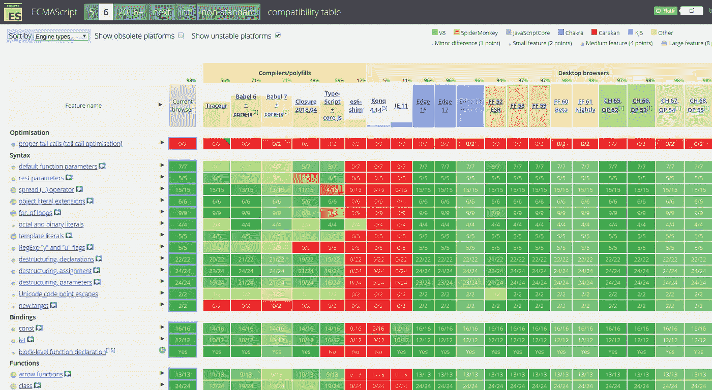

# 为什么您应该使用 ES6

> 原文：<https://itnext.io/why-you-should-use-es6-56bd12f7ae09?source=collection_archive---------0----------------------->


几个月前，我参加了一个前端开发人员职位的面试，有一次有趣的经历。

> 面试官:你能为这个功能写点代码吗？
> 
> 我:(在白板上写 JavaScript 代码……)
> 
> 面试官:对不起，你能用 JavaScript 写吗？
> 
> 我:哦，其实这是 JavaScript。是 ES6 语法。
> 
> 记者:嗯，你能用普通的 JavaScript 写吗？
> 
> ……

最终我没有给他看“纯”JavaScript 代码。这不是因为我不了解“纯”JavaScript，而是因为我不想为不了解 ES6，或者至少不想使用 ES6 的人工作。从 2015 年开始，ES6 (ECMAScript 6)问世多年，已经被大多数开发者所接受，并被证明是安全有效的。我有一些将遗留 JavaScript 代码转换成 ES6 风格的经验，它确实为我们节省了大量时间来解决由古怪的 JavaScript 引起的错误。

在这篇文章中，我将向你展示为什么你应该切换到 ES6(以及更多)的一些原因，如果你还没有这样做的话。我也将“纯”JavaScript 称为 ES5，因为 ES5 是 ES6 发布之前的规范。

# 现在用 ES6 安全吗？

ES6 也称为 ECMAScript 6，或 ES2015，是 2015 年发布的最新 JavaScript 规范。

使用另一种语言的一个常见问题是兼容性。ES5 和 CoffeeScript 也有同样的问题。嗯，CoffeeScript 已经死了，所以这个问题是合理的。答案是:

ES6 很安全。

看一看[这张图表](https://kangax.github.io/compat-table/es6/)。目前所有的浏览器都完全支持 ES6。嗯，如果你仔细看看，你可能会发现一些“不支持”或“部分支持”的功能，但我敢打赌，你永远不会有机会使用这些不支持的功能。目前所有的浏览器都很好地支持最流行的功能(我将在后面解释)。如果你是 nodejs 开发者，只要你用的是 node 6.4+就可以放心使用 ES6。



ES6 兼容性图表。([来源](http://kangax.github.io/compat-table/es6/))

即使你的目标是 IE11 等传统浏览器，你仍然可以使用 ES6 和令人惊叹的 [babel](https://babeljs.io/) 编译器。它被称为“编译器”，因为它将 ES6 代码转换为 ES5 代码，这样只要你的浏览器能够支持 ES5，你就可以安全地使用 ES6 代码。

# 好吧，那么 ES6 有什么惊人之处？

完整的特性列表可以在[这个网站](http://es6-features.org/)找到，但是我会列出一些最流行的特性给你一些建议。

## 班级

这是我喜欢 ES6 的最重要的原因之一。ES6 引入了`class`关键字，这样在创建类时就不需要使用原型继承。

```
// ES6
class Shape {
  constructor() {}
  draw() {}
}class Circle extends Shape {
  draw() {
    super.draw();
    ...
  }
}// ES5
var Shape = function() {...};
Shape.prototype.draw = function() {...};
...
```

## 箭头功能

我爱 ES6 的另一个重要原因。JavaScript 有一个非常奇怪的特性，即`this`关键字并不总是对象本身。例如(我使用了 jQuery 语法)，

```
function Foo() {};
$.extend(Foo.prototype, {
  getData: function() {
    $.get('/data', function(response) {
      this.data = response.data;
    });
  },
});
```

注意，我们通过扩展`Foo.prototype`定义了一个类。此代码将不起作用。当`$.get()`返回时，它将调用回调，但在回调中`this`将是全局上下文而不是`Foo`的本地上下文(你不需要理解“上下文”，但如果你愿意，你可以看看[这篇文章](http://ryanmorr.com/understanding-scope-and-context-in-javascript/))，所以`this.data = response.data`不会将数据赋给`this.data`，你会得到一个类似“未定义没有属性数据”的错误。

要解决这个问题，你必须使用这样一些技巧:

```
 var self = this;
$.get('/data', function(response) {
  self.data = response.data;
});
```

幸运的是，ES6 提供了箭头函数，一种声明函数的新方法，来解决这个问题:

```
$.get('/data', (response) => {
  this.data = response.data;
});
```

上面的代码中有两点:

*   `=>`取代了`function`关键字，提供了一种便捷的函数制作方式:`(param1, param2) => { function_body; }`
*   在函数体中，`this`是“词法的`this`”，这意味着`this`的行为将与代码完全一样

因此，使用`=>`我们可以安全地编写 JavaScript 代码，而不用担心什么时候使用`var self = this`技巧。

## 字符串插值

一个非常方便的功能。代码解释了它自己:

```
// ES6
console.log(`Hello ${name}, today is ${today}`);  // note the '`'
// ES5
console.log('Hello ' + name + ', today is ' + today);
```

## 数组/对象析构

另一个让生活更简单的语法糖。而不是写作

```
var x = point[0], y = point[1];
var name = obj.name, age = obj.age;
```

我们可以使用更简单的语法来产生完全相同的结果:

```
var [x, y] = point;
var { name, age } = obj;
```

## 以及许多其他功能…

我只列出了日常工作中最常用的特性，但还有更多特性你会发现非常有用:spread 运算符、函数默认参数、promise…

# 那我该如何入手 ES6 呢？

引入 ES6 的最佳和最安全的方式是使用巴别塔。巴别塔的用法超出了本文的范围，但是你可以通过谷歌搜索“ES6 巴别塔”找到很多好的资源，比如:

*   [建立巴别塔项目](http://ccoenraets.github.io/es6-tutorial/setup-babel/)
*   [初学者 ES6 和巴别塔教程](https://html5hive.org/es6-and-babel-tutorial/)

感谢阅读！如果你觉得这个帖子有用，请考虑为这个帖子鼓掌，并与你的队友分享！