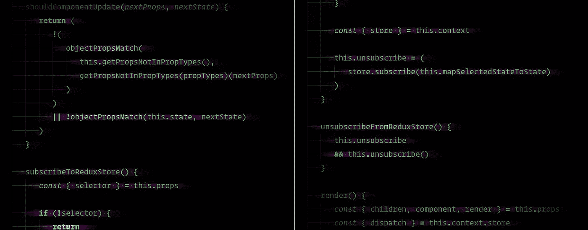

# 你不需要反应-还原

> 原文：<https://itnext.io/why-you-shouldnt-need-connect-from-react-redux-498876de9e4e?source=collection_archive---------2----------------------->



## 渲染道具比高阶的‘连接’函数要好。

有一种方法是用 Redux 代替 React-Redux 的高阶组件使用渲染道具:`connect`。这可以从根本上改变你对 React 和 Redux 中状态的看法，就像[新的 React 上下文 API](https://reactjs.org/docs/context.html) 的工作方式一样。它还有一个额外的好处，就是可以更容易地使用无状态的功能组件。

我创建了一个`ReduxConnection`组件，用 Redux 处理渲染道具。你总是可以写你自己的，但是这本书为你做了所有的事情，并且基本上是`connect`的替代者。

# React 和 Redux 的问题？

在 React 中使用 Redux 的最大问题之一是`connect`高阶组件。我知道当我第一次开始使用它时，我花了一段时间来理解它是如何工作的，以及我将如何使用它。

`ReduxConnection`只要你明白反应过来就可以用；虽然，如果你习惯了 React-Redux 的`connect`，渲染道具的方法需要一点说服力。

# 使用 Redux 渲染道具

这里有一个你熟悉的使用 React-Redux 的`connect`的例子:

这就是你如何用`ReduxConnection`做同样的事情:

注意`textSelector`和`mapStateToProps`一样，但是命名不同。我们可以随意命名这些函数。关键是你从状态中选择一些东西，并把它传递给`children`。

主要区别是高阶组件在你的组件之外，而渲染道具在里面。这就是你将在`ReduxConnection`中看到力量的地方。虽然乍一看可能很奇怪，但是如果您熟悉 React-Router v4+中的渲染道具，您很快就会意识到动态状态选择器组件的强大。随着[新的上下文 API](https://reactjs.org/docs/context.html) 的出现，渲染道具已经成为未来规范的一部分。

# 选择器的概念

选择器函数是一种可重用的方法，用于:

*   从冗余状态中选择一些东西。
*   在把状态交给你的组件之前，有一个统一的方法来计算状态。
*   在需要的地方增加记忆以提高性能(*见* [*重选*](https://github.com/reduxjs/reselect) )。

使用选择器，你可以从状态中提取东西，并使用`component`道具或渲染道具将它们传递给组件。

# 限制状态更新

`ReduxConnection`有一种方法，只有当进来的道具不同时才限制状态更新。这正是`connect`的工作方式，但是因为您可以在`ReduxConnection`中包装组件的特定部分，所以您不需要经常在没有意义的地方创建单独的组件。

ReduxConnection 能够完成这一壮举的方式是通过`shouldComponentUpdate() { return false }`。如果道具改变，它会选择何时更新，跳过`selector`，这样你就可以放一个内嵌函数，而不用担心一堆重新渲染。

# 带有渲染道具的未来

一般来说，高阶组件在使用 React-Hot-Loader 和 TypeScript 等其他工具时会有一些奇怪之处。尽管随着时间的推移，黑客和合法的解决方案都在解决这些问题，但很明显，这个行业正朝着渲染道具的方向发展。

要了解更多关于渲染道具的信息，请查看[官方 React 页面](https://reactjs.org/docs/render-props.html)和[迈克尔杰克逊的原帖](https://cdb.reacttraining.com/use-a-render-prop-50de598f11ce)。

在我看来，高阶组件编写起来很麻烦，因为它们需要在不需要的地方创建额外的组件。我最不希望的就是制造一堆不必要的间接。

举个例子，尝试将一个`div`封装在一个`connect`函数中。这需要将其取出，创建一个新的 React 组件，添加 PropTypes，并将该文件导入到当前组件中。或者找到一种方法，在一个文件中包含两个组件，而不会变得笨拙。`ReduxConnection`提供了一种方法来做到这一点，而无需制造单独的组件。

# 魔术道具

你可能想知道某些道具是从哪里来的。当使用像`connect`这样的高阶元件时，这些都是隐藏的。如果该属性是从父组件传递过来的，或者是直接来自 Redux 而不需要进入每个父组件，您实际上没有任何可见性。我称这些为“魔术道具”。

例如:

```
const propTypes = {
  children: PropTypes.node.isRequired,
  hasReceivedAuthInfo: PropTypes.bool.isRequired,
  isAuthenticated: PropTypes.bool.isRequired,
}
```

我的假设是我必须传递这三个道具。虽然，实际上，他们中的 2 个来自`connect`。

在记录组件时，我会分别标记哪些道具来自更高级别的组件；否则，对于使用您的组件的人来说，该组件期望的是什么是令人困惑的。

以下是我如何在高阶组件中补偿魔法道具的示例:

```
const propTypes = {
  children: PropTypes.node.isRequired,

  // Redux
  hasReceivedAuthInfo: PropTypes.bool.isRequired,
  isAuthenticated: PropTypes.bool.isRequired,
}
```

欢迎你和你的团队每次创建新的组件或添加新的道具或从状态拉新的道具额外的工作。完全是不必要的维护。当您有更重要的事情要考虑时，这种事情很容易在拉请求中被忽略。我仍然更喜欢这种方法，而不是不标注道具来自哪里，但理想情况下，我们将只使用渲染道具。

渲染道具解决了魔法道具的问题，很像 [how React-Router v4+是怎么做的](https://reacttraining.com/react-router/web/api/Route)。

以这个`IsAuthenticated`组件为例:

有了`ReduxConnection`，很容易看到我们的组件只把`children`作为一个道具。我不必考虑传入的组件之外的道具，比如`hasReceivedAuthInfo`和`isAuthenticated`。

这是`connect`的样子:

简单吧？不完全是。当您开始传入函数并查看属性类型时，这变得非常复杂。这是一个很小的例子；尽管通常情况下，您会有具有不同状态需求的较大组件。你并不总是想把这些组件分解成更小的组件，因为在某些时候你会遇到间接性的问题。

下面是在使用 PropTypes 时对这两个组件的另一种看法:

因为`ReduxConnection`示例使用了组件内部的组合，所以很清楚这种状态来自哪里，以及作为消费者的您需要将哪些支持传递给`IsAuthenticated`。

如果你仍然认为`connect`版本更好，当:

*   你用`mapDispatchToProps`。
*   您可以堆叠高阶组件，如`connect`和`reduxForm`。
*   您必须为一个组件组合两个或更多的状态选择器。
*   您并不真正知道哪些组件是状态包装的，哪些不是(想想新的开发人员)。

这里有一个复杂的组件，在`connect`和`ReduxConnection`中都有魔法道具:

这两个例子的主要区别是`namespace`道具。使用`connect`的时候不见了，因为在`mapStateToProps`是引擎盖下用的。您必须知道如何将它传入并添加到 PropTypes 中，因为它从未被`PersonsList`直接使用过。如果错过了，很快就会变成调试灾难。

还要注意，在组件级别要跟踪的 PropTypes 要少得多。显然，如果你使用的是 Flow 或 TypeScript，你会希望涵盖进入渲染道具的类型，但从组件道具的角度来看，这只是变得更加清晰。

在`connect`中使用`mapDispatchToProps`的另一个变化是我们必须定义`dispatch`并将其作为渲染道具。那是我们唯一可以走那条路的方法。`ReduxConnection`的好处是你可以把它放在任何地方，并且可以非常精确地知道在哪里使用`dispatch`函数。

# 重构

你可能已经注意到这些文件中有很多跳转。大多数人不会像我一样写垂直间隔的组件，但我想让它变得明显，渲染道具，事实上，当内联使用时，可以突出你的组件。

这是有益的；虽然在很多情况下并不需要，但是将组件的一些部分分离成更小的组件。这就是`ReduxConnection`上的`component`支柱派上用场的地方。感谢 React-Router v4+的创意！

现在我们可以进一步精简:

`ReduxConnection`允许这些类型的简化，而不必创建一堆额外的组件，这些组件本身也必须包装在`connect`中。`PersonsList`现在是一个智能组件，只告诉它的孩子从哪里得到他们需要的东西。

# 为什么不应该使用`mapDispatchToProps`

`mapDispatchToProps`是一个奇妙的小助手函数，它移除了 Redux 对组件的依赖性。此时，看起来您只是将函数作为道具传递，然后像往常一样调用这些函数。

可悲的是，这样做的副作用是隐藏了一个事实，即当一个函数被调用时，你正在调度一个动作。

很有可能您的组件可能接受多个函数，但并不是所有的函数都包装在 dispatch 中。也可能是您利用 JavaScript 作用域，最终不知道您使用的函数是传入的还是导入的。或者在另一种情况下，您的高阶组件通过了`mapDispatchToProps`，但是当您加载组件并希望添加功能或修复 bug 时，您无法看到这一点。

当试图快速辨别组件的功能时，所有这些都会导致不必要的混乱。

# 冗余连接的缺点

在处理渲染道具时，有一些事情你需要知道。如果提供道具的组件(如`ReduxConnection`)自定义`shouldComponentUpdate`，则需要传递渲染道具函数使用的相同道具；否则，它不会有来自父组件的最新道具。

这里有一个例子，我试图通过包装`ListItem`来优化`dispatch`的位置，而不是将其包含在父`ReduxConnection`中:

在本例中，如果`listItems`发生变化，因为`ReduxConnection`知道您正在关闭`id`和`name`，那么`ReduxConnection`将不会更新`id`或`name`。解决方案是使用简化的示例，从`map`函数中直接将`component`道具传递道具作为`ReduxConnection`上的道具。这样，您可以关闭它们，并且`ReduxConnection`会意识到关闭。

这不是`connect`的问题，因为你被迫将道具传递给组件。在`connect`中，没有关闭道具的选项。幸运的是，你可以用`component`道具模仿`connect`在`ReduxConnection`中的功能，并且仍然获得渲染道具的大部分优势。

虽然解决这个问题很容易，但是如果您不知道它的工作方式，调试可能是一场噩梦。将来这个问题会得到解决，但目前还不是这样。只要您的团队得到通知，您应该能够使用`ReduxConnection`并解决闭包带来的问题。

您还可以用自己的组件包装 ReduxConnection，并用一个`randomNumber={Math.random()}` prop 强制它更新。

# 今天就开始用`ReduxConnection`吧！

你今天就可以开始使用`ReduxConnection`！查看 npm 的初始版本，请点击此处:

[](https://www.npmjs.com/package/@ghadyani-framework/redux-components) [## @ ghadyani-framework/redux-components

### Redux 助手组件。

www.npmjs.com](https://www.npmjs.com/package/@ghadyani-framework/redux-components) 

如果你很好奇，可以在 GitHub 上找到源代码:
[https://GitHub . com/Sawtaytoes/Ghadyani-Framework-Redux-Components/blob/master/Components/Redux connection . js](https://github.com/Sawtaytoes/Ghadyani-Framework-Redux-Components/blob/master/components/ReduxConnection.js)

# 特别感谢

我要感谢杰森·纳尔。他的 [redux-render](https://github.com/jsonnull/redux-render) 库启发我编写自己的库。我从他的原始结构中格式化了 ReduxConnection 的基本概念。

# 更多阅读

如果您对与 React 相关的更多主题感兴趣，您应该查看我的其他文章:

*   [使用 Redux 的秘密:createNamespaceReducer](https://medium.com/@Sawtaytoes/the-secret-to-using-redux-createnamespacereducer-d3fed2ccca4a)
*   [在 React 组件中使用 Redux 还原剂](https://medium.com/@Sawtaytoes/using-redux-reducers-in-react-components-4e92985dd9cb)
*   [Redux-Observable 可以解决你的状态问题](https://medium.com/@Sawtaytoes/redux-observable-can-solve-your-state-problems-15b23a9649d7)
*   [RxJS 和可观察的 Flic 按钮](https://medium.com/flicblog/flic-buttons-and-the-observable-customization-using-rxjs-2214bc53d407)
*   函数式编程的表情爱好者指南:第一部分