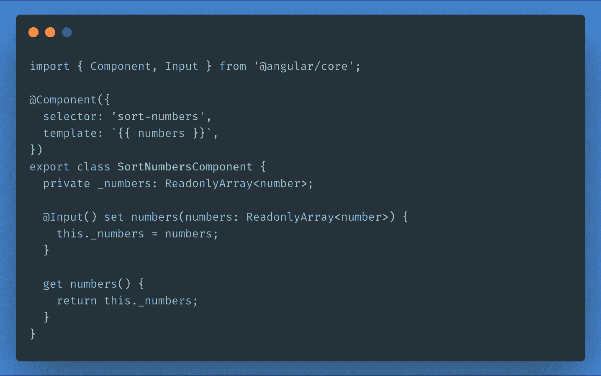
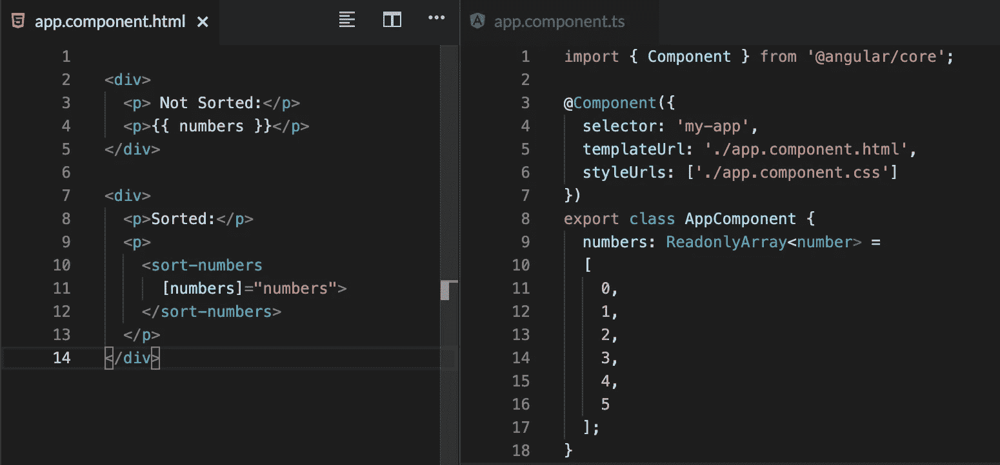
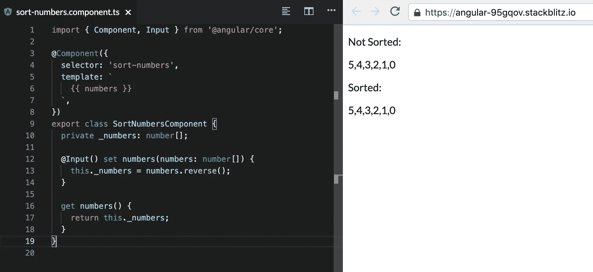
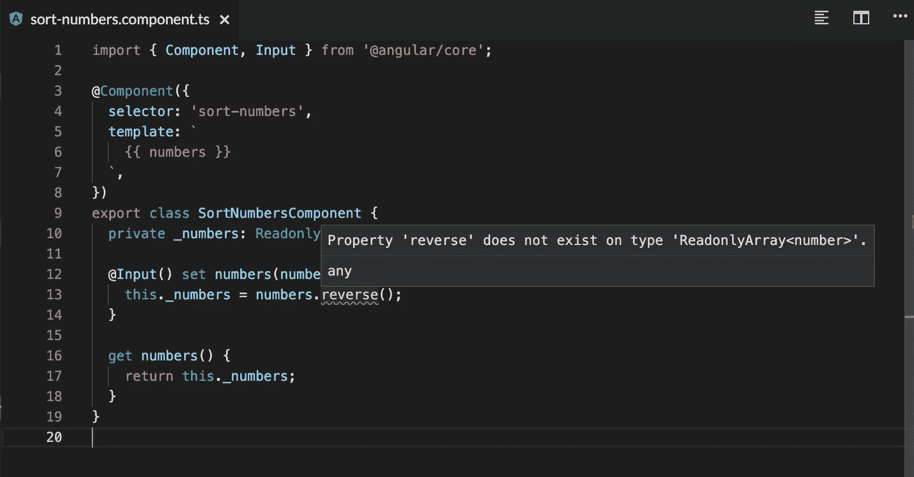
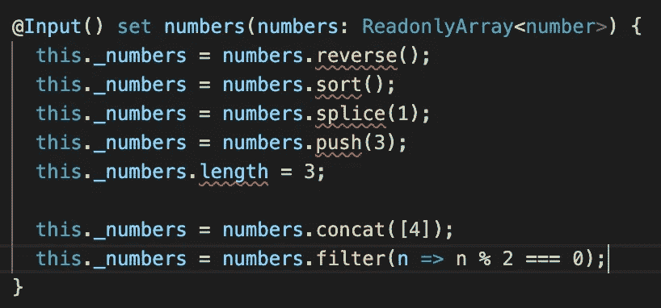

# 为什么你会喜欢 Typescript 的 ReadonlyArray

> 原文：<https://itnext.io/why-youll-love-typescript-s-readonlyarray-9d7f09971e4a?source=collection_archive---------3----------------------->

## Typescript 的新 3.4 版本为 ReadonlyArrays 引入了新的语法



如果你像我一样也相信一切都应该是不可变的，你会很高兴看到 Typescript 3.4 带来了什么。

虽然这个版本的所有内容看起来都很棒，但最吸引我注意的是引入了使用 *readonly* 关键字引用类型`ReadonlyArray`，这有助于我们在编译时在数组上调用会导致变异的方法时防止数组变异，因为这仍然是我在 Javascript 代码中看到的最常见的错误之一。

# 突变是不好的

这只是 Redux 当初如此受欢迎的众多原因之一。突变会在我们的代码中引起各种各样的问题，而且它们也是很难追踪的 bug。

我在 Angular 团队中经常看到这种情况:一个数组被传递给一个组件，子组件碰巧对这个数组进行排序:会发生什么呢？数组变异会一直传播到父代。

考虑下面的片段:

*   我们有一个声明数字数组的父组件
*   我们有一个子组件，它从父组件获取输入并调用方法`reverse()`
*   结果:两个数组都发生了变异！



在我的职业生涯中，这些错误花费了我很多时间，通常是我犯的错误。

但是最近，这些是我为已经存在的代码修复的错误，因为我终于学会了如何**永远不要改变一个对象或数组**。

问题是，有时候还是会发生。

# ReadonlyArray 来拯救

Typescript 的`ReadonlyArray`如何帮助我们减少这类错误？查看下图:



如你所见，编译器警告我们有一个错误，因为接口`ReadonlyArray`不包含方法`reverse`🎉

虽然听起来很奇怪，但我喜欢被告知我犯了一个错误。这就是我如此喜欢打字稿的原因。

由于 Typescript 3.4 中引入的新语法，我们可以将前面的示例编写如下:

```
*// Component metadata*
*export class* SortedNumbersComponent {
    *private* _numbers: *readonly number*[];

    @Input() *set* numbers(numbers: *readonly number*[]) {
        *this*._numbers = numbers.reverse(); // error
    }

    *get* numbers() {
        *return this*._numbers;
    }
}
```

让我们看看编译器告诉我们关于只读数组的不同操作:



如您所见，反转、排序、拼接、推送都是改变数组的方法——所以我们最好避免使用它们。

其他方法，如`filter`、`concat`、`reduce`等。是不可变的，应该总是首选的。

帮你未来的自己，或者有一天会捡起你的代码的任何人一个小忙:使用`Readonly`。

关键字`readonly`将不能防止由于重新分配而导致的突变，所以您仍然需要注意这些情况。

编辑:文章被编辑以纠正一些关于 ReadonlyArray 实际发布时间和措辞的错误。

*最初发布于*[*https://frontend . consulting*](https://frontend.consulting/why-youll-love-typescripts-readonly-array)*。*