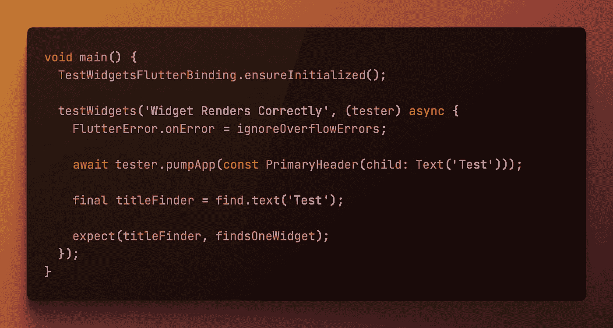

# 小部件测试:处理 Renderflex 溢出错误

> 原文：<https://itnext.io/widget-testing-dealing-with-renderflex-overflow-errors-9488f9cf9a29?source=collection_archive---------3----------------------->



我们以前肯定都在我们的 UI 中看到过，“一个 RenderFlex 溢出了…”，我们都知道这个错误意味着我们的 UI 超出了可用空间的界限。

当这出现在屏幕上时，很容易修复，但是当你对你的部件进行单元测试时遇到这种情况怎么办？

这是我遇到过几次的事情，在大多数情况下，我只是在测试中忽略了它，我 condor widget 测试的优先级有点低，在大多数情况下，我相信他们的测试最好作为旅程或集成测试的一部分来完成。

也就是说，有时业务逻辑位于小部件中，此时，花时间编写一个适当的单元测试是有价值的。

在过去，尝试修改虚拟用户界面已经产生了一些有用的结果，但是当这个错误最近出现时，我开始寻找一个更可靠的解决方案。

完全公开，这主要是 [**Remi Rousselet**](https://twitter.com/remi_rousselet) 的创意，我只是帮助分享它，让其他开发者的生活稍微轻松一点。

# 解决方案

我总是为我的单元测试保存一个`test_helpers.dart`文件，这是我的助手列表中的最新成员:

```
void ignoreOverflowErrors(
  FlutterErrorDetails details, {
  bool forceReport = false,
}) {
  bool ifIsOverflowError = false;
  bool isUnableToLoadAsset = false;// Detect overflow error.
  var exception = details.exception;
  if (exception is FlutterError) {
    ifIsOverflowError = !exception.diagnostics.any(
      (e) => e.value.toString().startsWith("A RenderFlex overflowed by"),
    );
    isUnableToLoadAsset = !exception.diagnostics.any(
      (e) => e.value.toString().startsWith("Unable to load asset"),
    );
  }// Ignore if is overflow error.
  if (ifIsOverflowError || isUnableToLoadAsset) {
    debugPrint('Ignored Error');
  } else {
    FlutterError.dumpErrorToConsole(details, forceReport: forceReport);
  }
}
```

我对原来的解决方案进行了一些更新，它被写为空安全，并且我还添加了加载本地资产时的错误检查。

这个助手所做的是当测试运行到这些错误之一时，防止测试运行者退出。我觉得很愚蠢的是，至少 RenderFlex 问题在测试中不是一个例外，单元测试是为了测试逻辑而存在的，一个小部件在一个无头环境中表现得有多好与测试本身没有关系。

要使用这个助手，您只需将它作为测试的一部分，使用`FlutterError.onError = ignoreOverflowErrors;,`参见下面的例子:

```
void main() {
  TestWidgetsFlutterBinding.ensureInitialized();testWidgets('Widget Renders Correctly', (tester) async {
    FlutterError.onError = ignoreOverflowErrors;await tester.pumpApp(const PrimaryHeader(child: Text('Test')));final titleFinder = find.text('Test');expect(titleFinder, findsOneWidget);
  });
}
```

要使其工作，需要在特定测试中分配，不能在`setUp`或`setUpAll`中分配。

我希望您对此感兴趣，如果您有任何问题、评论或改进，请随时发表评论。享受你的颤振发展之旅:D

如果你喜欢，一个赞会很棒，如果你真的喜欢，一杯[咖啡](https://www.buymeacoffee.com/remelehane)会很棒。

感谢阅读。

希望继续单元测试的话题，请看:

*原载于 2022 年 4 月 19 日*[*https://remelehane . dev*](https://remelehane.dev/posts/widget-testing-rendeflex-overflow/)*。*