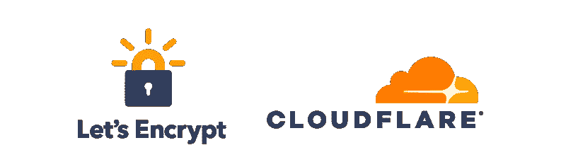
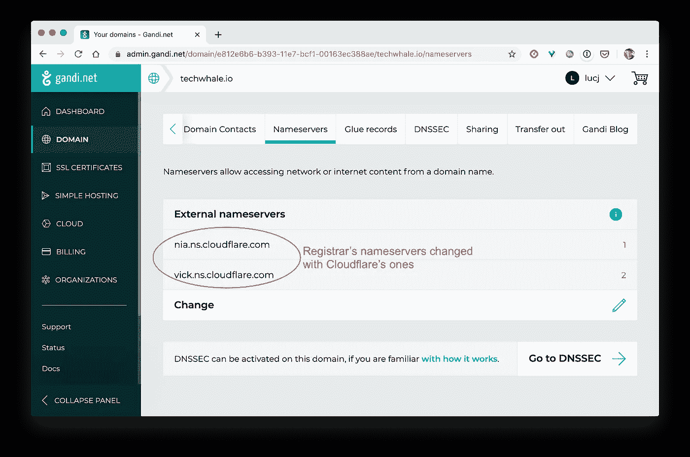
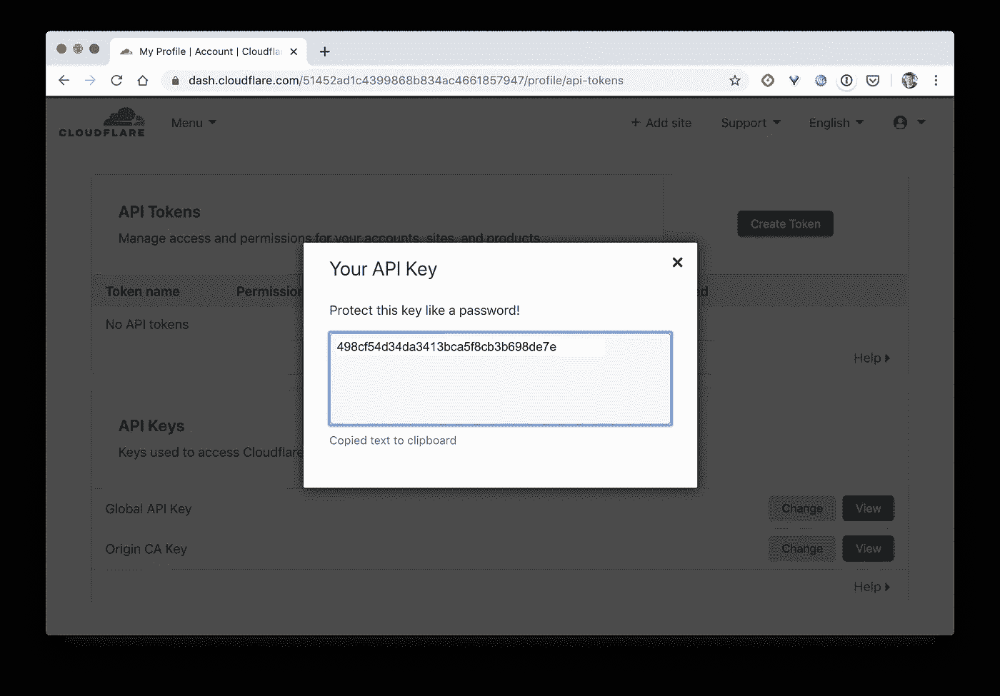
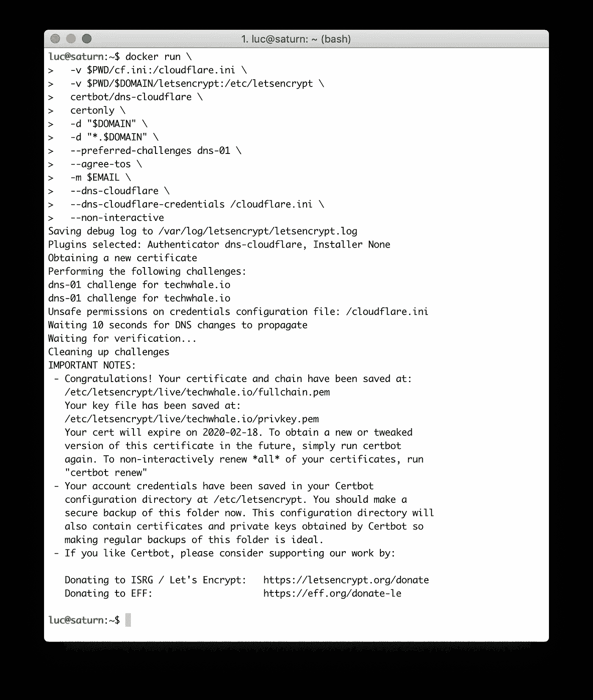
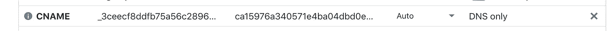
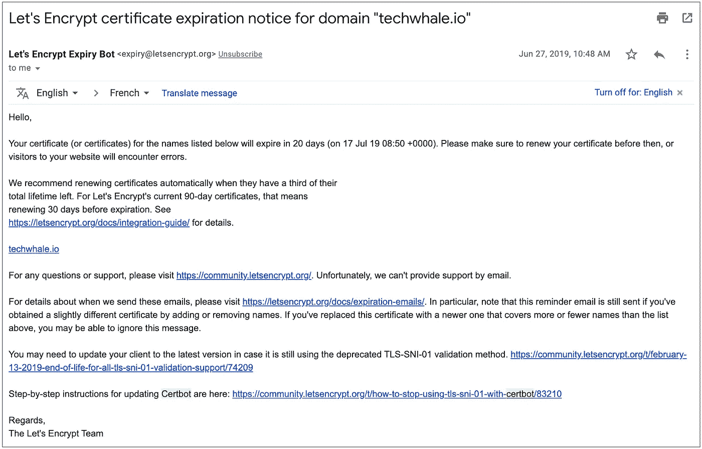
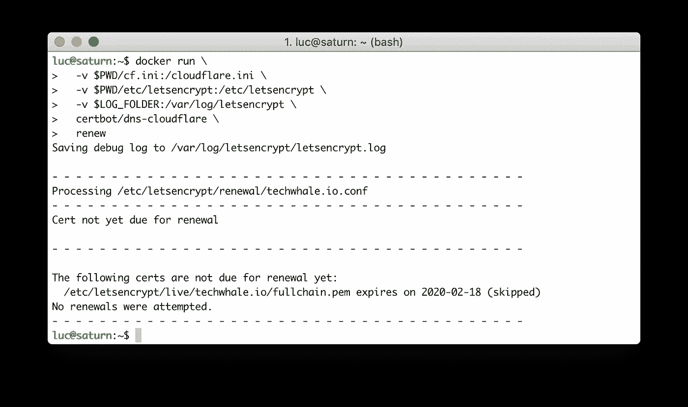

# 通配符让我们加密证书

> 原文：<https://itnext.io/wildcard-lets-encrypt-certificate-2b6133a1acdf?source=collection_archive---------1----------------------->

## 使用 DNS-01 挑战变得简单



[Let's Encrypt](https://letsencrypt.org/fr/) 是一个免费的、自动化的、开放的认证机构，广泛用于创建 TLS 证书。它很好地集成在几个工具中，如 Kubernetes Ingress 控制器、 [Cert-Manager](https://docs.cert-manager.io/en/latest/) ，…但有时使用 Let's Encrypt 来生成 TLS 证书并以更手动的方式使用它也很方便。

当请求“让我们加密”证书时，需要回答一个质询，以便“让我们加密”可以确保请求者是域的所有者。几个挑战是可用的:HTTP-01，DNS-01，TLS-ASPN-01(每一个的细节可以在官方的 Let's Encrypt 文档中找到:【https://letsencrypt.org/fr/docs/challenge-types/】T4)。

HTTP-01 挑战可能是最常用的，该挑战涉及的过程如下:

*   证书的请求需要从通过该域可到达的机器上完成
*   web 服务器运行在端口 80 上，提供临时文本文件
*   让我们加密验证它可以通过 HTTP Get 请求获得这个临时文件

这个挑战的一个限制是，在端口 80 上运行 web 服务器可能并不总是可行的，因为这个端口可能已经被另一个服务器使用。即使我们需要证书来保护在另一个端口上运行的服务器，也必须在端口 80 上回答挑战。

因此，使用“让我们用 DNS-01 挑战加密”有时可能是一个不错的选择。让我们不运行 web 服务器，而是通过创建临时 DNS 条目来加密验证域的所有权，通过 API 调用 DNS 提供者的 API。我们将会看到，使用一个 [Certbot](https://certbot.eff.org/) 插件，这个任务变得非常简单。

# 先决条件

我们首先需要完成几个步骤:

*   从我们最喜欢的注册商那里购买域名。让我们考虑一下域名 *techwhale.io* (实际上是我前段时间在[gandi.net](https://gandi.net)上买的)。
*   选择一个允许 certbot DNS-01 挑战的 DNS 提供商，[有很多。在本文的例子中，我们将使用](https://certbot.eff.org/docs/using.html#dns-plugins) [Cloudflare](https://cloudflare.com) 。
*   从我们购买域名的注册商那里，我们需要进入 DNS 设置并更改 DNS 条目，以便它使用您的 DNS 提供商提供的条目



*   获取 API 密钥，允许 API 调用我们的 DNS 提供商



Cloudflare 的 API 密钥(假的一个:)

# 证书的创建

首先，我们创建一个 *cf.ini* 文件，其中包含 Cloudflare API 令牌和我们的电子邮件地址:

```
# Cloudflare API credentials used by Certbot
dns_cloudflare_email = REPLACE_WITH_YOUR_EMAIL_ADDRESS
dns_cloudflare_api_key = REPLACE_WITH_YOUR_API_TOKEN
```

接下来，我们设置以下环境变量:

*   域，您需要为其获取证书的域名
*   电子邮件，证书即将过期时将收到通知的电子邮件地址

然后，我们从本地机器上运行 Cloudflare 的 Certbot 插件(该插件在 Docker Hub 中作为容器映像提供),选项如下:

```
$ docker run \
  -v $PWD/cf.ini:/cloudflare.ini \
  -v $PWD/etc/letsencrypt:/etc/letsencrypt \
  certbot/dns-cloudflare \
  certonly \
  -d "$DOMAIN" \
  -d "*.$DOMAIN" \
  --preferred-challenges dns-01 \
  --agree-tos \
  -m $EMAIL \
  --dns-cloudflare \
  --dns-cloudflare-credentials /cloudflare.ini \
  --non-interactive
```

下面的屏幕截图显示了这个命令为域 *techwhale.io* 申请证书的过程。



使用 Certbot 的 Cloudflare 插件获得一个使用 DNS-01 挑战的加密证书

为了验证域的所有权，DNS 质询使用提供的凭据在 DNS 表中创建一个临时条目。



由“让我们加密”创建的 CNAME 条目，用于回答 DNS-01 挑战

一旦创建了证书，就可以在本地的*etc/lets encrypt/live/tech whale . io/*文件夹中找到它(及其相关的私钥)。

```
$ ls etc/letsencrypt/live/techwhale.io/
README  cert.pem chain.pem **fullchain.pem** **privkey.pem**
```

证书( *fullchain.pem* )及其相关私钥( *privkey.pem* )现在可用于为应用程序设置 TLS 终止。该证书是一个通配符证书，这意味着它可以用于所有子域。

# “证书”生命周期

要检查关于我们已经创建的证书的信息，我们可以运行以下命令:

```
$ docker run \
  -v $PWD/etc/letsencrypt:/etc/letsencrypt \
  certbot/dns-cloudflare \
  certificates
```

对于找到的每个证书，这将提供诸如文件位置(证书和相关私钥)和到期日期等信息。


列出可用的证书(这里只有一个)

一个加密证书将在 3 个月后过期。到期前几周，会发送一封类似以下内容的电子邮件:



由 Let's Encrypt 发送的通知证书即将过期的电子邮件示例

要续订证书，我们只需运行以下命令:

```
$ docker run \
  -v $PWD/cf.ini:/cloudflare.ini \
  -v $PWD/etc/letsencrypt:/etc/letsencrypt \
  -v $LOG_FOLDER:/var/log/letsencrypt \
  certbot/dns-cloudflare \
  renew
```



不需要续订证书，因为其到期日期离当前日期很远

# 摘要

DNS-01 挑战真的很容易使用，它没有与 HTTP-01 相同的限制，但需要使用提供 API 的 DNS 提供商。在本文中，我们将展示如何通过手动运行 Certbot 来实现这一点。我希望它有助于理解整个过程，以及一些可能的挑战，可以利用。当然，最好是使用额外的软件，使加密证书的整个生命周期、创建和定期更新自动化。