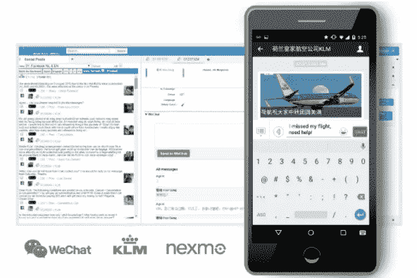
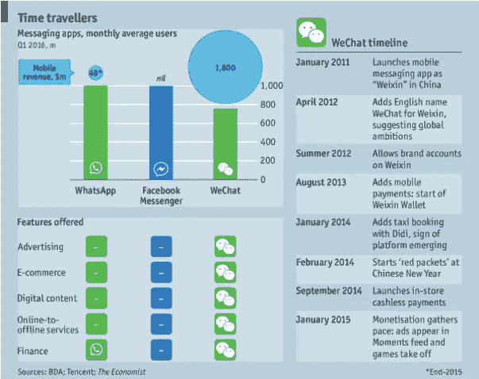
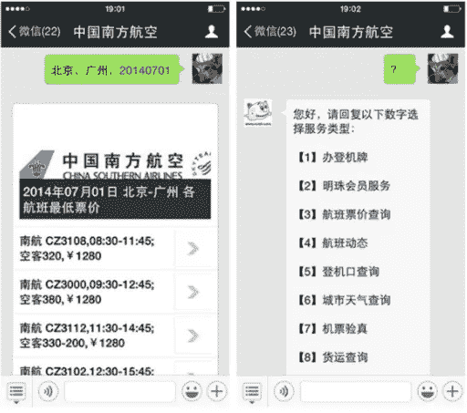

# 聊天机器人会改变我们的生活吗？

> 原文：<https://itnext.io/will-chatbots-change-our-lives-e8d515cf3320?source=collection_archive---------6----------------------->

随着人们对聊天机器人越来越感兴趣，更复杂算法的进步，相关技术的改进，特别是后者在 messenger 应用程序中的使用，需要对应用程序和聊天机器人有一个新的看法。在之前的文章中，我们已经了解了聊天机器人的用途，它们的核心组件和重要算法。我们已经知道，它们可以非常擅长来回交流，但是它们也可以作为一个界面吗？一个可以让与其他应用程序交互变得过时的界面？

**微信的例子**

[微信](https://chatbotsmagazine.com/chinas-wechat-foretells-facebook-microsoft-bot-platforms-future-278c3bd4bf14#.bdwtr26xz) [是](https://chatbotsmagazine.com/chinas-wechat-foretells-facebook-microsoft-bot-platforms-future-278c3bd4bf14#.bdwtr26xz)一种跨平台的通信服务，提供与许多其他应用程序集成的聊天机器人服务。以下示例显示了荷航的客户服务聊天机器人，带有微信和脸书:

*荷航客服与脸书和微信通过*[*MobileMarketingMagazine*](http://mobilemarketingmagazine.com/wp-content/uploads/2015/10/KLM-WeChat.jpg)

随着现代信息时代的到来，我们处理信息的时间保持不变，而信息量却呈指数级增长。各种研究表明我们花了多少时间处理邮件:根据麦肯锡的调查，我们每周花 13 个小时阅读邮件。与此同时，我们花在手机上的[时间](http://www.smartinsights.com/mobile-marketing/mobile-marketing-analytics/mobile-marketing-statistics/)越来越多；要阅读[电子邮件](https://blog.sanebox.com/2016/02/18/email-overload-research-statistics-sanebox/)，使用社交媒体或信息应用。我们同时使用几个应用程序，而它们都有相同的最终目标:通信。问题是，能不能做的简单一点？

在亚洲市场，尤其是在中国，微信通过提供一种融合一切的服务来填补这一空白。事实上，微信为用户提供了一种整合各种服务的简单方法。订购出租车、支付账单、购买电影票和取回衣物)和其他移动设备集成到一个数字身份中。这导致中国人在私人和商业环境中几乎只通过微信交流，而将电子邮件通信远远抛在后面。将这种身份与个性化聊天机器人和轻松访问所有服务相结合，您就拥有了聊天(机器人)服务，它可以用任何其他应用程序取代传统界面。

**但是脸书、Siri 或者 Cortana 呢？**

在之前的[文章](https://www.linkit.nl/knowledge-base/225/Chatbots_A_bright_future_in_IoT)中，我谈到了脸书信使如何作为与其他应用程序交流的界面。其他为聊天机器人开发和服务集成提供有趣基础的例子是个人助理 Siri、Google Now 和 Cortana。目前，这些聊天机器人的功能有限，只能打开应用程序并完成简单的请求，如告知当前天气或任何特定城市的公共交通路线。但是，大多数人与我们设备上的任何应用程序的交互都是通过手动交互完成的，而不是对话。然而，聊天机器人提供了对话式的用户体验，包括通过机器学习了解用户个人品味和偏好的能力。重点是聊天机器人可以填补我们日常工作中的自动化漏洞。微信已经在很大程度上为中国市场做到了这一点，但“西方”的替代品仍然落后(见下图)。这里的一个关键方面是，首先必须说服西方消费者将他们的财务数据与聊天服务联系起来，以便能够实现其他服务，例如在线订购商品。

*微信 vs Whatsapp vs Facebook Messenger by*[*经济学家*](http://www.economist.com/news/business/21703428-chinas-wechat-shows-way-social-medias-future-wechats-world)

聊天机器人会改变我们的生活吗？

我认为聊天机器人会像互联网和智能手机一样改变我们的生活的三个主要原因是:

1.  简单明了的对话交流，与人类的对话没有区别:毕竟我们是群居动物，我们喜欢交谈；
2.  聊天机器人可以提供统一的界面。当然，我们仍然需要单独的应用程序，但聊天机器人将提供一个干净的对话界面。它在于无缝获取用户需求和信息的集成。简而言之，它通过一个简单的界面减轻了一些信息过载；
3.  随着聊天机器人成为统一的界面，学习任何单个应用程序的功能都是不必要的。一个好的聊天机器人或聊天服务会在聊天服务本身中处理这一点，微信就是这样做的。这是代替正常的下载，安装和计算这一切你自己。聊天机器人可以提供即时的个人帮助。例如，下图显示了一个微信中国航空公司机器人的例子。您可以询问特定日期的航班，它会提供时间、价格、航班号和一些其他信息。

*南航聊天机器人客服由* [*聊天机器人杂志*](https://chatbotsmagazine.com/chinas-wechat-foretells-facebook-microsoft-bot-platforms-future-278c3bd4bf14#.czpjfaua1)