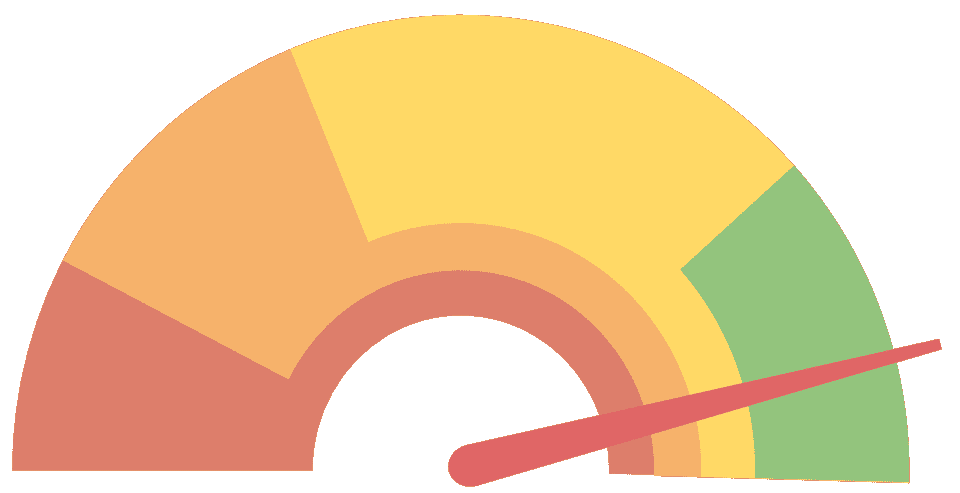
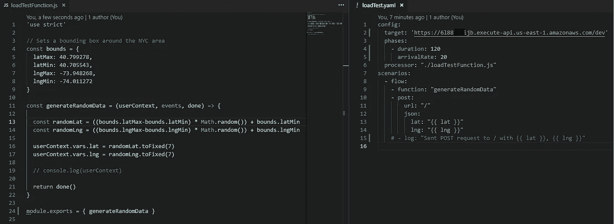
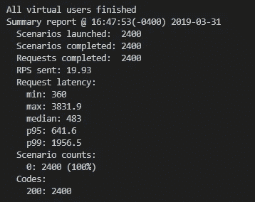
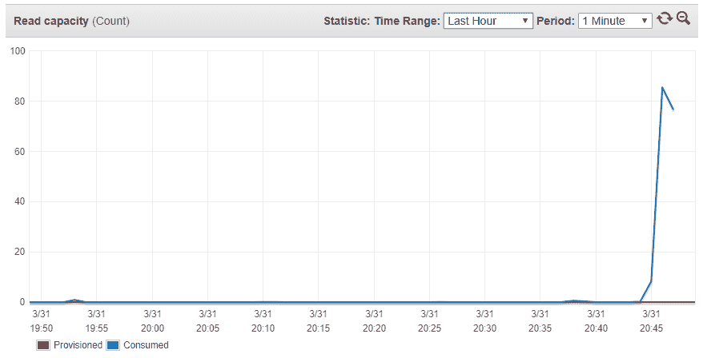

# 它会扩展吗？让我们在 DynamoDB 上加载测试 geohashing

> 原文：<https://itnext.io/will-it-scale-lets-load-test-geohashing-on-dynamodb-fbdc612d9ec3?source=collection_archive---------1----------------------->

## James Beswick 和 Richard Boyd 测试了地理哈希解决方案可以无服务器扩展到什么程度。

在我关于 DynamoDB 的[地理哈希的文章中，我展示了一种简单的方法来查询位置列表以找到最近的星巴克店。该方法使用几行代码通过地理哈希 NPM 包加载和查询数据。](https://read.acloud.guru/location-based-search-results-with-dynamodb-and-geohash-267727e5d54f)

但是这种方法的可扩展性如何呢？下一个问题是如何通过负载测试来衡量这个 NPM 库的性能，分析使用这个包的成本，并查看大规模的架构选项。

今天我和 iRobot 云工程师 [Richard Boyd](https://twitter.com/rchrdbyd) 一起工作，他正在帮助我寻找一些提高性能的聪明方法。

## NPM 图书馆在做什么？

[DynamoDB-Geo 库](https://www.npmjs.com/package/dynamodb-geo)管理底层 DynamoDB 表，设置分区键和二级索引来管理查找。通常每个搜索请求运行 8 个单独的查询，所以它不会从 DynamoDB 表中一次获取所有结果。

这是因为一旦识别了初始 geohash 正方形，算法还需要知道周围 8 个正方形中有什么，因为项目可能在正方形的边缘，或者指定的半径可能覆盖多个正方形。

一些性能特征也归因于我们对散列键长度的选择——散列越短，方块越大；哈希越大，方块越小。例如，如果您的零售点遍布全球，但使用长哈希和大搜索半径，则性能会比搜索半径较小的短哈希差得多。

## **用火炮进行负载测试**

这种服务的可能负载很难估计，但是我们可以使用[火炮](https://artillery.io/)工具包非常容易地为 API 创建一个艰巨的压力测试。

这个节点包可以在您的本地开发机器上模拟合理数量的独立并发用户。实际的数量将取决于你的电脑和网络连接，因为在幕后炮兵正在测试多个 Chrome 实例。

在我的机器上，我发现一秒钟可以模拟 20 个用户访问 API，但是如果我设置一个更高的限制，由于 PC 上的资源限制，测量变得不可靠。

用自定义函数配置 cannon，在一个边界框内模拟随机的纬度和经度请求。

在这个测试中，我在曼哈顿地区周围设置了一个边界方块，使用 cannon 中的自定义函数在这些边界内随机选择一个纬度和经度。我选择这个区域是因为纽约市有大量的星巴克商店——不管测试在哪里进行，我都可能得到多个结果。

火炮载荷测试结果。

这个测试运行 2 分钟(每秒 20 个用户)，总共完成 2400 个请求。在此期间，DynamoDB RCUs 增至 86 个，延迟降至 7–10 毫秒:

在上面显示的代码和没有缓存的初始配置中，我们可以轻松地每天处理 170 万次 API 点击(平均每天每秒 20 次请求)。但是代价是什么呢？

*   DynamoDB:需要不到 100 个 rcu，所以每月不到 10 美元。
*   API Gateway 在最低层按每百万次请求 3.50 美元收费，因此 5230 万次请求每月花费约 183 美元。
*   Lambda:函数的平均执行时间是 382 毫秒，所以 400 毫秒、1024 兆内存和 5200 万次执行的成本大约是 357 美元。
*   在这种设置中，为 5200 万个查找服务的总估计月成本约为 550 美元。

## **更多位置，更多写入**

Starbucks 位置列表是相对静态的，数据库表上的活动几乎都是“读取”。根据 DynamoDB 的性能特征，表中的项数不太可能影响读取性能，并且表可能会大得多，而查询延迟不会有明显的差异。

但是，NPM 图书馆使用 geohash 作为分区键，因此无法更新表中已有项目的位置(您必须删除并重新创建项目)。对于像星巴克这样的实体场所来说，这不是问题，因为它们通常不会改变位置，但是如果你有一个频繁移动的对象列表，这可能不是使用的正确库。

## **全球表格**

如果像星巴克这样的大型零售公司使用这项服务来查找他们全球最近的商店， [DynamoDB Global Tables](https://engineering.opsgenie.com/everything-you-need-to-know-about-dynamodb-global-tables-952d020d9834) 将是一个很好的选择，可以将负载分散到多个地区，并减少查找的延迟。在这种情况下，如果 50%的搜索发生在欧洲，那么将该表复制到该地区可以有效地从 us-east-1 中的主表分流 50%的流量。

这种方法可能不适合所有的业务案例(例如，查找来自单个地理区域，或者数据可能不会移出特定区域)，但是考虑到使用这种特性的简单性，它是在不改变代码的情况下实现更大规模的另一种工具。

## **API 网关缓存**

我们当前的方法让用户提供他们的纬度和经度坐标，而我们的 Lambda 函数计算 geohash (z-index)并完成查找。这对我们的用户来说很好，因为他们不需要知道任何关于 geohashing 的知识就可以发送请求，但这对缓存来说是不好的。为什么？

除非两个用户坐在彼此之上，否则他们的坐标会略有不同，即使他们的位置计算的是相同的 geohash。目前，我们无法在 API 级别利用请求缓存。

然而，如果我们将哈希计算从 Lambda 中取出，放入客户端库，一个用户的请求从**POST***/Starbucks body = { lat:45.345，lon:45.123}* 到 **GET** */starbucks？geohash=876543* 。有什么区别？

来自许多不同坐标的用户将“折叠”或“存储”到单个 geohash 索引中，我们可以在缓存中重用他们的请求，以减少我们数据库的负载。比如假设(45.345，45.123) geohashes 到 *876543，*很有可能(45。 **1** 45、45。 **3** 23)也对同一个桶进行了地理哈希，因此他们的新请求都将查询同一个桶，我们可以重用第一个请求的响应来满足第二个请求。

因为星巴克的创建是一个相对缓慢的过程，所以我们可以在缓存上设置一个较高的生存时间(TTL ),以便请求被记住几天。默认情况下，当启用缓存时，API Gateway 会在所有 GET 请求上创建一个缓存，API 的所有者可以进一步指定使用哪些 querystring 参数来确定哪些请求在缓存中“命中”或“未命中”。

## **有没有更好的(无服务器)方式？**

Richard 在这个问题上有一个有趣的观点:“既然我们已经将 Lambda 函数的大部分逻辑提取出来，并将其推送到我们应用程序的客户端，我们的 Lambda 函数就只是一个冰冷的死壳。我们现在能做的最恭敬的事，就是感谢它曾经提供的欢乐(和咖啡因)，深深拥抱它，及时删除！”

这是一个有趣的想法，因为它触及了所有这些决策中权衡的核心。通过在我们的 API 网关资源上集成 AWS 服务，我们可以直接将 API 网关连接到我们的 Dynamo 表来查询 geohashes，而不会增加管理 Lambda 函数的复杂性。

这种方法的主要缺点是，我们的 Lambda 函数可能会对位置表进行多次查询调用，并将响应聚合成一个响应。随着服务集成，我们将失去这种能力。理查德总结道，“我认为，如果你获得了附近星巴克超过 1Mb 的位置数据，第 2mb 就像谷歌搜索的第二页——它在那里，但如果你现在还没有决定点击哪个链接，第二页就没有你要找的答案。”

Richard 的想法通过完全消除 Lambda 极大地降低了成本，但也通过在 API Gateway 和 DynamoDB 之间创建一条直线来改善延迟和规模。它可能不适合所有用例，但显示了一些创造性思维如何为这个问题提供其他无服务器解决方案。

*想了解更多信息？在* [*查看理查德的云博客 https://rboyd.dev*](https://rboyd.dev) *。*