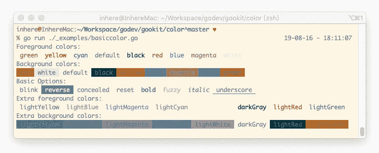
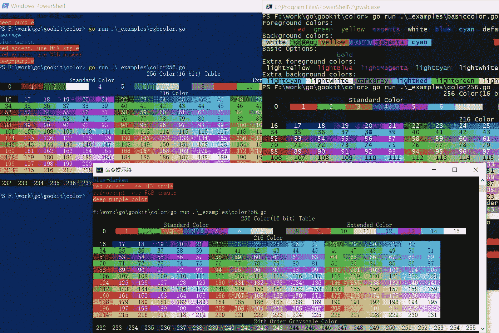

# golang 的 Windows CMD 和 PowerShell 颜色渲染

> 原文：<https://itnext.io/windows-cmd-and-powershell-color-rendering-by-golang-54bddc2d25d1?source=collection_archive---------3----------------------->

[gookit/color](https://github.com/gookit/color) 是一个命令行颜色库，具有真彩色支持、通用 API 方法和 Windows 支持。

基本颜色预览:



从 [**v1.2.4**](https://github.com/gookit/color/releases/tag/v1.2.4) 开始，256 色和 RGB 色也已经支持在 Windows CMD 和 PowerShell 中工作:



# 如何在 CMD 和 PWSH 上工作

go 类型定义。(更多请看[https://github.com/gookit/color/blob/master/color_rgb.go](https://github.com/gookit/color/blob/master/color_rgb.go))

```
*// RGBColor definition.
//
// The first to third digits represent the color value.
// The last digit represents the foreground(0), background(1), >1 is unset value
//
// Usage:
//     // 0, 1, 2 is R,G,B.
//     // 3th: Fg=0, Bg=1, >1: unset value
//     RGBColor{30,144,255, 0}
//     RGBColor{30,144,255, 1}
//
// NOTICE: now support RGB color on windows CMD, PowerShell* type RGBColor [4]uint8

*// create a empty RGBColor* var emptyRGBColor = RGBColor{3: 99}

*// RGB color create.
// Usage:
//     c := RGB(30,144,255)
//     c := RGB(30,144,255, true)
//     c.Print("message")* func RGB(r, g, b uint8, isBg ...bool) RGBColor {
   rgb := RGBColor{r, g, b}
   if len(isBg) > 0 && isBg[0] {
      rgb[3] = AsBg
   }

   return rgb
}
*... ...*
```

RGBColor 有一些打印 API 方法:

```
*... ...**// Print print message* func (c RGBColor) Print(a ...interface{}) {
   doPrintV2(c.String(), fmt.Sprint(a...))
}

*// Printf format and print message* func (c RGBColor) Printf(format string, a ...interface{}) {
   doPrintV2(c.String(), fmt.Sprintf(format, a...))
}

*// Println print message with newline* func (c RGBColor) Println(a ...interface{}) {
   doPrintlnV2(c.String(), a)
}...
```

*doPrintlnV2* 方法:

```
func doPrintlnV2(code string, args []interface{}) {
   str := formatArgsForPrintln(args)
   if isLikeInCmd {
      renderColorCodeOnCmd(func() {
         _, _ = fmt.Fprintln(output, RenderString(code, str))
      })
   } else {
      _, _ = fmt.Fprintln(output, RenderString(code, str))
   }
}
```

如果它当前在 CMD 或 PowerShell 中，它将执行 *renderColorCodeOnCmd* 方法。

核心代码:

```
*/*************************************************************
 * render full color code on windows(8,16,24bit color)
 *************************************************************/

// docs https://docs.microsoft.com/zh-cn/windows/console/getconsolemode#parameters* const (
   *// equals to docs page's ENABLE_VIRTUAL_TERMINAL_PROCESSING 0x0004* EnableVirtualTerminalProcessingMode uint32 = 0x4
)

*// EnableVirtualTerminalProcessing Enable virtual terminal processing
//
// ref from github.com/konsorten/go-windows-terminal-sequences
// doc https://docs.microsoft.com/zh-cn/windows/console/console-virtual-terminal-sequences#samples
//
// Usage:
//     err := EnableVirtualTerminalProcessing(syscall.Stdout, true)
//     // support print color text
//     err = EnableVirtualTerminalProcessing(syscall.Stdout, false)* func EnableVirtualTerminalProcessing(stream syscall.Handle, enable bool) error {
   var mode uint32
   *// Check if it is currently in the terminal* err := syscall.GetConsoleMode(syscall.Stdout, &mode)
   if err != nil {
      return err
   }

   if enable {
      mode |= EnableVirtualTerminalProcessingMode
   } else {
      mode &^= EnableVirtualTerminalProcessingMode
   }

   ret, _, err := procSetConsoleMode.Call(uintptr(unsafe.Pointer(stream)), uintptr(mode))
   if ret == 0 {
      return err
   }

   return nil
}

*// renderColorCodeOnCmd enable cmd color render.* func renderColorCodeOnCmd(fn func()) {
   err := EnableVirtualTerminalProcessing(syscall.Stdout, true)
   *// if is not in terminal, will clear color tag.* if err != nil {
      *// panic(err)* fn()
      return
   }

   *// force open color render* old := ForceOpenColor()
   fn()
   *// revert color setting* isSupportColor = old

   err = EnableVirtualTerminalProcessing(syscall.Stdout, false)
   if err != nil {
      panic(err)
   }
}
```

# 更多用法

位于[https://github . com/goo kit/color/blob/master/_ examples/RGB color . go](https://github.com/gookit/color/blob/master/_examples/rgbcolor.go)的示例文件

```
package main

import "github.com/gookit/color"

*// go run ./_examples/rgbcolor.go* func main() {
   color.RGB(30, 144, 255).Println("message. use RGB number")

   color.HEX("#1976D2").Println("blue-darken")
   color.HEX("#D50000", true).Println("red-accent. use HEX style")

   color.RGBStyleFromString("213,0,0").Println("red-accent. use RGB number")
   *// foreground: eee, background: D50000* color.HEXStyle("eee", "D50000").Println("deep-purple color")
}
```

[](https://github.com/gookit/color) [## 谷歌工具包/颜色

### 具有真彩色支持、通用 API 方法和 Windows 支持的命令行颜色库。

github.com](https://github.com/gookit/color)