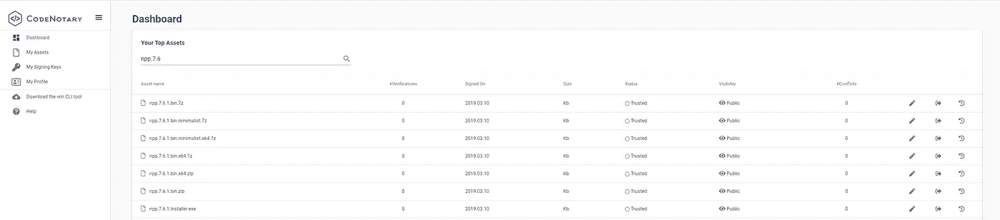
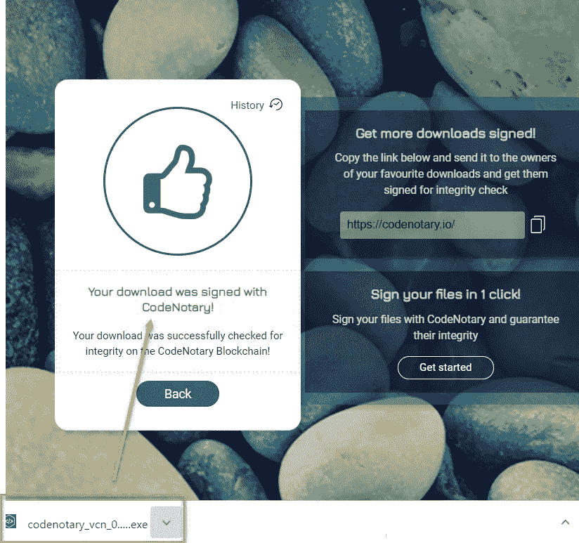
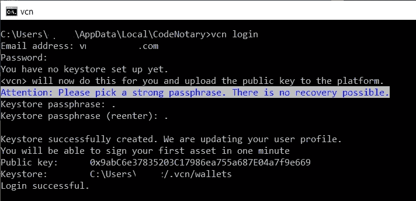
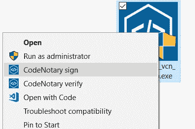

# 有了 code 公证人，您再也不必为代码签名证书付费了

> 原文：<https://itnext.io/with-codenotary-you-never-have-to-pay-for-code-signing-certificates-again-ca986b2d006e?source=collection_archive---------9----------------------->

你可能会想，这是一个相当大胆的声明。但这是我们所有非商业项目的目标。整个认证机构行业都喜欢在非商业项目的背后赚钱。他们通常会引诱你获得 1 到 3 年的免费代码签名证书，然后就有了回报。

如果你不这么做，你的证书将不会延期和过期(你的签名资产也会过期)。

一些小保护的唯一方法要么是每年付费的数字证书(特别是如果你提供微软 Windows 可执行文件)，要么使用 MD5/SHA-1/SHA-256 或 [GPG](https://www.gnupg.org/) ，这需要手动检查。一个证书来签署你的所有版本，只是为了避免在微软视窗讨厌的内置警告。这远远不够这个价格。最后，你提供免费的工具和软件，但是你需要为用户付费，这样用户才能在没有任何警告的情况下使用它们。

一个令人惊叹的开源非商业社区正在提供优秀的软件、工具和文档，为他人节省了数十亿小时。作为该社区的一员，您不应该为他们的资产(文件、文档、发布)支付任何保护或管理费用。

烦恼的声音很难被忽视——一定要看看关于[社区对数字证书](http://www.vchain.us/developers-unite-against-the-expensive-and-cumbersome-digital-code-signing-certificates/)的反应的博文。

# code 公证人是为非商业和开源开发者做什么的？

code 公证人的创造者，vChain 的 CTO 和联合创始人 Dennis Zimmer 说:*“我们在 vChain，创造了 code 公证人来保护你的辛勤工作，增加用户的信心和信任，而不用花一大笔钱。如果您提供非商业软件，我们将提供终身免费的 code 公证人许可。”*

利用分布式账本技术可以避免建设高安全性数据中心的巨大成本，并克服所有典型的市场监管障碍，提供替代解决方案。

code 公证人正是这样做的:自动创建您的数字资产的唯一散列，并以不可变的分布式方式存储它。该条目包含作者信息和信任级别。

所有权和作者身份的证明越好，资产的信任级别就越高。通过这种方式，code 公证人允许你以一种安全且不可改变的方式存储你的每一项资产，而不需要通过数字证书来签署你的代码。此外，code 公证人不局限于撤销带有其所有签名资产的整个证书，而是允许改变每个资产的信任级别。

我们邀请所有非商业项目所有者、开发者在此获得他们的免费许可证:

**领取** [**非商业项目许可证**](https://dashboard.codenotary.io/auth/signup)

# 公证组件

当您开始使用 code 公证人时，您会自动获得仪表板访问权限，在那里您可以查看和管理您曾经签名的所有数字资产。要对文件、文档、docker 容器等进行签名，还需要使用 vcn 命令行。但是，让我们深入了解两个重要的组成部分。

所有这些都由两个简单的组件完成:

# Chrome 浏览器扩展

顺便说一句。有第三个使下载完整性的验证变得非常简单。代码公证谷歌浏览器扩展。该扩展支持针对 code 公证人区块链服务的直接下载验证，以及对已经存储在您的机器上的文件的按需验证。

# 特征

我们才刚刚开始，还有更多的事情要做。当时我们已经支持以下行动:

1.  签署您的任何文件，文件，docker 容器和更多(信任)
2.  验证您签名的数字资产的完整性
3.  基于其他作者签名操作验证数字资产的完整性
4.  不信任自己的数字资产
5.  不支持您的数字资产(即过时版本)
6.  使用 vcn 或 code 公证人控制面板，列出并管理您所有的签名资产
7.  您还可以拥有私有和公共资产(可见性)

vcn 命令可以在 Linux、MacOS 或 Microsoft Windows 上使用:

快速提示:您需要从 **vcn 登录**开始设置您的密钥对以开始签名。可能需要 10 分钟才能开始签名，因为需要触发一些智能合同。

如果您只想使用 vcn 来验证现有文件，则无需登录。

当使用 vcn for Windows 时，基于 Windows explorer 集成，事情变得更加简单。这使得在 Windows 文件资源管理器中浏览时签名或验证文件变得非常方便。

# 如何开始？

再简单不过了— [**获得免费许可证**](https://dashboard.codenotary.io/auth/signup)

最好是在我们的非商业项目登录页面注册，然后在我们的 code 公证人仪表板上注册。请确保使用电子邮件地址，并将项目 url 发送到您的非商业产品。

我们会尽快激活您的许可证(通常在一天之内)，然后您就可以开始使用了。

请不要忘记留下反馈，因为我们喜欢听取您对我们产品的意见。您可以随时使用我们的聊天工具联系我们，并获得您的问题的解答。

*原载于 2019 年 3 月 27 日*[*www . vchain . us*](https://www.vchain.us/with-codenotary-you-never-have-to-pay-for-code-signing-certificates-again/)*。*