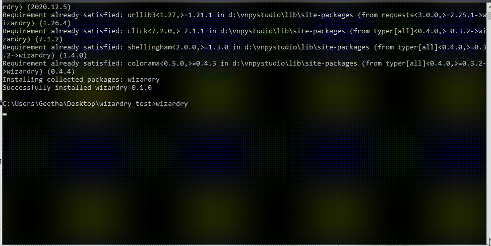
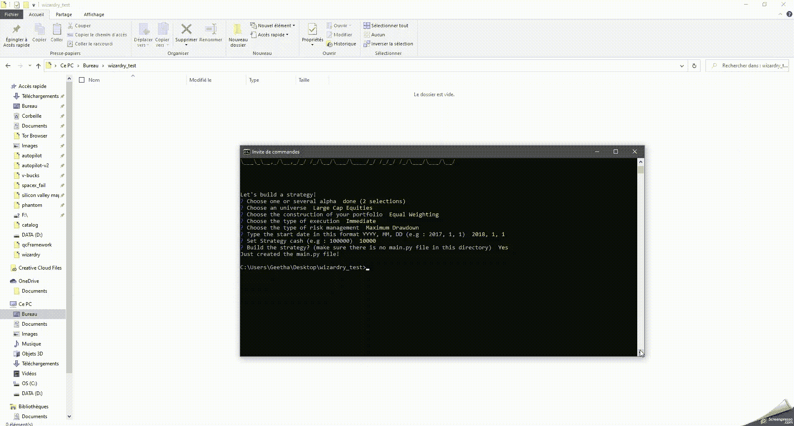

# 魔法，算法交易框架

> 原文：<https://itnext.io/wizardry-the-algorithmic-trading-framework-b90046fcb80?source=collection_archive---------0----------------------->

# 魔法，算法向导💫

Wizardry 是一个开源的 CLI，用于更快更容易地构建强大的算法交易策略(适用于 Lean/QuantConnect)


# 安装🧙

```
pip install wizardry
```

# 使用🏦

Wizardry CLI 中有 3 个命令:

*   `wizardry framework`使用户能够定义阿尔法、宇宙、投资组合结构和风险管理模型，以构建您的战略主体
*   `wizardry library`使用户能够从这个[网页](https://www.quantconnect.com/tutorials/strategy-library/strategy-library)中探索并“分叉”到他们的本地机器上大约 100 种算法交易策略
*   `wizardry backtest`回溯测试暂时不可用，但是这个命令行将指导你如何对 Quantconnect 进行回溯测试！

在深入了解每个命令的细节之前，请点击下面的图片来观看向导演示/教程

[https://www.youtube.com/embed/1ejiNJUeID4](https://www.youtube.com/embed/1ejiNJUeID4)

那么，让我们深入了解这 3 个命令

# 魔法框架



它遵循与 Quantconnect 相同的流程(外加一些额外功能) :

*   🍈宇宙选择:选择你的资产
*   🍓阿尔法创造:产生交易信号
*   🍇投资组合构建:确定头寸规模目标
*   🍉执行:根据你的仓位大小进行交易
*   🍌风险管理:管理市场风险

# 魔法图书馆



# 魔法回溯测试

以下是我建议你对你的魔法策略进行回溯测试的方法:

第一次:

1.  在空文件夹中运行`pip install lean`
2.  在这个目录下运行`lean login`,给出你的 QuantConnect ID 和 API 令牌(你可以在这里得到它们
3.  在命令提示符下运行同一个目录中的`lean create-project "Project Name"`
4.  用您的`main.py`替换“项目名称”文件夹中的`main.py`文件
5.  运行`lean cloud push --project "Project Name"`
6.  最后，运行`lean cloud backtest "Project Name" --open --push'`(修改文件时重复此命令即可)

你完了！🚀

如果你想看制作指南，你可以在这里看我的视频

# **信用**

所有这一切都归功于 QuantConnect 的工作！

# 接触

如果你有一些建议，改进，批评或问题，不要犹豫，让评论，这将是我的荣幸回答:)

电子邮件:santoshpassoubady@gmail.com

你也可以在 Github([https://github.com/ssantoshp](https://github.com/ssantoshp))上关注我，我在那里做了很多金融项目和面向量化的东西。