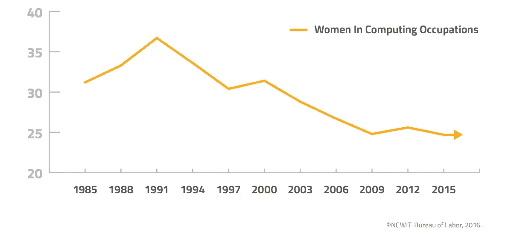
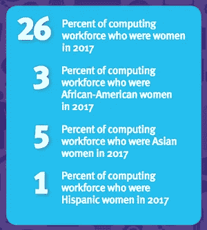

# 科技界的女性

> 原文：<https://itnext.io/women-in-tech-a48f2ac24308?source=collection_archive---------9----------------------->

## 他们在哪里？

很难发现我们。有时候，你会从远处看到飘逸的长发。你走近。慢慢地，他们转过身来，让你惊愕的是，你看到了胡子。唉，不是科技行业的女性，而是 it 行业的吉姆。可悲的是，你退到角落里，开始疯狂地用手指敲打你的机械键盘。

吉姆从里面出来

虽然我只在科技行业呆了三年，但我很快就意识到，有时候你是一屋子男人中唯一的女性。它可能是孤独的，令人生畏的，孤立的，令人沮丧的。这也凸显了一个问题:**女人都去哪了？**

# 有什么问题？

根据[国家妇女中心&信息技术的 By the Numbers](https://www.ncwit.org/resources/numbers) 报告，2017 年，女性占专业劳动力的 57%，但仅占科技行业的 26%。2016 年，57%的学士学位由女性获得，只有 19%的学位属于计算机和信息科学。相比之下，[在 2015 年](https://www.ncwit.org/sites/default/files/resources/womenintech_facts_fullreport_05132016.pdf)，25%的科技行业由女性主导。在两年的时间里，我们仅增加了 1%的美国科技劳动力。这似乎是一个胜利，但它不是。

总体而言，自 1991 年以来，女性在科技行业的人数一直在下降，当时女性占据了 36%的科技工作岗位。更有趣的是，根据编写代码的[女孩的说法，大约 74%的年轻女孩对 STEM 领域和计算机科学感兴趣，而只有 19%的人实际上在攻读这些学科的学位。](https://girlswhocode.com/)

[图像来源](https://www.ncwit.org/sites/default/files/resources/btn_04042018_web.pdf)

一个更大的问题是 STEM 中女性的多样性。虽然 2017 年 26%的 STEM 职位由女性担任，但其中 17%的职位由白人女性担任，而只有 5%的职位由亚裔女性担任，3%的职位由黑人/非洲裔女性担任，只有 1%的职位由拉丁裔/西班牙裔女性担任。

# 为什么会这样？

从我的经验来看，STEM 作为一种潜在的职业选择并没有被年轻女性充分讨论。我没有计算机专业的学位(le gasp！).当我在高中的时候，我接触了 VB.NET，并且非常了解 HTML。我会在业余时间编写小而简单的程序。我母亲是一名德语教师，父亲是 IBM 的 CPU 架构师。当到了我选择我一生想做什么的时候，没有一个人告诉我计算机科学是一个选项。我最终获得了音乐教育学士学位，并在最终转向技术之前教了两年初级音乐。我并不孤单。

国家女孩合作项目的研究表明，年轻时接触 STEM 以及科技如何应用于职业会影响女孩对 STEM 课程的态度。与女孩谈论未来的 STEM 机会可以鼓励她们像男孩一样追求数学和科学。但是那些目前在 STEM 领域的女性呢？

2017 年，一名(现已)前[谷歌软件工程师发布了一份 10 页的备忘录](https://gizmodo.com/exclusive-heres-the-full-10-page-anti-diversity-screed-1797564320)，内容是关于女性在科技职业中没有代表性，这不是因为偏见或歧视，而是因为遗传的心理上不如男性。

我对谷歌备忘录的反应

这种看法在工作场所仍然很普遍。偏见，包括无意识的偏见和刻板印象，对于目前在科技行业工作或拥有技能的女性来说[仍然是一个大问题](https://www.aauw.org/research/why-so-few/)。工作经验是科技行业女性保留率的一个重要因素。离开科技行业的女性报告说，在工作场所，她们的经理给予的培训、支持要少得多，破坏行为也多得多。

# 我们怎样才能停止这种疯狂？

像[女孩编码](https://girlswhocode.com/)、[女孩开发 It](https://www.girldevelopit.com/) 和[国家女孩合作项目](https://ngcproject.org/about-ngcp)这样的组织正在产生巨大的影响。这些组织为女孩提供了在安全、协作的环境中获得计算机科学实践经验的绝佳机会。这种早期接触 STEM 科目的经历增强了女孩在年轻时的自信和兴趣。

百万女性导师的研究表明，拥有一个积极的榜样是女孩在 STEM 领域探索职业生涯的主要动力。你可以申请成为一名导师，并在他们的[网站](https://www.millionwomenmentors.com/)上了解更多关于百万女性导师的信息，不分性别。

最后，如果你有女儿，和她谈谈 STEM 职业机会。即使她看起来不感兴趣，重要的是让她知道这是她的一个选择，并鼓励她追求 STEM 职业生涯。[哈佛大学发现，经过八年的计算机科学培训后，女性与零到一年培训的男性一样自信](https://www.thecrimson.com/article/2016/4/25/computer-science-gender-gap/)，所以完全有可能你的女儿可能只是缺乏一些自信来大显身手。

*作者注:我是堪萨斯城的白人女性。我不代表科技界的所有女性，我的经历只是我个人的。*