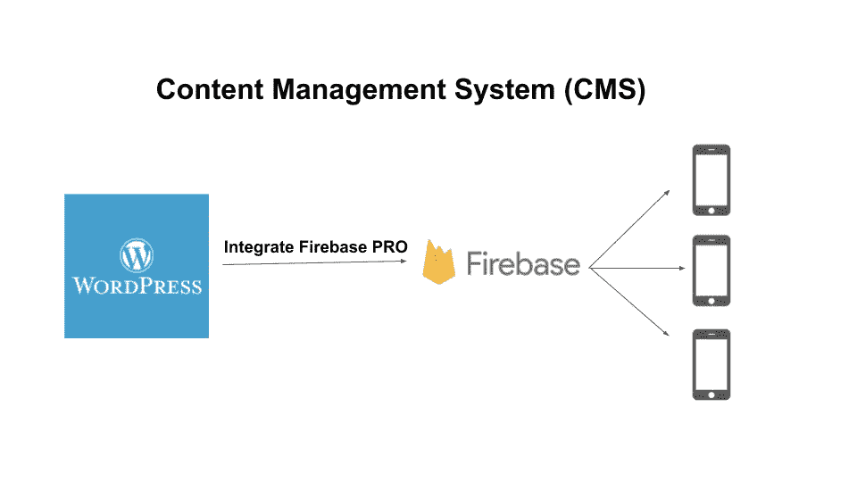
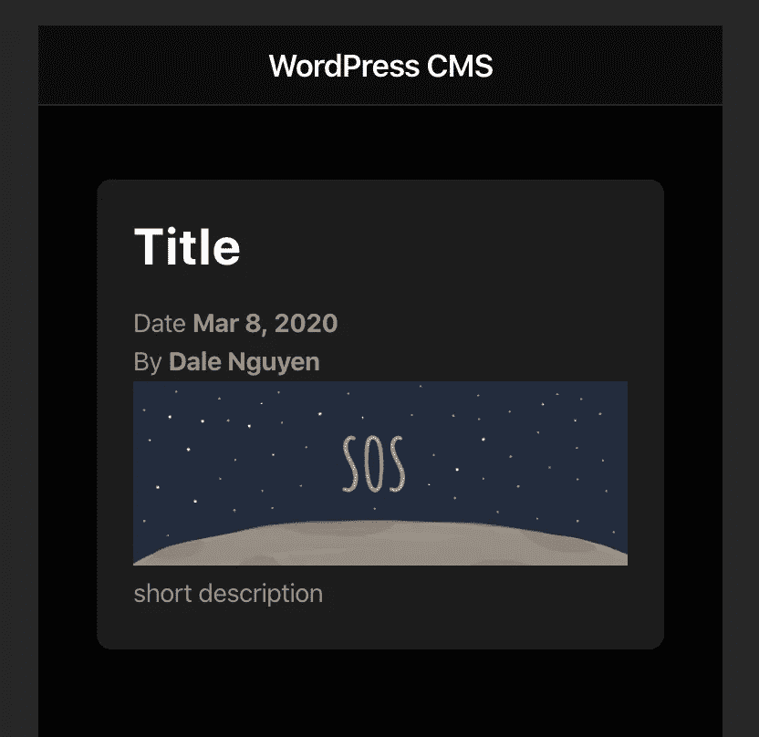

# 移动应用的 WordPress CMS(Ionic+Firebase)——第 1/4 部分

> 原文：<https://itnext.io/wordpress-cms-for-mobile-apps-ionic-firebase-part-1-4-983fea94d12?source=collection_archive---------2----------------------->



> **第 1 部分:创建一个具有博客功能的移动应用(Ionic 框架)**
> 
> 第 2 部分:[将帖子数据从 WordPress 同步到 Firebase](https://medium.com/@dalenguyen/wordpress-cms-for-mobile-apps-ionic-firebase-part-2-4-759d4dcfbc2e)
> 
> 第三部分:[在 Ionic app 上提供 WordPress 帖子内容](https://medium.com/@dalenguyen/wordpress-cms-for-mobile-apps-ionic-firebase-part-3-4-63803349a8af)
> 
> 第 4 部分:为博客特性添加缓存(继续)

为移动应用选择内容管理系统(CMS)不成问题。市场上有大量的选择，从传统的解耦 CMS 到无头 CMS。每个解决方案都有优点和缺点。

下面是我在为移动应用构建 CMS 时的一个选择:[WordPress](https://wordpress.org/)+[Firebase](https://firebase.google.com/)+[Ionic Framework](https://ionicframework.com/)。

选择 WordPress 的好处是它是一个健壮的、开发良好的系统。这意味着我有一个具有搜索引擎优化(SEO)功能的网站和一个可以通过 Firebase 扩展的移动应用程序。

在 [Integrate Firebase PRO](https://firebase-wordpress-docs.readthedocs.io/en/latest/) 插件的帮助下，来自 WordPress 的所有帖子都与 Firebase 数据库(Firestore / Realtime)同步。这意味着您将从[云 Firestore](https://firebase.google.com/docs/firestore/) 中获得所有这些好处，例如实时更新、离线支持&扩展。

**第一步:创建一个简单的 Ionic 应用**

确保您的机器上安装了[节点。然后安装 Ionic CLI](https://nodejs.org/en/)

```
npm install -g @ionic/cli
```

之后就可以用 ionic 启动一个空白的 app 了。我选择 Angular 作为开发的模板。您可以选择另一个模板，如 React。

```
ionic start app-name blank — type=angular
```

**第二步:给 Ionic app** 添加一个样本帖子

之后，您可以为您的帖子创建一个模型。该模型基于 WordPress 中的 [Post 对象。](https://developer.wordpress.org/reference/classes/wp_post/)

```
// /src/app/shared/models/post.model.tsexport interface Post {
  post_title: string;
  post_excerpt: string;
  post_date: string;
  post_author_name: string;
  post_thumbnail: string;
  post_content: string;
}
```

创建要在应用程序上显示的示例数据。

```
// /src/app/home/home.page.ts

import { Component } from '[@angular/core](http://twitter.com/angular/core)';
import { Post } from '../shared/models/post.model';[@Component](http://twitter.com/Component)({
  selector: 'app-home',
  templateUrl: 'home.page.html',
  styleUrls: ['home.page.scss']
})
export class HomePage {
  posts: Post[] = [
    {
      post_title: 'Title',
      post_excerpt: 'short description',
      post_date: '2020-03-08 01:27:59',
      post_author_name: 'Dale Nguyen',
      post_thumbnail:
        '[https://miro.medium.com/max/4800/1*jFsgUxz4Dm4HDIlpMjz8Sg.png'](https://miro.medium.com/max/4800/1*jFsgUxz4Dm4HDIlpMjz8Sg.png'),
      post_content:
        '<!-- wp:paragraph --><p>Welcome to WordPress. This is your first post. Edit or delete it, then start writing!</p><!-- /wp:paragraph -->'
    }
  ];constructor() {}
}
```

然后，您可以将数据映射到模板。

```
// /src/app/home/home.page.html<ion-app>
  <ion-header>
    <ion-toolbar>
      <ion-title>WordPress CMS</ion-title>
    </ion-toolbar>
  </ion-header><ion-content class="ion-padding">
    <ion-card *ngFor="let post of posts">
      <ion-card-header>
        <ion-card-title>{{post.post_title}}</ion-card-title>
      </ion-card-header>
      <ion-card-content>
        <p>Date <strong>{{post.post_date | date}}</strong></p>
        <p>By <strong>{{post.post_author_name}}</strong></p>
        
        <p [innerHTML]="post.post_excerpt"></p>
      </ion-card-content>
    </ion-card>
  </ion-content>
</ion-app>
```

瞧，一切正常。



在下一篇文章中，我将向你展示如何将文章数据从 WordPress 同步到 Firebase。

如果你想看完整的工作代码，请在 Github 上查看: [Ionic Firebase WordPress](https://github.com/dalenguyen/ionic-firebase-wordpress)