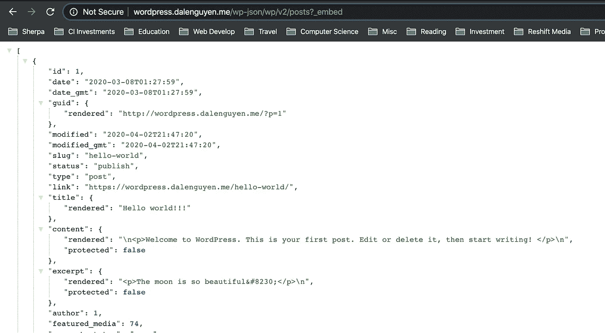

# 移动应用的 WordPress CMS(Ionic+Firebase)——第 2/4 部分

> 原文：<https://itnext.io/wordpress-cms-for-mobile-apps-ionic-firebase-part-2-4-759d4dcfbc2e?source=collection_archive---------7----------------------->


> *第一部分:* [*创建具有博客功能的移动应用(Ionic 框架)*](/wordpress-cms-for-mobile-apps-ionic-firebase-part-1-4-983fea94d12)
> 
> ***第二部分:将文章数据从 WordPress 同步到 Firebase***
> 
> *第三部分:* [*在 Ionic app 上发布 WordPress 帖子内容*](https://medium.com/@dalenguyen/wordpress-cms-for-mobile-apps-ionic-firebase-part-3-4-63803349a8af)
> 
> *第 4 部分:为博客功能添加缓存(正在进行)*

在之前的帖子中，我向您展示了如何创建一个简单的 Ionic 应用程序，以便显示简单的帖子内容。

有两种方法可以帮助你从 WordPress 中检索文章内容。一个来自 WordPress API 本身，另一个来自插件 Integrate Firebase PRO。

**从 WordPress Restful API 中检索文章**

这个方法将以 post 对象数组的形式返回一个帖子列表。

```
https://example.com/wp-json/wp/v2/posts?_embed
```



*从 WordPress Restful API 返回的示例帖子*

这个选项非常有效。唯一的缺点是你将没有能力收听新的更新。例如，如果您想在创建新帖子或更新产品后实时发送通知，这种方法很难做到。

**借助** [**整合 Firebase PRO**](https://firebase-wordpress-docs.readthedocs.io/en/latest/index.html) **插件**检索帖子

该插件的工作原理是在你每次更新或创建新内容时同步文章内容。因此，如果您想发送通知，您可以监听云函数中的创建事件。

安装插件后，您可以选择将哪些内容同步到实时或 Firestore 数据库。


*同步配置*

在这个例子中，它将选择 Firestore 作为数据库，每个新的或更新的帖子都将被同步到 Firestore。

之后，您可以创建新帖子或更新现有帖子。


*创建新帖子*

保存后，文章将被添加到 Firestore 的 **wpPosts** 收藏下。文章的文档 id 也是用于查询目的的文章 id。


*Firestore 中的新帖子*

当您更新当前帖子时，它将覆盖 Firestore 中的数据，以确保它总是更新的。

在下一篇文章中，我将向你展示如何将 WordPress 中的文章连接到 Ionic 应用程序。

如果你想看完整的工作代码，请在 Github 上查看: [Ionic Firebase WordPress](https://github.com/dalenguyen/ionic-firebase-wordpress)