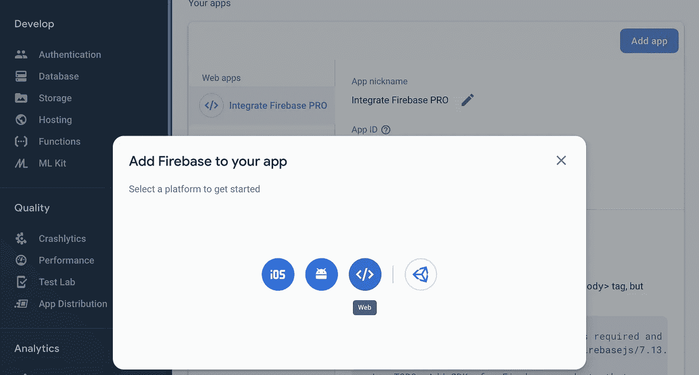
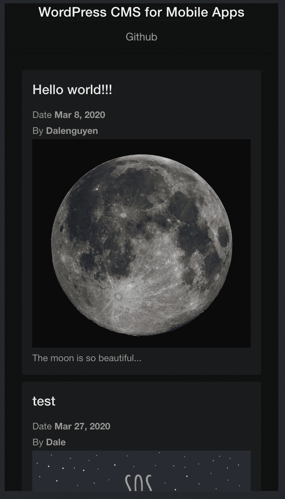

# 移动应用的 WordPress CMS(Ionic+Firebase)——第 3/4 部分

> 原文：<https://itnext.io/wordpress-cms-for-mobile-apps-ionic-firebase-part-3-4-63803349a8af?source=collection_archive---------8----------------------->


> *第一部分:* [*创建具有博客功能的移动应用(Ionic 框架)*](/wordpress-cms-for-mobile-apps-ionic-firebase-part-1-4-983fea94d12)
> 
> *第二部分:* [*将帖子数据从 WordPress 同步到 Firebase*](https://medium.com/@dalenguyen/wordpress-cms-for-mobile-apps-ionic-firebase-part-2-4-759d4dcfbc2e)
> 
> *第三部分:* ***在 Ionic app 上发布 WordPress 帖子内容***
> 
> *第 4 部分:为博客功能添加缓存(正在进行)*

在上一篇文章中，我向你展示了如何从 WordPress 准备文章。现在是时候在 Ionic App 上展示帖子了。

# 显示来自 Restful API 的 WordPress 文章

在 Angular 的 HttpClient 的帮助下，我们可以使用这个服务来调用 WordPress Restful API。

首先，我们需要添加 HttpClientModule

```
// app.module.tsimport { HttpClientModule } from '[@angular/common](http://twitter.com/angular/common)/http';[@NgModule](http://twitter.com/NgModule)({
  declarations: [AppComponent],
  entryComponents: [],
  imports: [
    ...
    HttpClientModule,
  ],
  providers: [
    StatusBar,
    SplashScreen,
    { provide: RouteReuseStrategy, useClass: IonicRouteStrategy },
  ],
  bootstrap: [AppComponent],
})
export class AppModule {}
```

然后用 HttpClient 检索帖子列表。

```
// /src/app/home/home.page.tsimport { Component } from '[@angular/core](http://twitter.com/angular/core)';
import { Observable } from 'rxjs';
**import { HttpClient } from '**[**@angular/common**](http://twitter.com/angular/common)**/http';**import { Post } from '../shared/models/post.model';[@Component](http://twitter.com/Component)({
  selector: 'app-home',
  templateUrl: 'home.page.html',
  styleUrls: ['home.page.scss'],
})
export class HomePage {
  **posts$: Observable<Post[]>;**constructor(private http: HttpClient) {
    **this.posts$ = http.get(
      `**[**http://example.com/wp-json/wp/v2/posts?_embed`**](http://wordpress.dalenguyen.me/wp-json/wp/v2/posts?_embed`) **) as Observable<Post[]>;** // Print out the list of posts
    this.posts$.subscribe((posts) => console.log(posts));
  }
}
```

# **显示来自 Firestore 的 WordPress 帖子**

假设您的 Firestore 数据库中有帖子列表。我们可以用 help [AngularFire](https://github.com/angular/angularfire) 包检索数据。

**第一步:将 AngularFire 安装到项目上**

```
npm install firebase @angular/fire --save
```

**第二步:添加 Firebase 项目**

去 [Firebase 控制台](https://console.firebase.google.com/)创建一个新的应用程序，如果你还没有。



创建新项目后，您将看到 Firebase 凭据。我们可以把它添加到环境中。

```
// /src/environments/environment.tsexport const environment = {
  production: false,
  firebaseConfig: {
    apiKey: "<your-api-key>",
    authDomain: "<your-auth-domain>",
    databaseURL: "<your-database-url>",
    projectId: "<your-cloud-firestore-project>",
    storageBucket: "<your-storage-bucket>",
    messagingSenderId: "<your-sender-id>",
    appId: "<your-app-id>",
    measurementId: "<your-measurement-id>"
  }
};
```

别忘了加上 AngularFireModule。

```
// /src/app/app.module.ts**import { AngularFireModule } from '**[**@angular/fire**](http://twitter.com/angular/fire)**';
import { AngularFirestoreModule } from '**[**@angular/fire**](http://twitter.com/angular/fire)**/firestore';****import { environment } from 'src/environments/environment';**[@NgModule](http://twitter.com/NgModule)({
  declarations: [AppComponent],
  entryComponents: [],
  imports: [
    BrowserModule,
    IonicModule.forRoot(),
    AppRoutingModule,
 **AngularFireModule.initializeApp(environment.firebaseConfig),
    AngularFirestoreModule**  ],
  ...
})
export class AppModule {}
```

**第三步:显示 Firestore 的帖子**

在 Ionic 项目中初始化 App 之后，我们现在可以访问 Firestore 来检索数据。

```
// /src/app/home/home.page.tsimport { Component } from '[@angular/core](http://twitter.com/angular/core)';
import { Observable } from 'rxjs';
**import { AngularFirestore } from '**[**@angular/fire**](http://twitter.com/angular/fire)**/firestore';**import { Post } from '../shared/models/post.model';[@Component](http://twitter.com/Component)({
  selector: 'app-home',
  templateUrl: 'home.page.html',
  styleUrls: ['home.page.scss']
})
export class HomePage {
  posts$: Observable<Post[]>;constructor(private fireStore: AngularFirestore) {
    **this.posts$ = this.fireStore.collection<any>('wpPosts').valueChanges();**
  }
}
```

基于 Post 模型，我们可以显示来自模板的数据。

```
// /src/app/home/home.page.html<ion-app>
  <ion-header>
    <ion-toolbar>
      <ion-title>WordPress CMS</ion-title>
    </ion-toolbar>
  </ion-header><ion-content class="ion-padding">
    <ion-card *ngFor="**let post of posts$ | async**">
      <ion-card-header>
        <ion-card-title>{{**post.post_title**}}</ion-card-title>
      </ion-card-header>
      <ion-card-content>
        <p>Date <strong>{{**post.post_date | date**}}</strong></p>
        <p>By <strong>{{post.post_author}}</strong></p>
        
        <p [innerHTML]="**post.post_excerpt**"></p>
      </ion-card-content>
    </ion-card>
  </ion-content>
</ion-app>
```

一切都设置好了，你会在你的 Ionic app 上看到帖子的内容。



帖子是从 Firestore 检索的

我们已经成功地构建了一个 Ionic 应用程序，提供来自 WordPress CMS 的内容。

在下一篇文章中，我将向您展示如何添加缓存层，以便更快地检索内容，从而获得更好的性能。

如果你想看完整的工作代码，请在 Github 上查看: [Ionic Firebase WordPress](https://github.com/dalenguyen/ionic-firebase-wordpress)