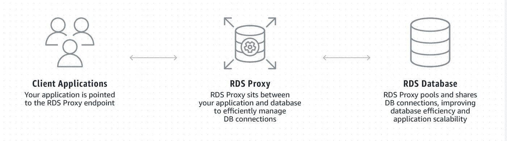
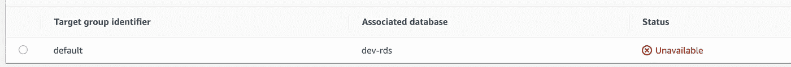
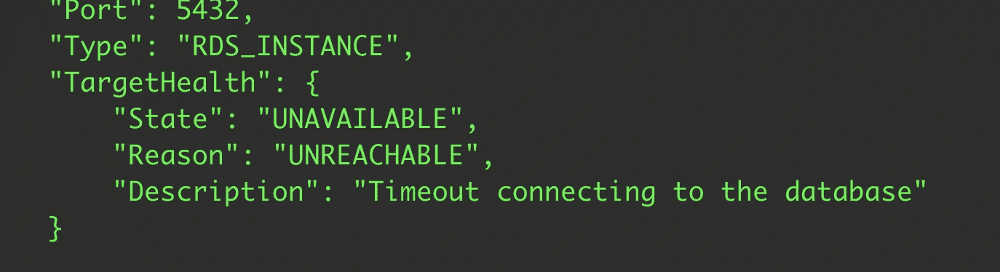

# 使用 AWS RDS 代理

> 原文：<https://itnext.io/work-with-aws-rds-proxy-9d7e09668080?source=collection_archive---------1----------------------->



2020 年 6 月，AWS 宣布 RDS 代理将同时兼容 MySQL 和 PostgreSQL 引擎。对于 AWS 无服务器生态系统来说，这是一个重要的里程碑，因为对于许多无服务器架构来说，使 DB 无服务器不是一项简单的任务，现在有了 RDS 代理，这项任务不再像以前那样具有挑战性。

我假设正在阅读这篇文章的任何人都是无服务器先锋，并且知道 RDS 代理的优点和缺点，所以我不打算写一个好东西的列表，相反，我将深入代码并向您展示如何使用它。

## 创建代理

创建 RDS 代理非常简单。当你创建一个代理时，需要记住一些事情。

**> VPC 安全小组。**分配给代理的安全组必须允许来自应用程序环境(如 Lambda 或 EC2)的流量到达代理，以及来自代理的流量到达 RDS。如果安全组配置不正确，

> **IAM 认证。**当您选择使用 IAM 认证时，您必须使用 TLS 连接到代理。当需要 IAM 身份验证时，本机凭据，即用户名和密码身份验证将不会被接受用于连接。

如果代理没有正确配置，您通常会看到目标变得不可用，这意味着到 RDS 的连接没有准备好，在大多数情况下，原因是安全组或 RDS 的凭据。



幸运的是，有了 AWS CLI，我们可以很容易地调试它。

```
aws rds describe-db-proxy-targets --db-proxy-name dev-rds-proxy-test
```

比如我故意设置错了秘密管理者。由于错误的密码，目标变得不可用。


最大的问题可能是安全组设置。当安全组不正确时，通常意味着流量不被允许，因此您会看到以下错误。



你必须有耐心，找出哪个 SG 是不正确的。

请注意，在配置更改和状态更改之间有几秒钟的延迟。

## 通过代理连接到 RDS

有不同的方法通过代理连接到 RDS，使用或不使用 TLS，使用或不使用 IAM 认证，我将向您展示如何。对于示例，我将使用 Postgres 和 TypeScript。

**> psql**

在编写任何代码之前，我们应该首先使用`psql`测试连接，这样我们可以确保一路绿灯。

```
# With TLS required
psql "host=dev-rds-proxy-test.xxxxxxxxxxx.ap-southeast-2.rds.amazonaws.com dbname=rds user=rds_user sslmode=require"
```

如果需要 IAM 身份验证，您将需要生成 IAM 令牌

```
aws rds generate-db-auth-token --hostname dev-rds-proxy-test.xxxxxxxxxxx.rds.amazonaws.com --port 5432 --region ap-southeast-2 --username dev_rds_user
```

在使用令牌连接到 RDS 之前，需要确保 EC2 或 Lamda 附加了以下 IAM 策略

```
{
    "Version": "2012-10-17",
    "Statement": [
        {
            "Effect": "Allow",
            "Action": [
                "rds-db:connect"
            ],
            "Resource": [
                "arn:aws:rds-db:ap-southeast-2:xxxxxxxxx:dbuser:**prx-0f9d9414be09b1c57**/**dev_rds_user**"
            ]
        }
    ]
}
```

**一个非常重要的注意事项，AWS 中没有记录(至少我找不到)，是放代理资源 ID，而不是 DB 资源 ID，因为我们使用 IAM 认证连接到代理，而不是 RDS。代理仍然使用在 secret manager 中配置的本地 auth 连接到 RDS。**

你还需要从 https://www.amazontrust.com/repository/AmazonRootCA1.pem 的[获得亚马逊根 CA](https://www.amazontrust.com/repository/AmazonRootCA1.pem)

最后，我们可以连接

```
psql "host=dev-rds-proxy-test.proxy-xxxxx.ap-southeast-2.rds.amazonaws.com port=5432 sslmode=verify-full sslrootcert=cert.pem dbname=rds user=dev_rds_user password=**the-token-gernated-before**"
```

**代码>代码**

在我们使用`psql`验证了连接之后，我们现在可以编码了！

使用 TLS 的连接

使用 IAM 身份验证的连接

请注意我们如何获得 EC2 或 Lambda 的凭证。

```
new aws.EC2MetadataCredentials()
```

因为权限是通过 IAM 角色控制的，所以函数需要异步。

***AWS 文件中注明:***

*如果您同步调用此方法(没有回调)，您必须确保您拥有静态或先前解析的凭据，否则它可能无法正确地对请求进行签名。如果您不能保证这一点(您使用的是异步凭据提供程序，即 EC2 IAM 角色)，您应该始终使用异步回调来调用此方法。*

这意味着如果您在本地存储了凭据，例如~/。aws/credentials，然后您可以以同步方式调用`getAuthToken`，以不同的方式获取凭证

```
**new** AWS.SharedIniFileCredentials({profile: 'default'})
```

AWS RDS 代理是添加到无服务器大军中的一个非常令人兴奋和有用的特性。只需很少的代码更改，就可以轻松地进行配置和调整。希望这个演示能让您在考虑使用代理管理 RDS 连接时更有信心。