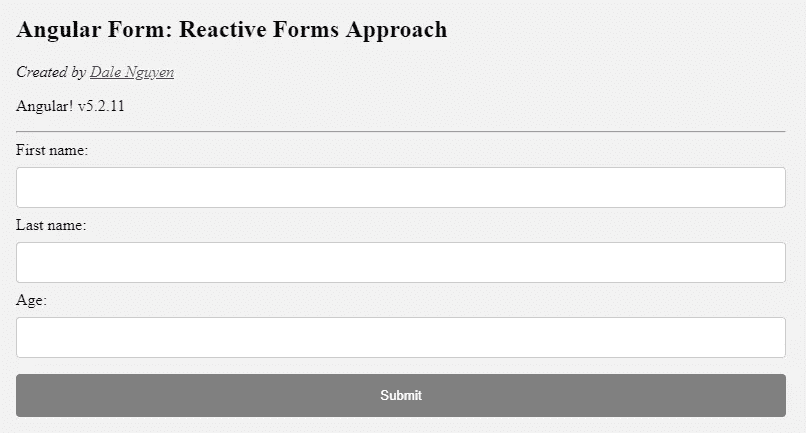

# 使用角度 2+形式:反应形式方法

> 原文：<https://itnext.io/working-with-angular-2-form-reactive-forms-approach-37e19a3af995?source=collection_archive---------4----------------------->



在上一篇文章中，我向你介绍了在 Angular 中使用表单时的[模板驱动方法](/working-with-angular-2-form-template-driven-approach-58182fc73150)。使用模板驱动方法的优点是它易于使用并且适合简单的场景。然而，对于更加灵活和复杂的情况，您可能希望实现反应式表单方法，以便通过您的组件对表单进行更多的控制。

对于这个示例项目，您可以在 https://next.plnkr.co/plunk/x47O6Cc4vJUnUEo8[的](https://next.plnkr.co/plunk/x47O6Cc4vJUnUEo8)处看到演示

首先，我们需要一个有角度的项目。您可以通过创建新项目或使用现有的 Angular 项目来实现这一点。

```
// Create a new project through angular cli
sudo npm install -g @angular/cli@latest
ng new Project_Name
```

1.  **进口反应式模块**

之后，您需要将 **ReactiveFormsModule** 导入到您的 **app.module.ts** 中

```
import { **FormsModule** } from '@angular/forms';
...@NgModule({
  declarations: [...],
  imports: [
    ...
    **ReactiveFormsModule**
  ],
})
```

2.**添加您的表单**

那么您的模板中应该有一个表单:

```
<form>
 First name: 
 <input 
   type="text"
   name="firstName"><br>Last name: 
 <input 
   type="text" 
   name="lastName"><br>Age:
 <input 
   type="number" 
   name="age"><br><input type="submit" value="Submit">
</form>
```

这只是一个简单的表格，收集你的名字，姓氏和年龄。

您可以随意设置样式，也可以使用这个临时 CSS

```
input[type=text], input[type=number], select {
    width: 100%;
    padding: 12px 20px;
    margin: 8px 0;
    display: inline-block;
    border: 1px solid #ccc;
    border-radius: 4px;
    box-sizing: border-box;
}input[type=submit] {
    width: 100%;
    background-color: #4CAF50;
    color: white;
    padding: 14px 20px;
    margin: 8px 0;
    border: none;
    border-radius: 4px;
    cursor: pointer;
}input[type=submit]:hover {
    background-color: #45a049;
}input[disabled][type=submit] {
    background:grey;
}div {
    border-radius: 5px;
    background-color: #f2f2f2;
    padding: 20px;
}
```

**3。** **应用反应式表单方法**

我们将从组件内部声明我们的

```
import { FormGroup, FormControl } from '[@angular/forms](http://twitter.com/angular/forms)';export class App { contactForm: FormGroup;
  constructor() {
    this.contactForm = new FormGroup({
      'firstName': new FormControl(''),
      'lastName': new FormControl(''),
      'age': new FormControl(''),
    })
  }

}
```

之后，我们将联系表单映射到我们的模板。

```
<form **[formGroup]="contactForm"**>
 First name: 
 <input 
   type="text" 
   name="firstName"
   **formControlName="firstName"**><br> Last name: 
 <input 
   type="text" 
   name="lastName"
   **formControlName="lastName"**><br>

 Age:
 <input 
   type="number" 
   name="age" 
   **formControlName="age"**><br>
 <input 
   type="submit" 
   value="Submit">
</form>
```

**4。控制表单提交**

我们需要组件中的一个函数来控制表单提交。表单值可以通过 **this.contactForm.value** 访问。

```
onSubmit() {    
 console.log(this.contactForm.value)
 // POST request or whatever
}
```

在你的模板里面

```
<form **(ngSubmit)="onSubmit()"** [formGroup]="contactForm">
```

**5。添加一些验证**

所有的验证都可以在组件内部完成。例如，这会将**所需的**规则添加到所有输入中。你可以从 [Angular.io](https://angular.io/api/forms/Validators) 中了解其他类型的验证器

```
import { FormGroup, FormControl, **Validators** } from '@angular/forms';...constructor() {
 this.contactForm = new FormGroup({
   'firstName': new FormControl('',  **[Validators.required]**),
   'lastName': new FormControl('',  **[Validators.required]**),
   'age': new FormControl('',  **[Validators.required]**),
 })
}
```

所以，如果用户没有填写所有的输入，表单将是无效的。通过检查有效性，您可以更好地控制表单。

```
<input 
  type="submit" 
  value="Submit" 
  **[disabled]="!contactForm.valid"**>
```

例如，如果表单无效，提交按钮将被禁用。

从现在开始，您知道了如何创建一个反应式表单，并能够向它添加一些验证。