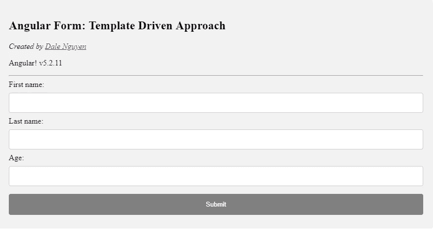

# 使用 Angular 2+表单:模板驱动方法

> 原文：<https://itnext.io/working-with-angular-2-form-template-driven-approach-58182fc73150?source=collection_archive---------7----------------------->



形式很重要，它是你的企业和客户之间的大门。在 Angular 2+中有很多方法来处理表单。今天我将向你展示如何使用模板驱动的方法来处理表单。

使用模板驱动方法的优点是它易于使用并且适合简单的场景。然而，对于更加灵活和复杂的情况，您可能希望实现[反应式表单方法](https://medium.com/@dalenguyen/working-with-angular-2-form-reactive-forms-approach-37e19a3af995),以便通过您的组件对表单进行更多的控制。

对于这个示例项目，您可以在 https://next.plnkr.co/plunk/2GJde72LCCKE2HyL[的](https://next.plnkr.co/plunk/2GJde72LCCKE2HyL)处看到演示

首先，我们需要一个有角度的项目。您可以通过创建新项目或使用现有的 Angular 项目来实现这一点。

```
// Create a new project through angular cli
sudo npm install -g @angular/cli@latest
ng new Project_Name
```

1.  **进口表格模块**

之后，您需要将**表单模块**导入到您的 **app.module.ts** 中

```
import { **FormsModule** } from '@angular/forms';
...@NgModule({
  declarations: [...],
  imports: [
    ...
    **FormsModule**
  ],
})
```

2.**添加您的表单**

那么您的模板中应该有一个表单:

```
<form>
 First name: 
 <input 
   type="text"
   name="firstName"><br>Last name: 
 <input 
   type="text" 
   name="lastName"><br>Age:
 <input 
   type="number" 
   name="age"><br> <input type="submit" value="Submit">
</form>
```

这只是一个简单的表格，收集你的名字，姓氏和年龄。

您可以随意设置样式，也可以使用这个临时 CSS

```
input[type=text], input[type=number], select {
    width: 100%;
    padding: 12px 20px;
    margin: 8px 0;
    display: inline-block;
    border: 1px solid #ccc;
    border-radius: 4px;
    box-sizing: border-box;
}input[type=submit] {
    width: 100%;
    background-color: #4CAF50;
    color: white;
    padding: 14px 20px;
    margin: 8px 0;
    border: none;
    border-radius: 4px;
    cursor: pointer;
}input[type=submit]:hover {
    background-color: #45a049;
}input[disabled][type=submit] {
    background:grey;
}div {
    border-radius: 5px;
    background-color: #f2f2f2;
    padding: 20px;
}
```

3.**应用模板驱动方法**

从现在开始，我们将利用 **ngForm** ， **ngModel** 来控制我们的表单。

```
<form (**ngSubmit)="onSubmit(f)"** **#f="ngForm"**>
 First name: 
 <input 
   type="text"
   name="firstName"
   **ngModel**><br>Last name: 
 <input 
   type="text" 
   name="lastName"
   **ngModel**><br>Age:
 <input 
   type="number" 
   name="age" 
   **ngModel**><br>
 <input type="submit" value="Submit">
</form>
```

**#f** 是导出的表单对象，我们将使用它来检索表单提交值。每个输入都有 **ngModel** 指令。我还通过使用 **ngSubmit** 将表单提交动作绑定到 **onSubmit()** 函数。

4.**控制你的提交**

在你的组件中，我们将创建 **onSubmit()** 函数来控制你的表单的行为。

```
export class App {

 **formValue: any;** **onSubmit(form: NgForm) {
    this.formValue = form.value;
    console.log(this.formValue);
    // Do whatever you want with form value
    // Could be a POST request or else
  }**
}
```

5.**添加一些验证**

在完成表单之前，您可以通过添加一些验证来对表单进行更多的控制。例如，名字、姓氏和年龄是必需的。年龄应该是正数。

```
<form (ngSubmit)="onSubmit(f)" #f="ngForm">
 First name: 
 <input 
   type="text" 
   name="firstName"
   ngModel
   **required**><br>Last name: 
 <input 
   type="text" 
   name="lastName"
   ngModel
   **required**><br>Age:
 <input 
   type="number" 
   name="age" 
   ngModel
   **required**
   **pattern="^[1-9]+[0-9]*$"**><br>
 <input 
   type="submit" 
   value="Submit" 
   **[disabled]="!f.valid"**>
</form>
```

如您所见，我向每个输入添加了 **required** 指令，以确保输入是必需的。并且**模式**将使用正则表达式只检查正数。

如果表单无效，我还会禁用提交按钮:**【禁用】= "！f.valid"**

你可以从 [Angular.io](https://angular.io/guide/form-validation) 了解更多关于验证的信息。