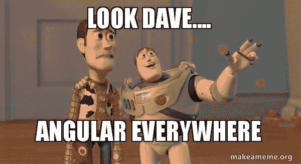

# 使用角度 5 模板参考变量

> 原文：<https://itnext.io/working-with-angular-5-template-reference-variable-e5aa59fb9af?source=collection_archive---------0----------------------->



模板引用变量通常是对模板中 DOM 元素的引用。它也可以是对角度组件或指令或 web 组件的引用(更多信息请访问 [Angular.io](https://angular.io/guide/template-syntax#ref-vars) )。这意味着您可以在模板中的任何地方轻松访问该变量。

使用散列符号(#)声明引用变量。 **#firstNameInput** 在`<input>`元素上声明了一个 **firstNameInput** 变量。

```
<input type="text" #firstNameInput><input type="text" #lastNameInput>
```

之后，您可以在模板内的任何地方访问该变量。例如，我将变量作为参数传递给事件。

```
<button (click)="show(lastNameInput)">Show</button>
```

请记住，lastNameInput 属于 HTMLInputElement 类型。

```
show(lastName: HTMLInputElement){
    console.log(lastName.value);
}
```

通常，引用变量只能在模板内部访问。但是，您可以使用 **ViewChild** decorator 在您的组件内部引用它。

```
import {ViewChild, ElementRef} from '[@angular/core](http://twitter.com/angular/core)';// Reference firstNameInput variable inside Component
[@ViewChild](http://twitter.com/ViewChild)('firstNameInput') nameInputRef: ElementRef;
```

之后，您可以在组件内部的任何地方使用***this . name input ref***。

```
show(lastName: HTMLInputElement){
  this.fullName = this.nameInputRef.nativeElement.value + ' ' + lastName.value;
}
```

**使用<ng-模板>工作**

在 ng-template 的例子中，有一点不同，因为每个模板都有自己的一组输入变量。例如:

```
// app.component.html
<ng-template #testingTemplate let-fullName="fullName"> <div>Full Name (template): {{fullName}}</div></ng-template><ng-container *ngTemplateOutlet="testingTemplate;**context:ctx**"></ng-container>
```

*   我们使用前缀 ***let-*** 来声明输入变量 ***全称***
*   这个变量 ***fullName*** 在 ***ng-template*** 里面可见，不在外面
*   为了访问 ***ng-template*** 中的变量，我们声明了上下文

```
// app.component.ts
export class AppComponent  { fullName: string;
   ctx = {fullName: ''}
   ... show(lastName: HTMLInputElement){
      this.fullName = this.nameInputRef.nativeElement.value + ' ' + lastName.value;
      **this.ctx.fullName = this.fullName;**
   }}
```

你可以在 Stackblitz 测试我简单的 [Angular 2+模板引用变量。](https://stackblitz.com/edit/angular-2-template-reference-variable)

[**在 Twitter 上关注我**](https://twitter.com/dale_nguyen) 了解 Angular、JavaScript & WebDevelopment 的最新内容👐