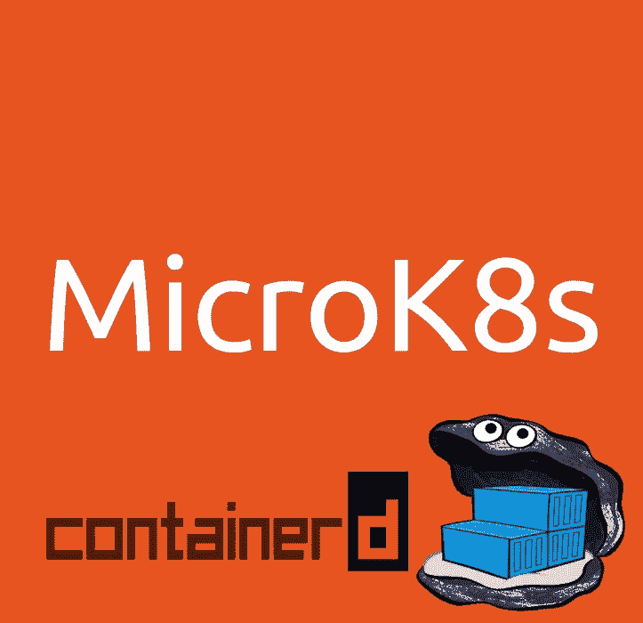

# 在 Kubernetes 中使用图像注册表和容器

> 原文：<https://itnext.io/working-with-image-registries-and-containerd-in-kubernetes-63c311b86368?source=collection_archive---------2----------------------->

Kubernetes 管理容器化的应用程序。容器映像可以在本地找到，也可以从远程注册中心获取。我们最近发布了 [MicroK8s](https://microk8s.io) ，并注意到我们的一些用户对配置带有图像注册表的 containerd 感到不舒服。在这篇博客中，我们将介绍一些大多数人都在遵循的工作流程。



## 你应该已经知道的

我们讨论如何使用本地图像，或者从配置了 containerd 的 [Kubernetes 中的公共和私有注册中心获取的图像。](https://kubernetes.io/blog/2018/05/24/kubernetes-containerd-integration-goes-ga/)

要获得这样一个集群，只需:

```
sudo snap install microk8s --classic
```

熟悉构建、推送和标记容器图像将会有所帮助。下面的例子使用 Docker，但是你也可以使用你喜欢的容器工具链。

要在 Ubuntu 18.04 上安装 Docker:

```
sudo apt-get install docker.io
```

将用户添加到 docker 组:

```
sudo usermod -aG docker ${USER}
```

使用更新的组成员身份为用户打开新的 shell:

```
su - ${USER}
```

我们将使用的`Dockerfile`是:

```
FROM nginx:alpine
```

要构建标记有`mynginx:local`的映像，转到`Dockerfile`所在的目录并运行:

```
docker build . -t mynginx:local
```

## 在没有注册表的情况下使用本地构建的映像

构建映像时，它被缓存在构建期间使用的 Docker 守护进程中。运行完`docker build . -t mynginx:local`命令后，您可以通过运行以下命令来查看新构建的映像:

```
docker images
```

这将列出 Docker 当前已知的图像，例如:

```
REPOSITORY          TAG                 IMAGE ID             SIZE
mynginx             local               0be75340bd9b         16.1MB
```

我们创造的形象为 Docker 所知。Kubernetes 不知道新构建的映像，因为您的本地 Docker 守护进程不是 MicroK8s Kubernetes 集群的一部分。我们可以从本地 Docker 守护进程导出构建的图像，并将其“注入”到 MicroK8s 图像缓存中，如下所示:

```
docker save mynginx > myimage.tar
microk8s.ctr -n k8s.io image import myimage.tar
```

注意，当我们将图像导入到 MicroK8s 时，我们是在 *k8s.io* 名称空间下进行的( *-n k8s.io* 参数)。

现在我们可以列出 MicroK8s 中存在的图像:

```
microk8s.ctr -n k8s.io images ls
```

此时我们准备用这张图片对`microk8s.kubectl apply -f`进行部署:

```
apiVersion: apps/v1
kind: Deployment
metadata:
  name: nginx-deployment
  labels:
    app: nginx
spec:
  selector:
    matchLabels:
      app: nginx
  template:
    metadata:
      labels:
        app: nginx
    spec:
      containers:
      - name: nginx
        image: mynginx:local
        ports:
        - containerPort: 80
```

我们用`image: mynginx:local`指代该图像。Kubernetes 将表现得好像 docker . io(docker hub 注册表)中已经有一个图像的缓存副本。请注意，containerd 不会缓存带有`latest`标签的图像，所以请确保不要使用该标签。

## 使用公共注册表

在用`docker build . -t mynginx:local`构建一个映像之后，它可以被推送到一个主流的公共注册中心。您需要创建一个帐户，并向注册服务提供商注册一个用户名。在这个例子中，我们用[https://hub.docker.com/](https://hub.docker.com/)创建了一个账户，我们以 *kjackal* 的身份登录。

首先，我们运行登录命令:

```
docker login
```

Docker 将要求输入 Docker ID 和密码来完成登录。

```
Login with your Docker ID to push and pull images from Docker Hub. If you don’t have a Docker ID, head over to [https://hub.docker.com](https://hub.docker.com) to create one.
Username: kjackal
Password: *******
```

推送到注册表要求图像用`your-hub-username/image-name:tag`标记。我们可以在构建期间添加适当的标记:

```
docker build . -t kjackal/mynginx:public
```

或者使用图像 ID 标记已经存在的图像。通过运行以下命令获取 ID:

```
docker images
```

输出中列出了 ID:

```
REPOSITORY          TAG                 IMAGE ID            SIZE
mynginx             local               0be75340bd9b        16.1MB
```

然后使用 tag 命令:

```
docker tag 0be75340bd9b kjackal/mynginx:public
```

既然图像已被正确标记，就可以将其推送到注册表中:

```
docker push kjackal/mynginx
```

此时我们准备用我们的形象对`microk8s.kubectl apply -f`进行一次部署:

```
apiVersion: apps/v1
kind: Deployment
metadata:
  name: nginx-deployment
  labels:
    app: nginx
spec:
  selector:
    matchLabels:
      app: nginx
  template:
    metadata:
      labels:
        app: nginx
    spec:
      containers:
      - name: nginx
        image: kjackal/mynginx:public
        ports:
        - containerPort: 80
```

我们将该图像称为`image:kjackal/mynginx:public`。Kubernetes 将在其默认注册表中搜索图像。

## 使用 MicroK8s 的注册表插件

拥有一个私人的 Docker 注册表可以减少上传和下载图片的时间，从而显著提高你的工作效率。MicroK8s 附带的注册表托管在 Kubernetes 集群中，并作为本地主机的端口 *32000* 上的*节点端口*服务公开。请注意，这是一个不安全的注册表，您可能需要采取额外的步骤来限制对它的访问。

您可以使用以下工具安装注册表:

```
microk8s.enable registry
```

附加注册表由声称用于存储图像的 *20Gi* 永久卷备份。为了满足这一要求，还启用了存储插件和注册表。

MicroK8s 使用的 containerd 守护进程被配置为信任这个不安全的注册表。要上传图片，我们必须在推送前给它们贴上`localhost:32000/your-mage`标签:

我们可以在构建期间添加适当的标记:

```
docker build . -t localhost:32000/mynginx:registry
```

或者使用图像 ID 标记已经存在的图像。通过运行以下命令获取 ID:

```
docker images
```

输出中列出了 ID:

```
REPOSITORY                TAG             IMAGE ID       SIZE
localhost:32000/mynginx   registry        0be75340bd9b   16.1MB
```

然后使用 tag 命令:

```
docker tag 0be75340bd9b localhost:32000/mynginx:registry
```

既然图像已被正确标记，就可以将其推送到注册表中:

```
docker push localhost:32000/mynginx
```

在 Docker 的某些版本中，推送这个不安全的注册表可能会失败，除非守护程序被明确配置为信任它。为了解决这个问题，我们需要编辑`/etc/docker/daemon.json`并添加:

```
{
 "insecure-registries" : ["localhost:32000"]
}
```

新配置应该通过 Docker 守护程序重启来加载:

```
sudo systemctl restart docker
```

此时，我们已经准备好使用我们的映像进行部署:

```
apiVersion: apps/v1
kind: Deployment
metadata:
  name: nginx-deployment
  labels:
    app: nginx
spec:
  selector:
    matchLabels:
      app: nginx
  template:
    metadata:
      labels:
        app: nginx
    spec:
      containers:
      - name: nginx
        image: localhost:32000/mynginx:registry
        ports:
        - containerPort: 80
```

**如果 MicroK8s 运行在虚拟机中会怎样？通常 MicroK8s 放在 VM 中，而开发过程在主机上进行。在这个设置中，将容器映像推送到 VM 中的注册表需要一些额外的配置。**

我们假设运行 MicroK8s 的 VM 的 IP 是 *10.141.241.175* 。当我们在主机上时，Docker 注册表是*而不是 *localhost:32000* 上的 *10.141.241.175:32000* 上的*。因此，我们需要做的第一件事是用正确的注册表端点标记我们在主机上构建的映像:

```
docker build . -t 10.141.241.175:32000/mynginx:registry
```

如果我们立即尝试推送 mynginx 映像，我们将会失败，因为本地 Docker 不信任 VM 中的注册表。如果我们尝试推送，会发生以下情况:

```
> docker push 10.141.241.175:32000/mynginx
The push refers to repository [10.141.241.175:32000/mynginx]
Get [https://10.141.241.175:32000/v2/](https://10.141.241.175:32000/v2/): http: server gave HTTP response to HTTPS client
```

我们需要明确地配置运行在主机上的 Docker 守护进程，以信任 VM 中不安全的注册表。在`/etc/docker/daemon.json`中添加注册表端点:

```
{
 "insecure-registries" : ["10.141.241.175:32000"]
}
```

然后重新启动主机上的 docker 守护程序来加载新的配置:

```
sudo systemctl restart docker
```

我们现在可以看到图片被上传。在推送期间，我们的 Docker 客户端指示主机内 Docker 守护程序将新构建的映像上传到由映像上的标签所标记的*端点。Docker 守护进程看到(在`/etc/docker/daemon.jason`上)它信任注册表，并继续上传图像。*

从虚拟机内部使用映像不涉及任何更改:

```
apiVersion: apps/v1
kind: Deployment
metadata:
  name: nginx-deployment
  labels:
    app: nginx
spec:
  selector:
    matchLabels:
      app: nginx
  template:
    metadata:
      labels:
        app: nginx
    spec:
      containers:
      - name: nginx
        image: localhost:32000/mynginx:registry
        ports:
        - containerPort: 80
```

我们用*localhost:32000/mynginx:registry*来引用这个映像，因为注册表在 VM 内部运行，所以它在 *localhost:32000* 上。

## 使用私有注册表

通常，组织都有自己的私有注册表，以帮助协作和加速开发。Kubernetes(以及 MicroK8s)在能够提取容器图像之前需要知道注册表端点。

**不安全注册表**
让我们假设私有不安全注册表位于端口 *32000* 上的 *10.141.241.175* 。我们构建的映像需要用注册表端点进行标记:

```
docker build . -t 10.141.241.175:32000/mynginx:registry
```

此时推送 *mynginx* 映像将会失败，因为本地 Docker 不信任私有的不安全注册表。用于构建映像的 docker 守护程序应该配置为信任私有的不安全注册表。这是通过在`/etc/docker/daemon.json`中标记注册表端点来完成的:

```
{
 "insecure-registries" : ["10.141.241.175:32000"]
}
```

重新启动主机上的 Docker 守护程序以加载新配置:

```
sudo systemctl restart docker
```

现在运行

```
docker push 10.141.241.175:32000/mynginx
```

…应该可以成功地将图像上传到注册表。

此时尝试在 MicroK8s 中提取图像将导致如下错误:

```
Warning Failed 1s (x2 over 16s) kubelet, jackal-vgn-fz11m Failed to pull image “10.141.241.175:32000/mynginx:registry”: rpc error: code = Unknown desc = failed to resolve image “10.141.241.175:32000/mynginx:registry”: no available registry endpoint: failed to do request: Head [https://10.141.241.175:32000/v2/mynginx/manifests/registry](https://10.141.241.175:32000/v2/mynginx/manifests/registry): http: server gave HTTP response to HTTPS client
```

我们需要编辑`/var/snap/microk8s/current/args/containerd-template.toml`，在*【插件】- >【插件. cri .注册表】- >【插件. cri .注册表.镜像】*下添加以下内容:

```
 [plugins.cri.registry.mirrors.”10.141.241.175:32000"]
     endpoint = [“[http://10.141.241.175:32000](http://10.141.241.175:32000)"]
```

看完整文件[这里](https://microk8s.io/docs/containerd-template.toml)。

重启 MicroK8s 以加载新的配置:

```
microk8s.stop
microk8s.start
```

该映像现在可以通过以下方式部署:

```
apiVersion: apps/v1
kind: Deployment
metadata:
  name: nginx-deployment
  labels:
    app: nginx
spec:
  selector:
    matchLabels:
      app: nginx
  template:
    metadata:
      labels:
        app: nginx
    spec:
      containers:
      - name: nginx
        image: 10.141.241.175:32000/mynginx:registry
        ports:
        - containerPort: 80
```

请注意，该图像引用了`10.141.241.175:32000/mynginx:registry`。

有很多方法可以设置一个私有的安全注册表，这可能会稍微改变你与它交互的方式。我们在这里提供两个关于如何与 Kubernetes 集成的提示，而不是深入每个设置的细节。

*   Kubernetes 官方文档描述了如何从 Docker 登录凭证中创建一个秘密，并使用它来访问安全注册表。为了实现这一点， *imagePullSecrets* 被用作容器规范的一部分。
*   MicroK8s *v1.14* 及更高版本使用 containerd。[如本文所述](https://github.com/containerd/cri/blob/master/docs/registry.md)配置容器涉及编辑`/var/snap/microk8s/current/args/containerd-template.toml`并通过*微 k8s.stop、微 k8s.start* 循环重新加载新配置。

## 进一步阅读

*   MicroK8s
*   [集装箱](https://containerd.io/)
*   [Kubernetes container d Integration 正式上市](https://kubernetes.io/blog/2018/05/24/kubernetes-containerd-integration-goes-ga/)
*   [测试不安全的注册表](https://docs.docker.com/registry/insecure/)
*   [配置容器](https://github.com/containerd/cri/blob/master/docs/registry.md)
*   [上游 Kubernetes 关于从私有注册中心提取图像的文档](https://kubernetes.io/docs/tasks/configure-pod-container/pull-image-private-registry/)