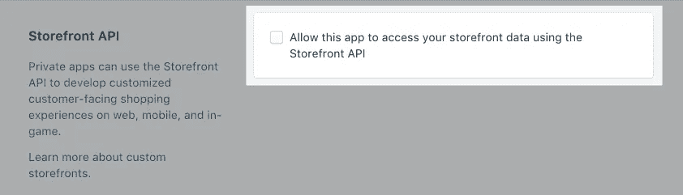
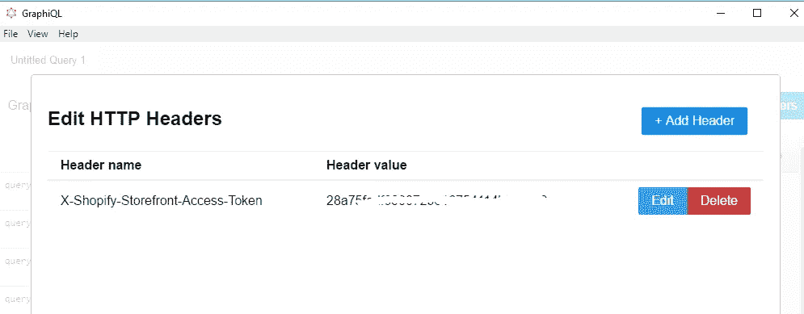
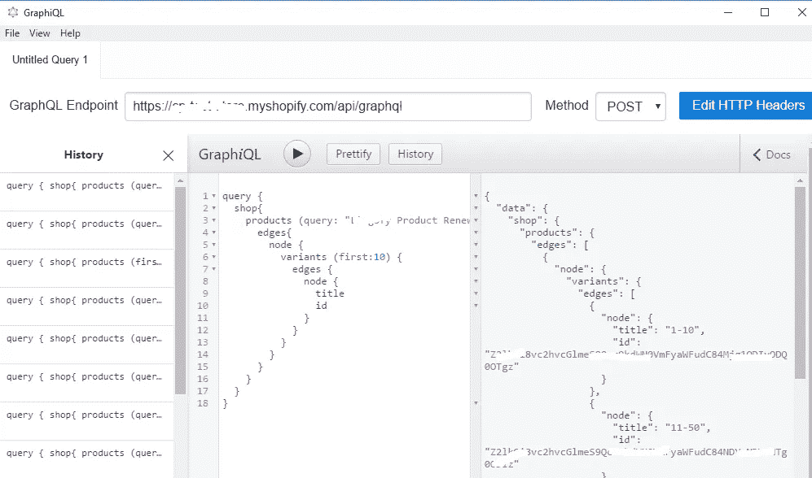

# 使用 Shopify store front API(graph QL+JavaScript)

> 原文：<https://itnext.io/working-with-shopify-storefront-api-graphql-javascript-c8ada0030451?source=collection_archive---------3----------------------->


根据 Shopify 的说法:*[*GraphQL 管理 API*](https://help.shopify.com/en/api/graphql-admin-api) *让你使用 graph QL 为 Shopify 管理构建应用和其他集成。借助该 API，您可以创建应用程序，在商店运营的每个阶段提供功能，包括发货、履行和产品管理。**

*虽然它仍然是一个测试版，但你可以利用这种新的方法将 Shopify 集成到你的应用程序中。在这篇文章中，我将展示一些在普通 JavaScript 中使用 Storefront API 的例子。*

*开始之前，您需要获得一些信息:*

1.  ***graph QL 端点***

*`https://my-store-name.myshopify.com/admin/api/graphql`*

*2.**获取店面访问令牌***

*您需要在商店内创建一个私有应用程序，并允许该应用程序使用 Storefront API 访问您的 storefront 数据*

**

**图片来自 Shopify**

*3.**测试您的店面 API GraphQL 端点***

*最好使用[GraphQL 应用](https://github.com/skevy/graphiql-app)来测试 graph QL。在我们把它应用到实际应用之前，要确保一切正常。*

**

*添加访问令牌头*

**

*Shopify 查询测试*

*4.**使用 JavaScript 和 Storefront API GraphQL***

*有很多方法我们可以使用，你可以在 [Shopify](https://help.shopify.com/en/api/custom-storefronts/storefront-api/getting-started#using-graphiql) 上看看。在这个例子中，我将使用 JavaScript 创建一个结帐 URL。*

*首先我们需要创造一个突变:*

```
*let mutation = `
      mutation {
        checkoutCreate(input: {
          email: "dale@dalenguyen.me"
          lineItems: [
            {
              quantity: 1
              variantId: "variant-id"
              customAttributes: {
                key: "key"
                value: "value"
              }
            }
          ]
          shippingAddress: {
            address1: "address"
            city: "Toronto"
            province: "ON"
            zip: "zip"
            country: "Canada"
            firstName: "Dale"
            lastName: "Nguyen"
          }
        }){
          checkout{
            webUrl
          }
        }
      }
    `;*
```

*然后我们通过 GraphQL 发送变异*

```
*let settings = {
    'async': true,
    'crossDomain': true,
    'url': 'https://my-store-name.myshopify.com/api/graphql',
    'method': 'POST',
    'headers': {
        'X-Shopify-Storefront-Access-Token': 'your-access-token',
        **'Content-Type': 'application/graphql',**
    },
    'data': **mutation**
};// Get checkout URL from shopify
return $.ajax(settings).done(function (response) {
    console.log(response);
});*
```

*发送突变后，您将在控制台日志中检查 URL。你可以用这个网址做任何事情。*

*从这个例子中，您知道通过在应用程序中使用 JavaScript 来发送 AJAX 请求。*

*希望这有所帮助；)*