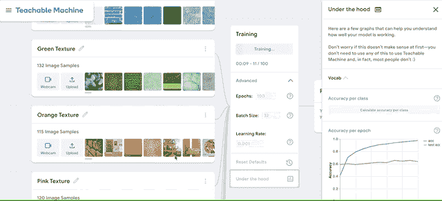
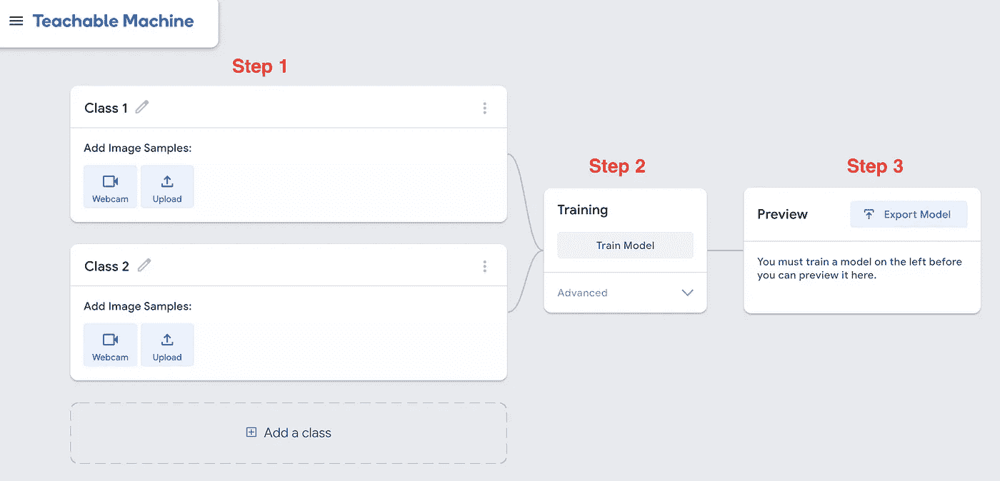
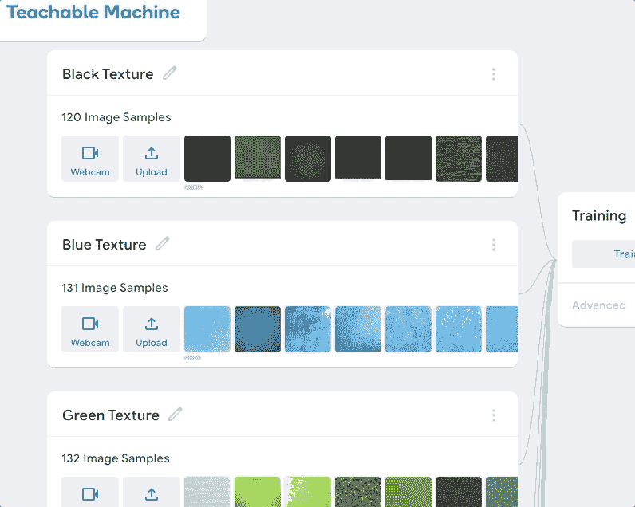
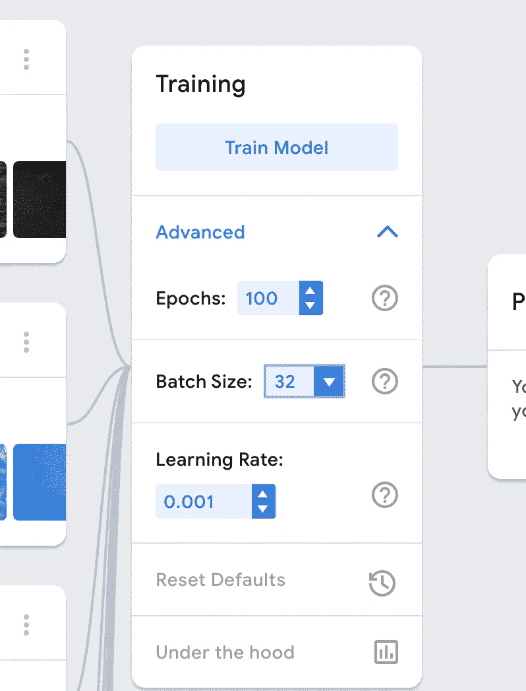
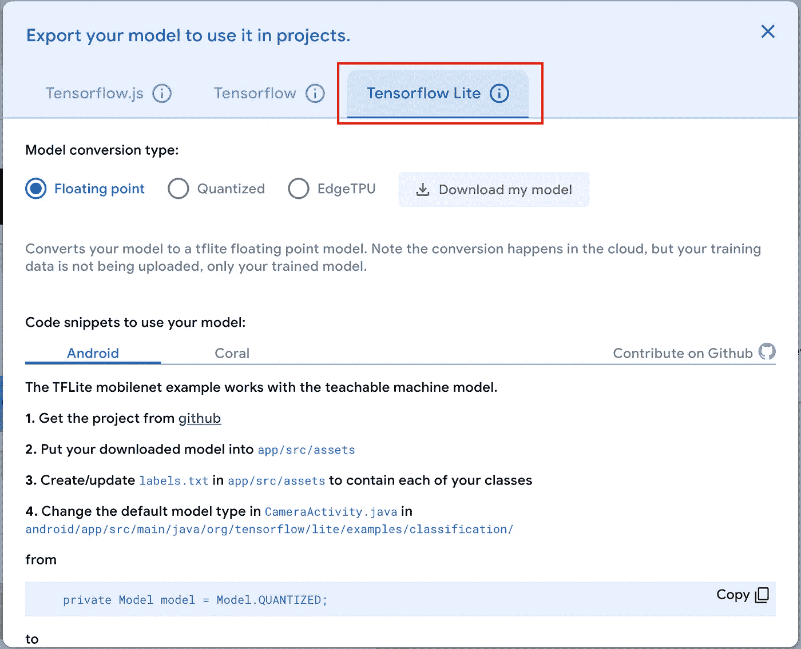
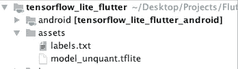
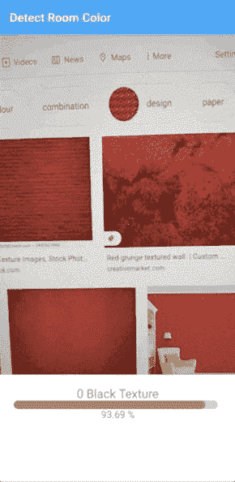

# 在 Flutter 中使用 TensorFlow Lite

> 原文：<https://itnext.io/working-with-tensorflow-lite-in-flutter-f00d733a09c3?source=collection_archive---------0----------------------->



带可教机器的训练模型

自从我听说了 TensorFlow Lite 之后，我就想开发一个应用程序来测试机器学习模型在 Android 设备上的能力。最初，我尝试了 Tensorflow 网站上不同的[预训练模型](https://www.tensorflow.org/lite/models)，甚至开始创建自己的定制模型，但由于缺乏这方面的经验，我无法让它工作。要学习在张量流中创建机器学习模型，我还有很长的路要走。

# 幸运的是，我们有可教的机器！

这是谷歌提供的最好的东西，以鼓励机器学习爱好者快速训练他们的模型，并在他们的应用程序中试用。在写这篇文章的时候，他们支持三种类型的模型的训练:

1.  形象工程
2.  音频项目
3.  姿态

目前，我们只能处理[分类](https://www.simplilearn.com/classification-machine-learning-tutorial)问题。

更多的即将到来。对于我的颤振项目，我选择了[图像项目](https://teachablemachine.withgoogle.com/train/image)。

您可以通过此[链接](https://teachablemachine.withgoogle.com/)了解更多关于可示教机器的信息。

# 太好了，那么我怎样才能用可教的机器来训练一个模型呢？

这很简单，你只需要知道你希望你的应用程序做什么，然后下一步就是收集数据让机器学习。收集数据可能很难，这完全取决于你试图解决的问题的类型。一旦你收集了你的数据并把它们安排在不同的班级，下一步就是把这些数据提供给可教的机器进行训练。我们可以很容易地从 pc 或 Gdrive 上传我们的批量数据，并给这个类一个名字。您将赋予一个类的名称将是您的应用程序中分类数据的标签。



对于我的应用程序，我专注于一个简单的问题，即检测墙壁的颜色。我收集了将近 1700 张图片，并把它们分成 9 类。我本来可以收集更多的数据，但是对于这种类型的应用程序，这已经足够了。



提供数据后，我开始第二步，即训练。然后，我为训练数据设置配置，如下图所示。



培训完成得非常快，我能够在几分钟内导出模型。



# 下一步，扑！

所以，现在是下一步，在 Flutter 应用程序中使用这个模型。谷歌还没有官方的 TensorFlow Lite 包，但有一个维护良好的可用包。我在我的项目中使用了这个包 [tflite](https://pub.dev/packages/tflite) 。

我们首先在 pubspec 文件中添加这个包:

```
dependencies:
  tflite: ^1.0.5
```

下一步是在资产文件夹中添加模型并更新 pubspec 文件:

```
flutter:
  assets:
    - assets/model_unquant.tflite
    - assets/labels.txt
```



然后我们加载模型:

```
static Future<String> loadModel() async{ return Tflite.loadModel(
    model: "assets/model_unquant.tflite",
    labels: "assets/labels.txt",
  );
}void initState() {
  super.initState(); //Load TFLite Model
  TFLiteHelper.loadModel().then((value) {
    setState(() {
      modelLoaded = true;
    });
  });
}
```

加载模型后，我们可以使用相机控制器的输出来为 TensorFlow lite 提供帧。

```
await Tflite.runModelOnFrame(
        bytesList: image.planes.map((plane) {
          return plane.bytes;
        }).toList(),
        numResults: 5)
    .then((value) { if (value.isNotEmpty) {
     //Do something with the results
  }});
```

这是应用程序的输出:



如您所见，在相机的每一帧上，TensorFlow lite 都在分类并提供多种结果。我们可以考虑最有把握的结果。

# 结论:

Flutter 与 Tensorflow Lite 配合使用效果非常好，我们可以立即制作许多不同类型的应用程序，并测试它们作为我们的概念验证，所需要的只是一个想法和训练数据。这种类型的方法最适合于那些不想弄脏 TensorFlow 平台的人，他们使用 Python 代码并陷入最终将训练好的模型转换为 tflite 类型的所有麻烦中，Teachable Machine 将为您完成所有这些工作，以便您可以专注于应用程序。

# 源代码:

你可以在我的 [Github](https://github.com/umair13adil/tensorflow_lite_flutter) 库上查看源代码。

【https://github.com/umair13adil/tensorflow_lite_flutter 

谢谢你。