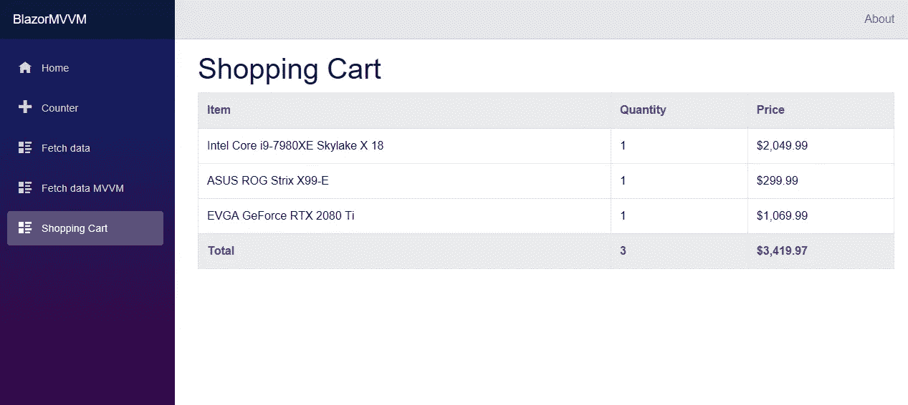

# 在 Blazor MVVM 中使用视图:函数{} vs 代码隐藏 vs 视图模型

> 原文：<https://itnext.io/working-with-the-view-in-blazor-mvvm-functions-vs-code-behind-vs-viewmodel-ed3508dba86a?source=collection_archive---------0----------------------->


这是关于在客户端 Blazor 中使用模型-视图-视图模型模式的一种方法的系列文章的第五篇。如果您想从头开始阅读该系列，第一篇文章位于此处:

[](/a-simple-mvvm-implementation-in-client-side-blazor-8c875c365435) [## 客户端 Blazor 中一个简单的 MVVM 实现。

### 如前所述，我正致力于将我的生产 Silverlight 应用程序迁移到一个新的平台上。我的…

itnext.io](/a-simple-mvvm-implementation-in-client-side-blazor-8c875c365435) 

本系列的所有源代码都可以在 GitHub 上获得。代表本文起点的代码包含在 ArticleFour 分支和 4.4 版本中。本文结尾的代码将成为 ArticleFive 分支和 4.5 版本。所有代码和文章都已更新，可以使用。网芯 3 预览版 4。

[](https://github.com/lchendricks/BlazorMVVM) [## lchendrick s/blazormvm

### 一个客户端 Blazor MVVM 实现。通过在…上创建帐户，为 lchendricks/BlazorMVVM 的开发做出贡献

github.com](https://github.com/lchendricks/BlazorMVVM) 

# 我们为什么要这么做？

自从我开始与 Blazor 合作并开始使用 MVVM 构建客户端应用程序以来，我已经不止一次地遇到了几个问题。这些问题是:

*   如何让我的代码离开我的视图？
*   当我可以在视图中做任何事情时，为什么我还需要一个视图模型？
*   为什么我的 Blazor 应用程序需要 MVVM？

最后一个问题可能是最容易回答的。真正简短的答案是“你的应用可能不需要 MVVM”。MVVM(或任何设计模式)的使用是视情况而定的，目标是降低应用程序的复杂性。如果在用 UI 显示数据之前没有转换模型中的任何数据，并且没有在应用程序的多个部分显示相同的数据，那么您可能没有一个好的 MVVM 用例。MVVM 允许你把你的应用程序分解成更小的类，并有明确的职责。如果你的班级在开始的时候已经很小了，而且只有一个单一的责任，那么再把他们分开是没有任何好处的。

也就是说，如果你的代码是合理设计的，你可以从没有 MVVM 开始，然后用重构引入它。可以做所有事情的单个视图可以被重构为视图和视图模型。该视图模型可以在以后被重构为视图模型和模型。如果您从一开始就关注了这一系列的文章，您会看到我们从 FetchData.razor 开始，并在四篇文章中从一开始的单一视图重构到有多个孩子的完整 MVVM。

# @functions{}块

我目前对`@functions{}`百感交集。一方面，我觉得视图中不应该有任何代码；应该是 UI 标记。另一方面，我记不清在过去的 20 年中有多少次我在研究页面的行为时，意识到我只是在查看视图模型，而需要去查看后面的代码。Blazor 仍在预览中，所以暂时我将推迟就此事做出个人决定，并展示与视图交互的两种方式。然而，我要说的是，清楚地理解一些代码应该是视图的一部分，而其他代码属于视图模型是很重要的。

为了查看后面的代码，我们将开始构建购物车的结构。这应该为我们提供了一些在视图和视图模型中使用代码的有效例子。开始时，我们需要将物品放入购物车，因此转到`BlazorMVVM.Shared`项目并添加一个新类`InventoryItem.cs`。用以下代码填充该类:

虽然数量不多，但对于我们的示例来说已经足够了。接下来，我们将制作一个视图模型。为了证明我之前的观点，我不打算做一个单独的模型，只是把所有东西都放在这里。当我们准备好以后，我们可以重构并提取模型到它自己的类中。创建一个新的类`ShoppingCartViewModel.cs`并将下面的代码放入其中。

您可以看到，我们构建了一个类，并声明了必要的接口来使用它。我们在类中放了一个`List<InventoryItem>`，并使用属性`Cart`来访问它。我们还在类中添加了三个方法；一个用于向购物车添加商品，一个用于合计数量和价格，最后一个用于以我的本地货币显示价格(向世界其他地方道歉)。

创建 ViewModel 后，我们可以在`Startup.cs`中用每个人现在都应该习惯的语法注册它:

```
services.AddTransient<IShoppingCartViewModel, ShoppingCartViewModel>();
```

最后一步是创建一个视图来绑定和显示我们的购物车。创建一个名为`ShoppingCart.razor`的新视图，并粘贴以下代码:

最后，转到`NavMenu.razor`并添加一个新部分，让我们可以导航到我们的购物车。

有了所有这些，我们可以启动我们的应用程序并查看我们的购物车，但实际上没有什么可看的。让我们添加一个`OnInit()`调用到我们的视图中，当页面加载时，这个调用将条目加载到我们的卡片中。我们可以假设这模拟了一个用户带着购物车中的商品离开后回到我们的站点。将此`@functions`块添加到视图底部。

如果我们现在启动我们的应用程序，并导航到我们的购物车，我们将看到几个项目以及总数:



# 移到代码后面

现在假设设计决策是使用代码隐藏，而不是在视图中使用`@function`块。这不是很多工作。基本思想是我们创建一个继承自`ComponentBase`的类，然后让视图继承该类。视图可用的所有内容都可以在该类中访问。

首先进入我们的视图文件夹，添加一个新的类`ShoppingCart.razor.cs`。Visual Studio 将会有所帮助，并将代码嵌套在视图下。我们将有一个与`ShoppingCart`冲突的类名称，进入新类并将其重命名为`ShoppingCartBase`，并使其继承自`ComponentBase`。连接了后面的代码后，我们可以返回视图，让它继承后面的代码。

```
@inherits ShoppingCartBase
```

有了这些，我们就可以开始将代码从视图中移植到后面的代码中了。首先从视图中删除所有三个 using 指令，并将它们放在代码的顶部。接下来，删除页面顶部的 inject 指令，并将其放入后面的代码中。到目前为止，新代码看起来与我们在类中进行的构造函数注入不同。

```
[Inject]public IShoppingCartViewModel ViewModel { get; set; }
```

当我们在 razor 视图中使用`@inject`时，很难意识到这一点，但我们实际上一直在为视图进行属性注入，而不是构造函数注入。这行代码让我们使用属性注入将 ViewModel 传递到后面的代码中。

最后一步是从我们的`@functions`中移除`OnInit()`方法，并把它放在我们的类后代码中。然后，我们可以从视图中删除该空块。在改变了我们周围的一切之后，现在看起来是这样的:

后面的代码是这样的:

如果我们再次启动应用程序，我们会看到一切仍然正常，我们有一个单独的视图、代码隐藏和视图模型。

# 代码隐藏与视图模型

所以我们现在有两个不同的类来保存影响我们视图的代码。我们什么时候把代码放在代码后面，什么时候把代码放在视图模型中？

目前，我觉得我们需要使用代码的唯一原因是为了访问视图的生命周期方法。MVVM 的每一层都不知道它上面的那一层。模型不知道它被注入的视图模型的任何信息，视图模型也不知道视图的任何信息。如果你需要挂钩到`OnInit`、`OnParametersSet`、`OnAfterRender`或者如果你要调用`BuildRenderTree`，你将在后面的代码中工作。

如果要格式化数据，可能需要在视图模型中进行。回到 ViewModel，看看`DisplayPrice()`方法。我们可以像放入 ViewModel 一样容易地将这段代码放入后面的代码中。然而，如果我们构建一个新的视图并将我们的视图模型绑定到它，而该方法已经在它后面的代码中，那么它将不可用。如果我们走这条路，我们将不得不在新视图中再次复制我们的代码。有了 ViewModel 中的这个函数，我们每次在整个系统中使用 ViewModel 时都可以访问它。

我觉得将视图绑定到视图模型的正确方法是尽一切可能在 razor 文件中进行绑定。如果你需要使用`@functions`或者后面的代码，试着让它成为一个方法调用来保持分离级别不变。

# 包扎

到目前为止，您应该对何时以及如何使用`@functions`、代码隐藏和视图模型有了一些好的想法。我要再说一遍，设计模式是指南，做一件事总有不止一种方法。利用这些信息来构建比我们今天所学的例子更好的东西。

在下一篇文章中，我们计划将多个组件添加到我们的购物车中，并在使用客户端 Blazor 的 MVVM 时，检查一个视图中多个组件的行为。