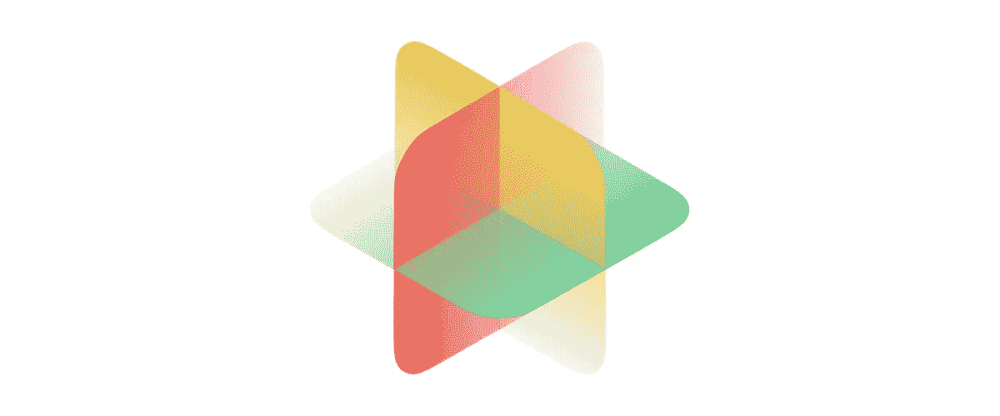

# 世界上第一个用于 React、Vue & Plain HTML & CSS 的可组合 CSS 动画工具包——anim XYZ

> 原文：<https://itnext.io/worlds-first-composable-css-animation-toolkit-for-react-vue-plain-html-css-animxyz-1cd0b8229da1?source=collection_archive---------3----------------------->



# 什么是 AnimXYZ？

AnimXYZ 是一个 CSS 动画库，用于为您的网站创建自定义 CSS 动画。AnimXYZ 的优秀之处在于它是可组合的，这意味着你可以组合不同的动画来创建你自己的高度可定制的 CSS 动画，而无需编写一个关键帧，正如 AnimXYZ 的创造者所说

> “制作一部动画就像用文字描述一样简单”

例如，您可以通过编写`xyz="fade big up"`来创建一个动画，该动画可以随着 AnimXYZ 淡入淡出、放大和上移。AnimXYZ 也有一个小的封装尺寸`2.68kB`用于基本功能和`11.4kb`，如果你包括方便的工具。


逐渐变大

# 可定制性

AnimXYZ 由 CSS 变量驱动，AnimXYZ 允许你覆盖任何 CSS 变量来进一步定制/控制动画和几乎无限数量的定制动画。您可以编辑一个 AnimXYZ CSS 变量，方法是在 CSS 中选择带有`xyz`属性的元素，然后像这样更改一个已定义的 AnimXYZ 变量的值

```
.my-class-name {
  --xyz-opacity: 0.5;
}
```

所有 AnimXYZ 变量的开头都带有 XYZ 前缀，然后通常是 CSS 属性名，这将影响到有变量用于`in`、`out` & `overall` ( `in`和`out`)`--xyz-opacity`是一个`overall`变量。有很多已定义的变量要了解更多关于它们的信息 [*点击这里*](https://AnimXYZ.com/docs/#variables) *。*

# 嵌套动画

AnimXYZ 支持嵌套动画，如果我们将多个元素包装在我们的动画元素(带有`xyz`属性的元素)中，这允许我们制作多个元素的动画。嵌套动画看起来像这样。

```
<div class="my-class-name" xyz="fade">
  <div class="xyz-in">Hello</div>
  <div class="xyz-in">Hello</div>
  <div class="xyz-in">Hello</div>
</div>
```

这将使所有被包裹的元素同时被`.my-name-element`淡入。


嵌套动画

# 交错动画

如果我们不希望嵌套动画同时发生，我们很幸运，因为 AnimXYZ 也支持交错动画，这意味着如果我们有一个嵌套动画，我们可以让每个元素一个接一个地到达/离开。我们可以通过将`stagger`添加到`xyz`属性来做到这一点。这将使动画从左到右交错。我们也可以通过使用`stagger-rev`来反转交错，因此它现在将从右到左交错。


交错动画

## 链接

*   [](https://AnimXYZ.com)**—了解更多关于* AnimXYZ 的信息*
*   *[*AnimXYZ 文档*](https://AnimXYZ.com/docs/)*——开始使用* AnimXYZ*
*   *[milesingram . me](https://milesingram.me/)——anim XYZ 的创作者之一*