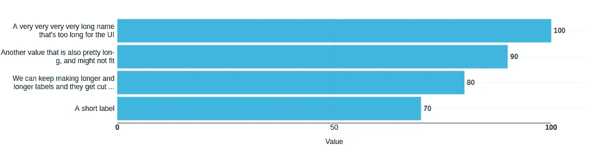
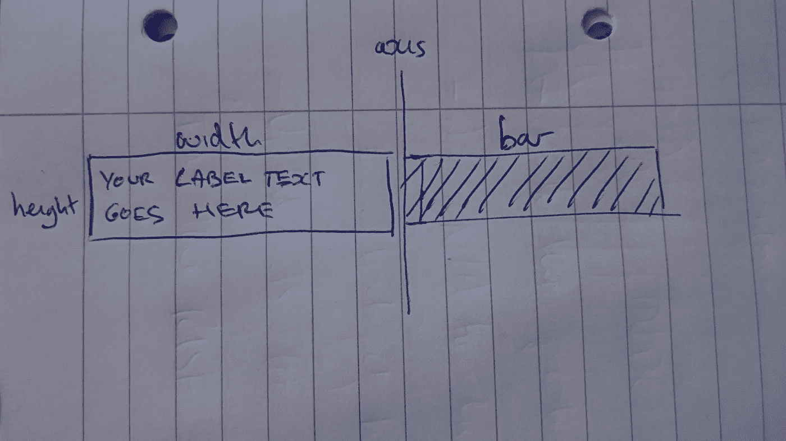
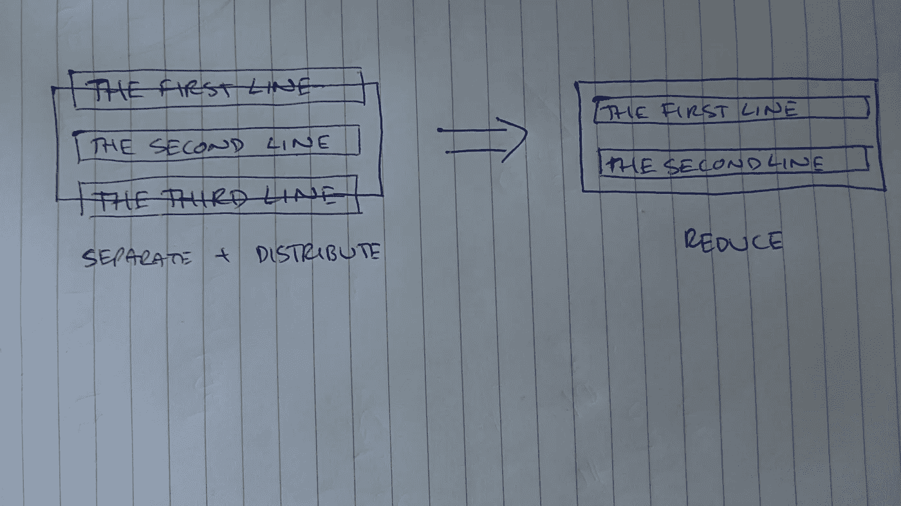
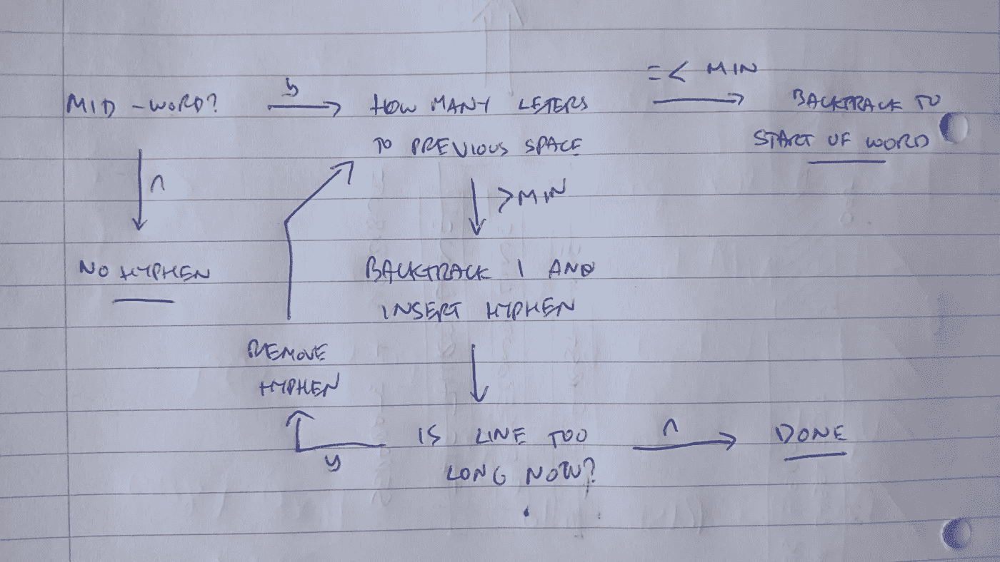

# 在 NVD3 水平条形图中换行和截断图表标签

> 原文：<https://itnext.io/wrapping-and-truncating-chart-labels-in-nvd3-horizontal-bar-charts-b5867a7775e6?source=collection_archive---------4----------------------->



我的数据中有一些非常非常非常非常长的图表标签

如果你的水平条形图标签对于你的左边距来说太长，默认情况下，在 NVD3 中标签会溢出空间，消失在左边，这很烦人，看起来也不专业。在这些图表中，垂直轴标签的空间非常宝贵，因此要做好工作，仅实现单词级换行是不够的，我们需要合并断字换行和标签截断。

这些标签的空间有限的原因之一是试图让你的水平条围绕一个文本行的高度。在这种情况下，标签包装并不能拯救你(虽然截断可以)。我建议在处理具有长标签的数据时，你也可以考虑增加条形的粗细来适应，我认为这样做的好处是可以得到更好看、更用户友好的图表。

这篇文章描述了一种算法，可以用于 NVD3，实际上是任何基于 SVG 的显示，获取一个长字符串，包装它(如果需要，使用连字符)并在空间用完时截断它。

(注意 [Mike Bostock 有一个包装解决方案](https://bl.ocks.org/mbostock/7555321),虽然它在单词级包装，不截断；下面的算法使用了类似的概念和扩展。在 NVD3 中，离散条形图上还有一个`wrapLabels:true`选项(我假设使用了 Mike 的解决方案)，但在水平多条条形图上没有

# 该方法

在我们进入代码之前，让我们考虑一下我们将要采取的整体方法。

我们可以从将最大数量的文本放入一个具有一定宽度和高度的框中的角度来考虑这个问题。该框中到底能容纳多少文本取决于文本大小、行高，以及(如果使用可变宽度的字体)具体包含哪些字母。



我们可以在一个框中放多少文字，也就是你的边距宽度和你的栏高度？

我们可以通过分别攻击横向和纵向来解决问题:

首先， ***将文本分成几行*** 以适应水平方向的可用空间。第二， ***垂直分布*** 文本(即把所有的行按顺序一行一行地放在另一行上面)，并确定它们是否适合这个框。最后， ***减少*** 文本行的数量，直到那些行仍然适合这个框。



垂直溢出的文本需要减少，直到适合可用空间

为了最大限度地利用有限的空间，我们想要包括的一个关键细节是尽可能地用连字符连接单词。不幸的是，断字看起来并不总是正确的——例如，你不想在单词的第一个或两个字母后断字。此外，断字在文本中引入了一个新字符，这需要在宽度计算中加以考虑，所以你不能只是在一行的末尾加上一个连字符来打断一个单词。

下面是一个流程图，定义了一个可行的、水平间距最大化的断字规则:



一种以相当用户友好的方式用连字符连接单词的算法

它是这样工作的:在我们的水平空格的末端，如果我们发现自己在一个单词的中间，找出它是多少个字母回到前一个单词的分隔符。如果到单词 break 的距离小于某个最小限制，那么我们不尝试断字，我们只是回溯到单词的开头并在那里断开。这防止我们做像“m-e”或“yo-u”这样看起来很奇怪的事情。我们会将最小值设置为 3 左右。

另一方面，如果到单词 break 的距离大于这个最小值，那么我们应该尝试使用连字符。我们这样做是通过回溯一个字母，然后添加一个连字符。现在我们需要检查这一行是否仍然水平合适，以防连字符比它所替换的字母更宽。

如果这条线合适，我们就完成了！否则，我们删除连字符，并保持回溯+连字符，直到该行适合所提供的空间。如果我们到达单词开头剩余的字母数低于最小值的点，我们就在单词边界换行。

这个算法是我发现的最简单的断字策略，它为高度受限的空间提供了合理的结果。在现实中，断字是复杂的，在排版中甚至有关于在哪里划分不同种类的单词的规则(比如，在音节边界)，这对我们来说太复杂了。还有，我们的算法只考虑单词的开头看起来对不对，不关心单词的结尾。因此，我们可以看到像“long-g”或“joi-n”这样的包装，开始很好，但结束很奇怪。我们将暂时忽略这一点，因为修复它会降低水平空间的使用效率。

# 代码

完整的功能可以在这篇文章的底部找到。我们将逐步介绍重要的部分，这样您就可以看到它是如何工作的。

我们将把它作为一个单独的函数来做，在它里面定义了其他函数。我们将传入一堆定义环境的参数(闭包)。

```
function wrapLabels(params) {
    var axisSelector = params.axisSelector;
    var maxWidth = params.maxWidth;
    var maxHeight = params.maxHeight;
    var lineHeight = params.lineHeight || 1.2;
    var wordBreaks = params.wordBreaks || [" ", "\t"];
    var minChunkSize = params.minChunkSize || 3; // implementation goes here
}
```

*   **axisSelector** —一个选择器字符串，d3 可以使用它来选择我们要包装标签的轴。
*   **maxWidth** —文本框需要容纳的最大宽度。这可能等于你给条形图的左边距
*   **maxHeight** —文本框需要容纳的最大高度。这可能等于钢筋的厚度
*   **行高** —您想要使用的行高，它定义了文本行之间所需的间距
*   **断字符** —你认为是单词间断点的字符列表。我们在这里默认为空格和制表符。
*   **minChunkSize** —断词时连字符前允许的最小字母数。

一旦我们以通常的方式使用 NVD3 绘制了图表，我们就可以应用包装作为后期渲染修改。为此，我们需要获取每个轴标签并对其执行转换。我们将完全按照上面的描述来分解算法:分离、分布、减少:

```
d3.selectAll(axisSelector + " .tick text").each(function(i, e) {
    var text = d3.select(this);
    var tspans = *separate*(text);
    do {
        *distribute*(text, tspans);
    }
    while (*reduce*(text, tspans))
});
```

我们获取每个标签的文本，并使用我们的*单独的*函数将其转换成一个`tspan`对象列表。然后我们*垂直分布*这些`tspans`，然后应用 *reduce* 函数，如果我们缩小了文本，则返回`true`，如果文本现在合适，则返回`false`。

## 不同的

分隔文本是最复杂的功能，因为它涉及到连字符。

我们正在定义一个函数，它采用轴标签的`text`节点:

```
function separate(text) { ... }
```

首先，我们获取文本内容作为一个字符数组，然后用一个`tspan`替换文本内容，我们可以用它来检查文本宽度:

```
var chars = text.text().trim().split("");
text.text(null);
var x = text.attr("x");
var tspan = text.append("tspan").attr("x", x).attr("y", 0);
```

现在我们要遍历这个`chars`数组，构建每一行，直到它填满，并应用我们的断字算法:

```
var lines = [];
var currentLine = [];while (chars.length > 0) {
    var char = chars.shift();
    ...
}
```

我们创建了两个注册表——一个记录`lines`的列表，另一个记录`currentLine`的进度。然后我们执行一个循环，直到`chars`数组为空。我们不能通过`chars`数组进行 for-each，因为我们将在该数组中向前和向后跟踪，所以我们不必每次迭代只消耗一个字符。然后，我们的第一个动作是从数组前面删除第一个字符。

下一步很简单，只需将第一个`char`添加到`currentLine`中，并将`currentLine`放入`tspan`中:

```
currentLine.push(char);
tspan.text(currentLine.join(""));
```

现在我们检查该行是否合适，如果不合适，就调整它并处理断字。我们将看看整个事情，然后在下面讨论它:

```
var maxed = false;
var hyphenated = false;
while(_isTooLong(tspan)) {
    maxed = true; if (hyphenated) {
        currentLine.splice(currentLine.length - 1);
        hyphenated = false;
    } _backtrack(1, currentLine, chars); if (_isMidWord(currentLine, chars)) {
        var toPrevSpace = _toPrevSpace(currentLine); if (toPrevSpace === -1 || toPrevSpace - 1 > minChunkSize) {
            _backtrack(1, currentLine, chars);
            currentLine.push("-");
            hyphenated = true;
        } else {
            _backtrack(toPrevSpace, currentLine, chars);
        }
    } currentLine = currentLine.join("").trim().split("");
    tspan.text(currentLine.join(""));
}
```

我们从一个问题开始:这条线是不是太长了？如果不是，这些代码都不会执行，并且继续消耗`chars`数组，直到行*变得*过长。

暂时忽略`maxed`和`hyphenated`，接下来发生的事情是我们**回溯** 1 字符。这将从`currentLine`中删除最后一个字符，并将其放回`chars`。

现在我们问另一个问题:我们正处于一个词的中间吗？如果没有，则更新`currentLine`和`tspan`(在循环的最后两行中)，然后循环将在下一次迭代时终止，因为该行不再太长。如果我们不想用连字符连接，这就足够了——我们会用我们的`chars`数组中的字符填充整行。

如果我们*在一个单词的中间*，那么应用我们的断字算法:首先计算出它离前面的空格有多远。如果我们在找到空格之前到达文本的开头，这可能是`-1`，或者如果我们找到空格，这可能是某个数字。

如果这个数字小于我们的`minChunkSize`，我们将不使用连字符(否则我们会以类似“m-e”的文本结束)，所以我们**回溯**到单词的开头并在那里结束。

否则，我们**回溯** 1 字符，插入“-”并继续，注意我们将绊网`hyphenated`设置为`true`。这将在循环的下一次迭代中发挥作用。如果我们将`hyphenated`设置为`true`开始循环，那么我们要做的第一件事就是在继续之前删除最后一个字符(连字符)。这处理了连字符比它所替换的字符更宽的可能性，并允许我们回溯尽可能多的字母，以使行适合于`tspan`。

这完全实现了我们上面的断字算法。除了`_isTooLong`之外，我不会详细介绍这里使用的其他函数，因为它包含了如何进行宽度检查的关键细节。函数如下:

```
function *_isTooLong*(tspan) {
    return tspan.node().getComputedTextLength() >= maxWidth
}
```

它在`tspan`节点上使用`getComputedTextLength`，并确定它是否比某个指定的(在本例中是闭包)`maxWidth`更宽。这是我们必须确定文本是否溢出空间的方法，因为我们只能计算 DOM 元素的宽度，我们不能在文本进入 DOM 之前计算它的宽度。

我们以一些终止条件结束了对`chars`数组的循环:

```
if (!maxed && chars.length > 0) {
    continue;
}if (maxed || chars.length === 0) {
    lines.push(currentLine);
    currentLine = [];
}
```

如果我们还没有达到极限，并且还有角色可以消耗，那么继续。如果我们确实用完了数组，或者没有剩余的字符要消耗，那么将`currentLine`记录在列表`lines`中，并将`currentLine`重置为空，准备好填充下一行字符。

我们现在跳出`chars`数组上的 while 循环，并构造完整的`tspans`列表以返回给调用者。

```
while (chars.length > 0) {
    var char = chars.shift();
    // see above for detail...
}tspan.remove();
var tspans = [];
for (var i = 0; i < lines.length; i++) {
    tspan = text.append("tspan").attr("x", x).attr("y", 0);
    tspan.text(lines[i].join(""));
    tspans.push(tspan);
}return tspans;
```

请注意，我们删除了在这里创建的原始的`tspan`——我们只是使用该元素来测量文本的宽度，所以一旦我们有了行列表，我们就清理它并重新开始。

## 分配

现在我们有了一组包含文本的`tspan`元素，它们水平地适合所提供的空间，我们可以考虑文本是否垂直适合。

我们的*独立的*函数将它创建的`tspans`与它替换的`text`的原始`x`位置对齐，但是它将`y`设置为`0`，这意味着所有的元素都位于彼此之上。 *distribute* 功能通过垂直排列线条来解决这一问题，使组的中心位于可用空间的中心(这又会使组相对于图表中的条形居中)。

```
function *distribute*(text, tspans) { 
    var pmax = lineHeight * (tspans.length - 1);
    var dy = parseFloat(text.attr("dy"));

    for (var j = 0; j < tspans.length; j++) {
        var pos = (lineHeight * j) - (pmax / 2.0) + dy;
        var tspan = tspans[j];
        tspan.attr("dy", pos + "em");
    }
}
```

我们首先计算出元素集(`pmax`)在分布时的最大高度，并获取原始文本属性的`dy`——这告诉我们原始偏移量 NVD3 用于将一行文本与条居中。大约是 0.32 毫米。

然后我们简单地按照一个简单的公式计算每个`tspan`的`dy`位置:

```
var pos = (lineHeight * j) - (pmax / 2.0) + dy;
```

*   行高乘以`tspan`数字告诉我们从我们想要移动到的`tspans`集合顶部的原始偏移量
*   超过 2 的块的最大高度告诉我们将文本向后移动多远，以使它处于相对于条的正确位置
*   添加`dy`将恢复`text`元素的原始偏移量，以将文本的中心与条的中心对齐

一旦知道了这个`pos`，那么我们只需适当地设置`tspan`的`dy`。

## 减少

有了一组水平排列、垂直分布的`tspans`，我们现在可以最终确定它们是否适合这个盒子。

我们的 reduce 函数查看已用空间和已分配空间，如果有溢出，就删除最后一个元素。另外，它还用省略号替换了前一行的最后几个字母，以表示截断。

```
function *reduce*(text, tspans) {
    var reduced = false;
    var box = text.node().getBBox();
    if (box.height > maxHeight && tspans.length > 1) {
        tspans[tspans.length - 1].remove();
        tspans.pop();
        var line = tspans[tspans.length - 1].text();
        if (line.length > 3) {
            line = line.substring(0, line.length - 3) + "...";
        }
        tspans[tspans.length - 1].text(line);
        reduced = true;
    }
    return reduced;
}
```

这使用了一个特性`getBBox`或`getBoundingBox`，它告诉我们一个元素的宽度、高度和位置。如果盒子高度大于某个最大高度，并且还有`tspans`需要移除，那么我们只需从 DOM 和内存列表中移除最后一个。然后我们删除最后一行的最后 3 个字母，用省略号替换它们，用新文本更新 UI，然后返回`true`。如果没有元素被移除，我们返回`false`，这使得这个函数适合我们在开始时介绍的`do ... while`循环。

## 将这一切结合在一起

我们将所有代码放入一个函数中，这个函数本身包含了我们定义的其他函数，给了我们一个很好的结尾:

```
function wrapLabels(params) {
    var axisSelector = params.axisSelector;
    var maxWidth = params.maxWidth;
    var maxHeight = params.maxHeight;
    var lineHeight = params.lineHeight || 1.2;
    var wordBreaks = params.wordBreaks || [" ", "\t"];
    var minChunkSize = params.minChunkSize || 3; function _isMidWord(currentLine, remainder) {...} function _toPrevSpace(currentLine) {...} function _backtrack(count, currentLine, remainder) {...} function _isTooLong(tspan) {...} function separate(text) {...} function distribute(text, tspans) {...} function reduce(text, tspans) {...} d3.selectAll(axisSelector + " .tick text").each(function(i, e) {
        var text = d3.select(this);
        var tspans = separate(text);
        do {
            distribute(text, tspans);
        }
        while (reduce(text, tspans))
    });
}
```

然后我们需要做的就是在每次图表更新时调用这个函数(记住在第一次呈现图表时调用它):

```
function updateChart() {
    chart.update();
    edges.nvd3.tools.wrapLabels({
        axisSelector: "#mychart .nv-x.nv-axis",
        maxWidth: 200,  // the left margin
        maxHeight: 40   // the bar height
    });
}updateChart();
nv.utils.windowResize(updateChart);
```

这里唯一新的重要的一点是理解如何选择正确的轴。在水平多栏上，这是`.nv-x.nv-axis`,我们将其本地化为`#mychart`,这样我们就不会对页面中的所有图表应用换行。

在理想情况下，图表标签应该很短，因为这对用户来说是最容易的。然而，有时这是不可能的，当你设计通用的可视化来呈现你无法控制的数据时，你没有太多的选择。在这些情况下，你需要做一些事情来改善默认的“溢出框”的方法，你从 NVD3 和这个标签包装，断字和截断方法是非常合适的。

*理查德是软件开发咨询公司* [*山寨实验室*](https://cottagelabs.com) *的创始人和高级合伙人，该公司专注于数据生命周期的各个方面。他偶尔会在推特上发*[*@ Richard _ d _ Jones*](https://twitter.com/richard_d_jones)

PS——这是完整的代码片段

```
function wrapLabels(params) {
    var axisSelector = params.axisSelector;
    var maxWidth = params.maxWidth;
    var maxHeight = params.maxHeight;
    var lineHeight = params.lineHeight || 1.2;
    var wordBreaks = params.wordBreaks || [" ", "\t"];
    var minChunkSize = params.minChunkSize || 3;

    function _isMidWord(currentLine, remainder) {
        var leftChar = $.inArray(currentLine[currentLine.length - 1], wordBreaks) === -1;
        var rightChar = $.inArray(remainder[0], wordBreaks) === -1;
        return leftChar && rightChar;
    }

    function _toPrevSpace(currentLine) {
        for (var i = currentLine.length - 1; i >= 0; i--) {
            var char = currentLine[i];
            if ($.inArray(char, wordBreaks) !== -1) {
                return currentLine.length - i;
            }
        }
        return -1;
    }

    function _backtrack(count, currentLine, remainder) {
        for (var i = 0; i < count; i++) {
            remainder.unshift(currentLine.pop());
        }
    }

    function _isTooLong(tspan) {
        return tspan.node().getComputedTextLength() >= maxWidth
    }

    function separate(text) {
        // get the current content then clear the text element
        var chars = text.text().trim().split("");
        text.text(null);

        // set up registries for the text lines that they will create
        var lines = [];

        // create a tspan for working in - we need it to calculate line widths dynamically
        var x = text.attr("x");
        var tspan = text.append("tspan").attr("x", x).attr("y", 0);

        // record the current line
        var currentLine = [];

        // for each character in the text, push to the current line, assign to the tspan, and then
        // check if we have exceeded the allowed max width
        while (chars.length > 0) {
            var char = chars.shift();
            currentLine.push(char);
            tspan.text(currentLine.join(""));

            var maxed = false;
            var hyphenated = false;
            while(_isTooLong(tspan)) {
                // record that we pushed the tspan to the limit
                maxed = true;

                // if we already added a hyphen, remove it
                if (hyphenated) {
                    currentLine.splice(currentLine.length - 1);
                    hyphenated = false;
                }

                // if we have exceeded the max width back-track 1
                _backtrack(1, currentLine, chars);

                if (_isMidWord(currentLine, chars)) {
                    var toPrevSpace = _toPrevSpace(currentLine);

                    if (toPrevSpace === -1 || toPrevSpace - 1 > minChunkSize) {
                        _backtrack(1, currentLine, chars);
                        currentLine.push("-");
                        hyphenated = true;
                    } else {
                        _backtrack(toPrevSpace, currentLine, chars);
                    }
                }

                currentLine = currentLine.join("").trim().split("");
                tspan.text(currentLine.join(""));
            }

            // if we didn't yet fill the tspan, continue adding characters
            if (!maxed && chars.length > 0) {
                continue;
            }

            // otherwise, move on to the next line
            if (maxed || chars.length === 0) {
                lines.push(currentLine);
                currentLine = [];
            }
        }

        // create all the tspans
        tspan.remove();
        var tspans = [];
        for (var i = 0; i < lines.length; i++) {
            tspan = text.append("tspan").attr("x", x).attr("y", 0);
            tspan.text(lines[i].join(""));
            tspans.push(tspan);
        }

        return tspans;
    }

    function distribute(text, tspans) {
        var imax = tspans.length;
        var pmax = lineHeight * (imax - 1);
        var dy = parseFloat(text.attr("dy"));

        for (var j = 0; j < tspans.length; j++) {
            var pos = (lineHeight * j) - (pmax / 2.0) + dy;
            var tspan = tspans[j];
            tspan.attr("dy", pos + "em");
        }
    }

    function reduce(text, tspans) {
        var reduced = false;
        var box = text.node().getBBox();
        if (box.height > maxHeight && tspans.length > 1) {
            tspans[tspans.length - 1].remove();
            tspans.pop();
            var line = tspans[tspans.length - 1].text();
            if (line.length > 3) {
                line = line.substring(0, line.length - 3) + "...";
            }
            tspans[tspans.length - 1].text(line);
            reduced = true;
        }
        return reduced;
    }

    d3.selectAll(axisSelector + " .tick text").each(function(i, e) {
        var text = d3.select(this);
        var tspans = separate(text);
        do {
            distribute(text, tspans);
        }
        while (reduce(text, tspans))
    });
}
```