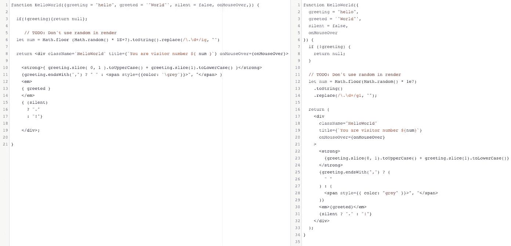

# 用 ESLint 和 beauty 编写有吸引力的代码

> 原文：<https://itnext.io/write-attractive-code-with-eslint-and-prettier-27d562b8ae9f?source=collection_archive---------5----------------------->

## 不要害怕你的下一次代码审查


本杰明·罗宾·叶斯柏森在 [Unsplash](https://unsplash.com?utm_source=medium&utm_medium=referral) 上的照片

大约十年前，当我还是自由职业者的时候，我可以随心所欲地写代码。我可能会养成坏习惯，给函数和类起只有我自己能理解的名字。当我和十几个其他开发人员在一家公司开始工作时，很明显拥有一套编码标准对团队的成功至关重要。

在一个小团队中工作教会了我拥有快速有效开发的指导方针和工具的重要性。

回到 2012 年，我们的前端团队有一个共享的 Visual Studio 设置文件和一个简单的 JSHint 配置。我们已经将 JSHint 配置为仅在构建整个项目或运行测试时抛出错误。这在开发过程中不是很有效，因为它不会实时导致错误或警告。回头修改你的代码总是事后的想法……并且总是用三重相等替换那些双重相等。

快进到今天，我们有一个广泛的文档概述了最佳实践，一个详细的 ESLint 配置，并使用漂亮的伟大格式化。

让我们回顾一下我们是如何到达那里的。

## 基础工作

我们的团队有许多包含指导方针、陷阱和规则的文档可供参考，并且这些文档会不断更新。一个很好的起点是实际展示 Javascript 控件和 HTML 模板的代码示例。我们将通过展示 API 调用的例子、如何给类和订阅加前缀，以及我们在这个过程中采用的许多其他约定来扩展这一点。我们甚至花时间创建了一个组件库，它对开发有很大的帮助，我真不敢相信我们没有早点这样做。

## 你应该如何开始？

从创建一个充满最佳实践的文档开始。比如如何给 CSS 类加前缀，如何命名事件处理程序和函数，如何构造 React 组件。记录最佳实践是很好的，但是如何执行它们呢？命名约定和 Javascript 结构之类的偏好可能很难实施，但是可以在设计和代码评审期间被发现。

对于语法模式、引号和分号之类的细节，或者全局格式，我们需要看看 ESLint 和 Prettier 之类的工具。

## 埃斯林特

ESLint 是 Javascript 的林挺工具。它有助于使您的代码更加一致，并在不同的编辑器和开发人员之间实施其规则。它可以通过警告不良编码实践和潜在问题来帮助防止将来的问题。

我们的团队添加了我们自己的规则，并扩展了我们现有的配置。Airbnb 提供了一个稳固的配置，许多其他公司都以此为起点。除了一般的 Javascript 错误之外，我们还使用 ESLint 来强制执行文体规则，如换行、引号和冗余分号。这真的很有帮助，因为我们的团队正在[过渡到反应和 JSX](https://medium.com/@chrisgirard/converting-your-code-base-to-react-1930945dc017) ，我们没有 ES6 的多年经验。ESLint 帮助我们完成了这一过程，并提醒我们在学习新技术时可能会出现的问题。当重构或清理代码时，通常会出现一个变量已经被赋值但从未被使用过，或者我们忘记命名一个函数。回过头来更新这些东西以保持代码的可读性和可维护性是有益的。

如果您不同意 ESLint 默认提供的任何规则或配置设置，您可以随时关闭它们。当你第一次启用 ESLint 时，看起来每一行代码都有红色下划线，但是不要担心，因为 ESLint 会给你一个答案，它会帮助你成为一名更好的开发人员。

*eslintconfig.json 扩展 airbnb 的*

```
"extends": [
    "airbnb-base"
    "eslint:recommended",
    "plugin:react/recommended"
]
```

[](https://eslint.org/docs/rules/) [## 可用规则列表

### 一个可插入和可配置的 linter 工具，用于识别和报告 JavaScript 中的模式。维护您的代码…

eslint.org](https://eslint.org/docs/rules/) 

## 较美丽

Prettier 是一个格式化工具，可用于多种语言，而不仅仅是 Javascript。它有助于标准化格式，因此您的整个团队可以用相似的风格编码。

格式化可能很棘手，因为每个人都有不同的编码风格。一个显而易见的好处是，你不需要记住一种特定的风格——你可以发展你喜欢的风格，然后格式化它。我们决定“试驾”更漂亮，并允许它用特定的命令格式化代码。许多团队在您保存文件时启用它，但是我们选择首先采用 on command 方法。这背后的一个原因是保持代码审查的可管理性。通常，我们会保存格式，直到我们准备好合并我们的更改，然后运行更漂亮。我们了解该工具提供的价值，并决定采取循序渐进的方法。



更漂亮后的函数示例

 [## 选项更漂亮

### Prettier 附带了一些可定制的格式选项，可以在 CLI 和 API 中使用。

更漂亮. io](https://prettier.io/docs/en/options.html) 

## 上车

当我们的团队增加一名新成员时，我们会要求他们审查一般开发文档以及最佳实践文档。在审查它们之后，一个新的开发人员就可以在对我们的编码标准有一个基本理解的情况下开始他们的第一个任务。

另一种方法是让新成员跳出困境，立即开始编写代码。如果练习被很好地记录下来，这很好，但是有一个可以参考的真实来源也很重要。大多数项目都包含遗留代码，如果开发人员以此为起点，那就没什么帮助了。

## 摘要

像 ESLint 和 appearlier 这样的工具很重要，因为它们提供了一套每个开发人员都必须遵守的规则。我们的团队使用 Git 和 Bitbucket 进行版本控制，并利用 pull request 特性进行代码审查。当审查代码时，我不想看到额外的空白、换行符和任何其他干扰，我只想看到你添加或更新的代码*(除非修饰)*。没有这些规则，开发人员会害怕审查他们同事的代码，团队的压力水平也会上升。

> 开发人员应该能够阅读您的代码，并且准确地知道发生了什么，而不需要使用大量的注释。

你能想象尝试教一个新开发人员你的团队在过去十年中遵循的所有编码注意事项吗？这将需要几个月的时间，而且对新开发人员也不公平。现在聪明的办法是让你的编辑来教。像 ESLint 和 Prettier 这样的工具让我们的团队成为更好的开发人员，让我们工作得更快。

如果你有兴趣了解更多关于这些工具的知识，可以查看语法播客，Scott Tolinski 和 Wes Bos 会在播客中深入讲解这些工具。

【https://syntax.fm/show/113/hasty-treat-code-quality-tooling 号