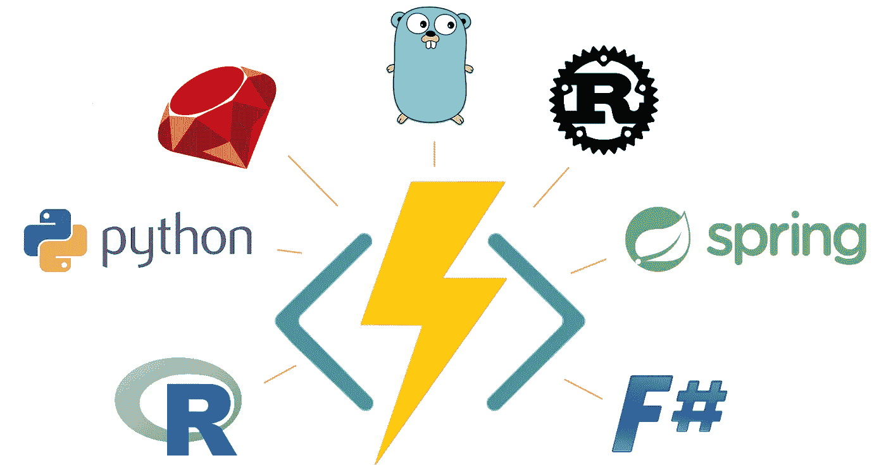
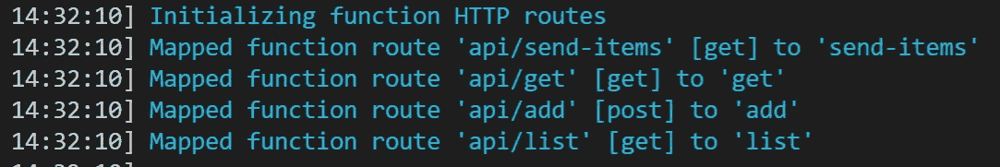
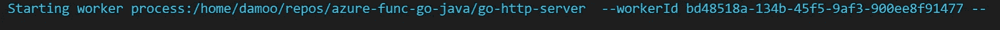
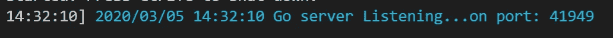
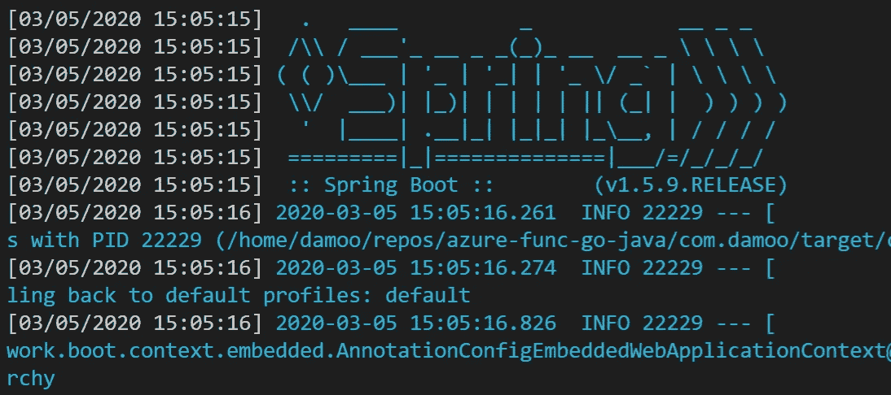

# 用 HTTP Worker(自定义处理程序)用*any*语言编写 Azure 函数

> 原文：<https://itnext.io/write-azure-functions-in-any-language-with-the-http-worker-34d01f522bfd?source=collection_archive---------2----------------------->



Azure Functions 主机运行时中的一个新的实验性特性现在允许你*自带 api* 并将其与 Azure Function triggers &绑定挂钩。这个特性被称为“HTTP Worker”，本质上是作为函数绑定和代码之间的代理层。在这里玩的回购样本:[https://github.com/damoodamoo/azure-func-go-java](https://github.com/damoodamoo/azure-func-go-java)。

*这是刚刚公开宣布的——参见此处* [*的文档*](https://docs.microsoft.com/en-gb/azure/azure-functions/functions-custom-handlers) *和此处* *的官方回购样本。*

## 情节

假设你真的很喜欢 **Go** ，它已经成为你的团队/组织的标准语言。然而，当谈到 Azure 函数时，目前只支持 C# / Python / Java & PowerShell。不去。你是做什么的？现在你可以简单地编写一个标准的 Go API，让主机运行时启动它，然后通过 HTTP Worker 从函数中调用它。

或者，假设你是一家 Java 公司，Java 11 / Spring 是你所有 web 项目的标准。要用 Java 编写函数，你目前只能使用 Java 8，而且你必须经历一些困难才能使用 Spring。你可能还会担心你正在编写的代码会把你和 Azure 函数捆绑在一起。现在——再一次——您只需创建您的 bog 标准 Spring API，然后让函数宿主启动它，并调用它。

## 怎么做:你好，世界

开始行动出奇的简单。让我们制作一个 Go 示例:

1.  确保您使用的是最新的功能核心工具:

```
$> npm i -g **azure-functions-core-tools**@core — unsafe-perm true
```

2.创建一个新的目录并初始化一个函数项目(我使用的是 WSL，但这无关紧要):

```
$> mkdir go-func
$> cd go-func
$> func init --docker 
```

3.选择`node`作为运行时间。我们实际上不会使用 node，但它只是使构建/部署更加简单，因为 C#有一个不同的机制。

4.使用核心工具创建一个函数。这只是创建了一个模板文件，没什么特别的:

```
$> func new 
```

按照提示选择`HTTP trigger`，并给它起个名字(我们选`hello-world`)。我们并不局限于 HTTP 触发的函数，但是对于我们的第一个函数来说，这是最简单的。

5.打开项目—我使用 VS 代码，但是任何 IDE 都可以。

```
$> code .
```

6.删除`hello-world`文件夹中的`index.js`文件。现在我们有一个空的函数项目和一个函数绑定文件。我们现在可以构建我们的 API 了。

7.构建 REST API，使用一个名为`hello-world`的端点。

```
func helloWorld(w http.ResponseWriter, r *http.Request){
   // doesn't matter what it does here...
}...func main() { mux := http.NewServeMux() // routes
   mux.HandleFunc("/hello-world", helloWorld) ...}
```

要复制更完整的示例，请参见该文件: [shopping-list-api.go](https://github.com/damoodamoo/azure-func-go-java/blob/master/go/go-http-server/shopping-list-api.go) 。

8.确保 REST API 运行在由环境变量`FUNCTIONS_HTTPWORKER_PORT`指定的端口上。对于围棋来说，这意味着`main`中的这段代码:

```
httpPort, _:= os.LookupEnv("FUNCTIONS_HTTPWORKER_PORT")
http.ListenAndServe(":"+httpPort, mux)
```

现在，您应该能够完全独立于函数来构建和运行您的 API:

```
$> env GOOS=your-os GOARCH=your-arch go build ./path/to/go-api
$> export FUNCTIONS_HTTPWORKER_PORT=8080
$> go run ./path/to/go-api
# now you can curl http://localhost:8080/hello-world
```

9.在`host.json`中引用。这告诉宿主运行时启动您的 api。

```
{
  "version": "2.0",
  "httpWorker": {
   "description": {
      "defaultExecutablePath": "./path/to/built/go-api/[.exe]"
    }
  }
}...
```

工作示例见 [host-go.json](https://github.com/damoodamoo/azure-func-go-java/blob/master/host-go.json) 。

使用 Go 很简单，因为它是独立运行的——但是像 java 这样的东西就需要了(注意`arguments`和`defaultExecutablePath`的额外参数)

```
"httpWorker": {
  "description": {
    "arguments": ["-jar"],
    "defaultExecutablePath": "java",
    "defaultWorkerPath": "path/to/my.jar"
  }
}
```

10.启动功能！

```
$> func start
```

您将在启动日志中看到一些有趣的事情:

将函数端点映射到 api(按名称):



启动您的 API:



对于 Java Spring API，您将看到熟悉的…



11.发挥你的作用:

```
$> curl http://localhost:7071/api/hello-world
```

## 总结和下一步…

希望这能让你开始。我们只讨论了最基本的内容，现在您可能想深入了解:

*   [概述不同的绑定、请求/响应模式](https://medium.com/@damoo/azure-functions-http-worker-bindings-and-schemas-f32f126a3654)，以及
*   [调试](https://medium.com/@damoo/debugging-your-azure-function-when-using-the-http-worker-3dcfabff4f16)。