# 在 Flutter 中使用 Riverpod 编写最佳性能的 ListView

> 原文：<https://itnext.io/write-best-performance-listviews-with-riverpod-in-flutter-8bf6590ed8b8?source=collection_archive---------0----------------------->


## Riverpod 系列 Listview 的隐性成本

## 让你的`ListView`更上一层楼，避免不必要的应用重建！

`ListView`是最常用的小工具之一，我们总是以同样的方式使用它，但我们大多数人从来不知道它有隐藏的成本！

这就是为什么，在这个系列中，我将向您展示隐藏的成本以及如何解决这些问题。

# 例子

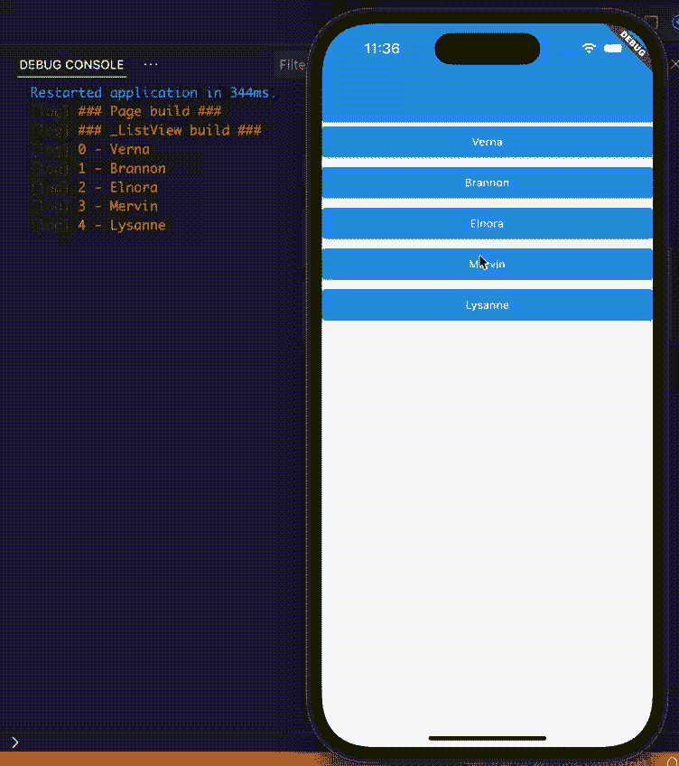

该应用程序很简单，我们有一个随机名称的列表，当我们点击一个项目的名称会随机改变。

我将使用`[faker](https://pub.dev/packages/faker)`包来获得随机的名字，当然还有`[riverpod](https://riverpod.dev/)`来管理状态。

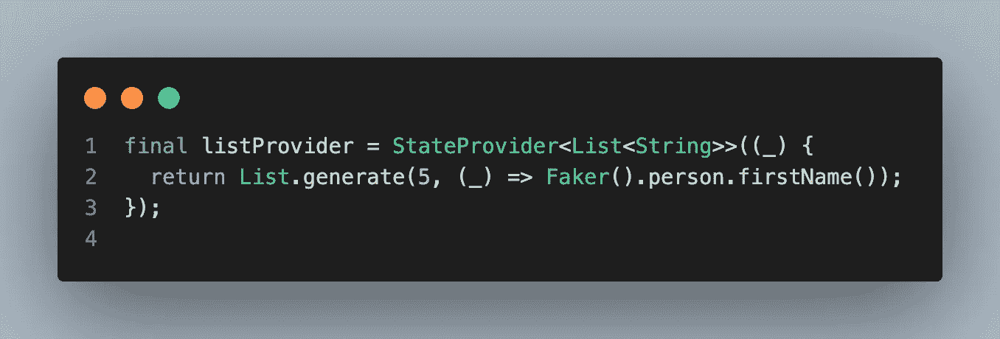

我们有一个`StateProvider`来获取名单。

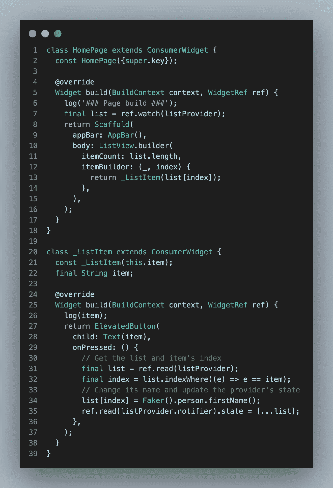

我们有一个`ListView`来显示名字。
据我所知，我们写的大多是那种显示列表的代码。

## 但问题到底出在哪里？一切看起来都很棒，对吧？

让我们点击一个项目，看看我们得到的日志！

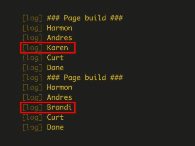

当我们更新一个项目时，整个页面都会重建，它的项目也是如此！那是个相当大的问题，我们从未意识到。

## 好吧，但是，我们怎样才能防止呢？

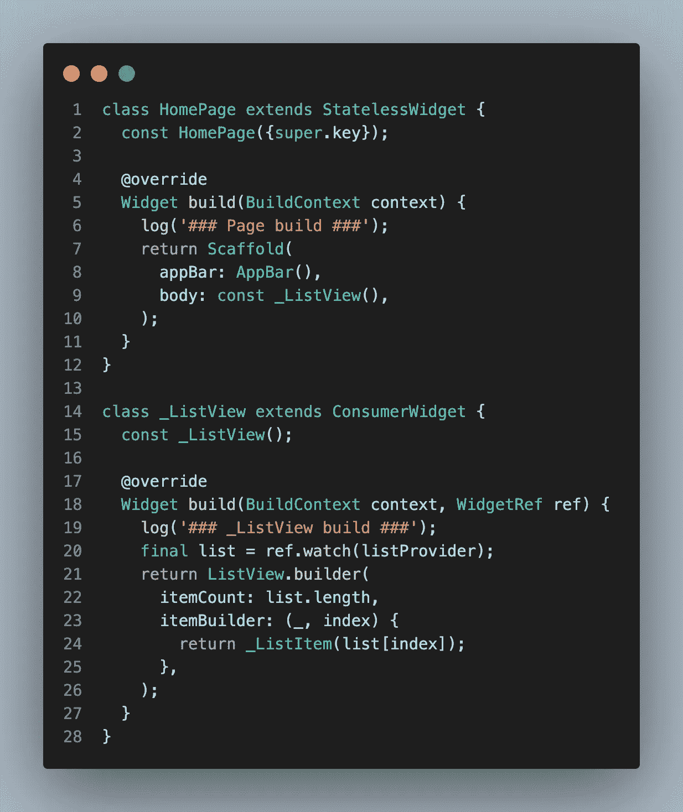

> “分离部件，分离关注点”

首先，分离小部件并使它们成为常量小部件将会隔离它们并防止一些不必要的重建。

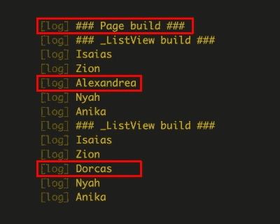

我们已经解决了页面重建的问题，但是,`ListView`和它的项目仍然在重建

## 我们现在能做什么？

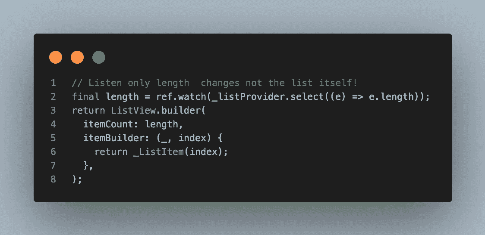

## Provider.select((state) => state。ValueToWatch)

多亏了`riverpod`，`select`方法让我们可以过滤看什么。

所以，我们可以只听状态中必要的部分，而忽略其他的变化。

比如`ListView`只关心列表的`length`，不关心列表本身。

```
// Do not forget
// This one watches all the changes and triggers on every change.
// Even if the length doesn't change.
// because here, we watch the entire list and extract the length later.
ref.watch(_listProvider).length;

// But this one watches only the length of the list.
// It doesn't care about the other changes.
// That's why it won't rebuild as long as length doesn't change
ref.watch(_listProvider.select((e) => e.length));
```

它对物品也有效！

```
// watch the list and get the index later
ref.watch(_listProvider)[index];
// watch only its item
ref.watch(_listProvider.select((e) => e[index]));
```

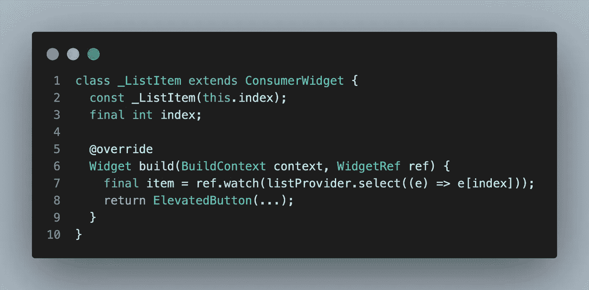

每个项目只看自己的项目，即使改变其他的，他们也不在乎。

让我们看看新的结果，现在！

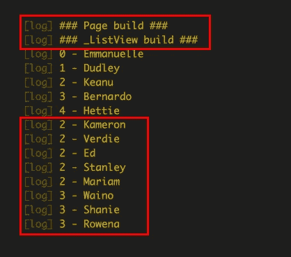

当我更新一个项目时，只有该项目被更新，而不是其他项目。基本上，每个人都在关注自己的事业。

但是，我们仍然有一个问题。

如果我们在 _ListView 小部件中有一个状态，并且它不断地更新这个状态，会怎么样？

(我将`_ListView`转换为`StatefulWidget`，并定期调用`setState`方法，向您展示这个问题。在这个场景中是没有意义的，但是我想给你看一个更重要的东西)

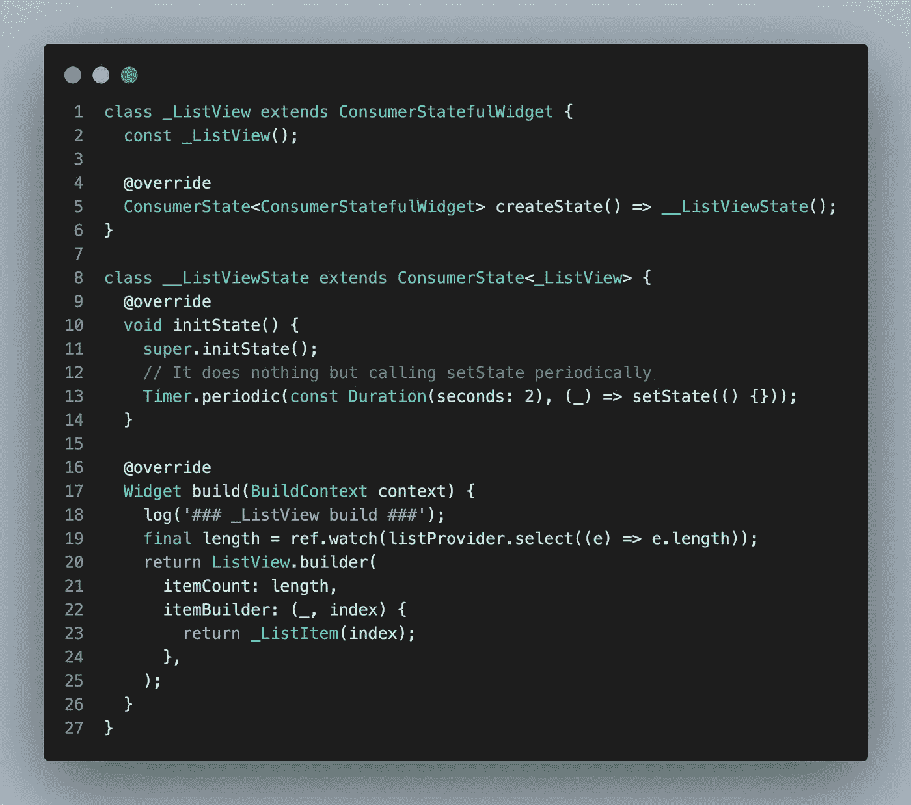

新代码如下所示。
现在让我们打开页面看看结果吧！

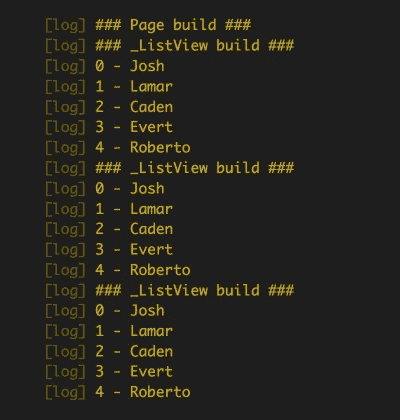

正如您所看到的，每次我们调用`setState`，整个列表和它的条目都会被重新构建。

这里的主要问题是`_ListItem`不是 const，因为它需要获取索引才能知道。

```
itemBuilder: (_, index) {
  return _ListItem(index);
},
```

## 但是，我们如何将索引传递给`_ListItem`来防止这种情况呢？

解决方案是再使用一个提供者。

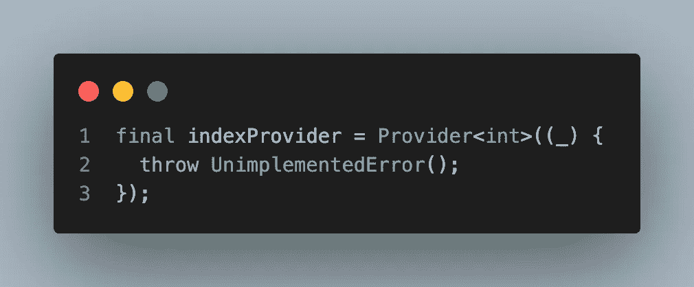

我们不想更新用户界面，这就是为什么我们要使用`Provider`，而不是`StateProvider`或其他。

但是如您所知，Provider 只获取一次值。这就是为什么我们需要覆盖每个索引的值。

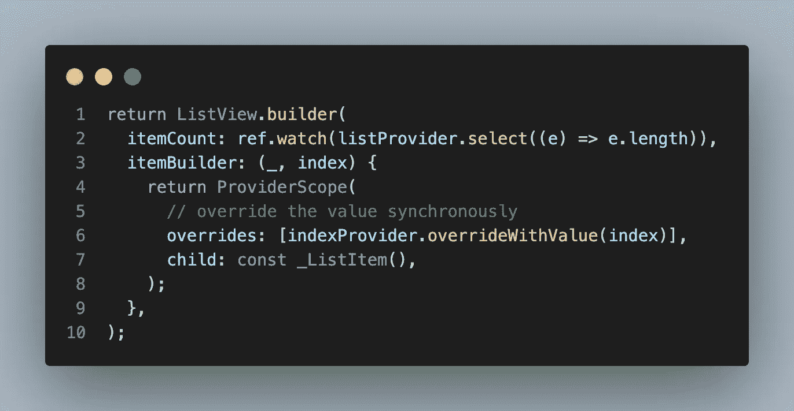

`Riverpod`让我们像这样使用`ProviderScope`来覆盖提供者的值。

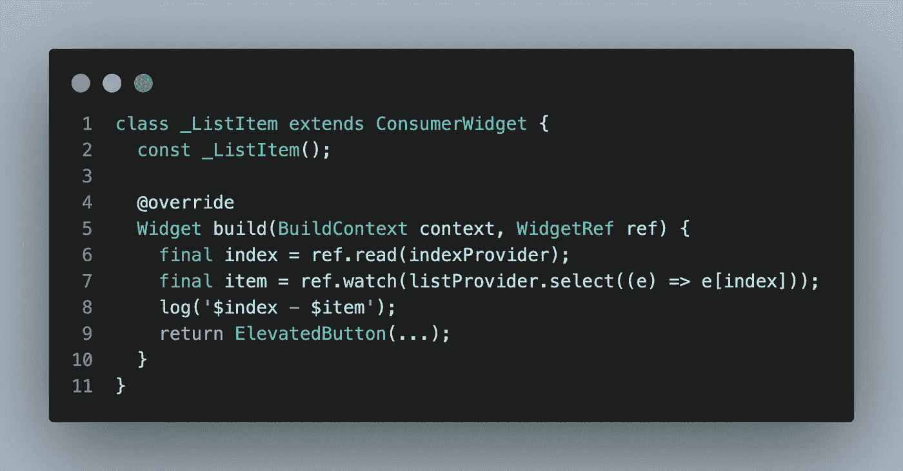

我们可以像那样简单地阅读索引。

所以过程很简单。

1.  从`ListView`获取索引
2.  将索引分配给`indexProvider`
3.  创建`_ListItem`并从提供者那里获取索引
4.  转到下一个索引，重复直到结束。

让我直观地展示一下新的逻辑。

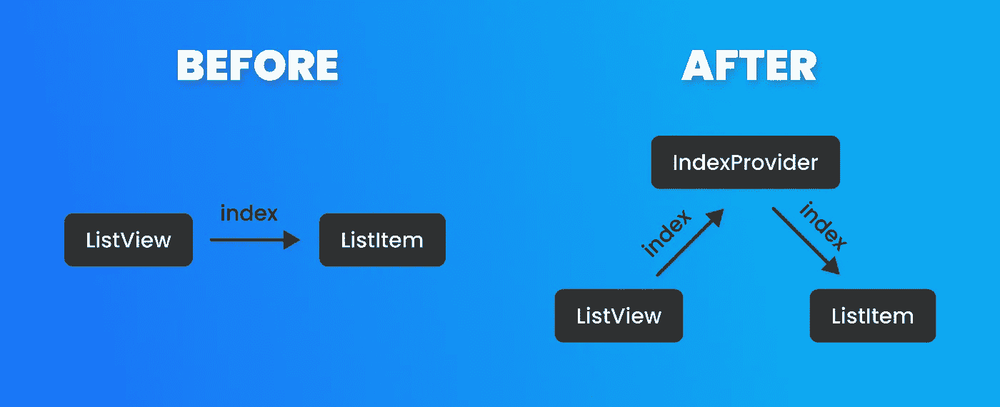

基本上，我们不是将索引直接发送给`_ListItem`，而是将索引分配给`_indexProvider`，并在同步呈现`ListView`的同时从提供者处获取索引。(这不是一个`async`操作，所以您不必担心分配的索引不正确)

> 注意:当然，我们也可以找到其他的解决方案，比如，为计时器使用另一个提供者，不使用有状态的小部件，但是我想向您展示 const 小部件有多重要，以及如何优雅地使 listitems 成为常量

让我们看看控制台，再看一次新的结果！

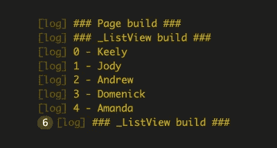

正如你所看到的，甚至调用了`setState`，但是项目并没有在每个`build`上重新构建，因为`const`部件只在需要的时候构建它们自己。

## Github 项目

你可以拿到最终的项目，自己去试一试！

[](https://github.com/rei-codes/advanced_list_riverpod) [## GitHub-rei-codes/advanced _ list _ riverpod:使用 river pod 编写最佳性能的列表视图…

### 一个新的颤振项目。这个项目是颤振应用的起点。一些帮助您入门的资源…

github.com](https://github.com/rei-codes/advanced_list_riverpod) 

这是这个系列的第一部分。强烈推荐您关注我，不要错过下一个主题:))

## 第 1 部分—编写更好的 ListViews —当前

第 2 部分—无缝无限列表—即将推出
第 3 部分—缓存您的提供商并降低服务器成本
第 4 部分—您可以向我推荐一个:)

# 感谢您的阅读！

请不要忘记点击👏按钮，并有一个飘扬的一天！