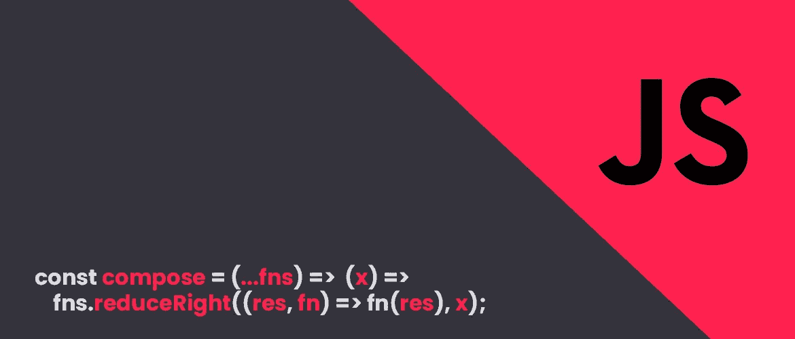
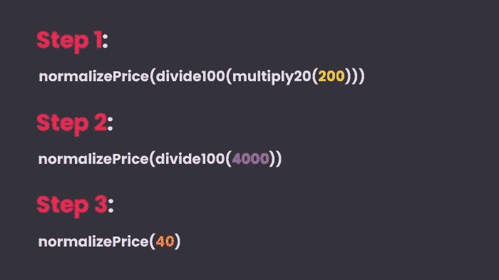
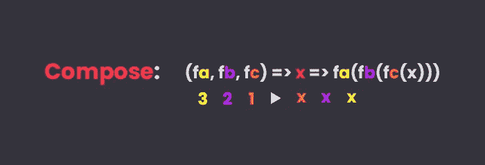

# 写更好的 JavaScript，用管道和 compose 函数复合

> 原文：<https://itnext.io/write-better-javascript-function-composition-with-pipe-and-compose-93cc39ab16ee?source=collection_archive---------0----------------------->

当我开始进入*函数式编程*的旅程时，我发现自己认为它既令人兴奋又令人困惑。我发现在我的日常工作中有用的核心概念之一是**函数组合**，由于其直观的本质，即使在一个完善的代码库中引入它也并不困难。

# **作曲**

当谈到函数组合时，我们可以将其视为**一种将多个函数链接在一起以创建一个新函数的方式**，换句话说，我们正在解决一个问题，将它简化为更小的解决方案，这些解决方案本身**不会完成太多，但一起可以解决复杂的任务**。

让我们来看一个例子，假设我们要计算一个价格的 20%折扣，我们可以这样创建三个函数:

上面的代码非常简单，现在我们需要找到一种方法来组合它们，更传统的方法是**将函数作为下一个函数**的参数:

这样**内部函数的结果被外部函数作为参数**使用，直到链结束:

我们现在已经设法将我们的函数链接在一起，我们可以通过编写一个 **compose 函数**提高可读性来实现相同的结果:

所以我们的代码变成了:

我们的 compose 函数使代码更易读、更整洁，但我们可以使用**高阶** *reduceRight* 函数将它改进为**接受三个以上的函数**:

我们正在做的是使用 *spread* 操作符将参数(我们的函数)转换成一个数组，并返回一个新函数，该函数接受一个参数“X ”,该参数将用作 reduceRight 函数的累加器的初始值。我们基本上是用前一个函数的结果从右到左执行作为参数传递的每个函数。

因此，如果我们现在想要添加一个新的函数来为我们的折扣添加一个前缀“$ ”,我们可以简单地将它添加到组合参数列表中

# **管道**

*管道*的工作方式与 Compose 完全相同，唯一的区别是**不是从右到左执行参数，而是从左到右执行参数**，我们可以像这样实现一个*管道*函数:

唯一不同的是*减右*变成了*减右*。就我个人而言，我更喜欢用*作曲*而不是*管*，即使乍一看这似乎违反直觉。

我们的最终代码是:

# **拉姆达**

你不必每次写一段代码就写自己版本的 *Pipe* 或 *Compose* ，你可以使用 [**Ramda**](https://ramdajs.com/docs/#compose) 等库，专注于你代码的实现。

# **结论**

希望这篇文章能让你深入了解函数组合的好处，以及如何在日常工作中引入它，**如果你有任何问题，请留下评论！**