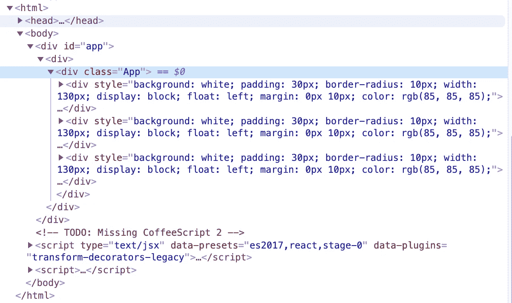

# 编写清洁(er)组件和 JSX

> 原文：<https://itnext.io/write-clean-er-components-jsx-1e70491baded?source=collection_archive---------0----------------------->


卡莉·谢伊@ Unsplash—[https://unsplash.com/photos/1SAnrIxw5OY](https://unsplash.com/photos/1SAnrIxw5OY)

我经常发现自己在忙着参加项目，因此不得不理解别人写的代码库。自然，代码伴随着许多错误和不良实践(在我看来)，我试图帮助人们理解如何做得更好。

使用 React 编码的困难之处在于，通常没有明确的最佳实践，存在相互矛盾的文章，并且很多内容都受到您是否真正理解 JS 本身的影响。有些人在深入理解 JavaScript 之前就做出了反应(这就是我们的行业和需求)。

## 我决定写一个小指南，介绍我在真实项目中看到的案例和一些重构解决方案。

先说一个我经常看到的:

# 1.可选道具和空的{}物体

我遵循单一目的的组件哲学。这意味着我会避免复杂的数百行长的组件，并尽可能地将所有组件分解。

假设我们有一个简单的`<UserCard />`组件。**该组件的唯一目的是接收一些用户对象并显示用户数据。**

我在项目中看到的:

一个组件需要一个属性(用户),没有它它什么也做不了，但是这个属性不是必需的，默认值被设置为`{}`,以避免一些`Cannot access property 'name' of ...`错误。

这导致了混乱和非性能的 ui，数据应该在空白的地方，因为访问一个不存在的对象的属性总是会给我们`undefined`。
如果你没有在`UserCard`中提供任何后备值或任何框架加载(像 LinkedIn 或脸书所做的)，如果我们没有数据，就没有理由呈现这个组件——特别是如果里面有一些计算逻辑正在无缘无故地运行，没有值。

## 那么什么是应该要求的，什么是不需要的呢？

有时候你只需要停下来问问自己什么是最有意义的。

假设我们有一个`<CurrencyConverter />`组件。它有三个支柱:

*   值(我们要转换的数字)
*   给定货币(我们要转换的货币)
*   目标货币(我们要转换到的货币)

我们可以决定默认的`givenCurrency`值为`"EUR"`，因为我们位于德国，默认的`targetCurrency`值为`"USD"`，因为它是一种广泛使用的货币。

然而，如果我们的`value`缺失，那么做任何转换都是没有意义的——那时根本不需要呈现组件。所以`value`道具应该**肯定是需要的。**

你应该使用类似的类比来问自己哪些道具是必需的，哪些不是，以防你还没有这样做。一个组件在那里做*某件事——***不要让它白白渲染，万一少了什么东西**。

# 2.在父组件中调节渲染

组件及其父组件应该是什么样子？

这样，我们将把`user`对象初始化为一个`null`值。为什么？如果没有用户，运行像`!user`这样的简单错误检查将返回*真*。对于空对象来说就不是这样了，你必须检查对象的键长度。我们通过不创建新的对象引用来节省一些内存空间，并且我们还对渲染进行了调整，使其仅在获得所需数据后才显示`<UserCard />`。

如果没有数据，也很容易显示微调器或消息。

**请记住，在父组件内部做这件事总是比在组件内部做更干净。**我不知道有多少次，我看到一个带有某种逻辑的组件只是为了显示一个微调器或一条消息而被徒劳地执行。

`<UserCard />`只负责显示用户数据。`<UserContainer />`有没有去取用户，决定渲染什么。这就是为什么`<UserContainer />`是显示后备值的正确位置。

# 3.别窝着了，早点回去吧

即使在普通编程语言的范围内，嵌套的阅读和编辑也是一团糟——更不用说 JSX 了，它是 JavaScript、HTML 和`{}`的混合。

您自己可能经常会发现看到类似的代码:

我们怎样才能做得更好？

如果我们要对渲染进行调整——比如数据是否可用，页面是否加载——我们可以选择提前返回。

这样我们就避免了嵌套，不要把 HTML 和 JavaScript 条件混在一起，代码对于来自不同背景或者没有技术背景的人来说也是可读的。

> 随着年龄和经验的增长，我越来越关心代码对任何人都是可读的。我们不仅仅是为电脑写的，也是为其他人写的。我们希望评审者理解我们的目标，而不用麻烦他们去破译我们的代码。我们希望我们的初级同事能够理解代码，捡起来并进一步研究它。如果从长远来看能节省我和其他人的时间，我愿意牺牲几行。

# 4.尽量少用 JSX 写 JavaScript

正如我之前提到的，JSX 有点棘手，因为它是多种语言的混合体。虽然高级开发人员理解组件内部发生的事情没有问题，但并不是每个人都这样。即使是我，作为一个大四学生，也经常发现别人的代码比它应该有的可读性差得多。

我们正在处理一些外部`<Input />`的变化，用一个定制的处理器解析值，然后调用由`<CustomInput />`组件接收的`onChange`属性。虽然这个例子可以工作，但是人们很容易迷失在`return()`方法中。在现实世界中，有更多的元素和更复杂的 JS 逻辑，它们可以快速嵌套。

这个例子长了 2 行，但是逻辑明显分开了。当我们返回我们的 JSX 时，我们没有必要用内联 JavaScript 逻辑使它变得沉重。**在** `return()` **里面应该很清楚你的 HTML 树是如何构造的——这使得在 JSX 内部使用嵌套对象和创建函数变得更加困难。**

# 5.带有 useEffect 的 useCallback

当钩子出现时，人们开始使用功能组件。他们需要在内部进行 API 调用，为此他们需要`useEffect`生命周期挂钩。第一个版本的文档指出，提供空的依赖数组`[]`将使钩子只在组件的挂载和卸载时运行。所以我们创建了自己的组件，并在`useEffect`中到处使用`[]`。然而，随后出现了`exhaustive-deps`规则。

人们很快就把它注释掉了，因为它对我们来说毫无意义。我们不习惯。但是现在，一年多过去了，这不是一个合理的借口，有些人仍然不停地评论这个规则，而不是试图理解它是如何工作的。

**有些人没有意识到的是，方法** `handleUserFetch()` **会在每次渲染时重新创建——或者组件中有多少次渲染。这就是为什么当我们需要调用一个`useEffect`内部的方法时，我们使用`useCallback`。这样我们就防止了`handleUserFetch()`方法被重新创建(除非它的依赖关系改变),因此可以作为`useEffect`钩子的依赖关系使用，而不会导致无限循环。**

演示的示例应该重写如下:

这里我们提供`handleUserFetch`作为 useEffect 的依赖项(因为它确实依赖于它),并将方法本身包装在`useCallback`中。如果这个方法使用一个外部的**参数**，比如`id`，比如*(在现实世界中可能会这样，因为你想获取一个特定的用户)*，**这个参数将被列为方法的依赖项**。如果参数改变了，唯一合理的是你想改变函数，然后再次调用它。

如果你发现自己在`useEffect`和`useCallback`中循环，也许是时候看看`useReducer`而不是`useState`了，或者选择一个完全不同的方法。

例如，如果您正在处理状态设置，您可以使用之前的状态作为函数的参数，如下所示:

```
setUser(prevUser => {…})
```

如果您将当前状态作为处理**状态更新**的方法的依赖项来提供，您将为自己创建一个无限循环。

# 6.外包独立逻辑

假设我们的组件内部有一个方法，它处理组件的一些变量，并为我们返回一个人工输出。示例:

随着钩子的出现，很多人放弃了类组件，所以你经常会发现自己拥有一个结构相似的组件。

这个方法，就像前一个例子中的方法一样，在每次渲染时都会被重新创建——但是**用** `**useCallback**` **包装这个方法是不必要的，因为我们不会在任何地方将它作为依赖项**(一个 useEffect 钩子，或者一个子组件的 *prop* )提供。

如果我们远离组件的范围，我们有一个函数`getUserRole()`需要用户的角色作为输入，给我们一个用户最重要角色的人工输出。它不需要在组件内部定义(和重新创建)。

组件内部定义的许多逻辑可以外包，因为它并不真正与组件相关。

这样，函数可以在一个单独的文件中定义，并在任何需要的地方导入。尽早将逻辑从组件中抽象出来，可以让我们拥有更干净的组件和易于重用的实用功能。

> 也许我们希望在更多的地方显示用户最重要的角色——然后我们倾向于创建代码，在不同的地方返回用户的人类角色——甚至可能由不同的开发人员以不同的方式实现。缺乏这样的架构会使将来重构代码变得更加困难，比如角色发生了变化。这就是为什么我们应该尽早抽象，特别是如果我们在一个团队中工作，其他开发人员会在我们的代码上构建，甚至可能在没有很好理解它的情况下复制它。

# 7.放下内嵌样式

一个我经常看到的。定义内联高级样式给了你两件事:

*   臃肿的代码
*   无法在不使用`!important`或一些适当的钻孔方法的情况下从外部改变 CSS

CSS 是**不是** JavaScript 相关的语言。如果你来自 React 训练营，并且你第一次看到 CSS 被使用是在一个使用 React 的 SPA 中，这可能是你唯一一次使用它的经历。然而，CSS 是一种与 HTML 协同工作的语言，根本不需要 JS。**你可以用 JS 动态地添加一个类到 HTML 标签中，并让 CSS 应用到这个类上**。CSS 对你所需要的一切都有现成的支持，而不需要嵌入到 JavaScript 中。

```
p { color: black }p.accent { color: red }
```

每段都有黑色字体。每个有`.accent`类的段落都有红色字体。

```
#banner p.accent { color: blue }
```

在`#banner`元素中带有类`.accent`的段落是蓝色的。这一切都归结为理解 CSS 继承。如果我们内联定义`p`颜色，我们将很难从外部接近它。这将引导我们创建做同样事情的不同组件——只是有不同的文本颜色。**现在，当我们必须更改这些组件时，我们必须更改它们中的 *n* 个，而不是一个。**

## 膨胀的代码

让我给你链接一个工作的 js fiddle:[https://jsfiddle.net/zonc3fvw/](https://jsfiddle.net/zonc3fvw/)。样式是内联的，代码如下所示:



不太漂亮，是吗？

现在让我们使用课堂方法:[https://jsfiddle.net/vzcLxwny/1/](https://jsfiddle.net/vzcLxwny/1/)


我们看到的只是一个打理一切的 CSS 类。组件在我们的应用程序中呈现的次数越多，我们节省的空间就越多。我们也可以通过使用**简单的 CSS 从外部改变`<Card />`的外观(*)，如果出于某种原因，设计者决定横幅卡中的标题应该是粉红色而不是黑色*。没有正确钻探，就没有反应。CSS 的上下文改变以避免钻取，只是一个 HTML 类。**

> 注意:如果你喜欢 CSS 模块，也可以这样做，使用`:global`前缀。也许我有一个`.icon`类，我想改变`button`中的`.icon`的字体大小。我想保留所有其他的属性，所以创建一个新的组件只是复制 98%的代码是没有意义的。

曾经有人反驳我说*“你可以有条件地使用 props 来设计内联 CSS 的样式”*——你绝对可以。然而，你的组件不应该有 10 个处理 CSS 而不做其他事情的道具。这就是把 JS 和 CSS 混合在一起的地方，在这里你可以把自己挖得很深，以至于很难再爬上去。组件将变得臃肿，难以理解，难以编辑，你的 CSS 将变得越来越难以维护。

# 8.编写有效的 HTML

我知道有人不喜欢，但是写 HTML 和 CSS 还是我们前端工程师的工作。React 很有趣，hooks 也是，Context 也很棒，但最终我们会负责渲染 HTML，让它看起来更好。

如果它的行为像一个按钮，它应该是一个`button`，而不是一个可点击的 div。如果它没有提交表单，那么它应该是`type="button"`的。如果它应该根据文本大小扩展，它不应该有固定的宽度。

如果是 40 像素填充的，应该不是`<br /><br /><br /><br />`。

如果是链接，应该是个`<a />`。

对你们中的一些人来说，这是最基本的。但对其他人来说，却不是。如果你觉得自己精通 React，但觉得自己的 HTML 技能有所欠缺，那就试着创建一个完全没有 JS 的网站——只有普通的 HTML。通过 HTML 验证器运行它。这就是我们当年的做法(那时我 10 岁😄)

我将提供的一个例子是表单。我经常看到的是:

这个例子有效..*不知何故*。这也是我经常在运送给客户的产品中看到的，当我看到它时，我总是有点发僵。

现在这个例子所做的是在`<input />` 变更和**提交** `<button />`点击时更新**名称**值，它通过手动调用`handleSubmit`提交数据。**点击。**

这对于普通用户来说没问题，但是对于使用`Enter`键提交表单的人来说就不太好了。这对于 HTML 来说是不行的，因为它实际上并不知道表单正在被提交。我们有一个 HTML & JS 支持，而不是设置奇怪的输入监听器:

```
<form onsubmit="myFunction()">
  Enter name: <input type="text">
  <input type="submit">
</form>
```

*盗自*[*https://www.w3schools.com/jsref/event_onsubmit.asp*](https://www.w3schools.com/jsref/event_onsubmit.asp)

在 React 中使用`onSubmit`的工作方式基本相同

与前一个示例相比，我们必须更改的内容列表:

*   输入需要包装在一个`<form />`元素中
*   按钮需要是一个`submit`类型=它寻找最近的父节点`<form />`并调用提交动作
*   表单得到一个`onSubmit`属性，这是提交动作( *handleSubmit* )
*   提交动作( *handleSubmit* )需要在收到事件时调用`preventDefault()`。如果不这样做，页面将会刷新，就像传统的表单提交一样。

现在表格**正在提交**。这是一个有效的表单，适用于任何提交触发器，而不仅仅是直接点击按钮。

# 9.不要过度使用上下文

感觉现在有两个阵营 Redux 阵营和 Context 阵营。大多数教程都是为 Redux 编写的，这是初学者会找到和学习的第一个资源——对于他们的第一个项目来说，这通常是一个大材小用。误用 Redux，它会咬你一口。很多人被咬了一口，转到了第二个阵营——语境一切。

平衡永远是答案，这个案例也不例外。

我见过很多应用程序利用了上下文**——而且是以错误的方式。该应用程序被包装在 15 个不同的提供者中，这些提供者存储了一些状态和状态的设置者——现在让我们假设您有 2 个利用了`SnackbarContext`的组件。其中一个显示 Snackbar 及其消息，另一个从外部触发 Snackbar 消息。**

****现在，每次重新呈现带有消息的 Snackbar 时，我们的第二个组件也将重新呈现，该组件仅用于设置新的 Snackbar 消息。**为什么？因为它与存储消息和消息设置器的上下文绑定在一起。现在我们还没有触及设置器，但是我们已经更新了消息，在提供者内部设置了一个新值，并且**连接到它的一切**都被重新呈现。用`memo()`包装组件是行不通的——提供者的价值是不同的。**

**你的应用程序中有 100 个地方都有这个。或者 1000。这就是你想要的表现吗？**

**有时使用 Redux 是有意义的——特别是对于整个应用程序都需要并显示在不同屏幕上的数据——并且不需要从头到尾重新获取。我说 Redux 是作为一个**状态管理——至于我自己，既然我发现了 mobx-state-tree，我就不回去了。****

**如果您对上下文管理更感兴趣，因为这是另一个复杂的主题，您可以在本文底部找到一个演示文稿的链接。**

**如果你已经到达这里，谢谢你的阅读。我希望我能帮助你们中的一些人搞清楚什么是什么。我只有一个建议给你——质疑你的知识、你学到的方法和你的代码。思考并寻求自己是否能做得更好。跳出框框思考——忘记 React 和 JavaScript，把项目作为一个整体来看，问问自己什么在架构方面最有意义。**

**最后，我想链接一些资源:**

*   **[https://slides . com/djanoskova/react-Context-api-create-a-reusable-snack bar #/](https://slides.com/djanoskova/react-context-api-create-a-reusable-snackbar#/)—我为演示如何高效使用上下文而创建的上下文 API 演示**
*   **https://medium . com/@ ftangastani/mobx-state-tree-a-step-by-step-guide-for-react-apps-e 65716 a 219d 2—这是一篇非常棒的文章，以非常实用的方式展示了 mobx-state-tree 的基础知识**
*   **[https://github.com/facebook/react/issues/14920](https://github.com/facebook/react/issues/14920)—详尽的 deps 讨论**