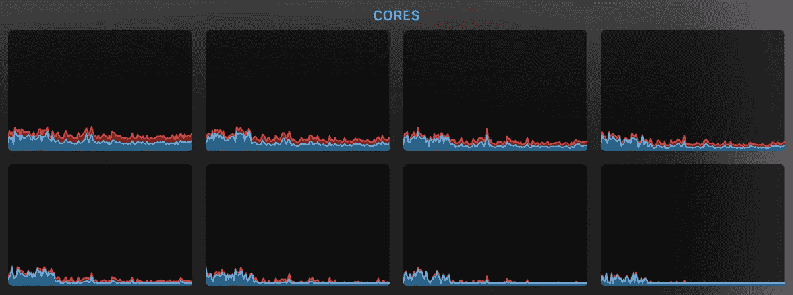

# 在 Dart 中使用 Isolate 和 Future 编写并发程序

> 原文：<https://itnext.io/write-concurrent-programs-using-isolate-and-future-in-dart-da3fd9395db1?source=collection_archive---------4----------------------->

## 使用 Isolate 和 Future 的简单 web 服务器的 4 种不同实现

dart 编程语言中关于并发性的资源很少，特别是关于 [Isolate](https://api.dart.dev/stable/2.12.1/dart-isolate/dart-isolate-library.html) ，在这篇文章中，我将通过一个 web 服务器的 4 个不同实现来描述 Dart 中的并发性概念(Isolate、Future 和 Async/Await)，然后开始在每个实现上产生负载，并最终尝试通过使用 Isolate 来提高性能，除了这 4 个实现，我还使用 [Ktor](https://ktor.io/) (Kotlin)和 [WebFlux](https://docs.spring.io/spring-framework/docs/current/reference/html/web-reactive.html) (Java)框架实现了相同的场景来比较最终性能(每秒请求数)。你可以从这个 Github 库找到最终的 Dart 代码。

## 前言

默认情况下，dart 程序是包含事件循环的单线程(单隔离)异步程序。通过观看这些视频系列，你可以对`Async Coding With Dart`有一个很好的了解。

我们将使用 dart 代码库中的`HttpServer`类(`dart:io`和`dart:isolate`)实现一个简单 web 服务器的 4 个不同版本，这个虚拟 web 服务器打算监听端口`4040`并计算`fibonacci number 35`(虚拟繁重工作)，然后将`Hello Dart!`返回给客户端！我们将通过以下方法实现它:

1-使用异步/等待( [dart_server_await.dart](https://github.com/zarinfam/dart_concurrency/blob/master/bin/dart_server_await.dart) )

2-使用 Future([dart _ server _ Future . dart](https://github.com/zarinfam/dart_concurrency/blob/master/bin/dart_server_future.dart)

3-使用隔离和异步/等待([dart _ server _ Isolate _ Await . dart](https://github.com/zarinfam/dart_concurrency/blob/master/bin/dart_server_isolate_await.dart))

4-使用隔离和未来([dart _ server _ Isolate _ Future . dart](https://github.com/zarinfam/dart_concurrency/blob/master/bin/dart_server_isolate_future.dart))

我通过实现一个 [Fibonacci](https://en.wikipedia.org/wiki/Fibonacci_number) 函数来模拟繁重的工作负载，并使用`[wrk](https://github.com/wg/wrk)`在服务器上生成负载:

`wrk -t12 -c1000 -d5m [http://127.0.0.1:4040/](http://127.0.0.1:4040/)`

# 1-使用异步/等待语法实现一个简单的 web 服务器

这是 dart.dev 站点中的默认实现( [dart_server_await.dart](https://github.com/zarinfam/dart_concurrency/blob/master/bin/dart_server_await.dart) )。

```
import 'dart:io';

import 'dto.dart';

void main() async {
  var server = await HttpServer.bind(
    InternetAddress.loopbackIPv4,
    4040,
  );

  print('Listening on localhost:${server.port}');

  await for (HttpRequest request in server) {
    fib(35);
    request.response.write('Hello Dart!');
    await request.response.close();
  }
}
```

`HttpServer`类操作是异步的，所以它们返回一个 [Future](https://api.dart.dev/stable/dart-async/Future-class.html) 类的实例，一个`Future`对象是一个异步操作的结果值的占位符，其值将在未来完成或未完成。

通过使用 Async/Await 语法，我们可以以声明的方式编写异步代码，而不是使用回调方法，正如您可以看到的那样，最终的代码看起来很像同步代码，但运行起来像异步代码。

当我使用`[wrk](https://github.com/wg/wrk)`为这个实现生成负载时，我发现 CPU 内核(或超线程)的参与度非常低:



第一次实施中涉及的 CPU 核心

`Ktor`和`WebFlux`实现比第一个使用 Async/Await 的 dart 实现快 7 倍，并且在性能测试期间它们涉及所有 CPU 内核。

这个结果是因为 Dart 编程语言的性质，默认情况下 Dart 是单线程的(隔离),该线程上有一个事件循环(隔离),但为了获得更好的性能，`Ktor`和`WebFlux`为每个 CPU 内核创建一个事件循环(我的 Mac 有 8 个内核，16 个超线程)。

# 2-使用未来语法实现一个简单的 web 服务器

我只是改变了以前的 web 服务器，并使用 Future 来确保为每个请求创建一个新的 Future 对象不会提高性能([dart _ server _ Future . dart](https://github.com/zarinfam/dart_concurrency/blob/master/bin/dart_server_future.dart))。

不出我所料，结果一模一样。首先我调用了`server`对象的`listen`方法中的`fib`函数:

```
server.listen((request) {
  fib(35);
  request.response.write('Hello Dart!');
  request.response.close();
});
```

然后试图将调用`fib`函数包装成另一个`Future`:

```
.
.
.
server.listen((request) {
    fibF().then((_) {
      request.response.write('Hello Dart!');
      request.response.close();
    });
  });
}

Future<int> fibF(){
  return Future.microtask(() => fib(35));
}
```

在这两种情况下，结果与第一个实现相同。

# 3-使用 Isolate 和 Async/Await 语法实现一个简单的 web 服务器

为了证明 Dart 编程语言的能力，我尝试使用 Isolate 重新实现简单的 web 服务器。我们可以想象一个隔离类似于一个带有一个事件循环的线程，但是它的结构类似于一个 Actor，从基础设施的角度来看，隔离非常类似于一个线程，但是没有共享内存，并且两个隔离可以共享某些东西的唯一方式是像 Actor 一样传递消息(使用`ReceivePort`和`SendPort`)。

我尝试`spawn` 16 隔离(CPU 超线程的数量)并使用循环算法(使用消息传递)向它们发送每个请求:

```
import 'dart:io';
import 'dart:isolate';

import 'dto.dart';

Future main() async {
  var server = await HttpServer.bind(
    InternetAddress.loopbackIPv4,
    4040,
  );

  final cpuCores = Platform.numberOfProcessors;
  final isolatePorts = <SendPort>[];
  var roundRobin = -1;

  for (var i = 0; i < cpuCores; i++) {
    final receivePort = ReceivePort();
    await Isolate.spawn(
        handler, IsolateData(receivePort.sendPort, 'isolate $i'));
    isolatePorts[i] = await receivePort.first;
  }

  print('Listening on localhost:${server.port}');

  await for (HttpRequest request in server) {
    roundRobin = (roundRobin + 1) % cpuCores;
    final msg = await send(isolatePorts[roundRobin], 'req');
    request.response.write(msg);
    await request.response.close();
  }
}

Future send(SendPort port, msg) {
  final response = ReceivePort();
  port.send([msg, response.sendPort]);
  return response.first;
}

Future<void> handler(IsolateData isolateData) async {
  final port = ReceivePort();
  isolateData.port.send(port.sendPort);

  await for (var msg in port) {
    final request = msg[0];
    SendPort replyTo = msg[1];

    fib(35);

    replyTo.send('Hello Dart!');
  }
}
```

看到使用`wrk`的性能测试结果没有变化，我非常惊讶！`Requests/sec`和 CPU 核心的参与与之前的实现是一样的！

**问题出在哪里？**

现在我们有了几个事件循环，并在它们之间分配请求，希望有更好的性能！

问题是在使用中误用了 Async/Await 语法，这部分代码是阻塞的:

```
await for (HttpRequest request in server) {
  roundRobin = (roundRobin + 1) % cpuCores;
  final msg = await send(isolatePorts[roundRobin], 'req');
  request.response.write(msg);
  await request.response.close();
}
```

所以我在最后一个简单 web 服务器的实现中，尝试改进这部分，使用 Future 将其转换为非阻塞。

# 4-使用 Isolate 和 Future 实现一个简单的 web 服务器

最后一个实现([dart _ server _ isolate _ future . dart](https://github.com/zarinfam/dart_concurrency/blob/master/bin/dart_server_isolate_future.dart))大约快了 7 倍！所有的 CPU 核心都参与其中。


```
import 'dart:io';
import 'dart:isolate';

import 'dto.dart';

Future main() async {
  var server = await HttpServer.bind(
    InternetAddress.loopbackIPv4,
    4040,
  );

  final cpuCores = Platform.numberOfProcessors;
  final isolatePorts = List<SendPort>(cpuCores);
  var roundRobin = -1;

  for (var i = 0; i < cpuCores; i++) {
    final receivePort = ReceivePort();
    await Isolate.spawn(
        handler, IsolateData(receivePort.sendPort, 'isolate $i'));
    isolatePorts[i] = await receivePort.first;
  }

  print('Listening on localhost:${server.port}');

  server.listen((request) {
    roundRobin = (roundRobin + 1) % cpuCores;
    send(isolatePorts[roundRobin], 'req').then((msg) {
      request.response.write(msg);
      request.response.close();
    });
  });
}

Future send(SendPort port, msg) {
  final response = ReceivePort();
  port.send([msg, response.sendPort]);
  return response.first;
}

Future<void> handler(IsolateData isolateData) async {
  final port = ReceivePort();
  isolateData.port.send(port.sendPort);

  await for (var msg in port) {
    final request = msg[0];
    SendPort replyTo = msg[1];

    fib(35);

    replyTo.send('Hello Dart!');
  }
}
```

如您所见，我只是从那部分代码中删除了 Async/Await 语法，并使用`listen`和`then`方法来处理异步代码，而不是 Async/Await 语法。

# 结论

您可以在 dart 中使用 Isolate 编写非常强大和可伸缩的并发程序，其性能可以与其他编程语言竞争，但当您想要在多隔离 Dart 应用程序中使用 Async/Await 语法时，您必须小心**，因为您可能会阻止您不需要的程序。当只有一个隔离和一个事件循环时，Async/Await 语法是完美的。**

对我来说，Isolate 的另一个有趣之处是它们之间的内存结构和通信。它与`[Erlang programming language](https://www.erlang.org/)`和`[Akka](https://akka.io/)`中的演员模型概念非常相似。就像演员一样，孤立者彼此分离，唯一的联系方式就是发送消息。