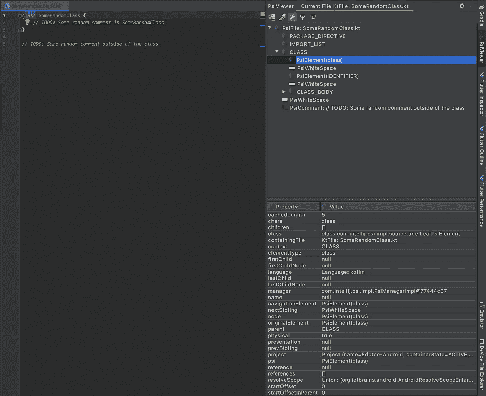
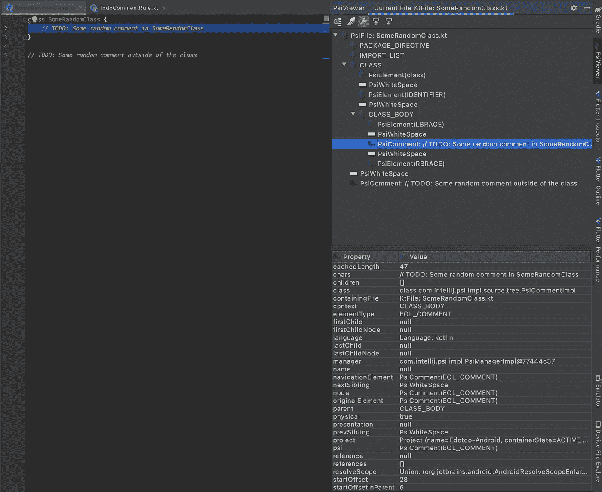
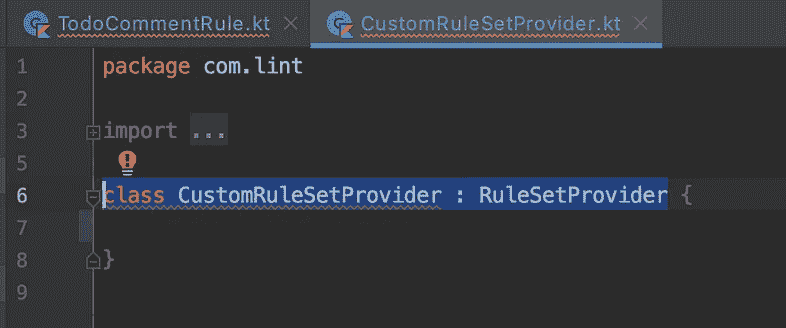
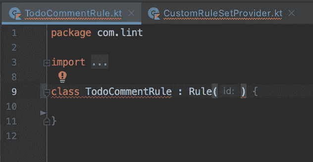
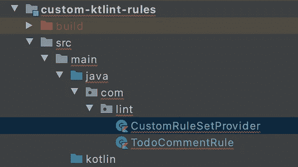
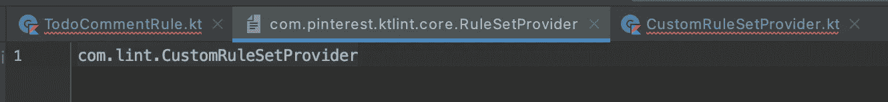
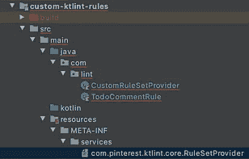
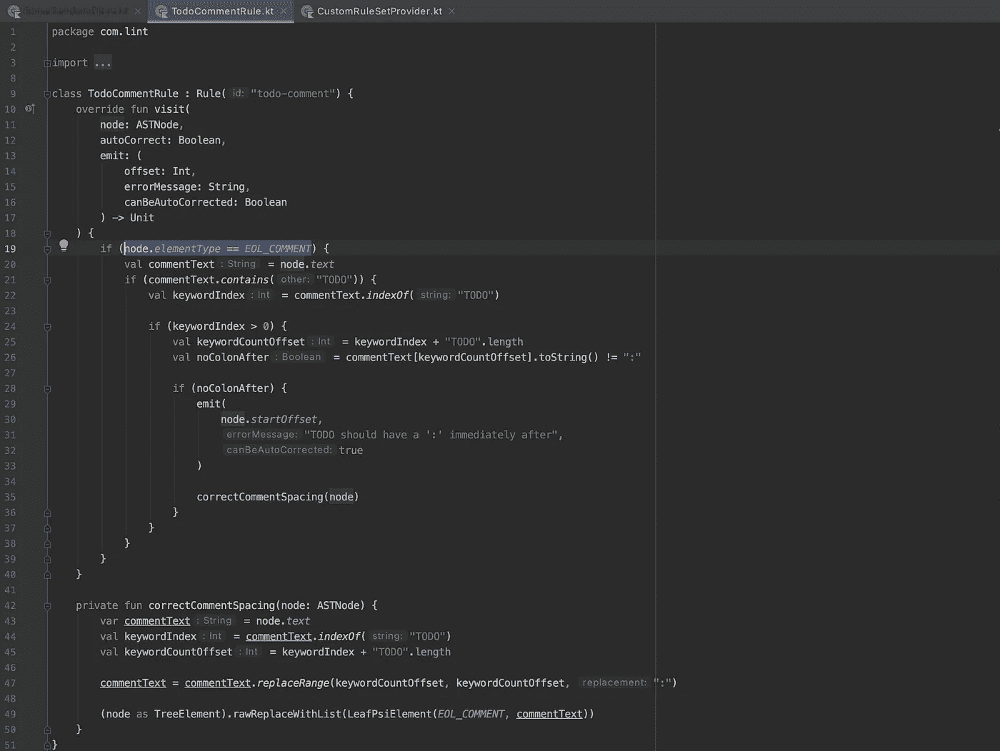

# 像写 Psi-chic 一样写自定义的 Android/Kotlin 林挺规则！

> 原文：<https://itnext.io/write-custom-android-kotlin-linting-rules-like-a-psi-chic-e081e032da2f?source=collection_archive---------4----------------------->


## 利用 Ktlint & PsiViewer 增强您团队的林挺工作流程。

# 目录

∘ [前言](#918d)∘[鸡，还是蛋？](#4ec1)
∘ [潜入母体](#6dbb)
∘[get psi-ched](#2134)
[psi-viewer](#f972)
[好玩的部分(实现)](#d936)
∘ [等一下](#96a5)
∘ [预设置](#608f)
∘ [设置](#93bb)
[好东西](#73a2)
[包装](#3592)

## 前言

在我的[上一篇文章](https://medium.com/@jasondhl/ktlint-git-hooked-on-it-48f4e08d1c8b)中，我谈到了如何利用 git 钩子和 Ktlint 的力量来为您的团队的林挺工作流带来健康。在本文中，我将向您展示如何通过利用 Ktlint 中的自定义规则集来改进这一点。是啊！自定义林挺规则！

## 鸡肉，还是鸡蛋？

在我搜索如何使用自定义林挺规则的过程中，我看到了不少文章，讨论如何反复编写或多或少相同的林挺规则。

现在，可以说我不擅长谷歌搜索，但真正让我头疼的是，在每篇文章的结尾，我仍然不知道如何开始编写自定义规则。

好吧，酷，我写了我的第一个“没有内部导入”规则，太好了。但是我如何使用这些知识来编写其他规则呢？首先，linter 怎么知道它在看什么，我怎么知道要*告诉它*去寻找我想要它检查的东西？当我甚至不知道它是如何构造的时候，我怎么能写规则呢？

为此，我们需要理解代码实际上是如何编写的。

## 潜入母体

我们生活在一个非凡的时代，我们拥有先进的 ide，能够动态地执行代码分析，并对我们遗漏分号或编写真正多余的表达式大喊大叫，代码编译需要几分钟甚至几秒钟(如果在过去我是多么粗心，我会浪费无数的时间和打卡)。

我们的编程语言随着我们的工具一起进化，但是就像人类语言中的语法一样，无论是旧的还是新的编程语言都有一个基本的结构。

这种语法结构就是像 Android Studio 这样的 IDE 如何知道你在函数闭包的开始错过了一个空格。特别是在 Android Studio 和 Kotlin/Java 的环境中，JetBrains 开发了一个*“解释器”*来查看代码如何编写的模式，这个“解释器”被称为 **UAS(通用抽象语法树)**。

我不会假装理解它是如何工作的，相反，我将在本文末尾链接参考资料，但您应该知道的是，这使得使用工具来识别常见的代码结构成为可能。这个工具是一个名为 [PsiViewer](https://plugins.jetbrains.com/plugin/227-psiviewer) 的插件。

## 获得 Psi-che

**PSI**

PsiViewer 只是一个方便的图形用户界面插件，让浏览这个界面结构不那么痛苦。不依赖于外部插件，还有其他方法可以查看树结构，但是输出将在终端中打印出来，我将向您展示为什么这是一个等待的坏时机。

当我第一次发现这个工具并理解它时，这是一个令人兴奋的发现(请注意，我仍然不理解它的大部分)，就像《黑客帝国》中的山谬·里维一样，我能够看到世界是如何形成的。

那么，让我停止我的漫谈，让我们看看工具本身，好吗？

# Psi 查看器

> 没有人能被告知矩阵是什么，你必须自己去看。

为了更清楚地说明如何使用这个插件，让我用两张图片来说明我的观点:



图片 A



图片 B

位于 Android Studio 右侧面板的 Psi 查看器的视觉层次结构:

1.  右上角的面板代表了这个文件的 PSI 结构，我将它命名为“SomeRandomClass”。
2.  右下方的面板是*的详细分解，只是代码中突出显示的部分，*即`class`关键字。

因此，在**图像 A** 中，我的光标高亮显示/悬停在`class`上，正如你所看到的，在右侧的 Psi-Viewer 面板中有很多单词，但是，我们最关心的是在右下方的面板中，在`Property`列下，有一个名为`elementType`的字段。对于**图片 A，**高亮显示为`class`，其中，我们*终究是*高亮显示一个类关键字声明。

更有趣的是，当我们查看**图像 B** 时，当我们高亮显示`TODO`注释时，它会告诉我们`elementType`是一个`EOL_COMMENT`。这向我们展示了代码如何构造的完整蓝图，以及我们如何识别代码的类型，就像我们识别枚举一样。

“所以呢？这对我们有什么帮助？搞什么杰森，这什么也没告诉我们😖”，嗯，我认为这是文章中我们应该用代码油脂弄脏手的部分。

# 有趣的部分(实现)

## 等一下

这里的假设是，你已经有一个 Android 项目启动并运行，带有主`app`模块，以及 2 个`build.gradle`文件；一个用于`app`模块，另一个用于整个项目本身。

此外，我是从 Mac 用户的角度来写这篇文章的，同时也是在一个正在进行的项目中实现的，所以你的收获可能会有所不同。

## 预设置

下载 Android Studio 插件 [PsiViewer](https://plugins.jetbrains.com/plugin/227-psiviewer) 来辅助查看代码的结构。如果你不确定如何在 Android Studio 中下载插件，只需在 mac 上按下`CMD + SHIFT + A`(或者在 Windows 上按下`CTRL + SHIFT + A`即可打开全局动作搜索栏，输入“**插件**”，然后在市场中搜索。

## 设置

首先，我们需要将 Ktlint 作为我们的主要林挺引擎(PsiViewer 也可以应用于其他林挺机制，但是在本文中，我们只关注 Ktlint)

*   在你的项目根文件夹中创建一个单独的模块(它应该和你的`app`模块在同一层，你可以随意命名。我给我的取名`custom-ktlint-rules`
*   将这个新模块中的`build.gradle`文件配置如下(这对于确保我们使用的是`ktlint`的 pinterest 版本非常重要)

```
plugins {
    id "kotlin"
    id "java-library"
    id "maven"
}dependencies {
    implementation "org.jetbrains.kotlin:kotlin-stdlib:0.33.0"
    compileOnly "com.pinterest.ktlint:ktlint-core:0.33.0" testImplementation "junit:junit:4.12"
    testImplementation "org.assertj:assertj-core:3.12.2"
    testImplementation "com.pinterest.ktlint:ktlint-core:0.33.0"
    testImplementation "com.pinterest.ktlint:ktlint-test:0.33.0"
}compileKotlin {
    kotlinOptions.jvmTarget = "1.8"
}
compileTestKotlin {
    kotlinOptions.jvmTarget = "1.8"
}
```

*需要注意的是，在撰写本文时，这是最新的依赖版本，根据版本的不同，可能会有不兼容的问题，所以请记住这一点，以防出现错误。*

*   接下来，在定制模块(我们刚刚创建的`custom-ktlint-rules`模块)中，创建两个分别扩展`RuleSetProvider`和`Rule`的类。您应该会得到类似这样的结果(暂时忽略编译错误，我们一会儿就会看到):



第三张图片是此时你的模块目录应该是什么样子。

*   接下来，在自定义模块的`src->main`目录下创建一个文件夹，命名为`resources/META-INF/services`，在这个目录下，新建一个名为`com.pinterest.ktlint.core.RuleSetProvider`的文件。现在，在*这个*文件中，您需要引用您的自定义`RuleSetProvider`类，在本例中，是我们刚刚在上面创建的`CustomRuleSetProvider`类。



*   最后，回到你的`app`模块的`build.gradle`，确保你在`dependencies`下包含了`ktlintRuleset project(‘:custom-ktlint-rules’)`
*   这就是完成的设置过程！

*还要注意，您可能需要将* e `classpath("org.jlleitschuh.gradle:ktlint-gradle:9.3.0)` *包含到您的***root**`**build.gradle**`**的`dependencies` *块中，因为可能会出现一些编译错误，我还没有找到根本原因。它本质上与之前的* Pinterest *依赖项相同，只是一个故障安全实现。***

# **好东西**

**好的，谢谢你一直坐着，这很重要，相信我，我知道。但我发誓现在事情会变得更有意义。*咳嗽*好，下一个:**

*   **回到我们之前刚刚编写的`CustomRuleSetProvider`类，复制并粘贴以下代码:**

```
class CustomRuleSetProvider : RuleSetProvider {
    override fun get() = RuleSet(
        "custom-rule-set",
        TodoCommentRule(),
    )
}
```

**所以这实际上是用 id`custom-rule-set`(或者你想叫它什么)声明这个新的规则集，并且声明你想要的定制规则。在这种情况下，是我们的`TodoCommentRule`！**

**现在，我将把整个代码实现粘贴到这里:**

```
class TodoCommentRule : Rule("todo-comment") {
    override fun visit(
        node: ASTNode,
        autoCorrect: Boolean,
        emit: (
            offset: Int,
            errorMessage: String,
            canBeAutoCorrected: Boolean
        ) -> Unit
    ) {
        if (node.*elementType* == *EOL_COMMENT*) {
            val commentText = node.*text* if (commentText.*contains*("TODO")) {
                val keywordIndex = commentText.*indexOf*("TODO")

                if (keywordIndex > 0) {
                    val keywordCountOffset = keywordIndex + "TODO".length
                    val noColonAfter = commentText[keywordCountOffset].toString() != ":"

                    if (noColonAfter) {
                        emit(
                            node.*startOffset*,
                            "TODO should have a ':' immediately after",
                            true
                        )
                    }
                }
            }
        }
    }
}
```

**是的，一整块格式不佳的代码(感谢 Medium)，但是，唯一重要的是:**

*   **`todo-comment`的`id`被传递到`Rule`的构造函数中以唯一标识该规则。**
*   **覆盖`visit`方法，以便 linter 知道基于您的定制实现应该注意什么。**

**还记得我不久前发布的**图片 A** 和**图片 B** 吗？看到熟悉的东西了吗？是的，那个`EOL_COMMENT`。**

**对于你们当中更有眼力的人来说，你们可能已经意识到这个定制规则是一个用来过滤代码注释中的违规的规则，特别是对于 TODOs。更具体地说，它检查在`:`符号后面是否有空格，这意味着像`TODO:no space after the colon lollll`这样的注释在这个规则下会失败，但是`TODO: This is fine`会飞起来。**

**现在，我知道，我知道，检查违规的算法写得很糟糕，不能检查过多的情况，但是，我只是希望当时有一些工作，所以，放我一马？是的，我知道，这不是最性感的习俗，就像，我已经可以听到人们说“真的吗？所有这一切都是为了 TODO 后面的一个微不足道的间距？”，但是，在我的辩护中，这篇文章是关于如何编写自定义规则，而不是如何编写*伟大的*自定义规则。我相信你能比我做得更好😉**

**总之，因为 Psi-Viewer 已经帮助我们识别了特定代码块的类型，所以我们可以通过被覆盖的`visit`方法的`node.elementType`来定位该类型的代码，并通过`emit(node.*startOffset*, “TODO should have a ‘:’ immediately after”, true)`向我的不知情的同事发出一个错误**

**在我的例子中，我甚至编写了一个快速的方法来修复这个违规，如下图所示:**

****

# **包裹**

**我知道这是一篇相当长的文章，在这方面还有很多东西需要探索。但是，如果你设法坚持到现在，并且你感觉到了我发现如何做到这一点时的那种眩晕感，那么也许这是值得的。**

**我并不天真，我知道考虑到潜在的回报，一个团队将时间投入到像定制林挺规则这样的小众事物上可能是不值得的。但是，如果你的团队的 PR 注释被关于风格选择的注释所困扰，或者，甚至更多的功能情况，比如“如果在一个片段中有一个`RecyclerView`，类名应该有一个‘listing’后缀”，这可能是你的团队技术堆栈中的一个银弹。**

**毕竟，自动化在前期几乎是不值得的，但是从长期来看，它将确保所做的决策比开发团队的租约更长久。母体终究是永恒的。**

**如果你想看看我以前的一篇文章，其中我谈到了利用 git 挂钩来改进你的团队的林挺工作流，[请点击这里](https://medium.com/@jasondhl/ktlint-git-hooked-on-it-48f4e08d1c8b)！**

**否则，请在 twitter 上关注我，了解我对技术、发展和生活思考的更多想法:)**

## **参考**

1.  **[Psi 查看器和自定义林挺规则](https://www.kotlindevelopment.com/formatting-code-analysis-rule-with-android-lint/)(强烈推荐阅读)**
2.  **[用魔石自定义 Ktlint 规则](https://www.glureau.com/2020/05/26/Ktlint-Moshi-Introduction/)**
3.  **[编写你的第一个 ktlint 规则](https://medium.com/@vanniktech/writing-your-first-ktlint-rule-5a1707f4ca5b)**