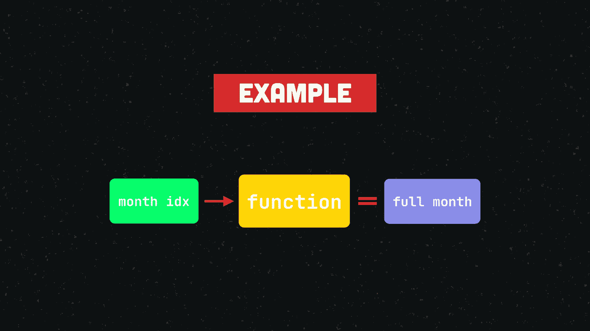
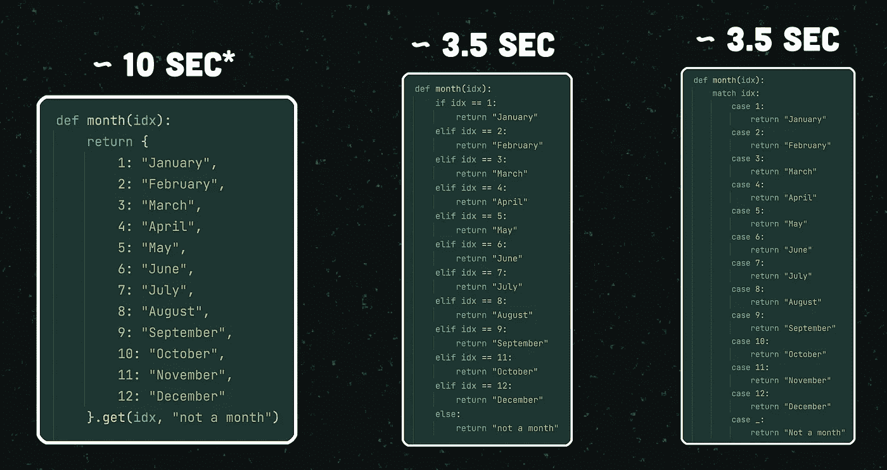
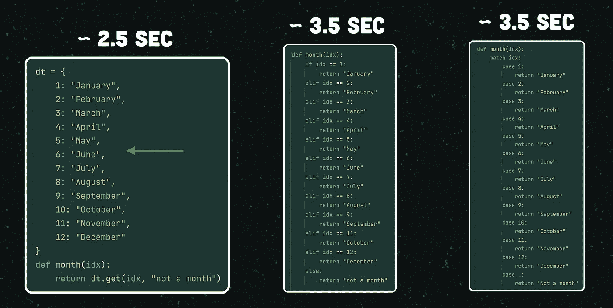
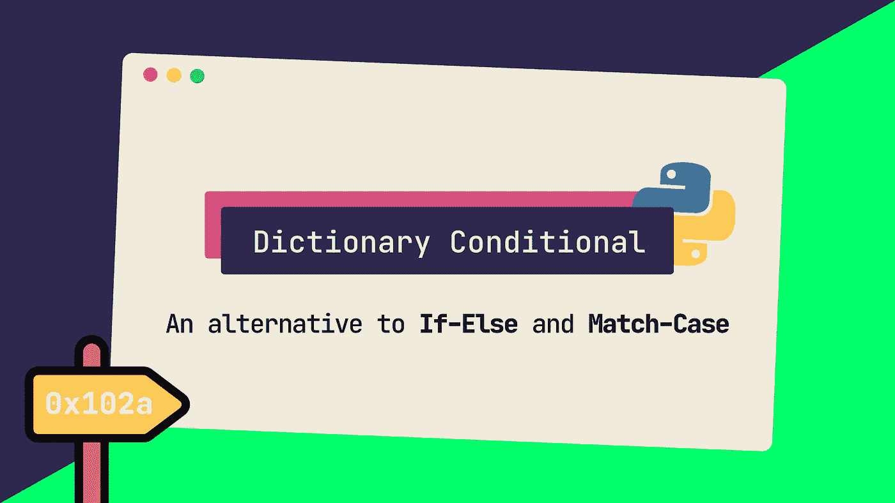

# 写更短的条件句(使用字典)

> 原文：<https://itnext.io/write-shorter-conditionals-using-dictionaries-python-snippets-4-f92c8ce5eb7?source=collection_archive---------2----------------------->

## 经典 If-Else 语句和新的 Match-Case 语句的简明替代。

大家好，这里是 Thijmen，在这篇文章中，我将演示经典的 *If-Else* 语句和 Python 3.10 中引入的新的 *Match-Case* 语句的简洁替代。

这篇文章在 YouTube 上也有视频格式。

## 优点和缺点

这种方法使用一个字典来获得一个条件语句，其中**比**少，而**比**代码更可读。它不会取代代码中的所有 If-Else 或 Match-Case 语句，但在很多情况下它肯定是有用的。

唯一的缺点是它*可能*以运行时间的微小减少为代价。本文稍后将详细介绍这一点。

## 示例案例

假设我们想要创建一个函数:

1.  接受一个数字作为参数。
2.  验证该数字是否对应于一个月。
3.  返回该特定月份的全名。

如果提供的参数不是有效的月份索引，我们将返回一个字符串，指示输入无效。

示例案例的抽象表示。

如果我们要使用一个 *If-Else* 语句，该函数将如下所示:

使用 If- *Else 的示例案例。*

另一种方法是使用最近发布的*匹配案例*语句:

使用匹配案例的示例案例(Python 3.10 及更高版本)。

我想强调的是，这两种方法本身都没有问题。毕竟，代码是有效的，并且做了它需要做的事情。

但是就**代码清晰度**而言，我认为还有更多的收获。

## 字典法

第一步是返回一个字典，该字典使用月份的索引作为键，使用相应的名称作为值。

字典方法:步骤 1

随后，我们使用`.get()`方法获得月份的名称，该名称实际上属于我们作为函数参数提供的数字。

字典方法:步骤 2

这个方法的伟大之处在于，当请求的键不是字典的一部分时，我们还可以指定一个*默认值* *返回值* *值*。在我们的例子中，这是字符串“不是一个月”。

字典法:搞定！

这就是真正的意义所在。整洁，对不对？

## 速度比较

正如我所承诺的，我想用一个快速的速度对比来结束这篇文章。

如果我们把我刚刚举例说明的每月百万次的字典方法称为*，我们的总运行时间大约是 10 秒。*

使用`If-Elif-Else`时大约为 3.5 秒，使用`Match-Case`时大约为 3.5 秒。

一百万次迭代的速度比较(函数范围内的字典)。

虽然我们的字典 conditional 的性能最低，但理解这种差异的来源是很重要的。

因为我们在的`month()`函数中定义了我们的字典*,所以它必须为每个函数调用构造一次，这是相当低效的。如果我们在函数之外定义字典并重新运行实验，我们将获得最快的运行时间，大约 2.5 秒:*

一百万次迭代的速度比较(字典在函数范围之外)。

## 背景很重要

在代码清晰度和运行时间方面最适合你的当然是**取决于你** *。你会知道对你的具体项目来说什么更重要。*

把这个方法看作是你工具箱中的另一个工具，它有时适合这项工作，有时不适合。

总之，这篇文章就到这里。希望你觉得有用，下次再见！

如果你从这篇文章中学到了一些新东西，请考虑订阅我的 YouTube 频道。谢谢！🙂

*这篇文章和相应的视频是我的 Python 片段系列的一部分，其中我们以字节大小的格式涵盖了围绕 Python 编程的各种主题。*

