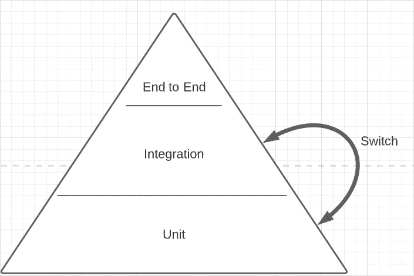

# 有效的自动化测试

> 原文：<https://itnext.io/write-valuable-automation-tests-a6148ff6090c?source=collection_archive---------1----------------------->

自动化测试不是惩罚。他们的目的不是满足验收标准，通过代码审查，或者满足代码覆盖工具。它们通过防止回归提高了代码的可信度，并减少了手工测试所花费的时间。以下几点说明了如何更有效地使用它们。

# 测试行为，而不是实现

*挑战:*只使用函数的输出和参数(签名)编写函数测试。这种策略是测试驱动开发的一个关键组成部分，并将产生更简单的应用程序代码。如果这被证明是有挑战性的，考虑拆分职能以减少复杂性和责任。

下面将以假函数为例。它增加一个数，确保下一个数大于前一个数。

一个人为的增加数字的例子——适用于其他语言。

实现测试的目标是函数的内部，以确定如何设置和模拟。

使用实现来确定模拟的示例测试

行为测试关注的是结果，并且只能改变函数参数的值(在本例中是没有)。

关注 getNextSequence 函数行为的示例测试

两个测试都通过了，但是关注实现的测试没有通过下面的重构。

`getNextSequence`函数的行为没有改变，应用程序仍然工作。然而，实现测试的目标是一个不再存在的隐藏细节，并设置了一个不再有效的模拟。它会失败，这是一个**假阴性**。

## 什么是假阴性？

一个假阴性是当一个测试失败时，即使该功能按预期工作；失败不是一个合理的应用程序错误。

## 假阴性的危险

*   开发人员对测试失去了信心。在编写代码时，通常会手动测试代码变更(TDD 可能并不总是遵循)。开发人员会认为别人写的失败的测试是不可靠的，可能会因为浪费时间去理解、更新或删除它而感到沮丧。
*   **开发者对应用失去信心。当一个代码库因糟糕的测试而声名狼藉时，像升级框架这样的大规模改变就会变得令人生畏。这些改变最终被搁置或从未完成。**
*   **故障排除造成的时间损失。**数百行设置会使根本原因分析变得困难。花在测试代码中诊断 bug 的时间本可以用在应用程序中的 bug 上。一个更短的解决方案是禁用被破坏的测试，这会导致覆盖率和可信度的损失。
*   **建造时间翻倍或三倍。**间歇性失败的测试是不可靠的。当构建可以通过重新启动来修复时，这就成了故障排除的第一步。当开发人员接受这一规范时，他们可能直到第二次或第三次尝试才看到失败构建的输出。
*   **增加了人工测试。如果自动化测试不被信任，团队将会退回到手工测试。手动测试速度较慢，容易出现人为错误，而且成本较高，但却提供了缺失的信心。**

## 什么是误报？

当测试通过时，即使应用程序被破坏，也会出现误报。

在前面的示例中，`generateId`正在被存根化。假设实际函数有如下定义。

```
let counter = 0;
function generateId() {
  // Counting down, not up!
  counter -= 1;
  return counter;
}
```

实现测试会错误地通过，因为我们用假数据覆盖了返回值。行为测试将陷入无限循环，超时，并成功失败。

奖励示例:

```
test('create user', function () {
  createUsers()
    .then((user) => {
      expect(user.id).to.not.be.null();
    });
});
```

上面的测试没有等待异步`createUsers`调用完成，所以不管结果如何，它都会通过。根据测试框架的不同，有多种修复方法可用。

```
// Include a done callback
test('create user', function (done) {
  createUser()
    .then((user) => {
      expect(user.id).to.not.be.null();
      done();
    });
});// return the createUser() promise
test('create user', function () {
  return createUser()
    .then((user) => {
      expect(user.id).to.not.be.null();
    });
});// use async/await. The test will catch unhandled exceptions
test('create user', async function () {
  const user = await createUser();
  expect(user.id).to.not.be.null();
});
```

不幸的是，这些类型的误报可能会逃过代码审查。

预防它们的方法:

*   使用 lint 插件，如 [prefer-expect-assertions](https://github.com/jest-community/eslint-plugin-jest/blob/master/docs/rules/prefer-expect-assertions.md)
*   对于测试驱动的开发，测试从失败状态开始，直到编写了实现才会通过。
*   有些框架，像 [ava](https://github.com/avajs/ava) ，除非做出断言，否则不会通过测试。

## 假阳性的危险

*   开发人员对测试失去信心。测试失败了，这是他们唯一的任务。还有哪些测试实际上并不测试任何东西？
*   **质量保证(QA)对开发人员失去信心。尽管通过了自动化测试，QA 测试人员还是会对测试环境中引入的明显错误感到沮丧。他们会更慢地接受自动化的理念，并觉得有必要手动验证每张票。**
*   **bug 发货生产。自动化测试的一个好处是及时验证系统的每个部分。QA 测试员是人，根据公司的不同，是不存在的。客户获得了报告 bug 的责任，这有时可能会导致节目停止。他们可能懒得报告，要么默默地怨恨应用程序，要么转移到另一个平台。**

# 代码覆盖率是一个指南，而不是代码质量的衡量标准

像`nyc`这样的工具，通知代码行缺少测试覆盖，给一些管理者的思维带来了有害的变化。百分之百的测试覆盖率产生递减的回报。这种心态鼓励测试实现细节，以便覆盖每个 if 语句，而不管对行为的影响。在`getNextSequence`的例子中，开发人员的时间被浪费在为一个不必要的实现测试建立模型，然后诊断一个有效重构产生的假阴性。

这并不意味着覆盖工具是无用的。代码覆盖工具是用来提供帮助的，而不是发号施令的。他们可以在测试完全缺失的地方找到疏忽，或者提供弹药向产品所有者提出关于代码可信度的案例。

# 不要依赖嘲讽库

许多开发人员认为嘲笑像`sinon`这样的库是一种代码味道。

> "代码气味是一种表面迹象，通常对应于系统中更深层次的问题."~马丁·福勒

模拟可用于访问未通过参数或类变量公开的内部代码。然而，在远离测试实现细节之后，对它们的需求就减少了。其他的可以通过依赖注入模式移除。请参见下面示例的调整。

ID 生成器函数作为参数传递，而不是导入

可以直接传递一个函数，而不是存根`generatorIdFunction`:`getNextSequence((lastSequence) => { return lastSequence + 1; });`

虽然 mocks 可能不是必需的，但它们确实有一个方便且富于表现力的 API: `expect(callback).to.be.calledOnce();`然而，它们应该只能通过参数进行有限的访问。

## 处理第三方库

第三方库不是嘲笑库的理由。使用依赖注入，一个接口很容易被替换成一个假的实现。

```
import serverUploader from "./serverUploader";const uploadToServer(file) {
  if (!file) {
    // This is what we're testing
    throw new Error("You didn't include a file!"); 
  }

  serverUploader.upload(file);
}
```

不要导入`serverUpload`，而是将其作为注入的依赖项。

```
const uploadToServer(serverUploader, file) {
  if (!file) {
    throw new Error("You didn't include a file!"); 
  }

  serverUploader.upload(file);
}
```

或者

```
class ServerUploader {
  constructor(serverUploader) {
    this.serverUploader = serverUploader;
  } uploadToServer(file} {
    if (!file) {
      throw new Error("You didn't include a file!"); 
    }

    this.serverUploader.upload(file);
  }
}
```

随着对`serverUploader`访问的增加，提供一个`() => { // do nothing }`的假实现变得微不足道。

## **应尽可能测试第三方代码**

像`moment.js`这样的外部库有它们自己的测试，所以没有必要覆盖每一种情况，但是明智的做法是覆盖应用程序正在使用的情况，或者至少不故意排除它们。进行这些测试可以捕捉升级版本的错误，并确保在切换到像`luxon`这样的库时功能仍然存在。

# **不测试常量和变量赋值**

```
function getTodoAction(title) {
  return { type: 'ADD_TODO', title };
}test('returns todo action', function () {
  const todo = getTodoAction('Test');
  expect(todo.type).to.equal('ADD_TODO');
  expect(todo.title).to.equal('Test');
});
```

这个例子可能看起来很极端(我见过)，但是经常发生在受代码覆盖工具支配的开发人员身上。

这里没有什么可测试的，因为没有行为。上面的测试是测试一个变量被赋值，这是语言最基本的功能之一。如果失败了，将会有更大的问题需要解决。

这种测试不仅没有增加价值，而且还减少了价值。每次开发者改变动作的结构或者类型的名字，他们也必须修复**假阴性**测试失败。

这些线将被集成和端到端测试隐式地覆盖。

# 以小块的形式提取和测试遗留代码

有时候编写测试是一个巨大的负担，尤其是在处理没有考虑测试的遗留代码时。害怕接触这些代码的开发人员将依赖手工验证来减少工作量。

将代码分割成逻辑上可管理的块可以减轻负担:在一个 2000 行的函数中取 100 行相关的代码，并将它们提取到一个单独的文件中。通过分离，可以毫不费力地添加依赖注入等模式。

劈了一小块后，**停止**。遗留代码可能不会经常更改，而且可能没有多少人完全理解它。由于缺乏自动化，较大的变更会带来风险。为什么不发布一个小的改变，然后在以后的日子里再拆分更多呢？

如果经理/员工要求彻底改变，这可能无法实现，尽管让他们参与进来的一个方法是使用关键词**减轻**和**风险**。

遗留代码库的另一个困难是过时或写得不好的测试。处理一个 2，000 行的测试文件是很困难的，尤其是当测试相互依赖的时候。幸运的是，为同一个目标拥有两个测试文件是一个合理的解决方案。为新测试创建一个新文件，并将旧文件重命名为`filename.deprecated.test.js`。

# 编写独立的测试

隔离测试让开发人员更加确信其他测试数据不会产生误报和漏报。考虑下面的例子。

```
test('user is created', async function () {
  for (let i = 0; i < 10; i += 1) {
    await createUser();
  } const users = await getUsers();
  expect(users).to.have.lengthOf(10);
});
```

这个测试本身不会清理，这意味着在它之后运行的每个测试在数据库中都有十个用户。或者，它可能是另一个没有清除的测试的受害者，这可能导致它意外失败并且难以诊断，特别是如果该用户是在另一个文件中创建的。

更安全的方法是每次测试都从一个新的数据库开始，即使运行时间更长。

```
beforeEach(function () {
  cleanDatabase();
});
```

# 使用测试驱动开发(TDD)

这种方法论让一些人呻吟；其他人质疑其可行性。目标是在编写函数的实现之前编写函数的测试，使用函数的预期行为作为指南。对于习惯于测试实现细节的人来说，这个任务似乎不合理。

遵循 TDD 有助于开发人员…

*   想想他们的界面和反应
*   保持小的功能，只有一个责任
*   避免测试实现细节——现在还没有！
*   想想依赖注入，导致更少或没有模仿。

何时不使用它:

*   **创建概念证明时**。这是可以接受的有明显错误的代码。动作要快，不要费心写测试，因为这只是一个你要扔掉的实验。自动化的缺乏可能会被用作破坏它的杠杆，因为产品所有者可能想要发运它。
*   **最终架构不明朗时。有时开发人员直到开始实施时才知道实施中涉及到什么。他们想不出任何类和函数签名，因为他们仍然不确定他们是否采取了正确的方法。在这个阶段编写测试只会浪费时间，因为你很可能会删除/重写它们。**

# 消除测试中的随机性

由于样本的多样性，引入随机性似乎很有吸引力。

```
test('planet is created', function () {
  planets = ['mars', 'pluto', ...theRestOfThem];
  randomPlanet = selectRandomFrom(planets); const planet = createPlanet(randomPlanet); expect(planet.name).to.be.oneOf(planets);
}
```

这种测试有几个主要缺点:

*   如果这项测试在冥王星(即`planets.filter(p => p !== “pluto")`)上失败，将很难诊断，尤其是在包括银河系以外的行星时。这将被视为**假阴性**，因为测试样本不符合排除 Pluto 的业务要求。
*   如果没有记录，导致失败的星球将是未知的。为测试进行日志记录是一种代码味道。
*   不太可能在本地重现故障，构建将在下一次 CI 运行时传递。该测试将被认为是片状的并被忽略，破坏了增加随机性的初衷。
*   每个测试运行只检查一个案例。如果所有的行星都需要检查，那么在大多数框架中可以将它们分成单独的测试。

```
test.each(planets, 'planet x is created', function () { ... }
```

*   想象一下`createPlanet`调用 trims 的名字:`planet.name.slice(0,4)`。这项测试在所有情况下都会失败，除了火星(只有银河系)，在那里它会产生一个**假阳性。**

> 类似的事情也发生在我身上。有人在我修改的代码测试中加入了随机性。奇迹般地，测试在本地通过了(10 分之一的机会)，并且再一次通过了我的公关。然而，一旦它被合并，我的运气就用完了，每个人的构建都开始失败。我浪费时间试图诊断环境变量的差异，却发现测试是罪魁祸首。

# 编写更多的集成测试

> 编写测试。不太多。主要是整合。吉列尔莫·劳赫



就价值而言，集成测试>单元测试>端到端测试，不一定是频率

一个新的范例正在出现，将集成测试放在测试金字塔中最有价值的位置。测试通过以与用户相同的方式运行代码来确保功能和外部系统之间的内聚性。尽管它们可能覆盖了一些单元测试，**单元测试仍然是有价值的。**

集成测试…

*   通过像用户那样使用代码来提供更多的信心。
*   限制对实现细节的暴露。唯一可用的访问是输入和输出。
*   比端到端测试更可靠、更快速，后者引入了外部变量，如浏览器、延迟和操作系统。
*   更少的假阳性和假阴性。
*   运行时间比单元测试长，因为它们可能会与外部系统(如数据库)交互。

最后一点只是现代处理器的一个小缺点。如果主要关注的是开发速度，有以下几种选择:

*   慢点。匆忙的代码容易出现人为错误。即将到来的最后期限真的值得因为 bug 而失去客户吗？
*   限制范围可以为测试创造更多的时间。
*   许多测试框架都有一个`--watch`命令，只运行与变更相关的测试。*国旗不会在 CI 渠道上运行。*
*   考虑一个可以异步或者在分布式环境中运行测试的框架。毕竟，**测试不应该互相依赖。**
*   本地禁用无关测试。大多数框架都有一个选项，只运行当前正在处理的文件或测试。(即`describe.only('...`)

# 结论

将与应用程序代码相同的质量放入测试中。如果一个测试没有价值，不要害怕重写它或者完全删除它。不要把测试覆盖率看得太重。考试是为了提供信心，而不是负担或琐事。