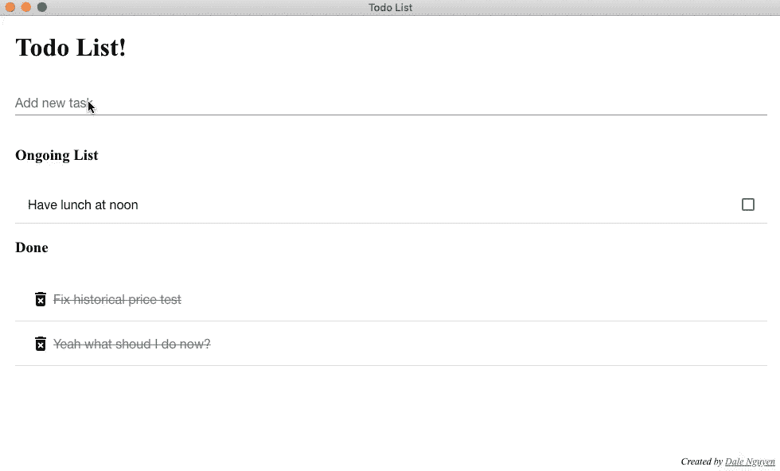
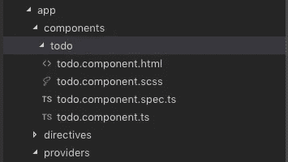

# 用电子和角度写你的第一个桌面待办事项应用

> 原文：<https://itnext.io/write-your-first-desktop-todo-app-with-electron-and-angular-d799c9920a85?source=collection_archive---------3----------------------->



我想你听说过阿特伍德定律。

> *“凡是**能用 JavaScript 写的，**最终都会用 JavaScript 写。”
> —杰夫·阿特伍德，作家，企业家，StackOverflow 的联合创始人*

你可以用 JavaScript([Ionic Framework](https://ionicframework.com/))编写混合或原生移动应用，现在你甚至可以用 JavaScript ( [Electron](https://electronjs.org/) )创建桌面应用(Windows、Mac、Linux)。

基本上我的脑子都被 JavaScript 的能力炸了。我会让它沉淀一会儿。

如果你想检查代码和试用应用程序，你可以直接跳到我的 [github 库](https://github.com/dalenguyen/todo-app-electron-angular)。

[](https://github.com/dalenguyen/todo-app-electron-angular) [## dalen guyen/todo-app-电子-角度

### 一个简单的 Todo 应用程序的 Windows，Mac 和 Linux 是通过电子 4 和角 7 创建的…

github.com](https://github.com/dalenguyen/todo-app-electron-angular) 

现在，我将向你展示我如何用 Electron 4 和 Angular 7 创建一个简单的待办事项应用程序。

特点:

*   创建新任务
*   拖放任务
*   删除已完成的任务
*   应用有角度的材料进行造型

1.  **从样板文件开始** : [角电子](https://github.com/maximegris/angular-electron)

如果你不想使用 Angular，你可以从[electronic Forge](https://electronforge.io/templates)查看其他模板，如 React、Vue、Vanilla…

克隆样板文件后，您需要安装软件包。

```
npm install
```

之后，对于拖放和样式功能，我们还需要安装一些额外的包。

```
npm i -D @angular/cdk @angular/material @angular/animations hammerjs
```

然后将必要的模块导入 **app.module.ts**

```
// app.module.tsimport { BrowserAnimationsModule } from '[@angular/platform-browser](http://twitter.com/angular/platform-browser)/animations';
import { DragDropModule } from '[@angular/cdk](http://twitter.com/angular/cdk)/drag-drop';import {MatGridListModule} from '[@angular/material](http://twitter.com/angular/material)/grid-list';
import {MatInputModule} from '[@angular/material](http://twitter.com/angular/material)/input';
import {MatIconModule} from '[@angular/material](http://twitter.com/angular/material)/icon';
import {MatListModule} from '[@angular/material](http://twitter.com/angular/material)/list';...[@NgModule](http://twitter.com/NgModule)({
  ...
  imports: [    
    BrowserAnimationsModule,
    MatGridListModule,
    MatInputModule,
    MatIconModule,
    MatListModule,
    DragDropModule
    ...
  ],
})
```

我们可以在 style.scss 中包含一个预构建的主题

```
// style.scss// Angular Material
@import "~@angular/material/prebuilt-themes/indigo-pink.css";
```

有些组件在 HammerJS 上回复为手势，我们就放在 **src/main.ts** 上

```
// src/main.tsimport 'hammerjs';
```

我们还需要添加材料图标到**index.html**

```
// index.html<link href="https://fonts.googleapis.com/icon?family=Material+Icons" rel="stylesheet">
```

2.**创建待办事宜组件**

您可以从样板文件中删除或重命名主构件。



*待办事项组件*

```
// todo.component.tsimport { Component, OnInit } from '[@angular/core](http://twitter.com/angular/core)';import {
  CdkDragDrop,
  moveItemInArray,
  transferArrayItem
} from '[@angular/cdk](http://twitter.com/angular/cdk)/drag-drop';export interface Todo {
  title: string;
  date: string;
}[@Component](http://twitter.com/Component)({
  selector: 'app-todo',
  templateUrl: './todo.component.html',
  styleUrls: ['./todo.component.scss']
})export class TodoComponent implements OnInit {
  value = '';public todo: Todo[] = [
    { title: 'Wake up', date: new Date().toString() },
    { title: 'Shopping', date: new Date().toString() },
  ];public done: Todo[] = [
    { title: 'Write a blog', date: new Date().toString() },
    { title: 'Study Electron', date: new Date().toString() }
  ];arr = [];constructor() {}ngOnInit() {}onSubmit() {
    this.todo.push({ title: this.value, date: new Date().toString() });
    this.value = '';
  }clearInput(event: MouseEvent) {
    if ((<HTMLElement>event.target).nodeName === 'MAT-ICON') {
      this.value = '';
    }
  }deleteTask(index: number) {
    this.done.splice(index, 1);
  }onAreaListControlChanged(index: number) {
    setTimeout(() => {
      const task = this.todo.splice(index, 1);
      this.done.unshift(task[0]);
    }, 1000);
  }drop(event: CdkDragDrop<string[]>, type: string) {
    if (event.previousContainer !== event.container) {
      transferArrayItem(event.previousContainer.data, event.container.data,
        event.previousIndex, event.currentIndex);
    } else {
      if (type === 'todo') {
        moveItemInArray(this.todo, event.previousIndex, event.currentIndex)
      } else {
        moveItemInArray(this.done, event.previousIndex, event.currentIndex);
      }
    }
  }
}
```

对于 Html 模板

```
// todo.component.html<div class="container">
    <h1>Todo List!</h1>
    <form class="example-form">
        <mat-form-field class="example-form-field">
            <input matInput type="text" placeholder="Add new task"              
              [(ngModel)]="value" 
              [ngModelOptions]="{standalone: true}" 
              (keyup.enter)="onSubmit()">
            <button mat-button *ngIf="value" matSuffix mat-icon-button aria-label="Clear" (click)="clearInput($event)">
              <mat-icon>close</mat-icon>
            </button>
        </mat-form-field>     
    </form> <p *ngIf="todo.length < 1">You're rock! There are no more tasks.</p>
    <div class="list">
        <h3 *ngIf="todo.length > 0">Ongoing List</h3>
        <mat-selection-list cdkDropList 
          [cdkDropListData]="todo" 
          [cdkDropListConnectedTo]="secondList" 
          #firstList="cdkDropList"
          (cdkDropListDropped)="drop($event, 'todo')">
            <mat-list-option *ngFor="let task of todo; let i = index" cdkDrag (click)="onAreaListControlChanged(i)">
              {{ task.title }}
              <mat-divider></mat-divider>
            </mat-list-option>
        </mat-selection-list>
        <h3 *ngIf="done.length > 0">Done</h3>
        <mat-list cdkDropList 
          [cdkDropListData]="done" 
          [cdkDropListConnectedTo]="firstList" 
          #secondList="cdkDropList"
          (cdkDropListDropped)="drop($event, 'done')">
            <mat-list-item role="listitem" *ngFor="let task of done; let i = index" cdkDrag>
              <mat-icon matListIcon (click)="deleteTask(i)">delete_forever</mat-icon>
              <s style="color: grey;">{{ task.title }}</s>              
              <mat-divider></mat-divider>
            </mat-list-item>
        </mat-list>   
    </div>  
</div>
```

给模板添加一些样式

```
// todo.component.scss.container{
  margin: 0 20px;  
}.example-form-field {
  width: 100%;
  button {
    border: none;
  }
}
```

编辑路由模块

```
// app-routing.module.tsimport { TodoComponent } from './components/todo/todo.component';
import { NgModule } from '[@angular/core](http://twitter.com/angular/core)';
import { Routes, RouterModule } from '[@angular/router](http://twitter.com/angular/router)';const routes: Routes = [
    {
        path: '',
        component: TodoComponent
    }
];[@NgModule](http://twitter.com/NgModule)({
    imports: [RouterModule.forRoot(routes, {useHash: true})],
    exports: [RouterModule]
})
export class AppRoutingModule { }
```

然后将 TodoComponent 添加到 **app.module.ts**

```
// app.module.tsimport { TodoComponent } from './components/todo/todo.component';[@NgModule](http://twitter.com/NgModule)({
  declarations: [
    AppComponent,
    **TodoComponent**,
    WebviewDirective
  ]
  ...
})
```

准备好 todo 组件后，您可以运行以下命令来测试应用程序:

```
npm start
```

我将打开一个带检查的新窗口，因此您可以工作并修改您的应用程序。对于生产，您可以通过以下命令构建跨平台桌面应用:

```
npm run electron:linux 
npm run electron:windows
npm run electron:mac
```

从现在开始，你可以开始玩这个简单的应用程序。如果你愿意，你可以在本地或者通过云(Firebase…)保存数据。

这只是一个简单的桌面应用程序项目，仅用于展示电子的能力。如果你想改善它，请随意制造问题或公关。