# 用 AWS Lambda 编写您的第一个无服务器应用程序

> 原文：<https://itnext.io/write-your-first-serverless-application-with-aws-lambda-9ff9c0f411a4?source=collection_archive---------3----------------------->

## 设置第一个无服务器应用程序的实践指南

无服务器应用程序最近越来越受欢迎。让我们浏览一下基础知识，并学习如何在几分钟内建立自己的无服务器应用程序。


照片由克里斯蒂娜@ wocintechchat.com/[Unsplash](https://unsplash.com/?utm_source=ghost&utm_medium=referral&utm_campaign=api-credit)拍摄

在本指南中，我们将了解无服务器应用程序的核心概念，并使用 AWS Lambda 构建一个无服务器应用程序。本指南不会教你如何编程，或如何编写 SQL，相反，它只专注于教你如何使用和编写无服务器应用程序。

*注意，本指南需要一个 AWS 帐户来设置一个无服务器 lambda。如果您没有 AWS 帐户，您可以继续学习，直到我们展示如何在本地运行无服务器应用程序。*

# 什么是无服务器应用程序？

没有服务器，我的代码如何运行？虽然我们称之为无服务器，但它并不完全无服务器。无服务器意味着，应用程序的代码被设置为在某个时间点被调用，并且只在它完成之前运行。对于 AWS，您需要为每毫秒的处理时间付费。

那么它不能在服务器上运行吗？从技术上来说，它确实运行在云提供商建立的基础设施上，例如 AWS。他们已经建立了一个基础设施，每当你调用应用程序的端点时，AWS 就会获取你的代码并在他们的服务器上运行。一旦完成，执行就会停止。

你还会发现无服务器应用程序被称为 FaaS，作为一种服务，因为有了无服务器应用程序，你管理的是功能而不是服务器。

# 为什么选择无服务器？

有多种原因可以解释为什么人们会选择无服务器路线。首先，规模较小的应用程序库更容易维护，发布速度更快。依赖性更少，开发人员不必担心破坏现有的功能。

因为您不需要管理基础设施和服务器，所以您不需要担心扩展问题，云提供商会处理这些问题。

每毫秒计费粒度使其非常适合那些不经常使用的应用程序。大约有 300 万次通话，你只需支付 18 美元。如果您的应用程序流量非常低，那么这将比租用服务器便宜得多。此外，这种计费粒度激励开发团队生产更快的代码，因为承认吧——缓慢的应用程序应该成为过去的一部分。

无服务器也被视为一种趋势。不幸的是，这不是无服务器的正当理由。如果你想学习编写无服务器应用程序，可以在业余时间做一些小项目，但是一定要明智地做出架构决策！

在 Google Trends 的下图中，我们可以看到 AWS 无服务器 Lambdas 是如何逐渐变得甚至比 Amazon 的 EC2 服务器实例更受欢迎的。

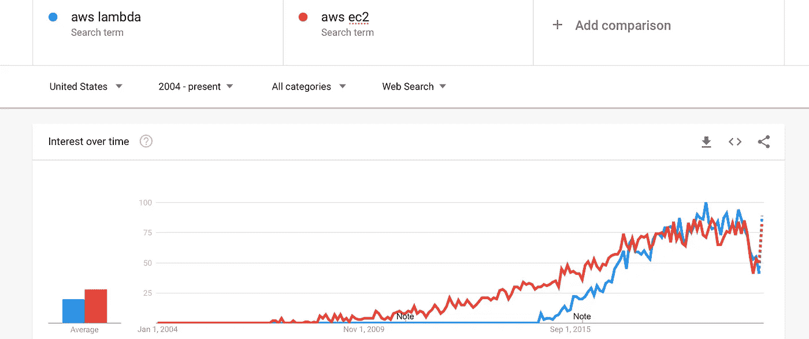

AWS Lambda 与 AWS EC2[谷歌趋势](https://trends.google.com/trends/)

# 为什么不总是使用无服务器？

无服务器应用程序也有明显的缺点。首先，应用程序只能在执行时运行。这意味着无服务器应用程序不能用于运行要求 24/7 开启的监听器。无服务器应用程序更多地用于短期的一次性请求。

*冷启动*是无服务器架构中的一个重要概念。这是您的云提供商检索您的应用程序代码，并开始在单独的执行环境中加载和运行它所需的时间。冷启动时间可能因您选择的云提供商而异。

解决冷启动的一个方法是让你的 T4 保持温暖。这意味着你的云提供商将让你的无服务器应用*准备好*执行，大大减少冷启动的时间。然而，长时间保持 lambdas 温暖，人们可能会想为什么不选择服务器架构来代替。如果冷启动对您的用例来说是一个问题，那么无服务器应用可能不是您架构中的最佳选择。

# 设置 Lambdas

让我们设置你的第一个 lambda！首先转到 [AWS 控制台](https://console.aws.amazon.com/console/home?nc2=h_ct)中的 Lambda 部分。

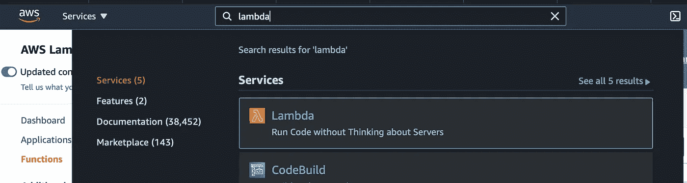

创建无服务器功能。

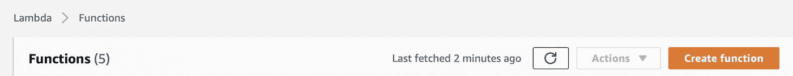

保持设置不变，为你的第一个 lambda 选择一个名字。我们将运行时保持为 Node.js，以编写一个简单的无服务器应用程序。

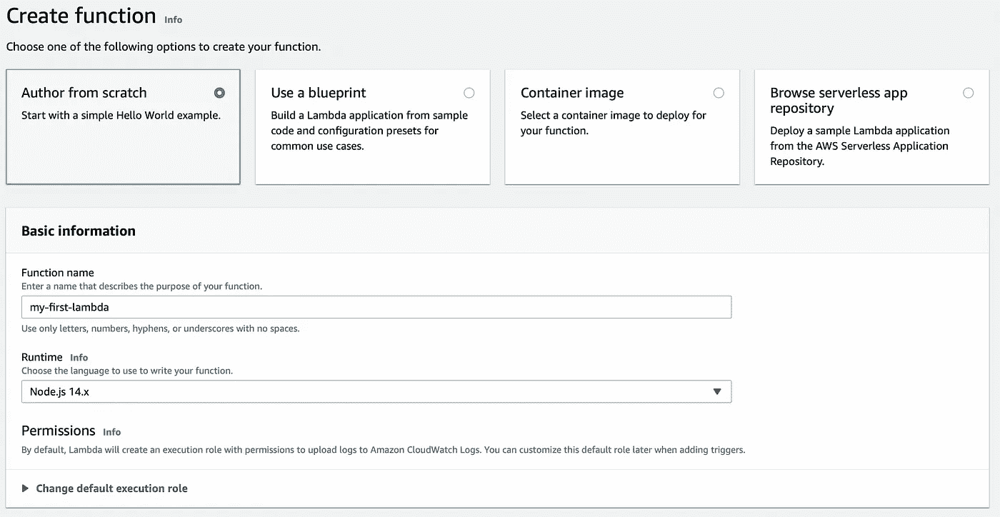

您将看到以下屏幕，其中显示了关于您新创建的 lambda 的所有设置。让我们暂时将 hello world 功能作为默认功能，并尝试一下。

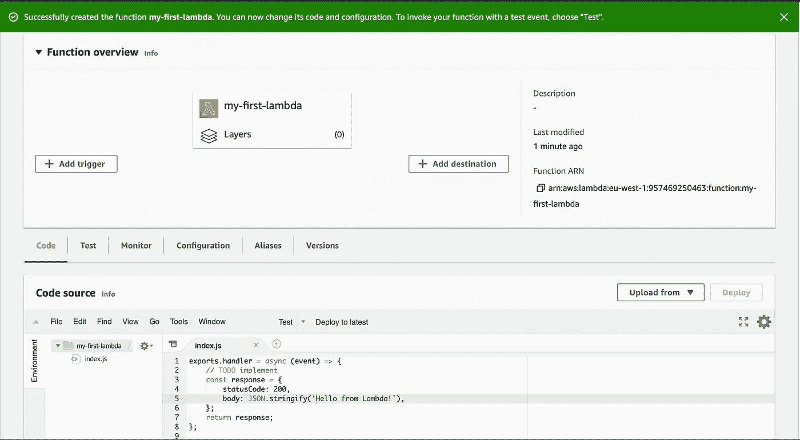

点击测试选项卡，保持设置不变，并选择*调用*。

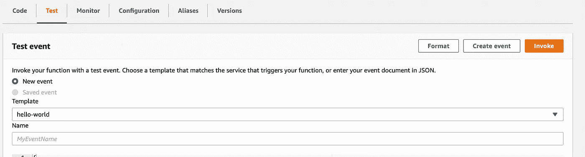

一旦完成，您将看到来自 lambda 的响应出现。

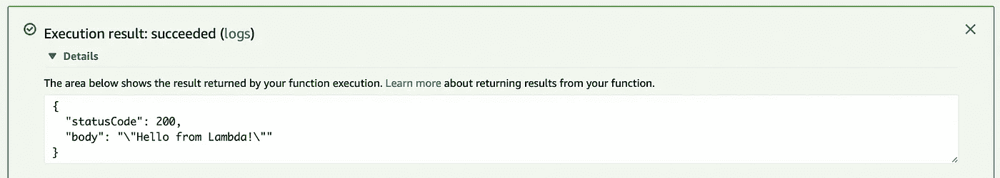

那是你的第一个λ！现在让我们尝试一些更有趣的东西！让我们创建一个每次都返回一个随机笑话的服务。为此，我们将使用一个名为[牛逼开发笑话](https://www.npmjs.com/package/awesome-dev-jokes)的 npm 包。

让我们建立一个 package.json，它依赖于这个令人敬畏的开发笑话包。在 AWS lambda 中选择 code 选项卡，并使用以下内容创建 package.json 文件。

然后，让我们调整我们的实际服务。更新 index.js 以使用 awesome-dev-笑话包，并以 JSON 格式返回一个笑话作为响应。

一旦完成，保存您的文件，并按下橙色部署按钮。

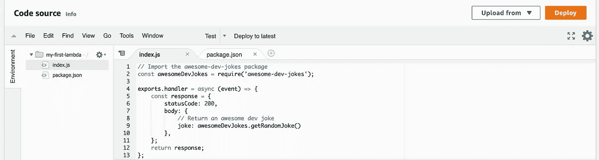

再次测试 lambda，看看结果。

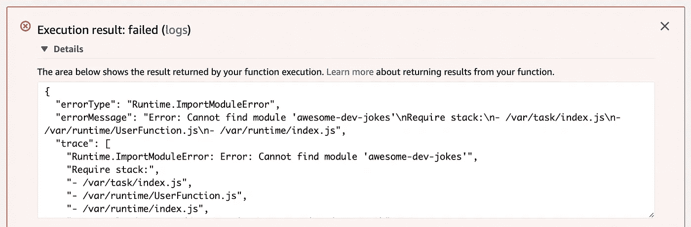

执行失败，因为找不到 awesome-dev-skins 包。为什么会这样？AWS 不会为你构建应用程序。您必须向 AWS 提交您的完整代码，包括任何第三方软件包。一个快速的解决方法是在本地安装它，压缩你的源文件夹，然后用 orange deploy 旁边的 *upload* 按钮上传它。

然而，许多 ide 都集成了自动部署到 lambdas 的解决方案。让我们用 Visual Studio 代码来设置它。

# 使用 Visual Studio 代码部署 Lambdas

首先，为 Visual Studio 代码安装 *AWS 工具包*扩展。该扩展将在左侧栏添加一个按钮，具有上传代码到 AWS Lambda 等功能。

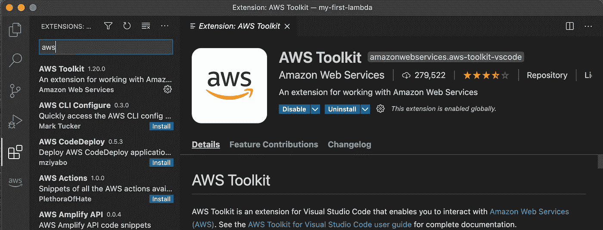

完成后，输入您的 AWS 访问密钥和秘密访问密钥。或者，您可以在 IAM 中创建一个对 lambda 具有特定访问权限的帐户。如果你对关于 IAM 的教程感兴趣，请在评论中告诉我。

让我们回到我们的项目—将 index.js 和 package.json 加载到 Visual Studio 代码中，并运行 npm install，node_modules 文件夹应该会出现。

在 AWS 工具包中，连接到您的帐户，选择您的 lambda 所在的地区，在我的例子中是 eu-west-1。展开 lambda 部分，右键单击您的 Lambda 并将其上传到 AWS。

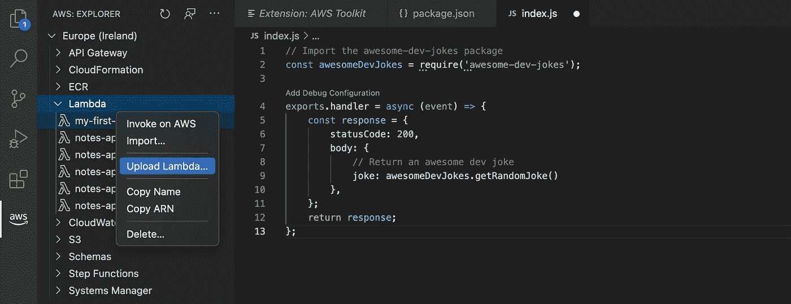

在 Visual Studio 代码中使用 AWS 工具包上传 lambda

让我们回到 AWS 控制台来测试我们的 lambda！调用 lambda 并享受由此产生的令人敬畏的开发笑话。调用 lambda 的另一种方法是在 Visual Studio 代码中使用 AWS Toolkit 右键单击它，然后选择 invoke。这将触发你终端中的 lambda。试试看你更喜欢哪种方法。

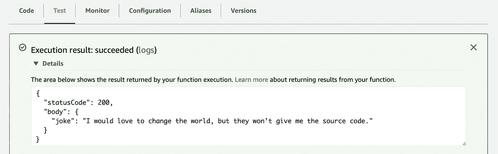

要是我们有全世界的源代码就好了！

# 本地调用 Lambda

我们已经运行了我们的第一个 lambda，它已经向我们抛出了很棒的开发笑话，干得好！地方发展呢？让我们试着在本地运行我们的 lambda，看看会发生什么。

没有输出。如果我们快速浏览一下 index.js，我们应该能够理解其中的原因。

我们正在导出一个处理程序，这是一个异步函数。但是在运行 node 时，这个函数只会被定义，不会被调用。为了在本地运行它，我们可以使用 AWS SAM 命令行工具。

按照亚马逊的[说明安装 AWS SAM CLI 工具。接下来，你还需要](https://docs.aws.amazon.com/serverless-application-model/latest/developerguide/serverless-sam-cli-install.html)[确保 Docker 安装在你的机器上](https://www.docker.com/)，因为这是 AWS 的要求。

安装完成后，我们可以使用下面的命令调用 lambda。

如我们所见，我们缺少 template.yaml 文件。出于本教程的考虑，我们可以从 AWS 中检索它。在 AWS 控制台中打开 lambda，点击 export。

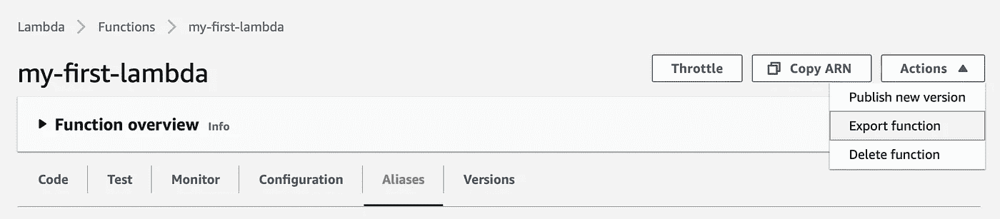

选择下载 AWS SAM 文件按钮，将该文件的内容复制到`./template.yaml`。

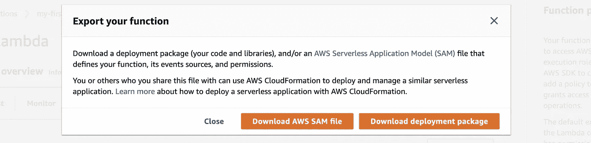

让我们使用`sam local invoke`命令再次在本地运行 lambda。

```
$ sam local invoke
Invoking index.handler (nodejs14.x)
Image was not found.
Building image.........
Skip pulling image and use local one: amazon/aws-sam-cli-emulation-image-nodejs14.x:rapid-1.17.0.START RequestId: e3958938-8c70-477f-b2bd-e8bcc633452b Version: $LATEST
END RequestId: e3958938-8c70-477f-b2bd-e8bcc633452b
REPORT RequestId: e3958938-8c70-477f-b2bd-e8bcc633452b  Init Duration: 1.04 ms  Duration: 708.70 ms     Billed Duration: 800 ms Memory Size: 128 MB     Max Memory Used: 128 MB
{"statusCode":200,"body":{"joke":"A programmer puts two glasses on his bedside table before going to sleep. A full one, in case he gets thirsty, and an empty one, in case he doesn’t."}}
```

这就是我们的最终结果！如果你想运行断点，我们可以使用标志`--debug-port 5858`来选择一个调试端口。在您的 IDE 中配置这个调试端口以使其工作。亚马逊在其文档网站上有一个针对 Visual Studio 代码的[示例启动配置。](https://docs.aws.amazon.com/serverless-application-model/latest/developerguide/serverless-sam-cli-using-debugging-nodejs.html)

# 摘要

无服务器功能有助于快速开发、简化维护，云提供商负责维护稳定的服务器和扩展。

在某些情况下，不推荐使用无服务器方法。例如，当最快速度是强制性的并且冷启动不能被容忍时。对于某些应用程序，无服务器应用程序是不可能的，例如，24/7 监听器，其中回调是不可能的。

在本文中，我们已经了解了无服务器技术是如何工作的，以及如何在 AWS 上使用它进行开发。然而，在企业环境中，您将无法获得如此大的访问权限。对此的解决方案是使用[云形成模板](https://aws.amazon.com/cloudformation/resources/templates/)。

*请注意，我并不隶属于 AWS，我只是喜欢他们提供的服务。*

[订阅我的媒体](https://kevinvr.medium.com/membership)到**解锁** **所有** **文章**。通过使用我的链接订阅，你是支持我的工作，没有额外的费用。你会得到我永远的感激。