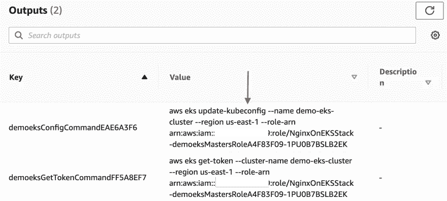
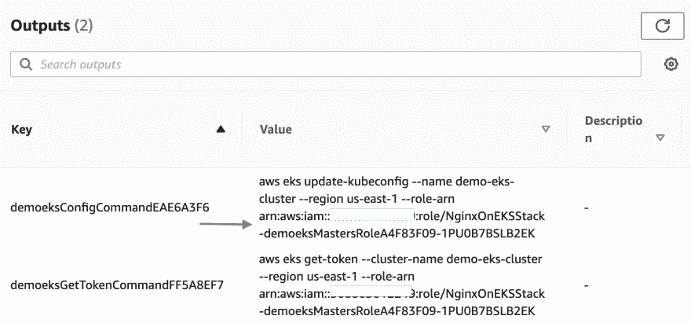

# 将您的 Kubernetes 基础设施编写为 Go 代码—将 cdk8s 与 AWS CDK 相结合

> 原文：<https://itnext.io/write-your-kubernetes-infrastructure-as-go-code-combine-cdk8s-with-aws-cdk-425c7b8136c6?source=collection_archive---------5----------------------->


cdk8s.io

在之前的一篇博文中，您看到了如何将 [cdk8s](https://cdk8s.io/docs/latest/) 与 [AWS 控制器一起用于 Kubernetes](https://aws-controllers-k8s.github.io/community/docs/community/overview/) (也称为 **ACK** )，这是因为您可以使用`cdk8s`导入现有的 Kubernetes 自定义资源定义！这使得使用`cdk8s`和 Kubernetes 将`DynamoDB`与客户端应用一起部署成为可能。

但是，如果你继续将 [AWS CDK](https://docs.aws.amazon.com/cdk/v2/guide/home.html) 用于 AWS 基础设施，并利用动力`cdk8s`(和`cdk8s-plus`)呢！)使用常规代码定义 Kubernetes 资源？由于 AWS EKS 模块和 cdk8s 之间的本机集成，您可以拥有两个世界的精华！

这篇博文的目的是用几个例子来证明这一点。我们将从一个简单的(基于 nginx 的)例子开始，然后转向一个成熟的应用堆栈(包括`DynamoDB`等)。).两者都将使用在 [AWS CDK](https://docs.aws.amazon.com/cdk/v2/guide/work-with-cdk-go.html) 以及 [cdk8s](https://cdk8s.io/docs/latest/getting-started/#prerequisites) 中得到很好支持的 Go 编程语言。

> *本博客讨论的所有代码均可在* [*本 GitHub repo*](https://github.com/abhirockzz/cdk8s-for-go-developers/tree/master/part6-cdk-eks-cdk8s) 中获得

# 先决条件

除了 AWS 帐户之外，要逐步跟进，您还需要以下 CLI—[AWS CLI](https://docs.aws.amazon.com/cli/latest/userguide/getting-started-install.html)、 [cdk8s CLI](https://cdk8s.io/docs/latest/getting-started/#install-the-cli) 和 [kubectl](https://kubernetes.io/docs/tasks/tools/#kubectl) 。另外，不要忘记安装 [AWS CDK](https://docs.aws.amazon.com/cdk/v2/guide/getting_started.html#getting_started_install) 、 [Go 编程语言](https://go.dev/dl/)(1.16 或以上版本)以及 [Docker](https://docs.docker.com/engine/install/) ，如果你还没有的话。

# 在 EKS 用 Nginx 保持简单

就像生活中的大多数事情一样，有两种方式——简单的方式或困难的方式；)你会看到他们两个！让我们先尝试一下，看看它们是如何工作的，然后再看看代码。

首先，克隆存储库并切换到正确的目录:

```
git clone https://github.com/abhirockzz/cdk8s-for-go-developers
cd cdk8s-for-go-developers/part6-cdk-eks-cdk8s/cdk-cdk8s-nginx-eks
```

要设置一切，您只需要一个命令:

```
cdk deploy
```

> *您也可以使用* `*cdk synth*` *先生成并检查云形成模板*

系统将提示您确认。一旦你这样做了，过程将开始-这将需要一些时间，因为大量的 AWS 资源将被创建，包括 VPC，EKS 集群等。

> 请随时查看自动气象站云形成控制台来跟踪进度。

一旦这个过程完成，您需要使用`kubectl`连接到 EKS 集群。此所需的命令将作为`cdk deploy`过程(在终端中)的结果可用，或者您可以参考 AWS 云形成堆栈的**输出**部分。



自动气象站云信息输出

一旦您将`kubectl`配置为指向您的 EKS 集群，您就可以检查 Nginx `Deployment`和`Service`。

```
kubectl get deployment

# output
NAME                          READY   UP-TO-DATE   AVAILABLE   AGE
nginx-deployment-cdk8s        1/1     1            1           1m
nginx-deployment-cdk          1/1     1            1           1m
```

你会看到已经创建了两个`Deployment`——稍后会有更多的介绍。同样，如果你检查`Service` ( `kubectl get svc`，你应该会看到其中的两个——`nginx-service-cdk`和`nginx-service-cdk8s`。

要访问 Nginx，选择两个`Service`中的任意一个`EXTERNAL-IP`，例如:

```
APP_URL=$(kubectl get service/nginx-service-cdk -o jsonpath="{.status.loadBalancer.ingress[0].hostname}")echo $APP_URL# to access nginx (notice we are using port 9090)
curl -i [http://$APP_URL:9090](/$APP_URL)
```

> *如果在访问 LB URL 时出现* `*Could not resolve host*` *错误，请等待一分钟左右，然后重试*

## 在幕后

现在让我们[看看代码](https://github.com/abhirockzz/cdk8s-for-go-developers/blob/master/part6-cdk-eks-cdk8s/cdk-cdk8s-nginx-eks/main.go)——这将阐明为什么我们有两个 Nginx `Deployment`。

感谢 AWS CDK 公司，VPC 创作公司与 awsec2 合二为一。NewVpc 函数和创建一个 [EKS 集群](https://pkg.go.dev/github.com/aws/aws-cdk-go/awscdk/v2/awseks#NewCluster)也不是太难！

```
func NewNginxOnEKSStack(scope constructs.Construct, id string, props *CdkStackProps) awscdk.Stack {
  //...
  vpc := awsec2.NewVpc(stack, jsii.String("demo-vpc"), nil)
    eksSecurityGroup := awsec2.NewSecurityGroup(stack, jsii.String("eks-demo-sg"),
        &awsec2.SecurityGroupProps{
            Vpc:               vpc,
            SecurityGroupName: jsii.String("eks-demo-sg"),
            AllowAllOutbound:  jsii.Bool(true)})
    eksCluster := awseks.NewCluster(stack, jsii.String("demo-eks"),
        &awseks.ClusterProps{
            ClusterName:   jsii.String("demo-eks-cluster"),
            Version:       awseks.KubernetesVersion_V1_21(),
            Vpc:           vpc,
            SecurityGroup: eksSecurityGroup,
            VpcSubnets: &[]*awsec2.SubnetSelection{
                {Subnets: vpc.PrivateSubnets()}},
            DefaultCapacity:         jsii.Number(2),
            DefaultCapacityInstance: awsec2.InstanceType_Of(awsec2.InstanceClass_BURSTABLE3, awsec2.InstanceSize_SMALL), DefaultCapacityType: awseks.DefaultCapacityType_NODEGROUP,
            OutputConfigCommand: jsii.Bool(true),
            EndpointAccess:      awseks.EndpointAccess_PUBLIC()})
//...
```

# Kubernetes 上的 Nginx，来硬的！

现在我们来看看创建 Nginx 的两种不同方式，从“硬”方式开始。在这种情况下，我们使用 AWS CDK ( *而不是* `cdk8s`)来定义`Deployment`和`Service`资源。

```
func deployNginxUsingCDK(eksCluster awseks.Cluster) {
    appLabel := map[string]*string{
        "app": jsii.String("nginx-eks-cdk"),
    }
    deployment := map[string]interface{}{
        "apiVersion": jsii.String("apps/v1"),
        "kind":       jsii.String("Deployment"),
        "metadata": map[string]*string{
            "name": jsii.String("nginx-deployment-cdk"),
        },
        "spec": map[string]interface{}{
            "replicas": jsii.Number(1),
            "selector": map[string]map[string]*string{
                "matchLabels": appLabel,
            },
            "template": map[string]interface{}{
                "metadata": map[string]map[string]*string{
                    "labels": appLabel,
                },
                "spec": map[string][]map[string]interface{}{
                    "containers": {
                        {
                            "name":  jsii.String("nginx"),
                            "image": jsii.String("nginx"),
                            "ports": []map[string]*float64{
                                {
                                    "containerPort": jsii.Number(80),
                                },
                            },
                        },
                    },
                },
            },
        },
    }
    service := map[string]interface{}{
        "apiVersion": jsii.String("v1"),
        "kind":       jsii.String("Service"),
        "metadata": map[string]*string{
            "name": jsii.String("nginx-service-cdk"),
        },
        "spec": map[string]interface{}{
            "type": jsii.String("LoadBalancer"),
            "ports": []map[string]*float64{
                {
                    "port":       jsii.Number(9090),
                    "targetPort": jsii.Number(80),
                },
            },
            "selector": appLabel,
        },
    }
    eksCluster.AddManifest(jsii.String("app-deployment"), &service, &deployment)
}
```

最后，为了在 EKS 创建它，我们调用 [AddManifest](https://pkg.go.dev/github.com/aws/aws-cdk-go/awscdk/v2/awseks#Cluster.AddManifest) (把它想象成`kubectl apply`的编程等价物)。这是可行的，但是这种方法存在一些缺陷:

*   我们无法从 Go 这种强类型语言中获益。这是因为 API 是松散的 T31 类型，这要感谢无处不在的 T6。这使得它非常容易出错(我也犯了一些错误！)
*   冗长也很明显。看起来好像我们在`Go`中写`YAML`——没有太大的改进！

## 有更好的方法吗..？

让我们看看第二个函数`deployNginxUsingCDK8s`——从它的名字可以明显看出，我们使用了`cdk8s`，而不仅仅是 CDK)

```
func deployNginxUsingCDK8s(eksCluster awseks.Cluster) {
    app := cdk8s.NewApp(nil)
    eksCluster.AddCdk8sChart(jsii.String("nginx-eks-chart"), NewNginxChart(app, "nginx-cdk8s", nil), nil)
}
```

这看起来“太容易”了，不可能是真的！但由于 CDK 和`cdk8s`之间的互操作性，这是可能的。这意味着，您可以使用*定义* Kubernetes 资源，使用`cdk8s` `Chart`将它们应用到用 CDK 创建的 EKS 集群(这使它成为一种混合系统)。

我们故事的主角是 [AddCdk8sChart](https://pkg.go.dev/github.com/aws/aws-cdk-go/awscdk/v2/awseks#Cluster.AddCdk8sChart) 函数，它接受一个[构造。构造](https://pkg.go.dev/github.com/aws/constructs-go/constructs/v10#Construct)(记住，[一切都是构造](https://dev.to/abhirockzz/write-your-kubernetes-infrastructure-as-go-code-getting-started-with-cdk8s-37n)！).在这种情况下，`Construct`恰好是一个 [cdk8s。图表](https://pkg.go.dev/github.com/cdk8s-team/cdk8s-core-go/cdk8s/v2#Chart)是由`NewNginxChart`函数返回的，所以[让我们来看看那个](https://github.com/abhirockzz/cdk8s-for-go-developers/blob/master/part6-cdk-eks-cdk8s/cdk-cdk8s-nginx-eks/nginx.go)。

```
func NewNginxChart(scope constructs.Construct, id string, props *MyChartProps) cdk8s.Chart {
  //....
    dep := cdk8splus22.NewDeployment(chart, jsii.String("nginx-deployment"),
        &cdk8splus22.DeploymentProps{
            Metadata: &cdk8s.ApiObjectMetadata{
                Name: jsii.String("nginx-deployment-cdk8s")}})
    dep.AddContainer(&cdk8splus22.ContainerProps{
        Name:  jsii.String("nginx-container"),
        Image: jsii.String("nginx"),
        Port:  jsii.Number(80)})
    dep.ExposeViaService(&cdk8splus22.DeploymentExposeViaServiceOptions{
        Name:        jsii.String("nginx-service-cdk8s"),
        ServiceType: cdk8splus22.ServiceType_LOAD_BALANCER,
        Ports: &[]*cdk8splus22.ServicePort{{
            Port:       jsii.Number(9090),
            TargetPort: jsii.Number(80)}}})
    return chart
}
```

如果你曾经和`cdk8s`(和 Go)一起工作过，或者读过我以前关于这个主题的一些博客，这应该看起来很熟悉——一个强类型、紧凑和富于表现力的 API！我甚至不需要带你走一遍，因为它非常易读——我们使用`cdk8s-plus`创建一个 Nginx `Deployment`，添加容器信息，最后通过`Service`公开它，这样我们就可以从 EKS 之外访问 Nginx。

这是一个足够简单的例子来说明这两种方法之间的区别。下一个场景是不同的——除了 EKS 集群，它还有 DynamoDB 和一个 URL shortener 应用程序，将部署到 EKS。

# 端到端示例:DynamoDB 及其在 EKS 的应用

我们不是从头开始创建一个新的 EKS 集群，而是重用上一个示例中创建的现有集群——这是一个很好的机会来看看如何在您的 CDK 代码中引用现有的 EKS 集群。正如所料，我们还需要创建`DynamoDB`表。

就像前面的例子一样，让我们先尝试一下解决方案。首先切换到正确的目录:

```
cd part6-cdk-eks-cdk8s/cdk-cdk8s-dynamodb-app-eks
```

由于 URL shortener 应用程序必须对`DynamoDB`进行 API 调用，我们需要为服务帐户(也称为 **IRSA** )配置 [IAM 角色。](https://docs.aws.amazon.com/eks/latest/userguide/iam-roles-for-service-accounts.html)

> *参考*[*https://docs . AWS . Amazon . com/eks/latest/user guide/create-service-account-iam-policy-and-role . html*](https://docs.aws.amazon.com/eks/latest/userguide/create-service-account-iam-policy-and-role.html)

**为应用程序定义 IAM 角色**

首先创建一个 [Kubernetes 服务帐户](https://kubernetes.io/docs/tasks/configure-pod-container/configure-service-account/):

```
kubectl apply -f - <<EOF
apiVersion: v1
kind: ServiceAccount
metadata:
  name: eks-dynamodb-app-sa
EOF
```

> *确认—*

将您的 AWS 帐户 ID 和 [OIDC 身份提供者](https://docs.aws.amazon.com/eks/latest/userguide/enable-iam-roles-for-service-accounts.html)设置为环境变量:

```
ACCOUNT_ID=$(aws sts get-caller-identity --query "Account" --output text)export EKS_CLUSTER_NAME=<enter cluster name>
export AWS_REGION=<enter region e.g. us-east-1>OIDC_PROVIDER=$(aws eks describe-cluster --name $EKS_CLUSTER_NAME --query "cluster.identity.oidc.issuer" --output text | sed -e "s/^https:\/\///")
```

为角色创建一个带有*可信实体*的 JSON 文件:

```
read -r -d '' TRUST_RELATIONSHIP <<EOF
{
  "Version": "2012-10-17",
  "Statement": [
    {
      "Effect": "Allow",
      "Principal": {
        "Federated": "arn:aws:iam::${ACCOUNT_ID}:oidc-provider/${OIDC_PROVIDER}"
      },
      "Action": "sts:AssumeRoleWithWebIdentity",
      "Condition": {
        "StringEquals": {
          "${OIDC_PROVIDER}:aud": "sts.amazonaws.com",
          "${OIDC_PROVIDER}:sub": "system:serviceaccount:default:eks-dynamodb-app-sa"
        }
      }
    }
  ]
}
EOF
echo "${TRUST_RELATIONSHIP}" > trust.json
```

> *检查—*

现在，创建 IAM 角色:

```
export ROLE_NAME=dynamodb-app-irsa
aws iam create-role --role-name $ROLE_NAME --assume-role-policy-document file://trust.json --description "IRSA for DynamoDB app on EKS"
```

我们需要创建策略并将其附加到角色，因为我们只想允许应用程序中的`PutItem`和`GetItem`操作。下面是策略 JSON 文件:

```
{
    "Version": "2012-10-17",
    "Statement": [
        {
            "Sid": "PutandGet",
            "Effect": "Allow",
            "Action": [
                "dynamodb:PutItem",
                "dynamodb:GetItem"
            ],
            "Resource": "arn:aws:dynamodb:*:*:table/urls"
        }
    ]
}
```

创建策略并将其附加到我们刚刚创建的角色:

```
aws iam create-policy --policy-name dynamodb-irsa-policy --policy-document file://policy.json
aws iam attach-role-policy --role-name $ROLE_NAME --policy-arn=arn:aws:iam::<enter AWS account ID>:policy/dynamodb-irsa-policy
```

最后，我们需要关联 IAM 角色和服务帐户:

```
kubectl annotate serviceaccount -n default eks-dynamodb-app-sa eks.amazonaws.com/role-arn=arn:aws:iam::<enter AWS account ID>:role/dynamodb-app-irsa
```

**得到 EKS**`**kubectl**`角色 ARN

要[引用 AWS CDK 中现有的 EKS 集群](https://docs.aws.amazon.com/cdk/api/v2/docs/aws-cdk-lib.aws_eks-readme.html#using-existing-clusters)，您需要 EKS 集群名称和`kubectl`角色 ARN。

你可以在 AWS 云形成堆栈的**输出**部分找到角色 ARN。



ARN 在自动气象站云信息输出中的作用

我们已经准备好使用 CDK 部署应用程序。设置所需的环境变量，后跟`cdk deploy`:

> *您也可以使用* `*cdk synth*` *先生成并检查云形成模板*

```
export EKS_CLUSTER_NAME=<enter name of EKS cluster>
export KUBECTL_ROLE_ARN=<enter kubectl role ARN>
export SERVICE_ACCOUNT_NAME=eks-dynamodb-app-sa
export APP_PORT=8080
export AWS_REGION=<enter region e.g. us-east-1>

cdk deploy
```

CDK(和`cdk8s`)将完成所有繁重的工作(我们很快就会看到代码):

*   将创建新的 DynamoDB 表
*   我们的应用程序的 docker 映像将被构建并推送到 ECR
*   用于 URL shortener 应用程序的 Kubernetes 资源将被部署到现有的 EKS 集群中

一旦堆栈创建完成，检查 Kubernetes `Deployment`和`Service`:

```
kubectl get deployment/dynamodb-app
kubectl get pods
kubectl get service/dynamodb-app-service
```

测试 URL shortener 服务很容易。但我不会在这里重复，因为它已经在[本博客]([https://dev . to/abhirockzz/write-your-kubernetes-infra structure-as-go-code-manage-AWS-services-3pgi](https://dev.to/abhirockzz/write-your-kubernetes-infrastructure-as-go-code-manage-aws-services-3pgi)中涉及到了。你所需要的是负载平衡器的 URL 来访问服务，并使用 yout 浏览器或`curl`来保存和访问 URL。

**再次回到探索 Go 代码**

在堆栈中，我们定义了`DynamoDB`表(使用 [awsdynamodb。NewTable](https://pkg.go.dev/github.com/aws/aws-cdk-go/awscdk/v2/awsdynamodb#NewTable) )以及我们的应用程序的 docker 图像(带有 [awsecrassets。NewDockerImageAsset](https://pkg.go.dev/github.com/aws/aws-cdk-go/awscdk/v2/awsecrassets#NewDockerImageAsset)

```
func NewDynamoDBAppStack(scope constructs.Construct, id string, props *CdkStackProps) awscdk.Stack {
  //...
    table := awsdynamodb.NewTable(stack, jsii.String("dynamodb-table"),
        &awsdynamodb.TableProps{
            TableName: jsii.String(tableName),
            PartitionKey: &awsdynamodb.Attribute{
                Name: jsii.String(dynamoDBPartitionKey),
                Type: awsdynamodb.AttributeType_STRING,
            },
            BillingMode:   awsdynamodb.BillingMode_PAY_PER_REQUEST,
            RemovalPolicy: awscdk.RemovalPolicy_DESTROY,
        })
    appDockerImage := awsecrassets.NewDockerImageAsset(stack, jsii.String("app-image"),
        &awsecrassets.DockerImageAssetProps{
            Directory: jsii.String(appDirectory)})
  //...g
```

接下来是有趣的部分，我们获得对现有 EKS 集群的引用，并使用`AddCdk8sChart`(就像之前一样)将应用程序部署到 EKS。

```
//...
  eksCluster := awseks.Cluster_FromClusterAttributes(stack, jsii.String("existing cluster"),
        &awseks.ClusterAttributes{
            ClusterName:    jsii.String(eksClusterName),
            KubectlRoleArn: jsii.String(kubectlRoleARN)})
    app := cdk8s.NewApp(nil)
    appProps := NewAppChartProps(appDockerImage.ImageUri(), table.TableName())
    eksCluster.AddCdk8sChart(jsii.String("dynamodbapp-chart"), NewDynamoDBAppChart(app, "dynamodb-cdk8s", &appProps), nil)
```

[NewDynamoDBAppChart 函数](https://github.com/abhirockzz/cdk8s-for-go-developers/blob/master/part6-cdk-eks-cdk8s/cdk-cdk8s-dynamodb-app-eks/dynamodb_app.go#L59)定义了`Deployment`和`Service`。不像前面的 Nginx 例子有静态值，这个应用程序接受动态值——特别是`DynamoDB`表名(用作容器环境变量`TABLE_NAME`)。还要注意这样一个事实，我们显式地添加了在上一步中创建的 Kubernetes 服务帐户的名称(用于 *IRSA* )。

```
func NewDynamoDBAppChart(scope constructs.Construct, id string, props *AppChartProps) cdk8s.Chart {
  //...
    dep := cdk8splus22.NewDeployment(chart, jsii.String("dynamodb-app-deployment"), &cdk8splus22.DeploymentProps{
        Metadata: &cdk8s.ApiObjectMetadata{
            Name: jsii.String("dynamodb-app")},
        ServiceAccount: cdk8splus22.ServiceAccount_FromServiceAccountName(
            chart,
            jsii.String("aws-irsa"),
            jsii.String(props.serviceAccountName))})
    container := dep.AddContainer(//.. omitted for brevity)
    container.Env().AddVariable(jsii.String("TABLE_NAME"), cdk8splus22.EnvValue_FromValue(props.tableName))
    container.Env().AddVariable(jsii.String("AWS_REGION"), cdk8splus22.EnvValue_FromValue(&props.region))
    dep.ExposeViaService(//.. omitted for brevity)
    return chart
}
```

# 包裹

本博客(及系列)到此为止！我们从一个简单的例子开始，展示 AWS CDK 和`cdk8s`之间的集成，以及它使事情变得多么容易(相比之下，只使用 CDK 将应用程序部署到 EKS)。然后，我们继续探索一个成熟的场景，您可以在其中部署基础设施(`DynamoDB`等)。)以及 EKS 上的客户端应用程序。

快乐大厦！