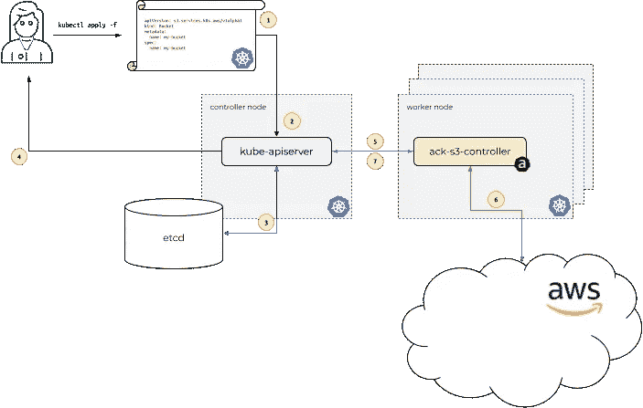
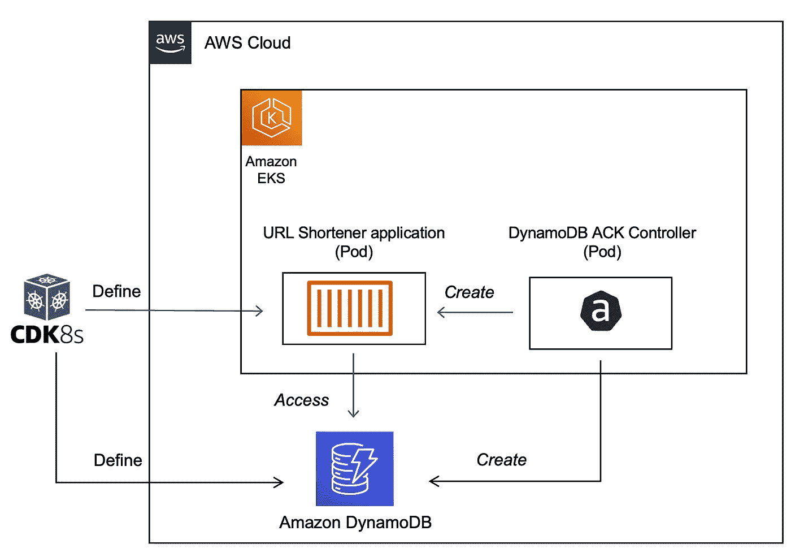

# 将您的 Kubernetes 基础设施编写为 Go 代码—管理 AWS 服务

> 原文：<https://itnext.io/write-your-kubernetes-infrastructure-as-go-code-manage-aws-services-815ecd4d1af8?source=collection_archive---------0----------------------->


cdk8s.io

## 使用`cdk8s`和 AWS 控制器为 Kubernetes 部署 DynamoDB 和一个客户端应用程序

[Kubernetes](https://aws-controllers-k8s.github.io/community/docs/community/overview/)(也称为 **ACK** )的 AWS 控制器是围绕[自定义资源和自定义资源定义](https://kubernetes.io/docs/concepts/extend-kubernetes/api-extension/custom-resources/#custom-resources)的 Kubernetes 扩展概念构建的。您可以使用`ACK`直接从 Kubernetes 定义和使用 AWS 服务。这有助于您利用 Kubernetes 应用程序的托管 AWS 服务，而无需在集群之外定义资源。

假设您需要在部署到 Kubernetes 的应用程序中使用一个 [AWS S3 桶](https://docs.aws.amazon.com/AmazonS3/latest/userguide/UsingBucket.html)。而不是使用 AWS 控制台、AWS CLI、AWS CloudFormation 等。，您可以在 YAML 清单文件中定义 AWS `S3`存储桶，并使用熟悉的工具如`kubectl`部署它。最终目标是允许用户(软件工程师、开发工程师、操作员等。)使用相同的接口(本例中为 Kubernetes API)来描述和管理 AWS 服务以及本地 Kubernetes 资源，如`Deployment`、`Service`等。

以下是 ACK 文档中的图表，提供了一个高层次的概述:



[https://AWS-controllers-k8s . github . io/community/docs/community/images/ack-how-it-works . png](https://aws-controllers-k8s.github.io/community/docs/community/images/ack-how-it-works.png)

# 这篇博文涵盖了哪些内容？

ACK 支持[很多 AWS 服务](https://aws-controllers-k8s.github.io/community/docs/community/services/#amazon-dynamodb)，包括[亚马逊 DynamoDB](https://docs.aws.amazon.com/amazondynamodb/latest/developerguide/Introduction.html) 。这篇博文涉及的话题之一是*如何在* [*亚马逊 EKS*](https://docs.aws.amazon.com/eks/latest/userguide/what-is-eks.html) *上使用* `*ACK*` *来管理* `*DynamoDB*`。但是，仅仅创建一个`DynamoDB`表并没有那么有趣！

除此之外，您还将使用和部署一个客户端应用程序——这是一个 URL shortener 应用程序的精简版本，在[以前的博客文章](https://dev.to/aws/build-a-serverless-url-shortener-with-go-10i2)中有所介绍。虽然博客的前半部分将涉及帮助您理解机制和开始的手动步骤，但在后半部分，我们将切换到`cdk8s`并使用 Go 代码实现相同的目标。



高层建筑

## cdk8s？什么，为什么？因为，基础设施就是代码

cdk8s(Kubernetes 的云开发工具包)是一个开源框架(CNCF 的一部分)，它允许你使用常规编程语言(而不是 T4)来定义你的 Kubernetes 应用。我已经围绕 cdk8s 和 Go 写了[几篇博文，你可能会觉得有用。](https://betterprogramming.pub/kubernetes-infrastructure-as-code-for-go-developers-cdk8s-plus-in-action-ee3eb2203745)

我们将继续走同一条路，即把`yaml`推到后台，并使用[Go 编程语言](https://go.dev/)来定义核心基础设施(在本例中恰好是`DynamoDB`，但也可能更多)以及应用组件(Kubernetes `Deployment`、`Service`等)。).

这是由于以下`cdk8s`特性而成为可能:

1.  `cdk8s`支持 [Kubernetes 自定义资源定义](https://dev.to/abhirockzz/write-your-kubernetes-infrastructure-as-go-code-using-custom-resource-definitions-with-cdk8s-1eei)，让我们神奇地将 CRD 作为 API 导入。
2.  cdk8s-plus 库在我们的 Go 代码(或任何其他语言)中使用 Kubernetes 资源时，它有助于减少/消除大量样板代码

在开始学习之前，请确保您已经完成了完成本教程所需的先决条件。

> *GitHub*上的 [*是基础设施和应用程序的全部代码*](https://github.com/abhirockzz/cdk8s-for-go-developers/tree/master/part5-dynamodb-eks-ack-cdk8s)

# 先决条件

要一步一步地学习，除了一个 AWS 账户，你还需要安装 [AWS CLI](https://docs.aws.amazon.com/cli/latest/userguide/getting-started-install.html) 、 [cdk8s CLI](https://cdk8s.io/docs/latest/getting-started/#install-the-cli) 、 [kubectl](https://kubernetes.io/docs/tasks/tools/#kubectl) 、 [helm](https://helm.sh/docs/intro/install/) 和 [Go 编程语言](https://go.dev/dl/)。

有很多种方法可以创建一个亚马逊 EKS 集群。我更喜欢使用 eks CTL CLI，因为它提供了方便！

好的，我们开始吧。我们需要做的第一件事是…

# 设置 DynamoDB 控制器

> *以下大部分步骤改编自* `*ACK*` *文档-* [*安装 ACK 控制器*](https://aws-controllers-k8s.github.io/community/docs/user-docs/install/)

**使用** `**Helm**` **:** 安装

```
export SERVICE=dynamodb#change/update this as required as per [https://api.github.com/repos/aws-controllers-k8s/dynamodb-controller/releases/latest](https://api.github.com/repos/aws-controllers-k8s/dynamodb-controller/releases/latest)export RELEASE_VERSION=0.1.7export ACK_SYSTEM_NAMESPACE=ack-system

# you can change the region if required
export AWS_REGION=us-east-1

aws ecr-public get-login-password --region us-east-1 | helm registry login --username AWS --password-stdin public.ecr.aws

helm install --create-namespace -n $ACK_SYSTEM_NAMESPACE ack-$SERVICE-controller \
  oci://public.ecr.aws/aws-controllers-k8s/$SERVICE-chart --version=$RELEASE_VERSION --set=aws.region=$AWS_REGION
```

要确认，请运行:

```
kubectl get crd# output (multiple CRDs)
tables.dynamodb.services.k8s.aws
fieldexports.services.k8s.aws
globaltables.dynamodb.services.k8s.aws
# etc....
```

由于`DynamoDB`控制器必须与 AWS 服务交互(进行 API 调用)，我们需要为服务帐户(也称为 **IRSA** )配置 [IAM 角色。](https://docs.aws.amazon.com/eks/latest/userguide/iam-roles-for-service-accounts.html)

> *详见* [*配置 IAM 权限*](https://aws-controllers-k8s.github.io/community/docs/user-docs/irsa/)

***IRSA 配置***

*首先，为您的群集创建一个 OIDC 身份提供者。*

```
*export EKS_CLUSTER_NAME=<name of your EKS cluster>
export AWS_REGION=<cluster region>
eksctl utils associate-iam-oidc-provider --cluster $EKS_CLUSTER_NAME --region $AWS_REGION --approve*
```

*目标是创建一个 IAM 角色并通过策略附加适当的权限。然后，我们可以创建一个 [Kubernetes 服务帐户](https://kubernetes.io/docs/tasks/configure-pod-container/configure-service-account/)，并将 IAM 角色附加到它上面。因此，控制器`Pod`将能够进行 AWS API 调用。请注意，我们通过`arn:aws:iam::aws:policy/AmazonDynamoDBFullAccess`策略向我们的控件提供所有`DynamoDB`权限。*

*多亏了`eksctl`，这可以用一行代码完成！*

```
*export SERVICE=dynamodb
export ACK_K8S_SERVICE_ACCOUNT_NAME=ack-$SERVICE-controller# recommend using the same name
export ACK_SYSTEM_NAMESPACE=ack-system
export EKS_CLUSTER_NAME=<enter EKS cluster name>
export POLICY_ARN=arn:aws:iam::aws:policy/AmazonDynamoDBFullAccess# IAM role has a format - do not change it. you can't use any arbitrary name
export IAM_ROLE_NAME=ack-$SERVICE-controller-roleeksctl create iamserviceaccount \
    --name $ACK_K8S_SERVICE_ACCOUNT_NAME \
    --namespace $ACK_SYSTEM_NAMESPACE \
    --cluster $EKS_CLUSTER_NAME \
    --role-name $IAM_ROLE_NAME \
    --attach-policy-arn $POLICY_ARN \
    --approve \
    --override-existing-serviceaccounts*
```

> **策略是根据*[*https://github . com/AWS-controllers-k8s/dynamo db-controller/blob/main/config/iam/recommended-policy-arn*](https://github.com/aws-controllers-k8s/dynamodb-controller/blob/main/config/iam/recommended-policy-arn)*

*要进行确认，您可以检查 IAM 角色是否已创建，并检查 Kubernetes 服务帐户*

```
*aws iam get-role --role-name=$IAM_ROLE_NAME --query Role.Arn --output textkubectl describe serviceaccount/$ACK_K8S_SERVICE_ACCOUNT_NAME -n $ACK_SYSTEM_NAMESPACE# you will see similar outputName:                ack-dynamodb-controller
Namespace:           ack-system
Labels:              app.kubernetes.io/instance=ack-dynamodb-controller
                     app.kubernetes.io/managed-by=eksctl
                     app.kubernetes.io/name=dynamodb-chart
                     app.kubernetes.io/version=v0.1.3
                     helm.sh/chart=dynamodb-chart-v0.1.3
                     k8s-app=dynamodb-chart
Annotations:         eks.amazonaws.com/role-arn: arn:aws:iam::<your AWS account ID>:role/ack-dynamodb-controller-role
                     meta.helm.sh/release-name: ack-dynamodb-controller
                     meta.helm.sh/release-namespace: ack-system
Image pull secrets:  <none>
Mountable secrets:   ack-dynamodb-controller-token-bbzxv
Tokens:              ack-dynamodb-controller-token-bbzxv
Events:              <none>*
```

*为了使`IRSA`生效，您需要重新启动 ACK `Deployment`:*

```
*# Note the deployment name for ACK service controller from following command
kubectl get deployments -n $ACK_SYSTEM_NAMESPACEkubectl -n $ACK_SYSTEM_NAMESPACE rollout restart deployment ack-dynamodb-controller-dynamodb-chart*
```

*确认`Deployment`已重启(当前为`Running`)且`IRSA`已正确配置:*

```
*kubectl get pods -n $ACK_SYSTEM_NAMESPACEkubectl describe pod -n $ACK_SYSTEM_NAMESPACE ack-dynamodb-controller-dynamodb-chart-7dc99456c6-6shrm | grep "^\s*AWS_"
# The output should contain following two lines:AWS_ROLE_ARN=arn:aws:iam::<AWS_ACCOUNT_ID>:role/<IAM_ROLE_NAME>
AWS_WEB_IDENTITY_TOKEN_FILE=/var/run/secrets/eks.amazonaws.com/serviceaccount/token*
```

*现在我们已经完成了配置…*

# *我们可以开始有趣的部分了！*

***首先创建 DynamoDB 表***

*清单看起来是这样的:*

```
*apiVersion: dynamodb.services.k8s.aws/v1alpha1
kind: Table
metadata:
  name: dynamodb-urls-ack
spec:
  tableName: urls
  attributeDefinitions:
    - attributeName: shortcode
      attributeType: S
  billingMode: PAY_PER_REQUEST
  keySchema:
    - attributeName: email
      keyType: HASH*
```

*克隆项目，转到正确的目录并应用清单:*

```
*git clone https://github.com/abhirockzz/dynamodb-ack-cdk8s
cd dynamodb-ack-cdk8s# create table
kubectl apply -f manual/dynamodb-ack.yaml*
```

*您可以在 AWS 控制台中检查 DynamoDB 表，或者使用 AWS CLI ( `aws dynamodb list-tables`)进行确认。我们的表已经准备好了，现在我们可以部署我们的 URL shortener 应用程序了。*

*但是，在此之前，我们需要创建一个 Docker 映像，并将其推送到亚马逊弹性容器注册中心的私有存储库中。*

***在亚马逊 ECR 中创建私有存储库***

*登录到 ECR:*

```
*aws ecr get-login-password --region <enter region> | docker login --username AWS --password-stdin <enter aws_account_id>.dkr.ecr.<enter region>.amazonaws.com*
```

*创建存储库:*

```
*aws ecr create-repository \
    --repository-name dynamodb-app \
    --region <enter AWS region>*
```

***构建映像并推送到 ECR***

```
*# if you're on Mac M1
#export DOCKER_DEFAULT_PLATFORM=linux/amd64
docker build -t dynamodb-app .docker tag dynamodb-app:latest <enter aws_account_id>.dkr.ecr.<enter region>.amazonaws.com/dynamodb-app:latestdocker push <enter aws_account_id>.dkr.ecr.<enter region>.amazonaws.com/dynamodb-app:latest*
```

*就像控制器一样，我们的应用程序也需要`IRSA`来执行`GetItem`和`PutItem` API 对`DynamoDB`的调用。*

***让我们为应用程序创建另一个 IRSA***

```
*# you can change the policy name. make sure yo use the same name in subsequent commands
aws iam create-policy --policy-name dynamodb-irsa-policy --policy-document file://manual/policy.jsoneksctl create iamserviceaccount --name eks-dynamodb-app-sa --namespace default --cluster <enter EKS cluster name> --attach-policy-arn arn:aws:iam::<enter AWS account ID>:policy/dynamodb-irsa-policy --approvekubectl describe serviceaccount/eks-dynamodb-app-sa# outputName:                eks-dynamodb-app-sa
Namespace:           default
Labels:              app.kubernetes.io/managed-by=eksctl
Annotations:         eks.amazonaws.com/role-arn: arn:aws:iam::<AWS account ID>:role/eksctl-eks-cluster-addon-iamserviceaccount-d-Role1-2KTGZO1GJRN
Image pull secrets:  <none>
Mountable secrets:   eks-dynamodb-app-sa-token-5fcvf
Tokens:              eks-dynamodb-app-sa-token-5fcvf
Events:              <none>*
```

*最后，我们可以部署我们的应用程序了！*

*在`manual/app.yaml`文件中，确保根据您的环境替换以下属性:*

*   *服务帐户名称—上面的例子使用了`eks-dynamodb-app-sa`*
*   *Docker 图像*
*   *AWS 区域的容器环境变量(例如`us-east-1`)和表名(这将是`urls`，因为这是我们使用的名称)*

```
*kubectl apply -f app.yaml# output
deployment.apps/dynamodb-app configured
service/dynamodb-app-service created*
```

*这将创建一个`Deployment`和`Service`来访问应用程序。*

> **由于服务类型是* `*LoadBalancer*` *，将提供适当的* [*AWS 负载平衡器*](https://docs.aws.amazon.com/eks/latest/userguide/network-load-balancing.html) *以允许外部访问。**

*检查`Pod`和`Service`:*

```
*kubectl get pods
kubectl get service/dynamodb-app-service# to get the load balancer IP
APP_URL=$(kubectl get service/dynamodb-app-service -o jsonpath="{.status.loadBalancer.ingress[0].hostname}")
echo $APP_URL# output example
a0042d5b5b0ad40abba9c6c42e6342a2-879424587.us-east-1.elb.amazonaws.com*
```

*您已经部署了应用程序，并且知道可以公开访问它的端点。*

*你可以尝试网址缩写服务*

```
*curl -i -X POST -d 'https://abhirockzz.github.io/' $APP_URL:9090/# output
HTTP/1.1 200 OK
Date: Thu, 21 Jul 2022 11:03:40 GMT
Content-Length: 25
Content-Type: text/plain; charset=utf-8{"ShortCode":"ae1e31a6"}*
```

> **如果在访问 LB URL 时出现* `*Could not resolve host*` *错误，请等待一分钟左右，然后重试**

*您应该会收到一个带有简短代码的 JSON 响应。在您的浏览器中输入以下内容`http://<enter APP_URL>:9090/<shortcode>`，例如`http://a0042d5b5b0ad40abba9c6c42e6342a2-879424587.us-east-1.elb.amazonaws.com:9090/ae1e31a6` -您将被重定向至原始 URL。*

*您也可以使用`curl`:*

```
*# example
curl -i http://a0042d5b5b0ad40abba9c6c42e6342a2-879424587.us-east-1.elb.amazonaws.com:9090/ae1e31a6# output
HTTP/1.1 302 Found
Location: https://abhirockzz.github.io/
Date: Thu, 21 Jul 2022 11:07:58 GMT
Content-Length: 0*
```

*我想 YAML 够了！正如我之前承诺的，后半部分将演示如何使用`cdk8s`和 Go 实现同样的功能。*

# *Kubernetes 基础设施作为带有 cdk8s 的 Go 代码*

*假设您已经克隆了项目(按照上面的说明)，切换到不同的目录:*

```
*cd dynamodb-cdk8s*
```

*这是一个预先创建的`cdk8s`项目，您可以使用。整个逻辑存在于 [main.go 文件](https://github.com/abhirockzz/dynamodb-ack-cdk8s/blob/master/dynamodb-cdk8s/main.go)中。我们将首先试用它，并确认它的工作方式相同。之后，我们将深入代码的本质。*

*删除之前创建的`DynamoDB`表以及`Deployment`(和`Service`):*

```
*# you can also delete the table directly from AWS console
aws dynamodb delete-table --table-name urls# this will delete Deployment and Service (as well as AWS Load Balancer)
kubectl delete -f manual/app.yaml*
```

*使用`cdk8s synth`为 DynamoDB 表和应用程序生成清单。然后我们可以使用`kubectl`来应用它*

> ****看出区别了吗？*** *前面，我们定义了* `*DynamoDB*` *表、* `*Deployment*` *(以及* `*Service*` *)手工清单。*`*cdk8s*`*不是*完全移除了 YAML，但是它为我们提供了一种利用常规编程语言(在本例中为* `*Go*` *)来定义我们的解决方案的组件的方式。***

```
**export TABLE_NAME=urls
export SERVICE_ACCOUNT=eks-dynamodb-app-sa
export DOCKER_IMAGE=<enter ECR repo that you created earlier>cdk8s synthls -lrt dist/#output
0000-dynamodb.k8s.yaml
0001-deployment.k8s.yaml**
```

**你会看到*两个*不同的清单由`cdk8s`生成，因为我们在代码中定义了两个独立的`cdk8s.Chart`——稍后会有更多的介绍。**

**我们可以逐个部署它们:**

```
**kubectl apply -f dist/0000-dynamodb.k8s.yaml#output
table.dynamodb.services.k8s.aws/dynamodb-dynamodb-ack-cdk8s-table-c88d874d created
configmap/export-dynamodb-urls-info created
fieldexport.services.k8s.aws/export-dynamodb-tablename created
fieldexport.services.k8s.aws/export-dynamodb-region created**
```

**和往常一样，您可以在控制台或 AWS CLI - `aws dynamodb describe-table --table-name urls`中检查`DynamoDB`表。查看输出，`DynamoDB`表格部分似乎很熟悉...**

## **但是什么是`fieldexport.services.k8s.aws`？？**

**…我们为什么需要一个`ConfigMap`？我会在这里给你要点。**

**在前一次迭代中，我们在`manual/app.yaml`中硬编码了表名和区域。虽然这适用于这个示例应用程序，但它是不可伸缩的，甚至可能不适用于一些元数据(如名称等)的资源。)是随机生成的。这就是为什么有了这个概念，即“T1”可以“从 ACK 资源中导出任何规范或状态字段到 Kubernetes `*ConfigMap*` *或*`*Secret*`**

***您可以阅读 [ACK 文档](https://aws-controllers-k8s.github.io/community/docs/user-docs/field-export/)中的详细信息以及一些示例。您将在这里看到如何定义一个`FieldExport`和`ConfigMap`以及`Deployment`，后者需要被配置为接受来自`ConfigMap`的环境变量——所有这些都在代码中使用 Go 实现(在代码遍历中会有更多相关内容)。***

***检查`FieldExport`和`ConfigMap`:***

```
***kubectl get fieldexport#output
NAME                        AGE
export-dynamodb-region      19s
export-dynamodb-tablename   19skubectl get configmap/export-dynamodb-urls-info -o yaml***
```

***我们从一个空白的`ConfigMap`开始(按照`cdk8s`逻辑)，但是`ACK`神奇地用来自`Table`定制资源的属性填充了它。***

```
***apiVersion: v1
data:
  default.export-dynamodb-region: us-east-1
  default.export-dynamodb-tablename: urls
immutable: false
kind: ConfigMap
#....omitted***
```

***我们现在可以使用第二份清单了——这并不奇怪。就像之前的迭代一样，它包含的只是应用程序`Deployment`和`Service`。检查`Pod`和`Service`:***

```
***kubectl apply -f dist/0001-deployment.k8s.yaml#output
deployment.apps/dynamodb-app created
service/dynamodb-app-service configuredkubectl get pods
kubectl get svc***
```

***整个设置已经准备好了，就像之前一样，您可以用同样的方式进行测试。这里就不重复步骤了。相反，我会去做一些更有趣的事情。***

# ***cdk8s 代码演练***

***逻辑分为两部分。为了简洁起见，我将只关注代码的关键部分，其余部分将被忽略。***

*****DynamoDB 和配置*****

***我们首先定义`DynamoDB`表(命名为`urls`)以及`ConfigMap`(注意，此时*没有*任何数据):***

```
***func NewDynamoDBChart(scope constructs.Construct, id string, props *MyChartProps) cdk8s.Chart {
    //...
    table := ddbcrd.NewTable(chart, jsii.String("dynamodb-ack-cdk8s-table"), &ddbcrd.TableProps{
        Spec: &ddbcrd.TableSpec{
            AttributeDefinitions: &[]*ddbcrd.TableSpecAttributeDefinitions{
                {AttributeName: jsii.String(primaryKeyName), AttributeType: jsii.String("S")}},
            BillingMode: jsii.String(billingMode),
            TableName:   jsii.String(tableName),
            KeySchema: &[]*ddbcrd.TableSpecKeySchema{
                {AttributeName: jsii.String(primaryKeyName),
                    KeyType: jsii.String(hashKeyType)}}}}) //...
  cfgMap = cdk8splus22.NewConfigMap(chart, jsii.String("config-map"),
        &cdk8splus22.ConfigMapProps{
            Metadata: &cdk8s.ApiObjectMetadata{
                Name: jsii.String(configMapName)}})***
```

***然后我们移动到`FieldExport`s——AWS 区域和表名各一个。一旦这些被创建，根据`FieldExport`中的`from`和`to`配置，`ConfigMap`将被填充所需的数据。***

```
***//...
    fieldExportForTable = servicesk8saws.NewFieldExport(chart, jsii.String("fexp-table"), &servicesk8saws.FieldExportProps{
        Metadata: &cdk8s.ApiObjectMetadata{Name: jsii.String(fieldExportNameForTable)},
        Spec: &servicesk8saws.FieldExportSpec{
            From: &servicesk8saws.FieldExportSpecFrom{Path: jsii.String(".spec.tableName"),
                Resource: &servicesk8saws.FieldExportSpecFromResource{
                    Group: jsii.String("dynamodb.services.k8s.aws"),
                    Kind:  jsii.String("Table"),
                    Name:  table.Name()}},
            To: &servicesk8saws.FieldExportSpecTo{
                Name: cfgMap.Name(),
                Kind: servicesk8saws.FieldExportSpecToKind_CONFIGMAP}}}) fieldExportForRegion = servicesk8saws.NewFieldExport(chart, jsii.String("fexp-region"), &servicesk8saws.FieldExportProps{
        Metadata: &cdk8s.ApiObjectMetadata{Name: jsii.String(fieldExportNameForRegion)},
        Spec: &servicesk8saws.FieldExportSpec{
            From: &servicesk8saws.FieldExportSpecFrom{
                Path: jsii.String(".status.ackResourceMetadata.region"),
                Resource: &servicesk8saws.FieldExportSpecFromResource{
                    Group: jsii.String("dynamodb.services.k8s.aws"),
                    Kind:  jsii.String("Table"),
                    Name:  table.Name()}},
            To: &servicesk8saws.FieldExportSpecTo{
                Name: cfgMap.Name(),
                Kind: servicesk8saws.FieldExportSpecToKind_CONFIGMAP}}})
//...***
```

*****应用图表*****

***我们应用的核心是`Deployment`本身:***

```
***func NewDeploymentChart(scope constructs.Construct, id string, props *MyChartProps) cdk8s.Chart {
  //...
  dep := cdk8splus22.NewDeployment(chart, jsii.String("dynamodb-app-deployment"), &cdk8splus22.DeploymentProps{
        Metadata: &cdk8s.ApiObjectMetadata{
            Name: jsii.String("dynamodb-app")},
        ServiceAccount: cdk8splus22.ServiceAccount_FromServiceAccountName(
            chart,
            jsii.String("aws-irsa"),
            jsii.String(serviceAccountName))})***
```

***下一个重要的部分是容器及其配置。我们指定了 ECR 图像存储库和环境变量——它们引用了我们在前面的图表中定义的`ConfigMap`(一切都是相互关联的！):***

```
***//...
container := dep.AddContainer(
        &cdk8splus22.ContainerProps{
            Name:  jsii.String("dynamodb-app-container"),
            Image: jsii.String(image),
            Port:  jsii.Number(appPort)}) container.Env().AddVariable(jsii.String("TABLE_NAME"), cdk8splus22.EnvValue_FromConfigMap(
        cfgMap, jsii.String("default."+*fieldExportForTable.Name()),
        &cdk8splus22.EnvValueFromConfigMapOptions{Optional: jsii.Bool(false)})) container.Env().AddVariable(jsii.String("AWS_REGION"), cdk8splus22.EnvValue_FromConfigMap(
        cfgMap, jsii.String("default."+*fieldExportForRegion.Name()),
        &cdk8splus22.EnvValueFromConfigMapOptions{Optional: jsii.Bool(false)}))***
```

***最后，我们定义了支持外部应用程序访问的`Service`(类型`LoadBalancer`)，并在`main`函数中将它们联系在一起:***

```
***//...
    dep.ExposeViaService(
        &cdk8splus22.DeploymentExposeViaServiceOptions{
            Name:        jsii.String("dynamodb-app-service"),
            ServiceType: cdk8splus22.ServiceType_LOAD_BALANCER,
            Ports: &[]*cdk8splus22.ServicePort{
                {Protocol: cdk8splus22.Protocol_TCP,
                    Port:       jsii.Number(lbPort),
                    TargetPort: jsii.Number(appPort)}}})
//...func main() {
    app := cdk8s.NewApp(nil) dynamodDB := NewDynamoDBChart(app, "dynamodb", nil)
    deployment := NewDeploymentChart(app, "deployment", nil) deployment.AddDependency(dynamodDB) app.Synth()
}***
```

***这就是我在这个博客里给你的全部！***

# ***不要忘记删除资源..***

```
***# delete DynamoDB table, Deployment, Service etc.
kubectl delete -f dist/# to uninstall the ACK controller
export SERVICE=dynamodb
helm uninstall -n $ACK_SYSTEM_NAMESPACE ack-$SERVICE-controller# delete the EKS cluster. if created via eksctl:
eksctl delete cluster --name <enter name of eks cluster>***
```

# ***包裹..***

***用于 Kubernetes 的 AWS 控制器允许您从单个控制平面管理传统的 Kubernetes 资源和 AWS 服务，从而有助于弥合二者之间的差距。在这篇博客中，您看到了如何在`DynamoDB`和一个 URL shortener 应用程序(部署到 Kubernetes)的上下文中实现这一点。我鼓励你尝试 ACK 支持的其他 AWS 服务- [这里有一个完整的列表](https://aws-controllers-k8s.github.io/community/docs/community/services/)。***

***如果只是想使用`cdk8s`，这里介绍的方法将会工作得很好。然而，根据您的要求，还有另一种方法可以做到这一点，那就是将 [AWS CDK](https://docs.aws.amazon.com/cdk/v2/guide/home.html) 引入到画面中。我想在这里暂停一下，因为这是我可能会在未来的博客文章中涉及的内容。***

***在那之前，快乐大厦！***