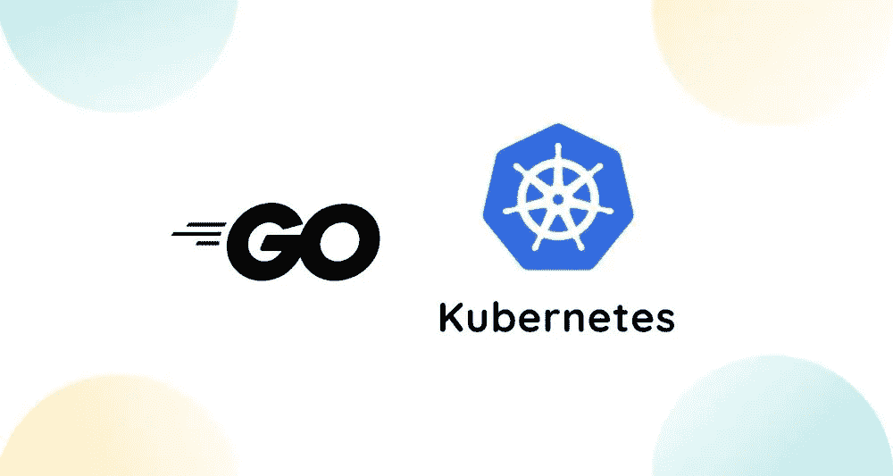

# 在 Go 中编写 Kubernetes CLI

> 原文：<https://itnext.io/writing-a-kubernetes-cli-in-go-a3970ad58299?source=collection_archive---------0----------------------->

作为一名部署到 Kubernetes 的微服务的全职开发人员，我发现自己在调试软件时经常会执行类似的重复动作。有时候，我想在 Kubernetes 上快速尝试一个新的 Docker 映像，而不需要编写新的 Helm 图表，或者通过 NodePorts 分配一个服务对象，以便连接调试工具，或者手动向 Kubernetes 资源添加注释，以触发操作员的操作。对于这些用例中的许多，有一些很棒的开源产品，但不是全部。为了提高我的生活质量，我已经开始编写自定义命令行界面(CLI)工具来自动化这些任务。Go 和 Kubernetes 客户端 API 的结合使得创建新的 Kubernetes CLI 变得很容易。

## 使用 client-go 访问 KUBECONFIG

一个 [kubeconfig](https://kubernetes.io/docs/concepts/configuration/organize-cluster-access-kubeconfig/) 文件用于指定关于 K8 集群、用户、名称空间和认证机制的信息。`kubectl`工具使用 kubeconfig 文件来查找与 K8 集群的 API 服务器通信所需的信息。

我们的定制 CLI 还需要访问 kubeconfig 文件，以便与 K8 集群通信。 [client-go](https://github.com/kubernetes/client-go) API 使得读取用户的 kubeconfig 文件变得非常简单。

GetLocal()读取用户的 KUBECONFIG 文件并返回 K8 客户端和 REST 对象

## 查询 K8 资源对象

现在，我们已经基于用户的 kubeconfig 文件创建了一个 K8 客户机对象，我们可以通过查询一个资源对象来测试与 K8 集群的通信。

要查询名称空间中所有服务的列表，请执行以下操作:

## 更新 K8 资源对象

一旦我们确认可以通过查询名称空间中的服务来成功地与 K8 集群通信，我们就可以编写代码来更新现有的 K8 资源对象。

在下面的代码片段中，函数 Update()将现有服务的类型(ClusterIP、NodePort、LoadBalancer、External)更改为参数 *serviceType* 。它还将原始服务类型保存为注释。函数 Revert()将服务类型改回存储在注释中的值。

## 仅此而已！

在为 Kubernetes 开发微服务时，我一直在寻找提高效率的新方法。请分享一些您用来提高您在云原生环境中的生活质量的技巧和诀窍。